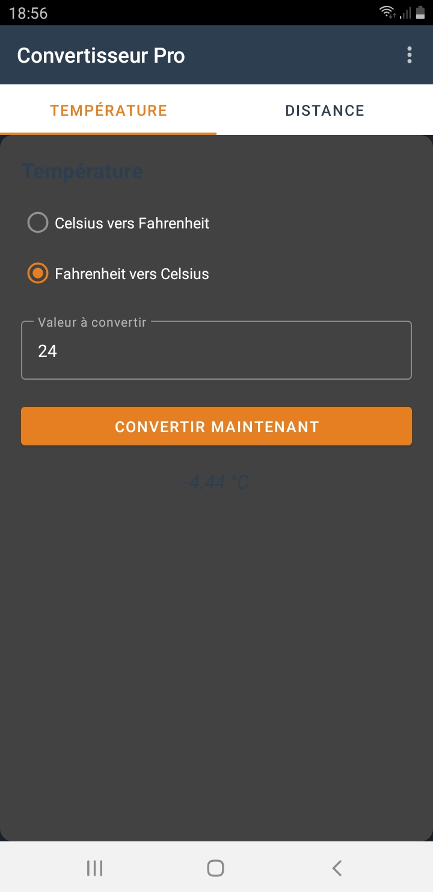
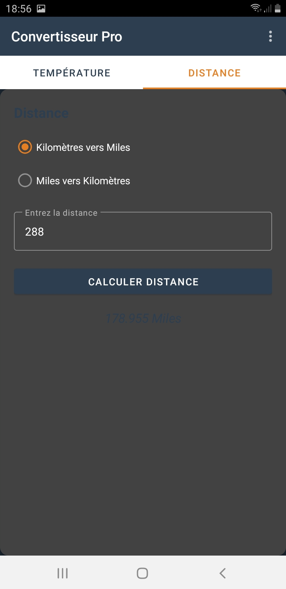
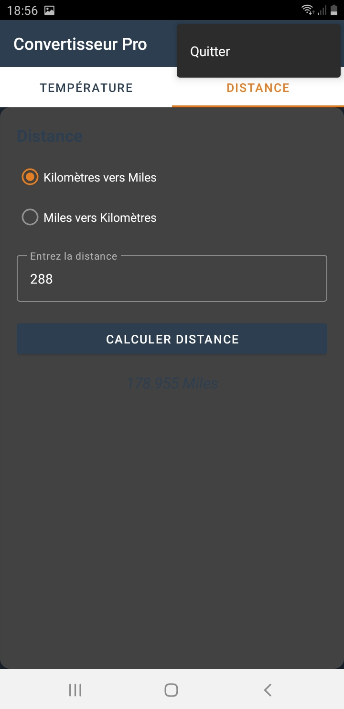
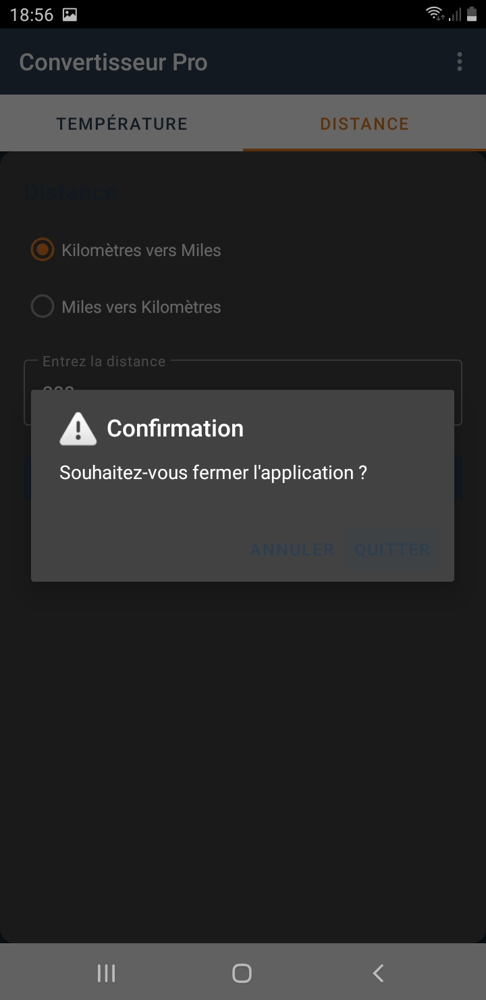

# Convertisseur Pro - Laboratoire 5 (Android)

## Description
Cette application Android est un outil de conversion moderne et intuitif. Elle permet de convertir des températures (°C ↔ °F) et des distances (Km ↔ Miles) via une interface élégante organisée en onglets.

## Fonctionnalités principales
- **Interface à Onglets** : Navigation fluide entre les catégories grâce à `TabLayout` et `ViewPager2`.
- **Conversion de Température** : Calcul précis entre Celsius et Fahrenheit avec gestion des erreurs de saisie.
- **Conversion de Distance** : Conversion rapide entre Kilomètres et Miles.
- **Sécurité de Fermeture** : Interception de la touche "Retour" et menu "Quitter" avec une boîte de dialogue de confirmation pour éviter les fermetures accidentelles.
- **Design Personnalisé** : Utilisation de `CardView`, `MaterialToolbar` et d'une palette de couleurs unique (Midnight Blue & Orange).

## Aperçu de l'application

| 1. Conversion Température | 2. Conversion Distance |
|:---:|:---:|
|  |  |

| 3. Menu Quitter | 4. Confirmation de Sortie |
|:---:|:---:|
|  |  |

## Aspects Techniques
- **Langage** : Java
- **Composants Material Design** : `CardView`, `TextInputLayout`, `MaterialToolbar`.
- **Navigation** : Fragments pilotés par un `FragmentStateAdapter`.
- **Compatibilité** : API 24 (Android 7.0) et versions supérieures.

## Installation
1. Cloner le repository.
2. Ouvrir le projet avec **Android Studio**.
3. Effectuer un **Gradle Sync**.
4. Compiler et lancer l'application sur un émulateur ou un appareil réel.

---
*Réalisé dans le cadre du Laboratoire 5.*