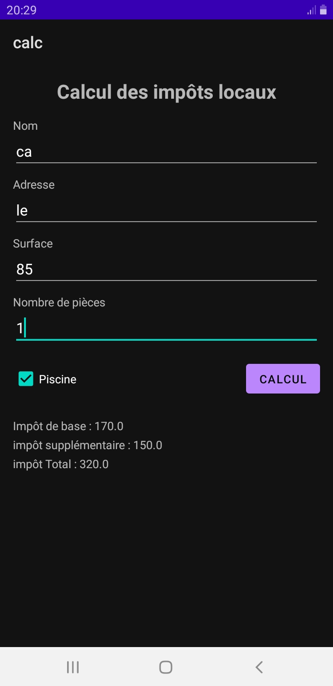

# Calcul des Impôts Locaux - Android

Cette application Android permet de calculer le montant total des impôts locaux d'une habitation en fonction de plusieurs critères.

## Fonctionnalités

L'utilisateur saisit les informations suivantes :
- **Nom et Adresse** du propriétaire.
- **Surface** de la maison (en m²).
- **Nombre de pièces**.
- **Présence d'une piscine** (via une case à cocher).

## Formule de Calcul

Le calcul est basé sur les règles suivantes :
- **Impôt de base** : Surface × 2 €
- **Impôt supplémentaire** : (Nombre de pièces × 50 €) + (100 € si une piscine est présente)
- **Impôt Total** : Somme de l'impôt de base et de l'impôt supplémentaire.

## Aperçu de l'application

## Installation

1. Clonez ce dépôt.
2. Ouvrez le projet dans **Android Studio**.
3. Compilez et lancez l'application sur un émulateur ou un appareil physique.

## Technologies utilisées
- Java
- Android SDK (XML Layouts)
- AppCompat / Material Components
