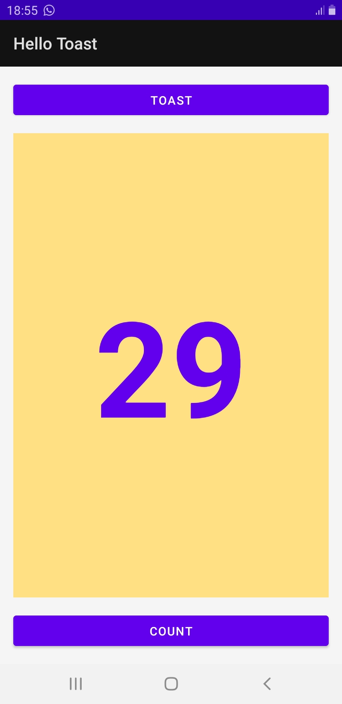

# Hello Toast Application

Cette application est un exemple simple d'application Android démontrant l'utilisation des boutons, des messages Toast et de la mise à jour dynamique d'un `TextView` à l'aide de `ConstraintLayout`.

## Fonctionnalités

L'application comporte deux boutons et un compteur :
- **Bouton TOAST** : Affiche un message contextuel "Hello Toast!".
- **Bouton COUNT** : Incrémente le compteur affiché au centre de l'écran.
- **Affichage du Compteur** : Le chiffre se met à jour en temps réel à chaque clic sur le bouton "Count".

## Aperçu

## Architecture du projet

- **MainActivity.java** : Contient la logique pour gérer les clics sur les boutons et l'incrémentation du compteur.
- **activity_main.xml** : Définit l'interface utilisateur à l'aide de `ConstraintLayout`.
- **strings.xml** : Stocke toutes les chaînes de caractères utilisées dans l'application pour faciliter la localisation.

## Installation

1. Clonez ce dépôt.
2. Ouvrez le projet dans Android Studio.
3. Compilez et lancez l'application sur un émulateur ou un appareil physique.
