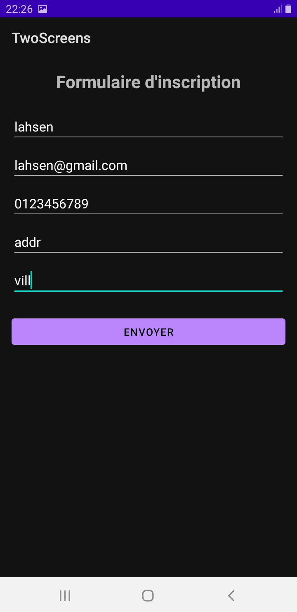
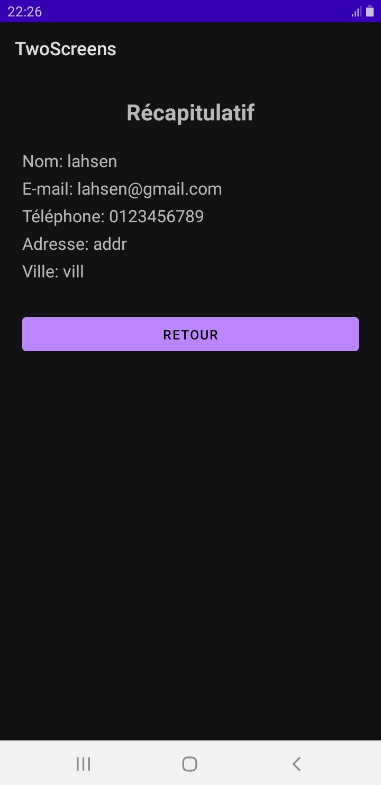

# TwoScreens App - Formulaire et Récapitulatif (Java)

Cette application Android démontre comment naviguer entre deux écrans et transférer des données utilisateur en utilisant des **Intents explicites** et des **Extras**.

## Fonctionnalités

1.  **Écran de Formulaire (`MainActivity`)** :
    *   Saisie des informations : **Nom & Prénom**, **Email**, **Téléphone**, **Adresse** et **Ville**.
    *   **Validation** : Vérifie que le Nom et l'Email ne sont pas vides avant l'envoi.
    *   **Navigation** : Utilise un `Intent` pour passer à l'écran suivant.

2.  **Écran Récapitulatif (`Screen2Activity`)** :
    *   **Récupération** : Extrait les données envoyées par la première activité.
    *   **Affichage sécurisé** : Utilise une méthode `safe()` pour afficher un tiret "—" si un champ optionnel n'a pas été rempli.
    *   **Retour** : Bouton permettant de fermer l'activité en cours (`finish()`) pour revenir au formulaire.

## Aperçu

| Écran Formulaire | Écran Récapitulatif |
| :---: | :---: |
|  |  |

## Détails Techniques

*   **Langage** : Java
*   **Composants UI** : 
    *   `ScrollView` pour le formulaire (confort sur petits écrans).
    *   `LinearLayout` pour l'organisation verticale.
    *   `EditText` avec types d'entrées spécifiques (`phone`, `textEmailAddress`, etc.).
*   **Logique** :
    *   Passage de données via `putExtra(clé, valeur)`.
    *   Récupération via `getStringExtra(clé)`.

## Installation

1.  Clonez le projet.
2.  Ouvrez-le dans **Android Studio**.
3.  Synchronisez Gradle.
4.  Lancez l'application sur un émulateur ou un appareil physique.

> **Note** : Pour afficher les images dans ce README, créez un dossier `screenshots/` à la racine et ajoutez vos captures d'écran nommées `screen1.png` et `screen2.png`.
