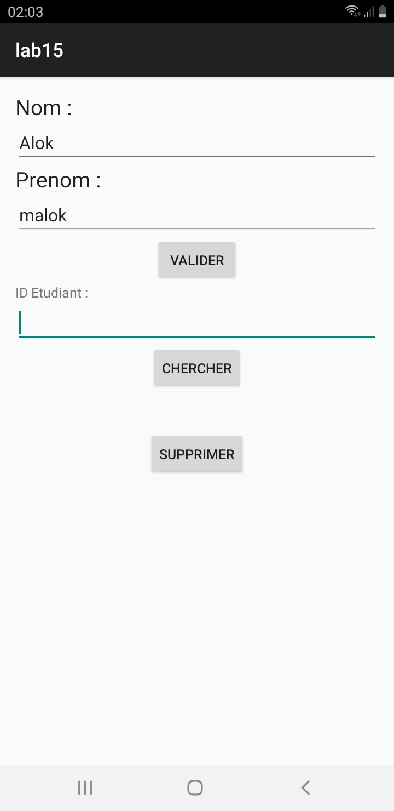
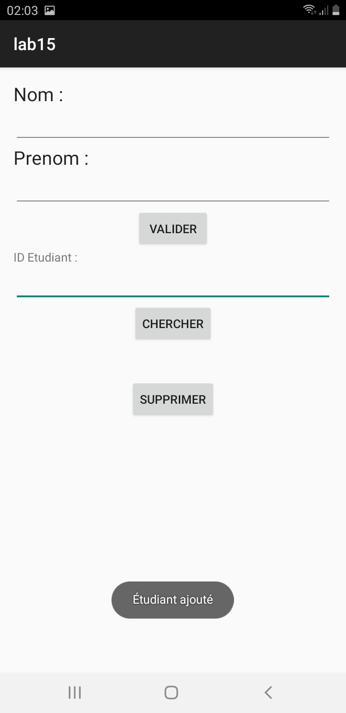
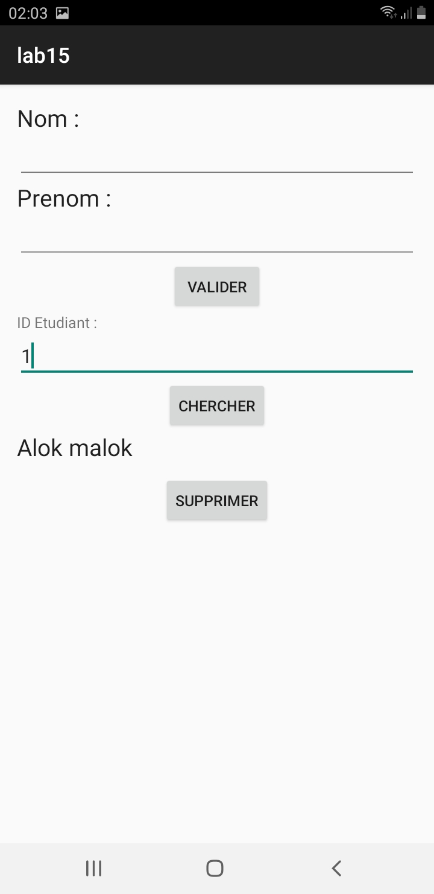
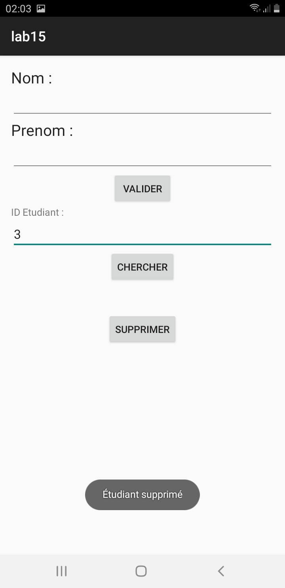

# Lab 15: Android Student Management with SQLite

## 📝 Overview
This laboratory project demonstrates how to build a fully functional Android application that manages student data using an embedded local **SQLite** database. It emphasizes a structured architectural approach by cleanly separating the domain model, the data access layer, and the visual presentation logic.

## 🎯 What We Learned
1. **Domain Modeling:** Creating pure Java model classes (e.g., `Etudiant`) to represent core business entities.
2. **Database Configuration:** Extending `SQLiteOpenHelper` to handle the embedded database (`ecole`) initialization, including defining the SQL schema and versioning.
3. **Service Layer (CRUD):** Creating a dedicated service (`EtudiantService`) to isolate database interactions:
   * **Create:** Using `ContentValues` to format data for insertion.
   * **Read:** Executing queries and iterating through a `Cursor` to rehydrate Java objects.
   * **Delete:** Safely removing records via parameterized queries to prevent SQL injection.
4. **UI Event Binding:** Connecting Android interactive elements (`EditText`, `Button`) inside `MainActivity` to the service logic, handling data validation, and displaying feedback through `Toast`.

---

## 💻 Key Code Snippets to Remember

### 1. Table Initialization (`MySQLiteHelper.java`)
The `onCreate` method ensures the table schema is created automatically the first time the app attempts to access the database.
```java
@Override
public void onCreate(SQLiteDatabase db) {
    String CREATE_TABLE_ETUDIANT = 
        "create table etudiant(" +
        "id INTEGER primary key autoincrement," +
        "nom TEXT," +
        "prenom TEXT)";
    db.execSQL(CREATE_TABLE_ETUDIANT);
}
```

### 2. Formatted Data Insertion (`EtudiantService.java`)
`ContentValues` acts as a secure, key-value mapping structure required by the `insert` method.
```java
public void create(Etudiant e) {
    SQLiteDatabase db = this.helper.getWritableDatabase();
    ContentValues values = new ContentValues();
    
    values.put("nom", e.getNom());
    values.put("prenom", e.getPrenom());
    
    db.insert("etudiant", null, values);
    db.close();
}
```

### 3. Querying & Cursor Handling (`EtudiantService.java`)
Using a `Cursor` to read records. Remember to always use parameterized queries `?` and cleanly `.close()` the cursor to avoid memory leaks.
```java
public Etudiant findById(int id) {
    SQLiteDatabase db = this.helper.getReadableDatabase();
    Cursor c = db.query("etudiant", COLUMNS, "id = ?", new String[]{String.valueOf(id)}, null, null, null, null);
    
    Etudiant e = null;
    if (c.moveToFirst()) { // Move to first row if it exists
        e = new Etudiant();
        e.setId(c.getInt(0));
        e.setNom(c.getString(1));
        e.setPrenom(c.getString(2));
    }
    
    c.close();
    db.close();
    return e;
}
```

---

## 📱 Application Screenshots

### Adding an Etudiant
*Entering student details and executing the insert operation.*

<p align="center">
  
  &nbsp;&nbsp;&nbsp;&nbsp;
  
</p>

### Displaying an Etudiant
*Retrieving and showing the student object by entering their auto-incremented ID.*

<p align="center">
  
</p>

### Deleting an Etudiant
*Removing the student record from the local SQLite database.*

<p align="center">
  
</p>
