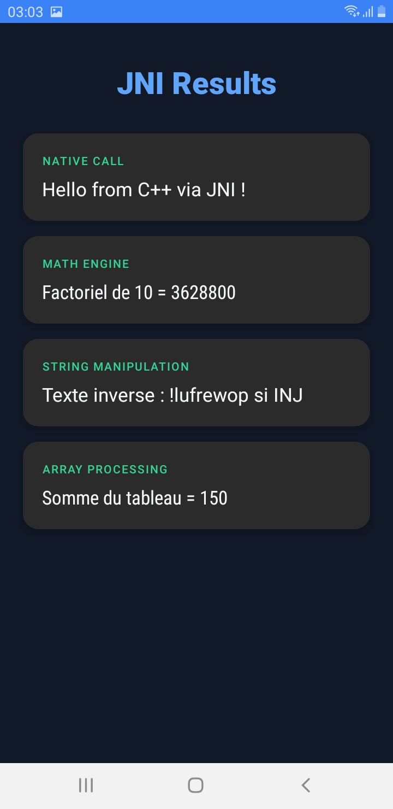
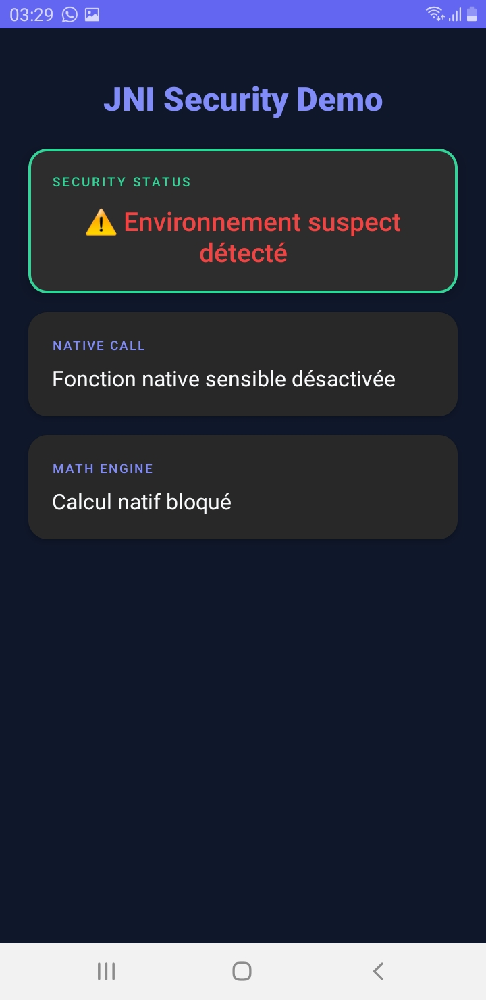

# LAB 23 : Sécurité Défensive Native avec JNI (Anti-Debug)

**Cours** : Programmation Mobile — Android avec Java

## Présentation

Ce laboratoire prolonge directement le TP précédent (Lab 22) sur JNI en ajoutant une **couche défensive native** destinée à repérer certaines situations anormales d'exécution, comme la présence d'un débogueur attaché au processus ou le chargement de bibliothèques souvent associées à l'instrumentation dynamique (Frida, Xposed, Magisk, gdbserver).

L'objectif pédagogique est de montrer comment une application Android peut déplacer une partie de ses contrôles sensibles dans une bibliothèque native C/C++, où ils sont généralement **plus difficiles à analyser et à modifier** que dans du code Java classique.

> Ce laboratoire reste un TP défensif, à réaliser dans un environnement de test autorisé. L'idée n'est pas de rendre une application « inviolable », mais d'illustrer des mécanismes de résistance que l'on retrouve dans des applications sensibles.

## Objectifs Pédagogiques

- Intégrer un contrôle **anti-debug** dans une bibliothèque native Android
- Comprendre le rôle d'un test basé sur `ptrace`
- Comprendre le principe d'une inspection de `/proc/self/maps`
- Remonter un résultat natif vers Java sous forme de **booléen**
- Adapter le comportement de l'interface Android selon l'état de sécurité détecté
- Journaliser les événements natifs dans **Logcat**
- Structurer proprement un module JNI défensif sans casser le reste du projet

## Architecture

```
MainActivity (Java)
  → appelle isDebugDetected()
  → libnative-lib.so exécute les contrôles natifs
    ├── isBeingTraced()            → ptrace(PTRACE_TRACEME)
    └── containsSuspiciousLibraryNames() → /proc/self/maps
  → un booléen est renvoyé à Java
  → l'interface adapte son comportement :
      ├── OK → affiche les résultats JNI (Lab 22)
      └── Suspect → désactive les fonctions natives
```

## Implémentations Principales

### 1. Contrôle anti-debug via `ptrace` (native-lib.cpp)

Le principe consiste à tenter d'établir un état de traçage sur le processus. Si un débogueur est déjà attaché, l'appel échoue :

```cpp
#include <sys/ptrace.h>

static bool isBeingTraced() {
    long result = ptrace(PTRACE_TRACEME, 0, 0, 0);
    if (result == -1) {
        LOGE("Etat suspect : trace/debug detecte");
        return true;
    }
    LOGI("Aucun trace/debug detecte via ptrace");
    return false;
}
```

### 2. Inspection mémoire via `/proc/self/maps` (native-lib.cpp)

Sous Linux/Android, `/proc/self/maps` donne une vue des régions mémoire et des bibliothèques chargées. On y recherche des signatures textuelles évocatrices d'un environnement d'analyse :

```cpp
static bool containsSuspiciousLibraryNames() {
    FILE* maps = fopen("/proc/self/maps", "r");
    if (!maps) return false;

    char line[512];
    while (fgets(line, sizeof(line), maps)) {
        if (strstr(line, "frida") || strstr(line, "xposed") ||
            strstr(line, "libfrida") || strstr(line, "gdbserver") ||
            strstr(line, "libgdb") || strstr(line, "magisk")) {
            LOGE("Signature suspecte trouvee dans maps : %s", line);
            fclose(maps);
            return true;
        }
    }
    fclose(maps);
    return false;
}
```

### 3. Point d'entrée JNI `isDebugDetected()` (native-lib.cpp)

Fusionne les deux signaux et renvoie un booléen à Java :

```cpp
extern "C"
JNIEXPORT jboolean JNICALL
Java_com_example_lab23_MainActivity_isDebugDetected(
        JNIEnv* env, jobject) {

    bool traced = isBeingTraced();
    bool suspiciousMaps = containsSuspiciousLibraryNames();

    if (traced || suspiciousMaps) {
        LOGE("Etat de securite : DEBUG / INSTRUMENTATION detecte");
        return JNI_TRUE;
    }

    LOGI("Etat de securite : OK");
    return JNI_FALSE;
}
```

### 4. Déclarations natives côté Java (MainActivity.java)

```java
public native boolean isDebugDetected();
public native String helloFromJNI();
public native int factorial(int n);
public native String reverseString(String s);
public native int sumArray(int[] values);

static {
    System.loadLibrary("native-lib");
}
```

### 5. Logique de décision côté Java (MainActivity.java)

Le booléen renvoyé par le natif n'entraîne pas un crash — l'activité adapte simplement l'affichage :

```java
boolean suspicious = isDebugDetected();

if (suspicious) {
    tvStatus.setText("⚠ Environnement suspect détecté");
    tvStatus.setTextColor(Color.parseColor("#EF4444"));
    tvHello.setText("Fonction native sensible désactivée");
    tvFact.setText("Calcul natif bloqué");
    tvReverse.setText("Inversion bloquée");
    tvArray.setText("Somme bloquée");
} else {
    tvStatus.setText("✓ État sécurité : OK");
    tvStatus.setTextColor(Color.parseColor("#10B981"));
    tvHello.setText(helloFromJNI());
    tvFact.setText("Factoriel de 10 = " + factorial(10));
    tvReverse.setText("Texte inversé : " + reverseString("JNI is powerful!"));
    tvArray.setText("Somme du tableau = " + sumArray(new int[]{10,20,30,40,50}));
}
```

### 6. Configuration CMake (CMakeLists.txt)

```cmake
cmake_minimum_required(VERSION 3.22.1)
project("jnidemo")

add_library(native-lib SHARED native-lib.cpp)
find_library(log-lib log)
target_link_libraries(native-lib ${log-lib})
```

## Résultats Attendus

### Exécution normale (aucun debug détecté)
- **Sécurité** : ✓ État sécurité : OK (vert)
- **Hello** : Hello from C++ via JNI !
- **Factoriel** : Factoriel de 10 = 3628800
- **Reverse** : Texte inversé : !lufrewop si INJ
- **Somme** : Somme du tableau = 150

### Environnement suspect détecté
- **Sécurité** : ⚠ Environnement suspect détecté (rouge)
- Toutes les fonctions natives sont **désactivées**

## Vérification Logcat

Filtrer avec le tag `ANTI_DEBUG` :

**Exécution normale :**
```
I/ANTI_DEBUG: Aucun trace/debug detecte via ptrace
I/ANTI_DEBUG: Aucune signature suspecte trouvee dans /proc/self/maps
I/ANTI_DEBUG: Etat de securite : OK
```

**Environnement suspect :**
```
E/ANTI_DEBUG: Etat suspect : trace/debug detecte
E/ANTI_DEBUG: Etat de securite : DEBUG / INSTRUMENTATION detecte
```

## Captures d'écrans

### Exécution normale


### Environnement suspect détecté


## Limites Pédagogiques

- **Détection imparfaite** : aucun contrôle simple ne garantit une détection exhaustive
- **Faux positifs possibles** : certains environnements de développement peuvent déclencher des signaux inattendus
- **Contre-mesures** : un attaquant expérimenté peut observer, modifier ou neutraliser ces contrôles
- **Coût de maintenance** : plus les protections sont nombreuses, plus le code devient complexe

## Bonnes Pratiques

1. **Ne pas dépendre d'un seul contrôle** : combiner plusieurs signaux
2. **Éviter les réactions excessives** : préférer l'affichage d'un statut plutôt qu'une fermeture brutale
3. **Garder l'API JNI minimale** : limiter les transitions Java/native
4. **Journaliser pendant le développement** : les logs natifs sont précieux pour le diagnostic
5. **Séparer code métier et code défensif** : fonctions dédiées pour la maintenabilité
