# Projet Gestion des Étudiants : Android + Serveur Web (PHP/MySQL)

Ce dépôt contient l'implémentation complète d'une application Android permettant la gestion des étudiants via un service web PHP RESTful (CRUD complet : Créer, Lire, Modifier, Supprimer).

## 🚀 Fonctionnalités Principales

- **Base de données MySQL** (`school1`) pour le stockage persistant.
- **Backend PHP (PDO)** générant et recevant des données au format `JSON`.
- **Frontend Android (Java)** :
  - Bibliothèque **Volley** pour les appels réseau asynchrones (HTTP GET/POST).
  - Bibliothèque **Gson** pour le mapping des objets JSON en classes Java.
  - Implémentation d'options avancées (Modification et Suppression) via des dialogues interactifs.

---

## 📸 Démonstration et Étapes du Lab

### 1. Configuration du Serveur Local (XAMPP & MySQL)
Tout d'abord, les modules Apache (Serveur Web) et MySQL (Base de données) ont été démarrés via le panneau de contrôle XAMPP.
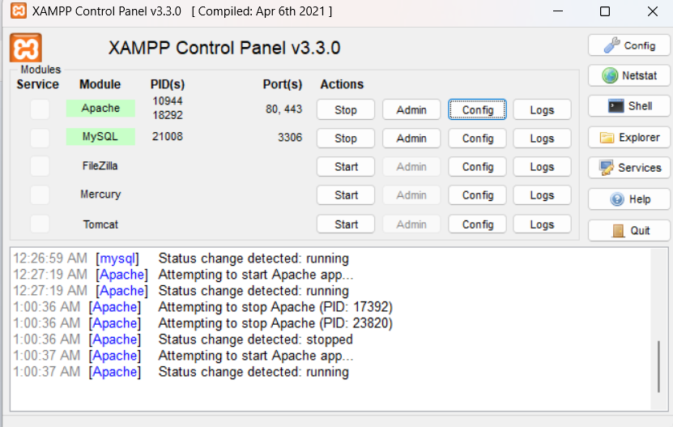

La base de données `school1` a été initialement créée avec une table `Etudiant` contenant des données de base.
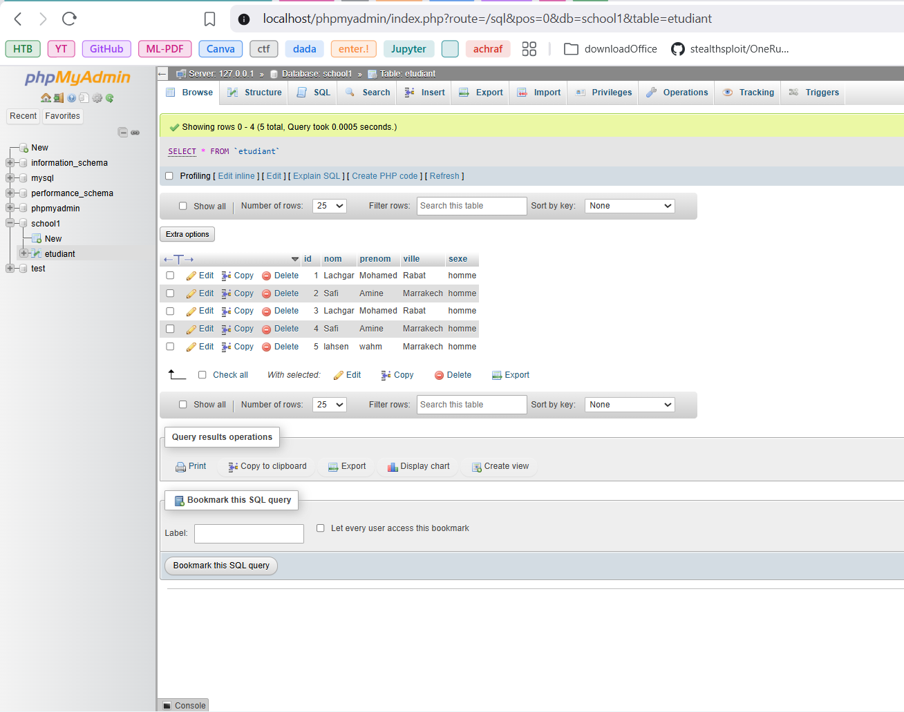

---

### 2. Fonctionnement de l'Application Android (CRUD)
L'application Android permet une gestion fluide et en temps réel des enregistrements. Voici les différentes étapes d'utilisation (Listage, Ajout, Modification, Suppression) :

<div align="center">
  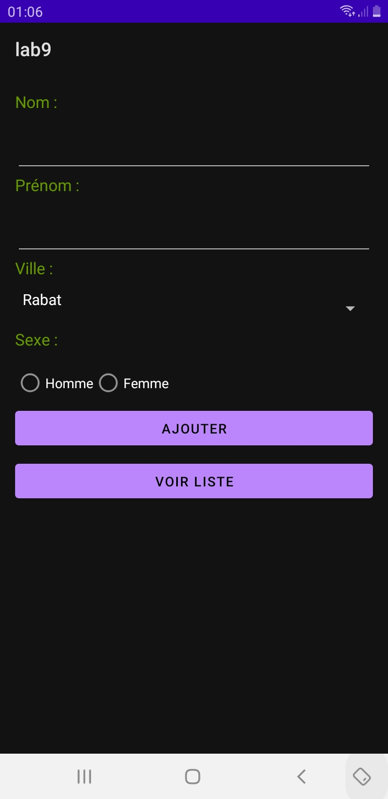
  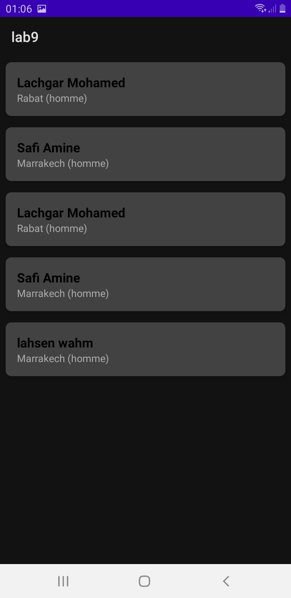
  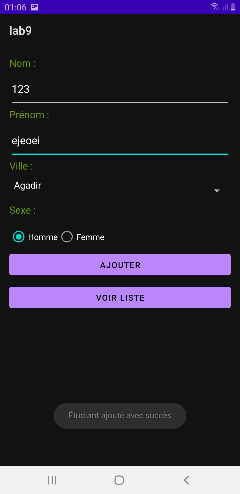
  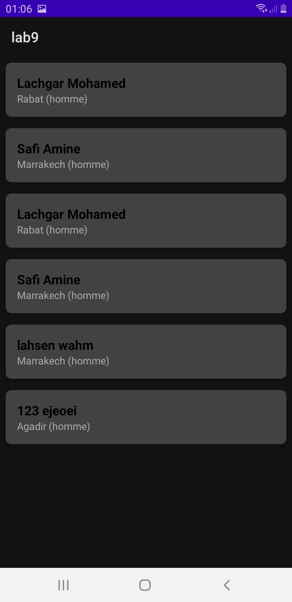
</div>

<div align="center">
  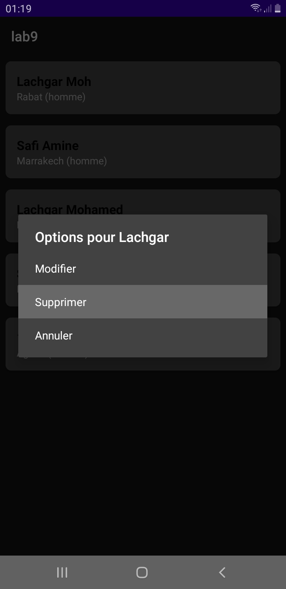
  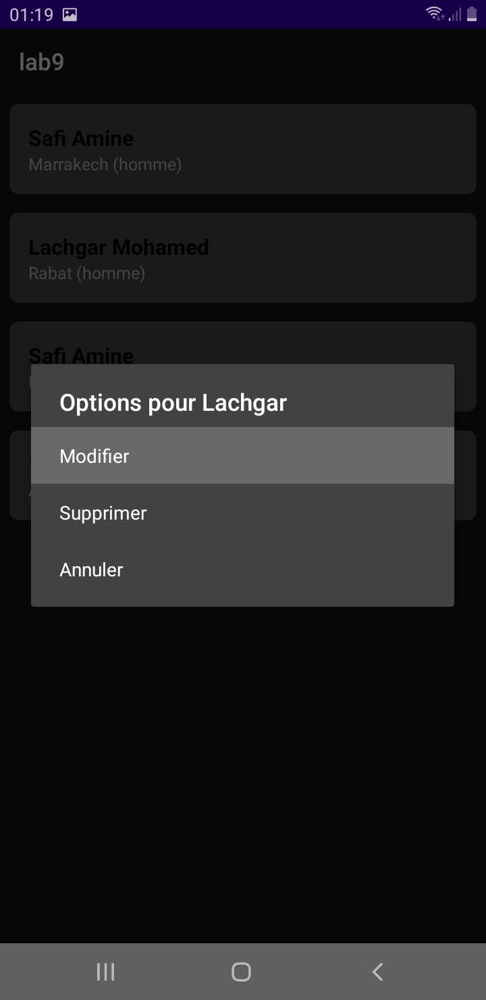
  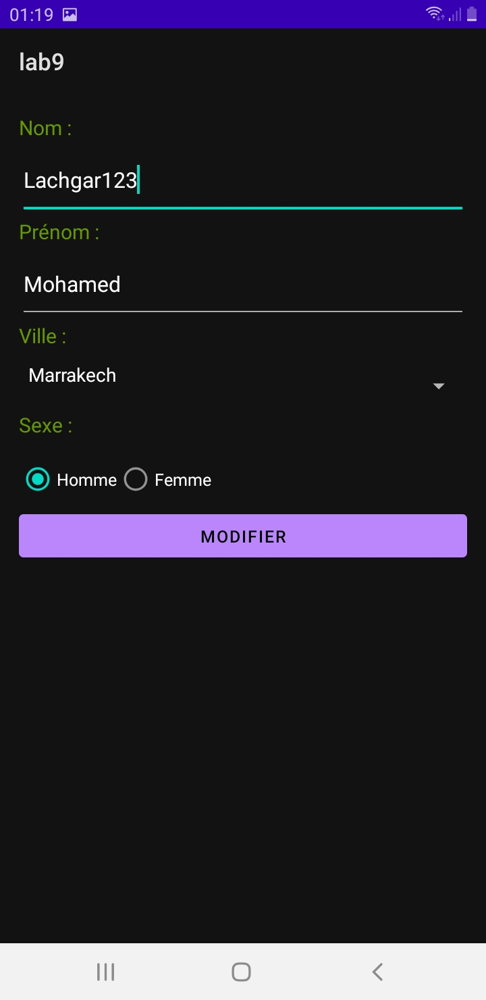
  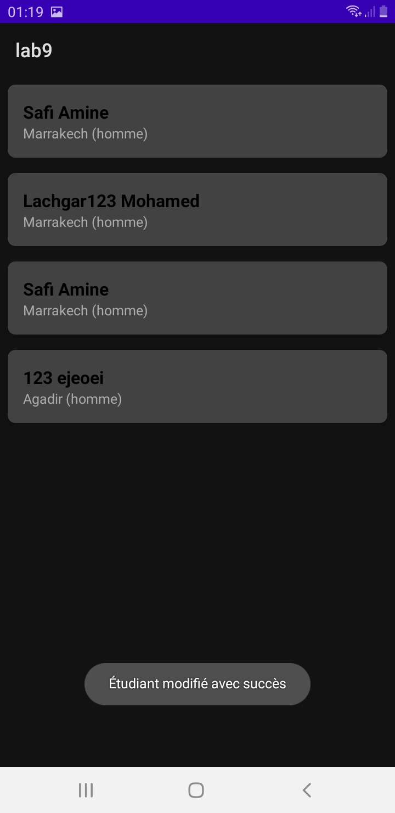
</div>

*(Les captures ci-dessus illustrent la liste synchronisée avec RecyclerView, les formulaires d'ajout/modification, et les popups de validation / suppression).*

---

### 3. Impact sur la Base de Données
Après nos différentes opérations sur le téléphone (ajouts dynamiques, modifications, et suppressions), les répercussions sont instantanément visibles côté serveur dans notre phpMyAdmin.
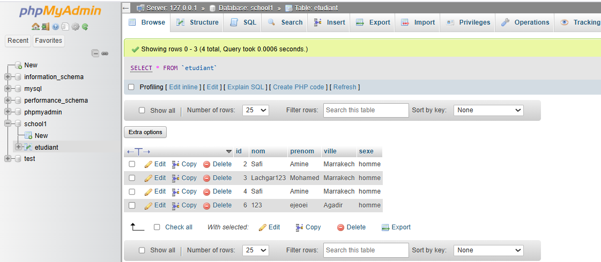

---

## 🛠 Extraits de Code Importants

### A. Connexion Sécurisée à MySQL via PDO (`server/connexion/Connexion.php`)
Le projet utilise PDO pour une connexion robuste et orientée objet avec MySQL.
```php
class Connexion {
    private $connexion;

    public function __construct() {
        try {
            // Connexion UTF-8 et gestion rigoureuse des erreurs
            $this->connexion = new PDO("mysql:host=localhost;dbname=school1;charset=utf8", "root", "");
            $this->connexion->setAttribute(PDO::ATTR_ERRMODE, PDO::ERRMODE_EXCEPTION);
        } catch (PDOException $e) {
            die('Erreur : ' . $e->getMessage());
        }
    }
    // ...
}
```

### B. Requête Réseau Volley (Android - `UpdateEtudiant.java`)
L'un des apports majeurs de ce lab fut l'ajout du composant **UPDATE**. Voici comment Volley envoie une requête POST avec les nouvelles données de l'étudiant.
```java
StringRequest request = new StringRequest(Request.Method.POST, updateUrl,
    response -> {
        Toast.makeText(UpdateEtudiant.this, "Étudiant modifié avec succès", Toast.LENGTH_SHORT).show();
        finish(); // Retour automatique à la liste
    },
    error -> Log.e("VOLLEY", "Erreur : " + error.getMessage())) {
    
    @Override
    protected Map<String, String> getParams() {
        Map<String, String> params = new HashMap<>();
        params.put("id", String.valueOf(etudiantId));
        params.put("nom", nom.getText().toString());
        // ... (autres champs)
        return params;
    }
};
requestQueue.add(request);
```

### C. Sécurisation du Réseau Local (`network_security_config.xml`)
Sous Android 9+, le trafic HTTP en "clair" (non HTTPS) est bloqué par défaut. Puisque notre serveur local PHP (XAMPP) tourne sur une API locale `192.168.1.175`, nous avons explicitement autorisé ce trafic pour tester l'application dynamiquement avec notre Vrai Smartphone.
```xml
<?xml version="1.0" encoding="utf-8"?>
<network-security-config>
    <domain-config cleartextTrafficPermitted="true">
        <domain includeSubdomains="true">192.168.1.175</domain> <!-- Adresse IP Wi-Fi locale -->
    </domain-config>
</network-security-config>
```

Ce fichier de sécurité réseau est ensuite référencé dans notre `AndroidManifest.xml` via l'attribut `android:networkSecurityConfig`.
