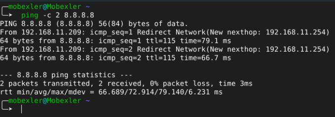
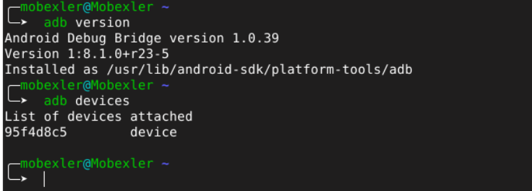

# 🛡️ GUIDE D'OPÉRATION : INFRASTRUCTURE D'AUDIT MOBILE (LAB-01)

## 📑 Aperçu du Déploiement
Ce document détaille le protocole de configuration de l'environnement **Mobexler** dédié à l'analyse offensive des applications mobiles. L'objectif est d'établir une station de travail isolée, persistante et connectée pour les futurs audits de sécurité.

## 🚀 Matrice de Compétences
À l'issue de cette phase d'initialisation, les capacités suivantes seront opérationnelles :
- Orchestration de machines virtuelles via l'hyperviseur.
- Segmentation et routage réseau (Configuration des adaptateurs NAT et Host-Only).
- Validation de l'intégrité de la liaison montante (Internet).
- Gestion des points de restauration système.
- Interfaçage matériel via le pont de débogage Android (ADB).

---

## 🛠️ Protocole d'Exécution

### Phase A — Authentification Système
Une fois l'instance déployée dans l'hyperviseur, accédez à la console en utilisant les paramètres d'accès par défaut :

| Identifiant | Valeur |
| :--- | :--- |
| **Utilisateur** | `mobexler` |
| **Mot de passe** | `mobexler` |

### Phase B — Diagnostic de la Couche Réseau
Il est impératif de confirmer que l'instance dispose d'une route active vers l'extérieur pour le téléchargement d'outils tiers ou de dépendances.

**Test de latence et connectivité :**
```bash
# Vérification du routage vers les DNS globaux
ping -c 2 8.8.8.8
```

### Phase C — Persistance et Sauvegarde (Baseline)
Avant toute manipulation structurelle ou installation de malwares, une image de l'état "sain" du système doit être capturée.

- **Identifiant de l'instantané :** `CLEAN_BASELINE_TP1`
- **Utilité :** Restauration immédiate en cas de corruption de l'environnement de test.

### Phase D — Liaison de la Cible de Test
L'intégration de la cible (appareil Android ou émulateur) est validée par l'utilitaire **ADB**. Cette étape est cruciale pour le transfert de fichiers et l'exécution de commandes à distance.

**Commandes de contrôle :**
1. `adb version` (Vérification de l'intégrité de l'outil)
2. `adb devices` (Détection des cibles actives)

---
**Mainteneur :** AIT OIHMANE Lahsen
