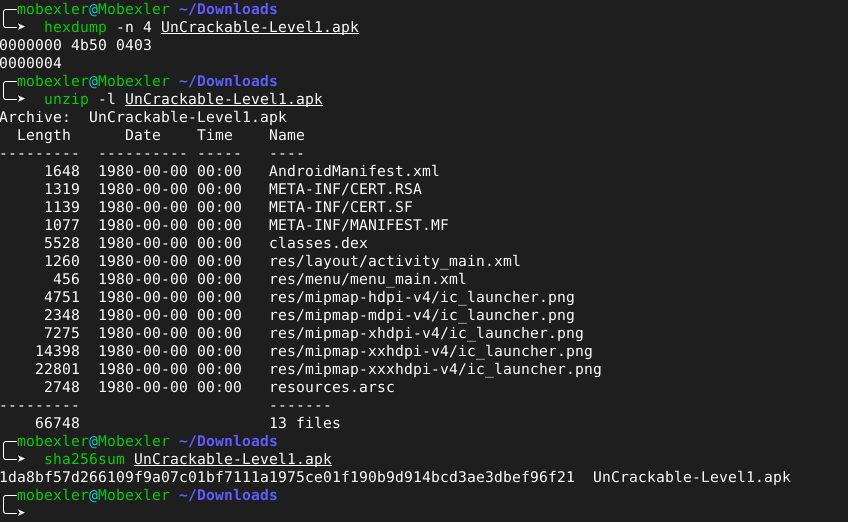
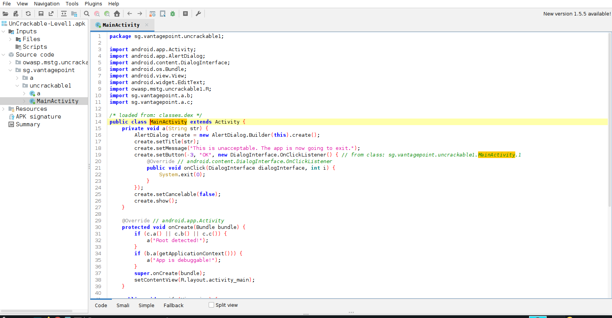
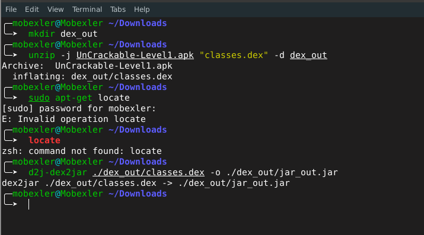

# Retour d'Analyse Statique : APK UnCrackable-Level1 (LAB 4)

## 1. Contexte de l'Analyse
- **Date de réalisation :** 3 mars 2026
- **Cible :** Fichier `UnCrackable-Level1.apk`
- **Méta-données :** Version 1.0 (code de version : 1)
- **Origine :** Défi OWASP MSTG
- **Boîte à outils :** JADX (interface graphique), utilitaire dex2jar v2.4, extraction via unzip

---

## 2. Résumé Exécutif

L'audit statique mené sur l'application **UnCrackable-Level1** a permis d'identifier d'importantes vulnérabilités au niveau de sa structure et de la gestion de ses secrets. La cible manque sérieusement de défenses proactives contre la rétro-ingénierie et laisse fuiter des éléments critiques. 

**Vulnérabilités majeures identifiées :**
1. Présence d'un secret "en dur" (hardcodé) directement dans le code source.
2. Détection trop basique du mode "debug" pouvant être repérée facilement.
3. Code source en clair et totalement lisible (aucune technique d'obfuscation déployée).

**Niveau de criticité global :** ÉLEVÉ

### Plan d'Action Recommandé
- Éliminer le stockage de secrets directement au sein du code de l'application.
- Assurer la désactivation totale des options de débogage pour les environnements de production.
- Appliquer un outil de minification et d'obfuscation (comme ProGuard ou R8) avant toute release.

---

## 3. Étapes d'Investigation et Observations

### Étape 1 : Inspection générale de l'APK

L'extraction de l'archive confirme qu'il s'agit bien d'un package Android standard. L'APK pèse environ 66,7 Ko et renferme 13 éléments distincts. La présence de composants fondamentaux tels que le `AndroidManifest.xml` et le fichier binaire `classes.dex` confirme l'intégrité de la cible d'étude.

---

### Étape 2 : Exploration du manifeste (`AndroidManifest.xml`)

L'étude du manifeste révèle que le nom de package assigné est **`owasp.mstg.uncrackable1`**. Par ailleurs, l'application ne définit qu'une unique activité principale : **`MainActivity`**, agissant comme l'unique point d'entrée de l'interface utilisateur.

---

### Étape 3 : Traque de données sensibles

En recherchant des mots-clés spécifiques comme le mot "secret" à l'intérieur du code, on tombe extrêmement vite sur la chaîne de caractères :
**"This is the correct secret."**

Nous identifions par ailleurs l'usage explicite de la classe **`SecretKeySpec`**, indiquant qu'une routine de cryptographie locale est exécutée. Ces traces sont les symptômes caractéristiques d'une logique de validation cryptographique complètement couplée côté client.

---

### Étape 4 : Conversion de la logique métier (DEX vers JAR)

Afin de mener une analyse structurelle plus abordable, le composant **`classes.dex`** a été isolé et transcodé en archive Java (un fichier JAR classique) en exploitant l'utilitaire **dex2jar**. Cette manipulation technique offre aux auditeurs une base de code infiniment plus simple à lire que le bytecode brut d'origine.

---

### Étape 5 : Examen du reverse engineering

Les résultats de l'effort de décompilation exposent une arborescence de code laissée pratiquement intacte. Les noms des méthodes, les variables et les logiques de classe n'ont pas fait l'objet de transformations. Appréhender le squelette et le comportement de l'application est par conséquent immédiat, prouvant le l'absence criante d'obfuscation.

---

### Étape 6 : Mécanisme anti-debug détecté

Lors du passage au crible du code désassemblé, la mention suivante a été interceptée :
**"App is debuggable!"**

Cela dénote que les développeurs de l'application ont prévu un système d'alerte permettant à l'application de s'auto-analyser pour identifier si elle s'exécute dans un contexte de manipulation. Malheureusement, puisque la base de code n'est pas robuste, ce mécanisme d'audit peut aisément être détecté et neutralisé.

---

## 4. Bilan de l'Audit

Cet audit statique de l'épreuve **UnCrackable-Level1** justifie la faisabilité d'une attaque sur la conception même de ce type d'applications. La compilation de données sensibles lisibles en dur combinée à l'absence totale de barrières anti-reverse (obfuscation) offre une victoire facile pour un analyste qui voudrait extraire l'essence du programme.

En contexte commercial, ce type d'erreur conduirait à un piratage immédiat des accès. Remédier à cette disposition est obligatoire et passe inévitablement par un nettoyage drastique des fichiers métiers, un chiffrement côté backend, ainsi que par un outil pour complexifier les bibliothèques embarquées.
