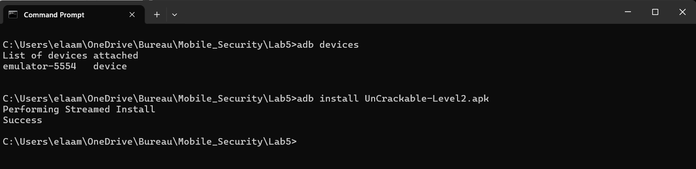
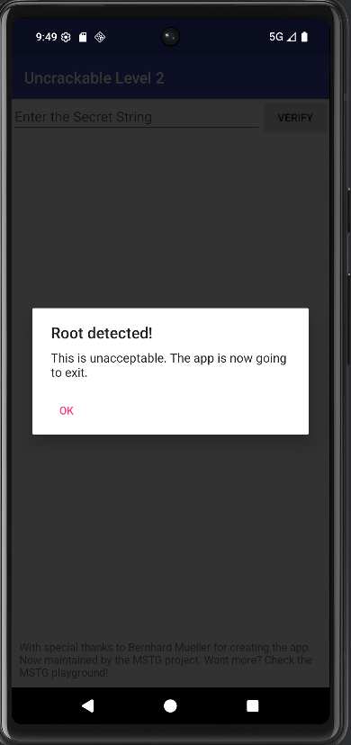
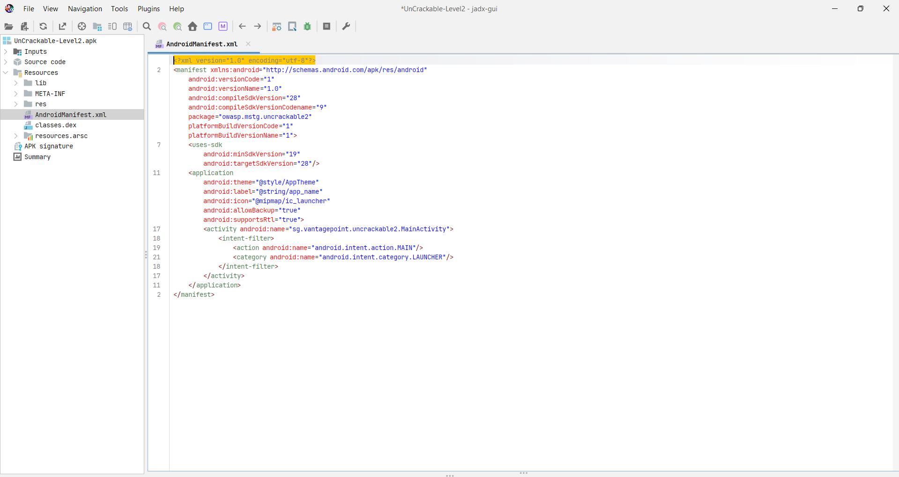
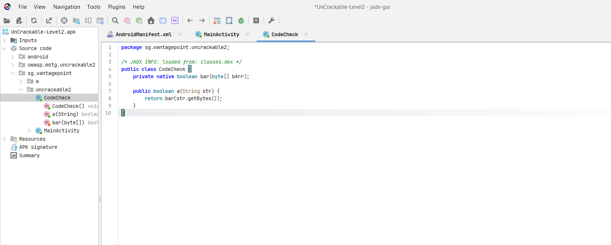
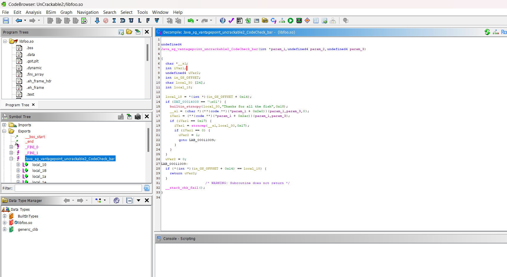
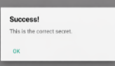

# Rapport d'Investigation : Rétro-ingénierie avancée - UnCrackable Level 2 (LAB 5)

## Synthèse et Objectifs
Ce document détaille l'analyse exhaustive d'une application Android conçue spécifiquement pour dissimuler ses mécanismes de validation au sein d'une bibliothèque native (fichier `.so`). Bien que l'interface graphique paraisse rudimentaire (un simple champ texte suivi d'un bouton de soumission), la logique réelle de vérification du mot de passe s'exécute directement en C/C++ grâce à l'interface JNI.

L'objectif final consiste à récupérer la chaîne secrète enfouie en réalisant les étapes suivantes :
- Décompilation du fichier binaire APK à l'aide de JADX.
- Isolement et extraction de la bibliothèque système `libfoo.so`.
- Étude détaillée du code binaire natif via le désassembleur Ghidra.
- Repérage du bloc mémoire gérant la fonction `strncmp`.
- Extraction de la clé codée en dur.

---

## Outils Déployés
- **Émulateur Android / Périphérique de test** : Pour l'exécution dynamique de la cible.
- **Console ADB** : Pont de débogage pour l'installation manuelle et le monitoring.
- **Interface JADX** : Ingénierie inverse sur la couche Java (Dalvik to Java).
- **Plateforme Ghidra** : Examen et rétro-ingénierie de la couche C/C++ compilée.
- **Extracteurs d'archives** : Pour l'extraction des bibliothèques (`.so`).

---

## Modalités Opératoires

### Étape 1 : Phase d'installation et reconnaissance
```bash
adb install UnCrackable-Level2.apk
```
Dès l'installation confirmée sur le terminal émulé :


*Figure 1 : Succès de l'installation du package via terminal ADB.*

L'interface principale se révèle classique. Cependant, une contrainte majeure existe : l'application embarque une routine de détection des privilèges "root". S'exécuter sur un terminal jailbreaké déclenchera une fermeture immédiate en guise de protection (anti-Rooting). Il est donc conseillé de manipuler un environnement standard ou d'intercepter la fonction de vérification.


*Figure 2 : Alerte de sécurité bloquant l'exécution sur appareil compromis.*

---

### Étape 2 : Conduite des tests fonctionnels
L'injection de valeurs aléatoires (par exemple, des chaînes comme `test` ou `1234`) dans le champ de saisie conduit invariablement à la même erreur :
*"That's not it. Try again."*

Cela permet d'affirmer formellement que l'entrée utilisateur est directement comparée à une donnée secrète stockée en mémoire par le système.

---

### Étape 3 : Examen statique de la couche applicative
```bash
jadx-gui
```
L'analyse initiale se concentre sur l'organisation des packages de l'application, en examinant la classe principale (`sg.vantagepoint.uncrackable2.MainActivity`).


*Figure 3 : Cartographie du Manifeste et des classes.*

L'analyse de la méthode métier `verify` démontre qu'une ressource externe est invoquée pour valider le mot de passe :
```java
public void verify(View view) {
    String input = ((EditText) findViewById(R.id.edit_text)).getText().toString();
    if (this.m.a(input)) {
        // Condition de validation
    } else {
        // Condition d'échec
    }
}
```
L'attribut `this.m` renvoie directement à une instance de classe nommée `CodeCheck`.


*Figure 4 : Examen Java du déclencheur de la méthode CodeCheck.*

---

### Étape 4 : Inspection de l'objet CodeCheck
En explorant le fichier `CodeCheck.java`, le pont JNI devient alors parfaitement visible :
```java
public class CodeCheck {
    static {
        System.loadLibrary("foo");
    }
    private native boolean bar(byte[] bArr);
    public boolean a(String str) {
        return bar(str.getBytes());
    }
}
```
Le système charge un fichier de bibliothèque externe appelé `foo`, signifiant l'exploitation de `libfoo.so`. La vérification effective se trouve dans la méthode native `bar`.


*Figure 5 : Appel JNI et initialisation de la librairie.*

---

### Étape 5 : Extraction du cœur natif
```bash
unzip UnCrackable-Level2.apk -d uncrackable_l2
ls -R uncrackable_l2/lib
```
Le désarchivage intégral de l'APK permet de mettre la main sur le répertoire contenant les bibliothèques (`lib`). On y extrait la ressource `libfoo.so` adaptée à la tranche architecturale souhaitée (ex: architecture `x86` ou `arm`).

---

### Étape 6 : Analyse binaire poussée avec Ghidra
```bash
ghidraRun
```
Après la configuration du projet d'ingénierie inverse sous Ghidra, nous importons la librairie et initions le balayage automatique du code compilé.
En inspectant l'arbre des fonctions symbolisées, nous ciblons la mention `Java_` qui est couramment employée comme convention nominale de pont JNI.
Le point d'entrée central retenu est la méthode : `Java_sg_vantagepoint_uncrackable2_CodeCheck_bar`.


*Figure 6 : Visualisation du bloc d'instructions désassemblées.*

---

### Étape 7 : Interception de la logique et résultat
En examinant le module de code reconstitué, une confrontation de chaînes est traitée via la fonction native `strncmp` :



```c
buildtim_strncpy(local_30, "Thanks for all the fish", 0x18);
...
if (strncmp(s1, local_34, 0x17) == 0) {
    // Flag accordé
}
```
Nous constatons donc une gravissime erreur d'implémentation : la chaîne d'authentification a été laissée en texte clair au sein du binaire C.

## Conclusions et Flag

Le mot de passe global dissimulé par les développeurs s'avère être :
`Thanks for all the fish`

En injectant cette variable directement dans la zone de texte de l'interface Android, nous arrivons au contournement total de la protection.
