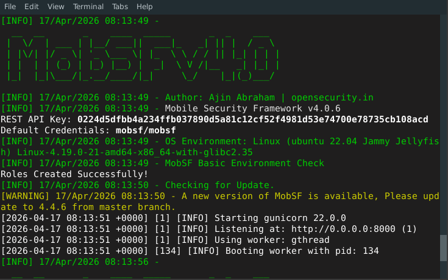
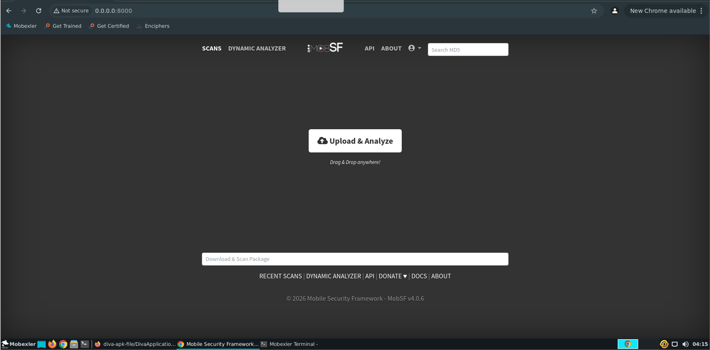
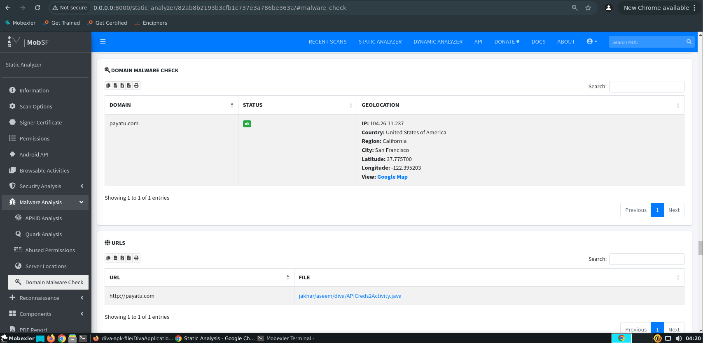

# Rapport d'Évaluation de Sécurité : Automatisation avec MobSF (LAB 6)

## Instanciation du Framework

*Figure 1 : Déploiement initial de la solution MobSF.*

Le dispositif "Mobile Security Framework" (MobSF) a été correctement mis en service sur une plateforme Ubuntu locale. Il génère une interface web locale via Gunicorn, atteignable à l'adresse `http://0.0.0.0:8000`. Cet utilitaire est incontournable pour réaliser des cartographies de risques statiques sur des packages applicatifs fermés.

---

## Injection de l'Application Cible

*Figure 2 : Module de réception des binaires cibles.*

Le hub de l'interface favorise l'import de l'échantillon. Le processus de scan est amorcé par un simple système d'insertion des fichiers APK dont l'analyse prend quelques secondes à quelques minutes selon la taille du code compilé.

---

## Bilan Général de Sécurité

*Figure 3 : Radar des vulnérabilités de haut niveau.*

À la fin de la compilation statique, le logiciel dessine le portrait robot en matière de sureté d'application :
- **Indice de vulnérabilité** : 36/100, classant l'application dans un profil de risque accentué.
- **Carte d'identité** : Méta-données de nommage, SDK requis et architecture de l'App.
- **Répartition des entités Android** : Dénombrement exact des interfaces utilisateurs (Activités), des processus d'arrière-plan (Services), ainsi que des écouteurs de notification.
Ce constat donne très rapidement le ton quant à la fragilité de développement du dispositif.

---

## Étude Critique du Manifeste Android

*Figure 4 : Inspections des failles de configuration déclarative.*

L'analyse du fichier `AndroidManifest.xml` soulève plusieurs violations de conception flagrantes :
- Le module de "debug" a été validé (`android:debuggable=true`), offrant ainsi une possible manipulation sauvage par un tiers en environnement de production.
- Le cycle de compatibilité intègre des versions bien trop rudimentaires et connues de la couche Android.
- Beaucoup d'activités cruciales sont définies comme "exportées", ce qui signifie concrètement qu'une application tierce malveillante hébergée sur le même téléphone peut les déclencher de forcer.
- Les fonctionnalités de sauvegarde natives ont été laissées opérantes, facilitant la fuite involontaire du registre utilisateur.

---

## Analyse Approfondie des Permissions Déléguées

*Figure 5 : Matrice des habilitations sollicitées.*

Le crible des droits accordés relève la demande de permissions d'une grande disparité selon leur niveau d'intrusion :
- Sollicitation d'un accès Web ordinaire.
- Autorisation de réécriture sur le support de stockage du terminal mobile (Niveau "Dangerous"), risquant d'exposer la confidentialité des données si l'application vient à enregistrer son contexte sur des supports mal ouverts.

---

## Traçage Réseau et Fuite d'Informations

*Figure 6 : Investigations autour des connexions distantes.*

MobSF est doté d'un extracteur de terminologie réseau performant qui identifie les services tiers dialoguant avec le téléphone (`payatu.com`). Cela apporte :
- Les données de résolution d'adresses géographiques (IP).
- Un signal de position de nom de domaine précis.
L'empreinte du réseau est fondamentale pour discerner un service API standard d'un possible flux malveillant déguisé au sein du code.

---

## Audit Qualité et Sécurité du Code Source

*Figure 7 : Liste d'alerte des lignes de code fautives.*

L'analyse intrincée des bibliothèques met en lumière les mauvaises routines de programmation :
- Exposition du contexte via des logs en texte clair.
- Assemblage de requêtes bases de données dépourvues d'échappement, provoquant une menace importante d'Injection SQL.
- Configurations propices à un piratage via gestionnaires temporaires non sécurisés.
Le système aligne directement ces violations avec la cartographie internationale du fameux top 10 des vecteurs de piratage, notamment la base réglementaire **CWE**.

---

## Cartographie sur le Normatif MASVS

*Figure 8 : Attestation comparative MASVS.*

L'outil intègre un rapport d'évaluation comparant ses extractions contre les attentes de la standardisation de Mobile App Security d'OWASP : protocole cryptographique, résistance des modules d'authentification, gestion du trafic internet chiffré et complexité logique.

---

## Synthèse PDF Automatisée

*Figure 9 : Modèle de rapport complet de MobSF.*

En fin de boucle, le framework assemble l'ensemble de ses alertes dans un livrable PDF professionnel, utile tant pour la gestion administrative post-audit que pour pointer les défaillances aux pôles d'ingénierie devant remanier les produits mobiles.
