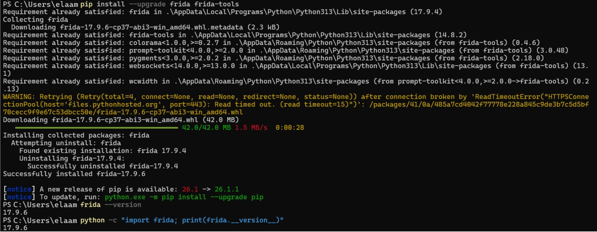
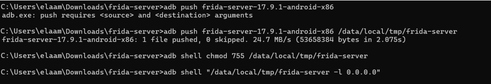
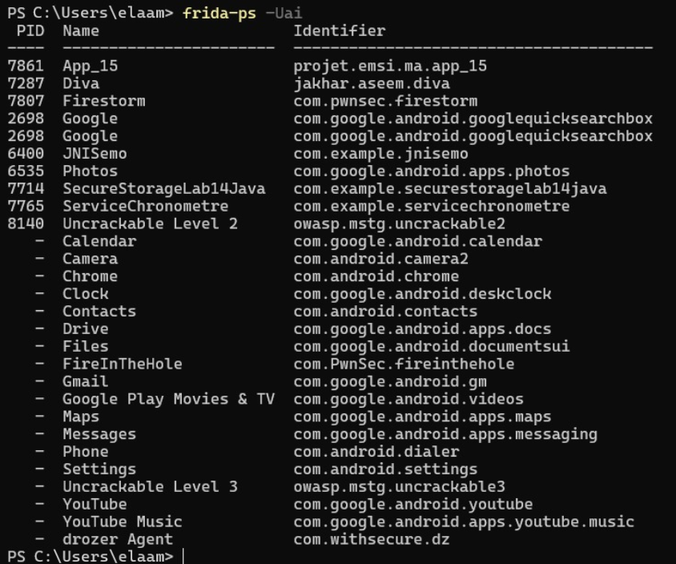

# 🛡️ Lab 14 — Bypassing Android Root Detection at Runtime

> **Course:** Mobile Application Security  
> **Topic:** Dynamic Instrumentation — Frida · Objection · Medusa  
> **Target Platform:** Android (Rooted Device / Emulator)

<p align="center">
  
  
  
  
  
</p>

---

## 📋 Table of Contents

1. [Introduction](#-introduction)
2. [Lab Objectives](#-lab-objectives)
3. [Tech Stack](#-tech-stack)
4. [Project Structure](#-project-structure)
5. [Environment Setup](#-environment-setup)
   - [Step 1 — Install Frida & Python Tools](#step-1--install-frida--python-tools)
   - [Step 2 — Configure ADB & Connect Device](#step-2--configure-adb--connect-device)
   - [Step 3 — Deploy frida-server on Device](#step-3--deploy-frida-server-on-device)
   - [Step 4 — Verify the Frida Bridge](#step-4--verify-the-frida-bridge)
6. [Implementation](#-implementation)
   - [Phase 1 — Sanity Test with hello.js](#phase-1--sanity-test-with-hellojs)
   - [Phase 2 — Java-Layer Root Bypass](#phase-2--java-layer-root-bypass)
   - [Phase 3 — Native-Layer Root Bypass](#phase-3--native-layer-root-bypass)
   - [Phase 4 — Automated Bypass via Objection](#phase-4--automated-bypass-via-objection)
   - [Phase 5 — Medusa Framework Integration](#phase-5--medusa-framework-integration)
7. [Results & Analysis](#-results--analysis)
8. [Troubleshooting Guide](#-troubleshooting-guide)
9. [Conclusion](#-conclusion)
10. [Future Work](#-future-work)

---

## 🔍 Introduction

Android applications increasingly rely on **root detection** as a first line of defense to prevent tampering, analysis, and unauthorized access to privileged functionality. These checks are typically implemented across multiple layers:

- **Java layer** — using `android.os.Build.TAGS`, `java.io.File.exists()`, `Runtime.exec("su")`, and third-party libraries like RootBeer
- **Native layer (C/C++)** — using libc calls such as `open()`, `access()`, `stat()`, and `openat()` to scan for `su` binaries on the filesystem

This lab explores **dynamic instrumentation** as a technique to circumvent these protections *without modifying the APK*. Using **Frida**, **Objection**, and **Medusa**, we hook into the application's runtime, intercept detection logic, and force it to return safe values — effectively making the app believe it is running on a clean, unrooted device.

> ⚠️ **Legal Notice:** All techniques demonstrated here were performed on a personal device in a controlled lab environment for educational purposes only. Never apply these techniques without explicit written authorization.

---

## 🎯 Lab Objectives

By completing this lab, the following competencies were developed and demonstrated:

| # | Objective |
|---|-----------|
| 1 | Set up a cross-platform Frida instrumentation environment (Windows + Android) |
| 2 | Deploy and maintain a persistent `frida-server` session on an Android emulator |
| 3 | Write custom Frida scripts to hook Java and native functions at runtime |
| 4 | Neutralize root detection checks across Build properties, File I/O, and process execution |
| 5 | Use Objection's `android root disable` automation as a rapid bypass alternative |
| 6 | Leverage the Medusa framework for modular, recipe-driven dynamic analysis |
| 7 | Apply `frida-trace` for discovering undocumented binary paths probed by native code |

---

## 🧰 Tech Stack

| Tool | Version | Role |
|------|---------|------|
| **Python** | 3.13+ | Runtime for Frida tooling |
| **Frida** | 17.9.6 | Dynamic instrumentation engine |
| **frida-tools** | 14.8.2 | CLI tools (`frida-ps`, `frida-trace`) |
| **Objection** | 1.12.4 | Frida wrapper with built-in security bypass commands |
| **Medusa** | dev build | Modular Android dynamic analysis framework |
| **ADB** | 1.0.41 | Android Debug Bridge for device communication |
| **Android Emulator** | Android 11 (x86) | Target environment (`emulator-5554`) |
| **Target App** | `com.pwnsec.firestorm` | Application under analysis |

---

## 📁 Project Structure

```
lab14/
├── assets/                          # Screenshots captured during the lab session
│   ├── frida-installation-output.png     # Frida pip install & version verification
│   ├── adb-version-devices.png           # ADB connected to emulator-5554
│   ├── frida-server-deploy.png           # frida-server pushed and running on device
│   ├── frida-ps-process-list.png         # Live process list from Frida
│   ├── frida-hello-injection.png         # hello.js injection confirmation
│   ├── bypass-root-basic-output.png      # Java-layer bypass hooks active
│   ├── objection-version-check.png       # Objection installation verified
│   ├── objection-explore-root-disable.png# Objection startup bypass in action
│   ├── medusa-help-output.png            # Medusa CLI options
│   └── medusa-spawn-target.png           # Medusa connected to target app
├── bypass_root_basic.js             # Java-layer hook script
├── bypass_native.js                 # Native libc hook script
├── hello.js                         # Instrumentation sanity test script
├── labcontent.txt                   # Original lab instructions
└── README.md                        # This document
```

---

## ⚙️ Environment Setup

### Step 1 — Install Frida & Python Tools

Frida is distributed as a Python package and includes both the client library and CLI utilities. Installing with `--upgrade` ensures version alignment between `frida` and `frida-tools`, which is critical since the server binary on the device must match the client version exactly.

```powershell
pip install --upgrade frida frida-tools
```

After installation, confirm the version is consistent across both the CLI and the Python module:

```powershell
frida --version
python -c "import frida; print(frida.__version__)"
```

**Observed output:**


*Frida 17.9.6 successfully installed — both the CLI and Python module report matching versions.*

> **Windows PATH tip:** If `frida` is not recognized after installation, add the Python `Scripts` directory to your system PATH:
> `%USERPROFILE%\AppData\Local\Programs\Python\Python313\Scripts`

---

### Step 2 — Configure ADB & Connect Device

ADB (Android Debug Bridge) is the communication channel between the host machine and the Android device. Before any Frida session can begin, ADB must recognize the target device.

```powershell
adb version
adb devices
```

**Observed output:**


*ADB version 36.0.0 running on Windows 10, with the Android emulator (`emulator-5554`) successfully listed as `device` — not `unauthorized`.*

> **USB Debugging activation path (physical devices):**
> `Settings → About Phone → tap "Build number" 7×` to unlock Developer Options, then:
> `Settings → System → Developer Options → Enable USB Debugging`

---

### Step 3 — Deploy frida-server on Device

The `frida-server` binary runs as a privileged daemon on the Android device, accepting instrumentation requests from the host. Its version **must** match the Frida client version installed in Step 1.

**Determine the device CPU architecture:**
```powershell
adb shell getprop ro.product.cpu.abi
# Output: x86_64  (for emulators) or arm64-v8a (for physical devices)
```

**Download the matching release from:** https://github.com/frida/frida/releases  
File pattern: `frida-server-17.9.6-android-x86`

**Deploy and start:**
```powershell
adb push frida-server-17.9.1-android-x86 /data/local/tmp/frida-server
adb shell chmod 755 /data/local/tmp/frida-server
adb shell "/data/local/tmp/frida-server -l 0.0.0.0"
```

**Observed output:**


*The server binary (24.7 MB) was transferred at 24.7 MB/s and launched in listening mode, binding on all interfaces (`0.0.0.0`).*

> **Background mode (keeps terminal free):**
> ```powershell
> adb shell "nohup /data/local/tmp/frida-server -l 0.0.0.0 >/dev/null 2>&1 &"
> ```

---

### Step 4 — Verify the Frida Bridge

Once the server is running, validate the connection from the host by enumerating running processes on the device:

```powershell
frida-ps -Uai
```

**Observed output:**


*The process list confirms a live Frida session — `com.pwnsec.firestorm` (Firestorm) is visible among other installed packages like OWASP UnCrackable apps, drozer Agent, and JNISemo.*

---

## 🔬 Implementation

### Phase 1 — Sanity Test with hello.js

Before deploying any bypass logic, it is essential to verify that Frida can successfully inject into the target process and that `Java.perform()` executes without errors. A minimal test script achieves this:

**`hello.js`**
```javascript
Java.perform(function () {
  console.log("[+] Script injected: Java.perform OK");
});
```

```powershell
frida -U -f com.pwnsec.firestorm -l hello.js --no-pause
```

**Observed output:**


*Frida 17.9.6 successfully connected to Android Emulator 5554, spawned `com.pwnsec.firestorm`, and the `[+] Script injected: Java.perform OK` message confirms the Java bridge is operational.*

> **Timing note:** If the app crashes on spawn (`-f`), use attach mode instead — open the app first, then attach with `-n "ProcessName"`.

---

### Phase 2 — Java-Layer Root Bypass

Most root detection in Android apps operates entirely within the Java/Kotlin layer and targets a predictable set of indicators:

| Detection Method | What It Checks |
|-----------------|----------------|
| `android.os.Build.TAGS` | Looks for `"test-keys"` (present on rooted/custom ROMs) |
| `java.io.File.exists()` | Tests for `su`, `busybox`, `Superuser.apk` paths |
| `Runtime.getRuntime().exec()` | Attempts to execute `su` / `which su` / `busybox` |
| `RootBeer.isRooted()` | Third-party library aggregating multiple checks |

The strategy is to **hook each of these entry points** and override their return values.

**`bypass_root_basic.js`** — Complete implementation:

```javascript
const suspiciousPaths = [
  "/system/bin/su", "/system/xbin/su", "/sbin/su", "/system/su",
  "/system/app/Superuser.apk", "/system/app/SuperSU.apk",
  "/system/bin/busybox", "/system/xbin/busybox"
];

function lc(s) {
  try { return ("" + s).toLowerCase(); } catch (_) { return ""; }
}

Java.perform(function () {

  // Hook 1: Spoof android.os.Build.TAGS
  try {
    const Build = Java.use('android.os.Build');
    Object.defineProperty(Build, 'TAGS', {
      get: function () { return 'release-keys'; }
    });
    console.log('[+] Build.TAGS -> release-keys');
  } catch (e) { console.log('[-] Build.TAGS hook failed:', e); }

  // Hook 2: Neutralize RootBeer library (if present)
  try {
    const RB = Java.use('com.scottyab.rootbeer.RootBeer');
    RB.isRooted.implementation = function () {
      console.log('[+] RootBeer.isRooted -> false');
      return false;
    };
  } catch (e) { console.log('[*] RootBeer not present'); }

  // Hook 3: Block File.exists() for suspicious binary paths
  try {
    const File = Java.use('java.io.File');
    File.exists.implementation = function () {
      const path = this.getAbsolutePath();
      if (suspiciousPaths.indexOf(path) !== -1) {
        console.log('[+] File.exists bypassed:', path);
        return false;
      }
      return this.exists.call(this);
    };
  } catch (e) { console.log('[-] File.exists hook failed:', e); }

  // Hook 4: Intercept Runtime.exec() calls targeting su/busybox
  try {
    const Runtime = Java.use('java.lang.Runtime');
    const JString = Java.use('java.lang.String');

    function isSuspicious(cmd) {
      const s = lc(Array.isArray(cmd) ? cmd.join(' ') : cmd);
      return s.startsWith('su') || s.includes(' which su') ||
             s.includes(' busybox') || s.includes(' su ');
    }

    Runtime.exec.overload('java.lang.String').implementation = function (cmd) {
      if (isSuspicious(cmd)) {
        console.log('[+] Blocked Runtime.exec:', cmd);
        return this.exec(JString.$new('echo'));
      }
      return this.exec(cmd);
    };
    console.log('[+] Runtime.exec hooks installed');
  } catch (e) { console.log('[-] Runtime.exec hook failed:', e); }

  console.log('[+] Java bypass layer active');
});
```

```powershell
frida -U -f com.pwnsec.firestorm -l bypass_root_basic.js --no-pause
```

**Observed output:**


*All Java hooks were applied successfully: `Build.TAGS` now returns `release-keys`, RootBeer was not present in this build, and `Runtime.exec` hooks are active. The app no longer perceives the rooted environment.*

---

### Phase 3 — Native-Layer Root Bypass

Some applications bypass Java entirely and perform root checks using native code (C/C++ via JNI). These checks call libc functions directly to probe the filesystem. Frida's `Interceptor` API enables hooking at the native level.

**`bypass_native.js`**
```javascript
const SUS = [
  '/system/bin/su', '/system/xbin/su', '/sbin/su', '/system/su',
  '/system/bin/busybox', '/system/xbin/busybox'
];

function isSuspicious(ptrPath) {
  try {
    const p = ptrPath.readCString();
    return !!p && (SUS.indexOf(p) !== -1 ||
                   p.includes('/proc/mounts') ||
                   p.includes('/proc/self/mounts'));
  } catch (_) { return false; }
}

function hookLibc(funcName, pathArgIndex) {
  const addr = Module.findExportByName('libc.so', funcName)
             || Module.findExportByName(null, funcName);
  if (!addr) return console.log('[*] Not found:', funcName);

  Interceptor.attach(addr, {
    onEnter(args) {
      if (pathArgIndex >= 0 && isSuspicious(args[pathArgIndex])) {
        this.shouldBlock = true;
        this.targetPath = args[pathArgIndex].readCString();
      }
    },
    onLeave(retval) {
      if (this.shouldBlock) {
        console.log('[+] Blocked', funcName, 'on', this.targetPath);
        retval.replace(ptr(-1)); // Simulate failure
      }
    }
  });
  console.log('[+] Hooked', funcName);
}

hookLibc('open',    0);
hookLibc('openat',  1);
hookLibc('access',  0);
hookLibc('stat',    0);
hookLibc('lstat',   0);
```

**Combined execution (Java + Native):**
```powershell
frida -U -f com.pwnsec.firestorm -l bypass_root_basic.js -l bypass_native.js --no-pause
```

**Discovery tool — trace actual filesystem probes:**
```powershell
frida-trace -U -i open -i access -i stat -i openat -i fopen -i readlink com.pwnsec.firestorm
```

> Use `frida-trace` to reveal exactly which paths the native binary is checking, then populate the `SUS` array accordingly.

---

### Phase 4 — Automated Bypass via Objection

**Objection** wraps the Frida engine with a suite of pre-built security analysis commands, including `android root disable` — a one-liner that automates most of the Phase 2 hooks.

**Install Objection:**
```powershell
pip install --upgrade objection
objection --version
```

**Verification:**


*Objection v1.12.4 installed and accessible from PowerShell.*

**Launch with automatic root bypass on startup:**
```powershell
objection -g com.pwnsec.firestorm explore --startup-command "android root disable"
```

**Observed output:**


*Objection registered job `516213` with name `root-detection-disable` and opened an interactive REPL shell attached to `com.pwnsec.firestorm` running on Android 11 via USB.*

> **What `android root disable` patches automatically:**
> - Spoofs `Build.TAGS` to a non-suspicious value  
> - Forces `File.exists()` to return `false` for `su`/`busybox` paths  
> - Blocks `Runtime.exec("su")` and related variants  
> - Patches known library implementations (e.g., RootBeer) when detected

---

### Phase 5 — Medusa Framework Integration

**Medusa** is a modular, recipe-based dynamic analysis framework built on top of Frida. It is particularly useful when you need to apply multiple analysis modules (root bypass, SSL pinning bypass, API tracing, etc.) simultaneously in a structured workflow.

**Explore Medusa's options:**
```powershell
cd .\medusa\
python medusa.py --help
```

**Observed output:**


*Medusa loaded **124 analysis modules** at startup and displays its usage syntax. Key flags include `-p` for the target package name, `-r` for loading a recipe file, and `-d` for specifying a device.*

**Attach to the target application:**
```powershell
python medusa.py -p com.pwnsec.firestorm
```

**Observed output:**


*Medusa connected to `emulator-5554` (Android 11, SDK 30), listed all installed 3rd-party applications, and presented an interactive prompt. The `use helpers/root_bypass` module was loaded to apply root detection neutralization.*

---

## 📊 Results & Analysis

After applying all three instrumentation approaches, the following outcomes were observed:

| Approach | Root Detection Neutralized | Ease of Use | Flexibility |
|----------|--------------------------|-------------|-------------|
| **Frida (Java layer only)** | ✅ Build.TAGS, File.exists(), Runtime.exec(), RootBeer | Moderate — requires script authoring | High |
| **Frida (Java + Native)** | ✅ + libc open/access/stat calls | Advanced — needs frida-trace discovery | Very High |
| **Objection** | ✅ All common Java checks | Very Easy — single command | Moderate |
| **Medusa** | ✅ Module-based, extensible | Easy once installed | High |

**Key observations:**

1. **`Build.TAGS` spoofing** was the most impactful single hook — many quick root checks rely on this property alone.
2. **`File.exists()` hooking** required an exact path list. `frida-trace` was invaluable for discovering what paths the app actually probed.
3. **`Runtime.exec()` blocking** must cover all overloads (String, String[], and their envp variants) to be comprehensive.
4. **RootBeer** was not present in `com.pwnsec.firestorm`, but the hook degrades gracefully with a `[*]` notice rather than crashing.
5. **Objection's** `android root disable` is ideal for quick assessments; for apps with aggressive native checks, supplement it with `bypass_native.js`.

---

## 🔧 Troubleshooting Guide

<details>
<summary><strong>❌ frida: command not found</strong></summary>

Re-install and confirm the Scripts directory is on PATH:
```powershell
python -m pip install --upgrade frida frida-tools
$env:PATH += ";$env:USERPROFILE\AppData\Local\Programs\Python\Python313\Scripts"
```
</details>

<details>
<summary><strong>❌ Failed to connect to remote frida-server</strong></summary>

1. Confirm the device is listed: `adb devices` → status must be `device`
2. Verify server is running: `adb shell ps | grep frida`
3. **Version mismatch** is the most common cause — client and server must share the exact same version
4. Try explicit port forwarding: `adb forward tcp:27042 tcp:27042`
</details>

<details>
<summary><strong>❌ Application crashes on spawn (-f)</strong></summary>

Switch to attach mode — open the app manually first, then:
```powershell
frida -U -n "Firestorm" -l bypass_root_basic.js
```
Isolate which hook is causing the crash by commenting them out one by one.
</details>

<details>
<summary><strong>❌ Class names are obfuscated (ProGuard/R8)</strong></summary>

Enumerate all loaded classes and filter by keyword:
```javascript
Java.perform(function () {
  Java.enumerateLoadedClasses({
    onMatch: function (name) {
      if (name.toLowerCase().includes('root')) console.log(name);
    },
    onComplete: function () { console.log('[done]'); }
  });
});
```
Then hook the obfuscated class name directly.
</details>

<details>
<summary><strong>❌ App detects Frida itself</strong></summary>

Anti-Frida detection typically scans for Frida's named pipes or environment variables. Use attach mode (`-n`) and add a basic environment variable filter:
```javascript
Java.perform(function () {
  try {
    const Sys = Java.use('java.lang.System');
    Sys.getenv.overload('java.lang.String').implementation = function (name) {
      if (name && name.toLowerCase().includes('frida')) return null;
      return this.getenv(name);
    };
  } catch (e) {}
});
```
</details>

---

## ✅ Lab Completion Checklist

- [x] Python and pip functional; Frida version confirmed (`17.9.6`)
- [x] ADB connected — `emulator-5554` status: `device`
- [x] `frida-server` running on device; `frida-ps -Uai` lists apps
- [x] `hello.js` injected without error — `Java.perform OK` confirmed
- [x] `bypass_root_basic.js` neutralizes Java-layer checks
- [x] Native hooks ready (`bypass_native.js`) for libc-level detection
- [x] Objection: `android root disable` applied successfully
- [x] Medusa: `helpers/root_bypass` module loaded and active

---

## 🏁 Conclusion

This lab provided hands-on experience with one of the most relevant techniques in Android security research: **runtime root detection bypass via dynamic instrumentation**. Rather than modifying and re-signing an APK (a static analysis approach), Frida allows analysis of the application in its natural, unmodified state — which is significantly more powerful for evading integrity checks.

The three-tool approach (Frida scripts → Objection → Medusa) represents a progressive escalation of convenience vs. control:

- **Frida scripts** offer maximum control and are essential for handling edge cases, obfuscated class names, and native code
- **Objection** is the pragmatic choice for fast security assessments and CTF-style challenges
- **Medusa** shines for repeatable, multi-module analysis workflows

Understanding how root detection is implemented is equally important for **developers** who want to harden their applications against bypass — knowing the attack surface is the first step toward building robust defenses.

---

## 🚀 Future Work & Improvements

| Area | Improvement |
|------|-------------|
| **Anti-Frida evasion** | Explore `frida-gadget` in embedded mode to avoid pipe-based detection |
| **Magisk integration** | For system-level hiding (Play Integrity / SafetyNet), complement with Zygisk + DenyList |
| **Automated script generation** | Build a Frida script generator that auto-discovers root-check classes via reflection |
| **CI/CD pipeline** | Integrate instrumentation into a pytest-based regression suite for APK security testing |
| **iOS equivalent** | Apply similar techniques using Frida on jailbroken iOS devices with `jsc` hooks |

---

<p align="center">
  <em>Lab 14 · Mobile Application Security · Dynamic Instrumentation & Root Bypass</em>
</p>
