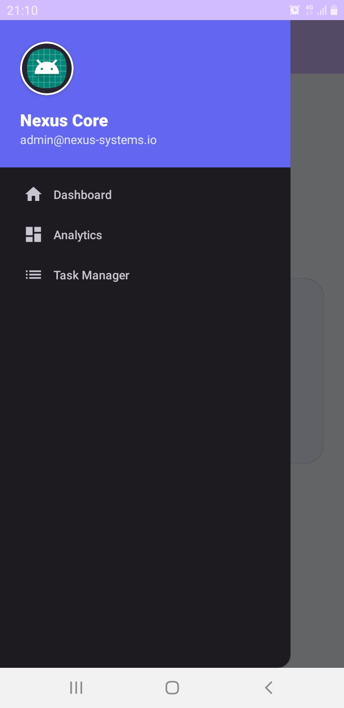
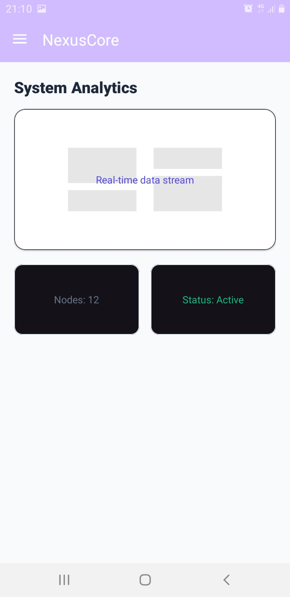
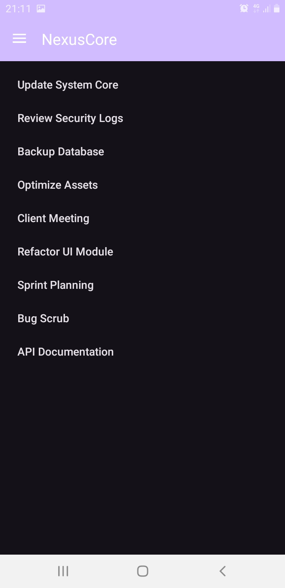

# Nexus Core - Navigation Drawer Moderne

## 📝 Description
Ce projet est une application Android de démonstration mettant en œuvre un **Navigation Drawer** (menu latéral) avec une architecture modulaire basée sur les **Fragments**. 

L'objectif pédagogique est de maîtriser la navigation dynamique, la gestion des transactions de fragments et l'application des principes de design **Material 3** pour une interface utilisateur moderne et épurée.

## 🚀 Fonctionnalités
- **Navigation Latérale** : Un menu coulissant permettant d'accéder rapidement aux différentes sections.
- **Gestion Dynamique** : Utilisation du `FragmentManager` pour remplacer le contenu de l'écran sans recharger l'activité.
- **Interface Moderne** : Palette de couleurs Indigo/Violet, cartes avec coins arrondis et typographie optimisée.
- **Trois Écrans Distincts** :
    - **Dashboard** : Accueil avec carte de bienvenue.
    - **Analytics** : Vue de données avec grille de statistiques.
    - **Task Manager** : Liste de tâches interactive utilisant un `ListFragment`.

## 🛠 Technologies utilisées
- **Langage** : Java
- **UI** : Android Material Components (Google)
- **Navigation** : DrawerLayout & Fragments
- **Compatibilité** : API 24 (Android 7.0) et versions supérieures

## 📸 Aperçus de l'application

### Menu de Navigation (img1)

*Le menu latéral permet de naviguer entre le Dashboard, les Analytics et les Tâches.*

### Fragment 1 : Dashboard (img2)

*L'écran d'accueil avec un design épuré.*

### Fragment 2 : Analytics (img3)

*Suivi des données système avec des cartes de statistiques.*

### Fragment 3 : Task Manager (img4)

*Gestionnaire de tâches utilisant une structure de liste optimisée.*

---
*Projet réalisé dans le cadre du Lab 10 - Développement Mobile Android.*