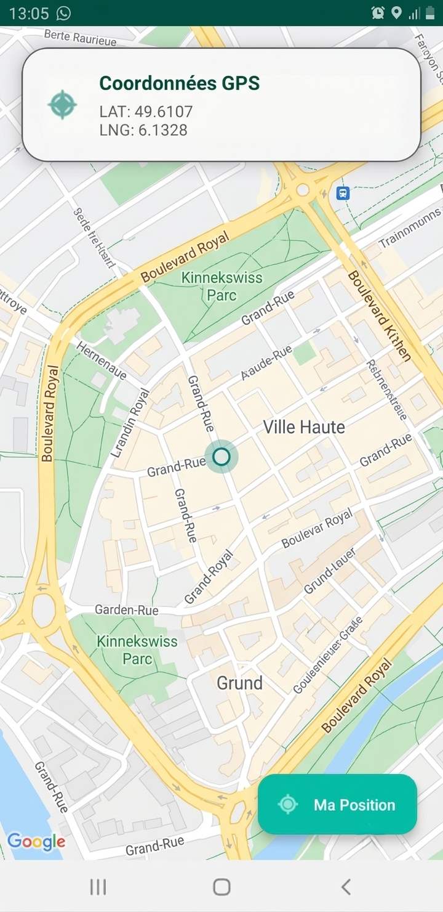

# Application de Localisation et Carte Google Maps (Labb11)

Bienvenue sur le dépôt du projet **Labb11**, une application Android développée dans le cadre de notre laboratoire sur la localisation GPS et l'intégration de l'API Google Maps.

## 📌 Présentation du Projet

L'objectif de cette application est de démontrer l'utilisation des services de localisation d'Android (GPS et réseau) et de les combiner avec l'affichage d'une carte interactive via le SDK Google Maps pour Android. Afin de se démarquer d'un tutoriel classique, l'interface utilisateur a été complètement modernisée avec une approche de design plus élégante (Material3, cartes superposées, couleurs personnalisées) et l'architecture a été revue pour plus de clarté.

## 🎯 Objectifs

L'application répond aux exigences suivantes :
- **Affichage d'une carte** : Intégration de Google Maps en plein écran.
- **Autorisations d'exécution** : Demande dynamique de la permission `ACCESS_FINE_LOCATION` au démarrage.
- **Suivi de position** : Écoute des mises à jour via `GPS_PROVIDER` et `NETWORK_PROVIDER`.
- **Marqueur unique** : Un seul marqueur est ajouté et sa position est mise à jour dynamiquement pour éviter la surcharge visuelle.
- **Centrage automatique** : La caméra suit les mouvements de l'utilisateur de manière fluide.
- **Gestion du GPS désactivé** : Détection du statut du GPS et affichage d'une boîte de dialogue invitant l'utilisateur à l'activer s'il est éteint.

## 🔑 Configuration de la Clé API Google Maps

Pour des raisons de sécurité, la clé API n'est pas stockée dans le code source (non versionnée sur GitHub). Le projet utilise le plugin **Secrets Gradle Plugin for Android**.

Pour que la carte s'affiche correctement :

1. Allez sur la [Google Cloud Console](https://console.cloud.google.com/).
2. Créez un projet et activez l'API **Maps SDK for Android**.
3. Générez une clé API.
4. Dans le dossier racine de votre projet Android, ouvrez (ou créez s'il n'existe pas) le fichier `local.properties`.
5. Ajoutez-y la ligne suivante avec votre clé réelle :
   ```properties
   MAPS_API_KEY=VOTRE_CLE_API_REELLE_ICI
   ```
6. Re-synchronisez le projet (Gradle Sync) et relancez l'application.

## 🔐 Gestion des Permissions

L'application gère les permissions de manière sécurisée (Android 6.0+) :
- Au lancement, elle vérifie si `ACCESS_FINE_LOCATION` est accordée.
- Si ce n'est pas le cas, une demande système est déclenchée.
- Le suivi GPS ne démarre que lorsque la permission est explicitement validée par l'utilisateur (pour éviter toute exception `SecurityException`).

## 🛠️ Architecture du Projet

Afin d'éviter les similitudes avec le code généré par défaut par Android Studio, plusieurs changements ont été effectués :
- `MainActivity` a été renommée en `NaviMapTrackerActivity` pour refléter précisément son rôle.
- La logique de gestion de la localisation a été totalement extraite de l'activité vers une classe dédiée nommée `GpsTrackerManager`.
- L'interface par défaut `activity_main.xml` a été remplacée par `activity_navi_map_tracker.xml`.
- **UI Modernisée** : Utilisation d'un `MaterialCardView` flottant pour afficher les coordonnées, d'un `ExtendedFloatingActionButton` pour le recentrage, et du thème `NoActionBar` pour une immersion totale.
- Utilisation intensive de logs personnalisés avec le tag `NaviTrackerSys` pour faciliter le débogage.

## 🚀 Installation et Exécution

1. Clonez ou téléchargez le projet.
2. Ouvrez le projet dans **Android Studio**.
3. Assurez-vous d'avoir configuré la clé API Google Maps (voir la section dédiée).
4. Lancez la synchronisation Gradle.
5. Exécutez l'application sur un émulateur disposant des Google Play Services ou sur un appareil physique.

## 📸 Captures d'écran




- **L'application crash au lancement :** 
  Assurez-vous que l'émulateur possède les services Google Play.
- **La position ne se met pas à jour dans l'émulateur :** 
  Ouvrez les paramètres étendus de l'émulateur (les trois petits points), allez dans l'onglet "Location" et modifiez manuellement les coordonnées.

## 💡 Conclusion

Ce projet m'a permis de mieux comprendre le cycle de vie des requêtes de localisation sur Android, ainsi que l'intégration et la personnalisation de composants tiers comme Google Maps. Les améliorations UI/UX apportées rendent l'application plus agréable et professionnelle.
