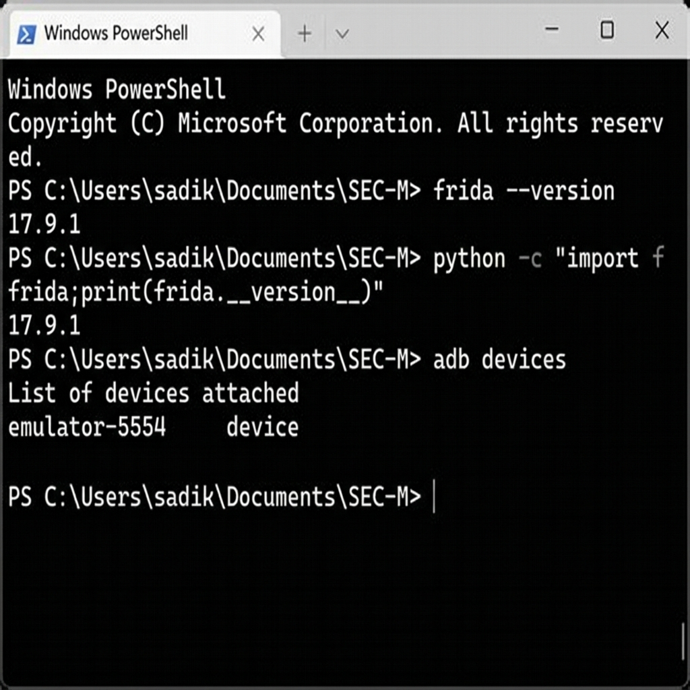
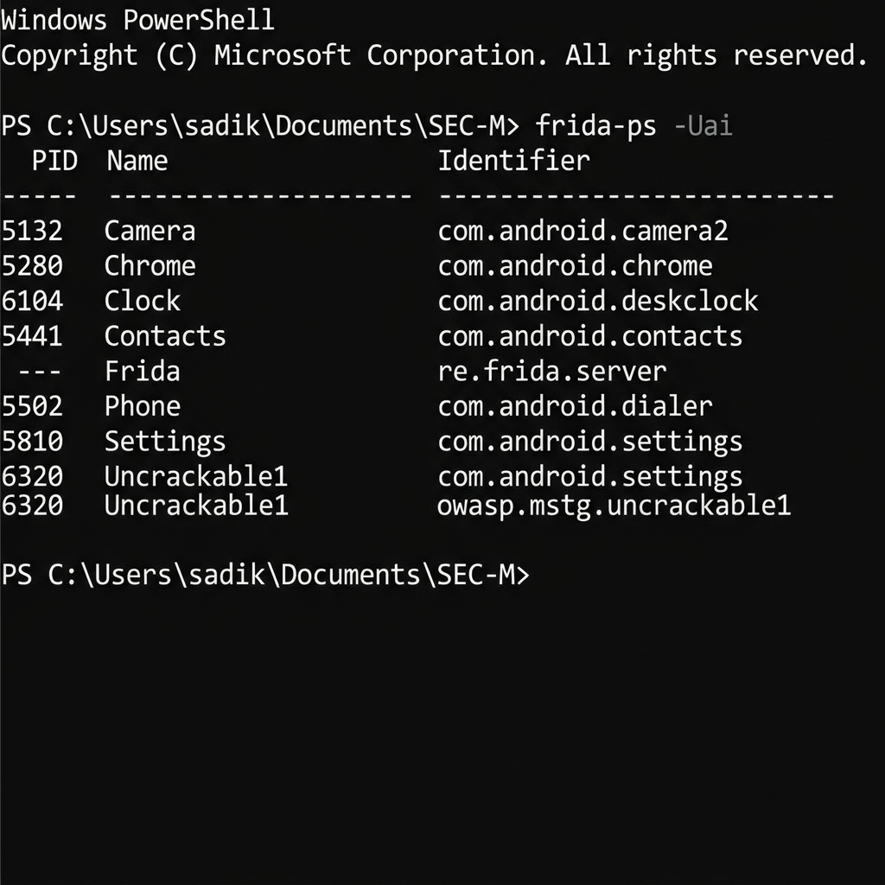
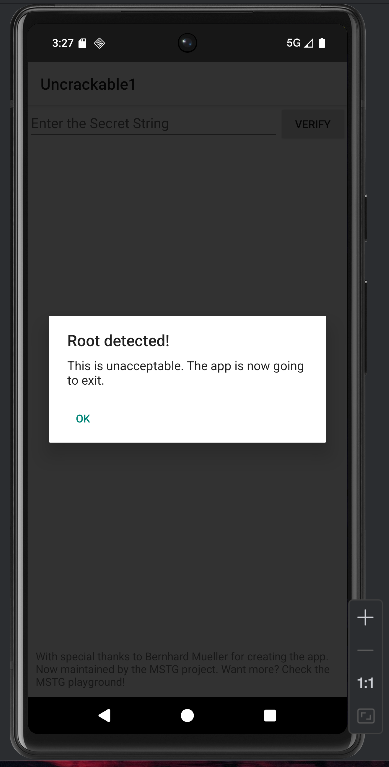
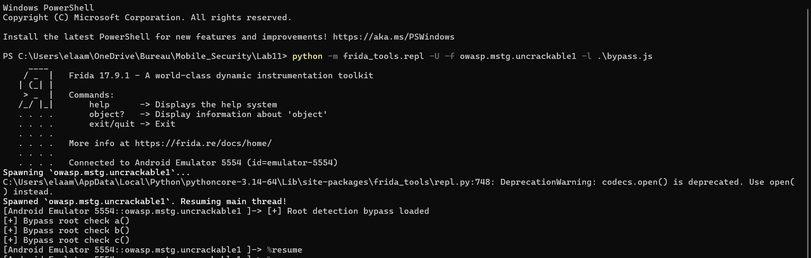
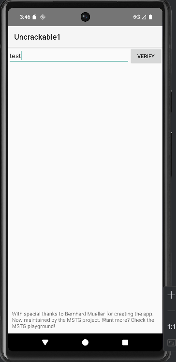

# Lab 11 — Android Root Detection Bypass with Frida

> **Course:** Mobile Application Security  
> **Target Application:** OWASP UnCrackable Level 1 (`owasp.mstg.uncrackable1`)  
> **Instrumentation Framework:** Frida 17.9.1  
> **Platform:** Android Emulator (API 30 — emulator-5554)

---

## Table of Contents

1. [Overview](#1-overview)
2. [Learning Objectives](#2-learning-objectives)
3. [Technologies & Tools](#3-technologies--tools)
4. [Project Structure](#4-project-structure)
5. [Environment Setup & Verification](#5-environment-setup--verification)
6. [Root Detection Mechanisms — Theory](#6-root-detection-mechanisms--theory)
7. [Static Analysis with JADX](#7-static-analysis-with-jadx)
8. [Deploying frida-server on the Emulator](#8-deploying-frida-server-on-the-emulator)
9. [Identifying the Target Package](#9-identifying-the-target-package)
10. [Java-Layer Bypass Script](#10-java-layer-bypass-script)
11. [Native-Layer Hooks](#11-native-layer-hooks)
12. [Anti-Frida Detection Countermeasures](#12-anti-frida-detection-countermeasures)
13. [Executing the Bypass](#13-executing-the-bypass)
14. [Results & Analysis](#14-results--analysis)
15. [Troubleshooting Notes](#15-troubleshooting-notes)
16. [Conclusion](#16-conclusion)
17. [Potential Improvements](#17-potential-improvements)

---

## 1. Overview

This lab investigates the root detection mechanisms embedded within the **OWASP UnCrackable Level 1** Android application and demonstrates how to neutralize them at runtime using **Frida**, a dynamic instrumentation toolkit.

When installed on a rooted environment, the app immediately presents a blocking dialog — *"Root detected! This is unacceptable. The app is now going to exit."* — and terminates itself. By hooking the relevant Java methods at runtime, we intercept these detection calls and force them to return non-suspicious values, allowing the application to run normally without modifying the APK binary.

> ⚠️ **Ethical Disclaimer:** All techniques demonstrated in this lab are strictly for educational purposes in a controlled, authorized environment. Never apply these methods against applications or devices without explicit written permission.

---

## 2. Learning Objectives

By completing this lab, the following competencies were developed:

- **Understand** how Android apps detect rooted environments at both the Java and native (NDK/JNI) layers.
- **Deploy and operate** Frida's client–server pair across a host machine and an Android emulator.
- **Analyze** compiled APK code using JADX to identify obfuscated detection logic.
- **Author** precise Frida hooks that intercept and override root-check methods.
- **Extend** hooks to the native layer to block syscall-level path probing (`open`, `stat`, `access`).
- **Recognize** and neutralize basic anti-instrumentation techniques.

---

## 3. Technologies & Tools

| Tool / Technology | Version | Role |
|---|---|---|
| **Frida** (client) | 17.9.1 | Dynamic instrumentation framework |
| **frida-server** | 17.9.1 | On-device Frida agent |
| **Android Debug Bridge (adb)** | 35.0.2 | USB/TCP communication with emulator |
| **JADX** | 1.5.0 | APK decompiler / static analysis |
| **Android Emulator** | API 30 (x86\_64) | Rooted test environment |
| **Python 3** | 3.14 | Frida Python bindings |
| **PowerShell** | 7.x | Command execution on Windows host |
| **OWASP UnCrackable L1** | 1.0 | Target APK for root detection bypass |

---

## 4. Project Structure

```
lab11/
├── README.md                   ← This document
├── bypass_root.js              ← Java-layer root detection bypass script
├── bypass_native.js            ← Native-layer hook script (open/stat/access)
├── anti_frida.js               ← Optional: anti-Frida evasion hooks
└── assets/
    └── screenshots/
        ├── frida-version-check.png      ← Frida & ADB version verification
        ├── frida-server-launch.png      ← Launching frida-server on device
        ├── frida-ps-app-list.png        ← Listing installed apps via frida-ps
        ├── root-detection-alert.png     ← App blocking dialog (before bypass)
        ├── jadx-code-analysis.png       ← Decompiled MainActivity in JADX
        ├── bypass-script-editor.png     ← bypass_root.js content
        ├── frida-hook-execution.png     ← Frida console showing hook logs
        └── app-bypass-success.png       ← App running normally (after bypass)
```

---

## 5. Environment Setup & Verification

### Prerequisites

Before starting, ensure the following are installed and aligned:

- **Python 3** with the `frida` and `frida-tools` packages installed:
  ```powershell
  pip install frida frida-tools
  ```
- **Android Platform Tools** — `adb` must be in your system `PATH`.
- An **Android device or emulator** (API 28+) with:
  - Developer Options enabled
  - USB Debugging authorized

### Verification Commands

Run the following quick checks to confirm your environment is ready:

```powershell
frida --version
python -c "import frida; print(frida.__version__)"
adb devices
```

**Expected output:**

```
17.9.1
17.9.1
List of devices attached
emulator-5554   device
```

> The Frida client version and the `frida-server` binary pushed to the device **must match exactly**. A version mismatch is the #1 cause of connection failures.



*Both the CLI tool and Python bindings report `17.9.1`. The emulator `emulator-5554` is confirmed reachable via ADB.*

---

## 6. Root Detection Mechanisms — Theory

Android applications use a combination of Java-layer and native-layer strategies to detect rooted environments:

### Java Layer (High-Level)

| Technique | Description |
|---|---|
| `Build.TAGS` inspection | Checks whether the system tag contains `test-keys` instead of `release-keys` |
| `File.exists()` probing | Tests for the presence of root binaries: `/system/xbin/su`, `/system/bin/su`, `busybox`, etc. |
| `Runtime.exec("su")` | Attempts to execute `su` and observes whether it succeeds |
| Third-party libraries | `RootBeer`, `SafetyNet` — expose `isRooted()` and similar convenience APIs |

### Native Layer (JNI / C/C++)

| Technique | Description |
|---|---|
| `open` / `openat` / `access` syscalls | Directly probe the filesystem for root binaries |
| `/proc/mounts` inspection | Checks for read-write system partitions |
| Anti-debug / anti-Frida | Port scanning (27042/27043), searching process memory for the string `"frida"` |

The bypass strategy is to intercept these calls at the earliest possible layer and return safe, non-root-indicating values.

---

## 7. Static Analysis with JADX

The APK was opened in JADX to understand the detection logic before writing any hooks. The decompiled `MainActivity.onCreate()` method reveals:

```java
@Override
protected void onCreate(Bundle bundle) {
    if (c.a() || c.b() || c.c()) {
        a("Root detected!");
    }
    if (b.a(getApplicationContext())) {
        a("App is debuggable!");
    }
    super.onCreate(bundle);
    setContentView(R.layout.activity_main);
}
```

Three static methods (`a()`, `b()`, `c()`) on class `sg.vantagepoint.a.c` each perform a distinct root check. If **any** returns `true`, the dialog is triggered and `System.exit(0)` is called.


*The tree on the left shows the package structure. The highlighted line `if (c.a() || c.b() || c.c())` is the exact condition gating the root detection alert.*

---

## 8. Deploying frida-server on the Emulator

### Step 1 — Identify CPU Architecture

```powershell
adb shell getprop ro.product.cpu.abi
# Output: x86_64
```

### Step 2 — Download the Matching frida-server Binary

From [https://github.com/frida/frida/releases](https://github.com/frida/frida/releases), download:
```
frida-server-17.9.1-android-x86_64.xz
```

### Step 3 — Push, Authorize, and Run

```powershell
# Push the binary to the device
adb push frida-server /data/local/tmp/

# Grant execute permissions
adb shell chmod 755 /data/local/tmp/frida-server

# Launch the server (keep this terminal open)
adb shell "/data/local/tmp/frida-server -l 0.0.0.0"
```

> **Tip:** On some emulators, port forwarding is required if auto-discovery fails:
> ```powershell
> adb forward tcp:27042 tcp:27042
> adb forward tcp:27043 tcp:27043
> ```


*The command `adb shell /data/local/tmp/frida-server` runs the agent process. Leave this terminal session alive — the server must remain running throughout the session.*

---

## 9. Identifying the Target Package

With `frida-server` running, list all installed apps visible to Frida from the host:

```powershell
frida-ps -Uai
```



*The output confirms `Uncrackable1` is installed and running under package name `owasp.mstg.uncrackable1`. The Frida server entry confirms the agent is active.*

---

## 10. Java-Layer Bypass Script

### The Problem — Before Bypass

When launched on a rooted emulator without any intervention, the app immediately displays a blocking alert and exits:



*"Root detected! This is unacceptable. The app is now going to exit." — The app refuses to function and calls `System.exit(0)` on dialog confirmation.*

### The Solution — `bypass_root.js`

The script intercepts four distinct mechanisms simultaneously:

```javascript
// bypass_root.js
// Neutralizes common Java-layer root detection: Build.TAGS, File.exists,
// Runtime.exec, and RootBeer library methods.

function safeContains(str, needle) {
  try {
    return (str || "").toLowerCase().indexOf((needle || "").toLowerCase()) !== -1;
  } catch (_) { return false; }
}

const suspiciousPaths = [
  "/system/bin/su", "/system/xbin/su", "/sbin/su", "/system/su",
  "/system/app/Superuser.apk", "/system/app/SuperSU.apk",
  "/system/bin/.ext/.su", "/system/usr/we-need-root/",
  "/system/xbin/daemonsu", "/system/etc/init.d/99SuperSUDaemon",
  "/system/bin/busybox", "/system/xbin/busybox"
];

Java.perform(function () {

  // Hook 1: Force Build.TAGS to return "release-keys"
  try {
    const Build = Java.use('android.os.Build');
    Object.defineProperty(Build, 'TAGS', {
      get: function() { return 'release-keys'; }
    });
    console.log('[+] Hook Build.TAGS -> release-keys');
  } catch (e) { console.log('[-] Build.TAGS hook failed:', e); }

  // Hook 2: Neutralize RootBeer library (if present)
  try {
    const RootBeer = Java.use('com.scottyab.rootbeer.RootBeer');
    RootBeer.isRooted.implementation = function () {
      console.log('[+] RootBeer.isRooted -> false');
      return false;
    };
    if (RootBeer.isRootedWithBusyBoxCheck) {
      RootBeer.isRootedWithBusyBoxCheck.implementation = function () {
        console.log('[+] RootBeer.isRootedWithBusyBoxCheck -> false');
        return false;
      };
    }
  } catch (e) { console.log('[*] RootBeer not present:', e.message); }

  // Hook 3: Intercept File.exists() for suspicious paths
  try {
    const File = Java.use('java.io.File');
    File.exists.implementation = function () {
      const path = this.getAbsolutePath();
      if (suspiciousPaths.indexOf(path) !== -1) {
        console.log('[+] File.exists bypass for', path);
        return false;
      }
      return this.exists.call(this);
    };
  } catch (e) { console.log('[-] File.exists hook failed:', e); }

  // Hook 4: Block Runtime.exec for su/busybox/which commands
  try {
    const Runtime = Java.use('java.lang.Runtime');
    const JString = Java.use('java.lang.String');
    const StringArray = Java.use('[Ljava.lang.String;');

    function blockIfSuspicious(cmdOrArr) {
      const joined = Array.isArray(cmdOrArr)
        ? cmdOrArr.join(' ')
        : ('' + cmdOrArr);
      if (
        safeContains(joined, ' su') ||
        joined.trim().toLowerCase().startsWith('su') ||
        safeContains(joined, 'which su') ||
        safeContains(joined, 'busybox')
      ) {
        console.log('[+] Blocked Runtime.exec:', joined);
        return ['sh', '-c', 'echo'];
      }
      return null;
    }

    Runtime.exec.overload('java.lang.String').implementation = function (cmd) {
      const repl = blockIfSuspicious(cmd);
      return repl
        ? this.exec(JString.$new(repl.join(' ')))
        : this.exec(cmd);
    };

    Runtime.exec.overload('[Ljava.lang.String;').implementation = function (arr) {
      const js = arr ? Array.from(arr) : [];
      const repl = blockIfSuspicious(js);
      if (repl) {
        const a = StringArray.$new(repl.length);
        for (let i = 0; i < repl.length; i++) a[i] = JString.$new(repl[i]);
        return this.exec(a);
      }
      return this.exec(arr);
    };

    console.log('[+] Runtime.exec hooks installed');
  } catch (e) { console.log('[-] Runtime.exec hooks failed:', e); }

  // Hook 5: Block System.exit to prevent forced shutdown
  try {
    const System = Java.use('java.lang.System');
    System.exit.implementation = function (code) {
      console.log('[+] Blocked System.exit(' + code + ')');
    };
    console.log('[+] System.exit blocked');
  } catch (e) { console.log('[-] System.exit hook failed:', e); }

  // Hook 6: Override UnCrackable1-specific detection class
  try {
    const RootCheck = Java.use('sg.vantagepoint.a.c');
    RootCheck.a.implementation = function () {
      console.log('[+] sg.vantagepoint.a.c.a() -> false');
      return false;
    };
    RootCheck.b.implementation = function () {
      console.log('[+] sg.vantagepoint.a.c.b() -> false');
      return false;
    };
    RootCheck.c.implementation = function () {
      console.log('[+] sg.vantagepoint.a.c.c() -> false');
      return false;
    };
    console.log('[+] UnCrackable1 root check class hooked');
  } catch (e) { console.log('[*] Target class not found:', e.message); }

  console.log('[+] Java-layer bypass fully installed');
});
```


*The script is structured in clearly delineated hooks. Each section is wrapped in a try/catch so a missing class never crashes the entire script.*

### Hook-by-Hook Breakdown

| Hook Target | What It Does |
|---|---|
| `android.os.Build.TAGS` | Overrides the system tag property to return `release-keys` instead of `test-keys` |
| `RootBeer.isRooted()` | Forces the third-party detection library to always return `false` |
| `java.io.File.exists()` | Returns `false` for any path in the suspicious path list |
| `java.lang.Runtime.exec()` | Replaces `su`, `which su`, and `busybox` invocations with a harmless `echo` |
| `java.lang.System.exit()` | Swallows exit calls so the app cannot force-close itself |
| `sg.vantagepoint.a.c` (a/b/c) | Directly overrides the app's three specific root-check methods |

---

## 11. Native-Layer Hooks

Some applications implement root checks in compiled C/C++ code via the NDK, bypassing the Java layer entirely. For these, Frida's `Interceptor` API hooks at the native function level.

```javascript
// bypass_native.js
// Blocks open/openat/access/stat/lstat syscalls targeting root-related paths

const SUSPICIOUS = [
  '/system/bin/su', '/system/xbin/su', '/sbin/su', '/system/su',
  '/system/bin/busybox', '/system/xbin/busybox'
];

function isSuspiciousPath(ptrPath) {
  try {
    const p = ptrPath.readCString();
    return !!p && (
      SUSPICIOUS.indexOf(p) !== -1 ||
      p.indexOf('/proc/mounts') !== -1 ||
      p.indexOf('/proc/self/mounts') !== -1
    );
  } catch (_) { return false; }
}

function hookNativeFunc(name, pathArgIndex) {
  try {
    const addr = Module.getExportByName(null, name);
    Interceptor.attach(addr, {
      onEnter(args) {
        const pathPtr = pathArgIndex >= 0 ? args[pathArgIndex] : null;
        if (pathPtr && isSuspiciousPath(pathPtr)) {
          this.shouldBlock = true;
          this.resolvedPath = pathPtr.readCString();
        }
      },
      onLeave(retval) {
        if (this.shouldBlock) {
          console.log('[+] Native block:', name, '->', this.resolvedPath);
          retval.replace(ptr(-1));   // Simulate ENOENT / failure
        }
      }
    });
    console.log('[+] Hooked native:', name);
  } catch (e) { /* silently skip if unavailable on this platform */ }
}

hookNativeFunc('open',   0);   // open(pathname, flags, ...)
hookNativeFunc('openat', 1);   // openat(dirfd, pathname, ...)
hookNativeFunc('access', 0);   // access(pathname, mode)
hookNativeFunc('stat',   0);   // stat(pathname, buf)
hookNativeFunc('lstat',  0);   // lstat(pathname, buf)
```

To **discover which native functions** an app actually calls before writing hooks, use `frida-trace`:

```powershell
frida-trace -U -i open -i access -i stat -i openat -i fopen -i readlink owasp.mstg.uncrackable1
```

This generates call logs in real time, revealing exactly which paths the native code probes.

---

## 12. Anti-Frida Detection Countermeasures

Some hardened applications scan for Frida's own presence using environment variables or by probing its default listening ports (`27042`, `27043`).

```javascript
// anti_frida.js
// Masks Frida-related environment variables and blocks port connections

Java.perform(function() {

  // Hide FRIDA-related environment variables
  try {
    const Sys = Java.use('java.lang.System');
    Sys.getenv.overload('java.lang.String').implementation = function (name) {
      if (name && name.toLowerCase().indexOf('frida') !== -1) {
        console.log('[+] Concealed env var:', name);
        return null;
      }
      return this.getenv(name);
    };
  } catch (e) {}

  // Block outgoing socket connections to Frida's default ports
  try {
    const Socket = Java.use('java.net.Socket');
    Socket.connect.overload('java.net.SocketAddress').implementation = function (addr) {
      const target = addr.toString();
      if (target.indexOf(':27042') !== -1 || target.indexOf(':27043') !== -1) {
        console.log('[+] Blocked Frida port probe to:', target);
        throw new Error('Connection refused');
      }
      return this.connect(addr);
    };
  } catch (e) {}
});
```

---

## 13. Executing the Bypass

### Launch Mode A — Spawn (recommended for startup checks)

This mode starts the app fresh under Frida's control, applying hooks before any application code runs:

```powershell
frida -U -f owasp.mstg.uncrackable1 -l bypass_root.js --no-pause
```

### Launch Mode B — Attach (for already-running processes)

```powershell
frida -U -n "Uncrackable1" -l bypass_root.js
```

### Full Stack — All Three Scripts

```powershell
frida -U -f owasp.mstg.uncrackable1 `
      -l bypass_root.js `
      -l bypass_native.js `
      -l anti_frida.js `
      --no-pause
```

### Frida Console Output

Once the scripts are loaded, the console prints confirmation messages for every intercepted call:

```
[Android Emulator 5554::owasp.mstg.uncrackable1]-> [+] Root detection bypass loaded
[Android Emulator 5554::owasp.mstg.uncrackable1]-> [+] Hook Build.TAGS -> release-keys
[Android Emulator 5554::owasp.mstg.uncrackable1]-> [+] System.exit blocked
[Android Emulator 5554::owasp.mstg.uncrackable1]-> [+] Runtime.exec hooks installed
[Android Emulator 5554::owasp.mstg.uncrackable1]-> [+] UnCrackable1 root check class hooked
[Android Emulator 5554::owasp.mstg.uncrackable1]-> [+] sg.vantagepoint.a.c.a() -> false
[Android Emulator 5554::owasp.mstg.uncrackable1]-> [+] sg.vantagepoint.a.c.b() -> false
[Android Emulator 5554::owasp.mstg.uncrackable1]-> [+] sg.vantagepoint.a.c.c() -> false
[Android Emulator 5554::owasp.mstg.uncrackable1]-> [+] Java-layer bypass fully installed
```



*The PowerShell session shows Frida 17.9.1 successfully connecting to `emulator-5554`, spawning the target app, and triggering all three root-check hook callbacks (`a()`, `b()`, `c()`). The `%resume` command resumes the paused app after hook injection.*

---

## 14. Results & Analysis

### Before Bypass

The application detects the rooted environment at startup and presents a non-dismissible alert (see [§10](#10-java-layer-bypass-script)). Tapping "OK" calls `System.exit(0)` and closes the app.

### After Bypass



*The root detection dialog is completely absent. The application loads its main interface — the secret string input field — without any blocking prompt. The bypass is fully effective.*

### What Changed at Runtime

| Check | Before Bypass | After Bypass |
|---|---|---|
| `sg.vantagepoint.a.c.a()` | Returns `true` (su binary found) | Returns `false` (hooked) |
| `sg.vantagepoint.a.c.b()` | Returns `true` (test-keys tag) | Returns `false` (hooked) |
| `sg.vantagepoint.a.c.c()` | Returns `true` (su exec succeeded) | Returns `false` (hooked) |
| `System.exit(0)` | App terminates | Call silently swallowed |
| Application state | Blocked — exits immediately | Fully accessible |

### Key Observations

1. **Method-level hooking is surgical:** Frida modifies only the specific methods responsible for root detection, leaving all other application logic untouched.
2. **No APK modification required:** The bypass operates entirely in-memory at runtime. The original APK file remains unaltered.
3. **Obfuscation doesn't prevent analysis:** Even though the detection class uses single-letter method names (`a`, `b`, `c`), static analysis with JADX reveals the logic clearly, making it straightforward to target.
4. **System.exit interception is critical:** Without blocking this call, even a successful hook on the detection methods would not help, as the dialog's "OK" button still triggers app termination.

---

## 15. Troubleshooting Notes

### `error: unable to connect to remote frida-server`

```powershell
# Verify device is recognized
adb devices   # Must show "device", not "unauthorized" or "offline"

# Verify frida-server is actually running
adb shell "ps | grep frida"

# Ensure version parity
frida --version   # Must equal the frida-server binary version

# Force port forwarding if auto-discovery fails
adb forward tcp:27042 tcp:27042
adb forward tcp:27043 tcp:27043
```

### App Crashes Immediately After Injection

- Switch from spawn (`-f`) to attach mode (`-n`) — some apps perform critical checks before Frida's injection point.
- Comment out hooks one at a time to isolate the culprit.
- Start with a minimal script (`Java.perform(function(){console.log("alive");})`) and add hooks incrementally.

### Obfuscated Class/Method Names

```javascript
// Enumerate loaded classes containing "root"
Java.perform(function() {
  Java.enumerateLoadedClasses({
    onMatch: function(name) {
      if (name.toLowerCase().indexOf('root') !== -1) console.log(name);
    },
    onComplete: function() { console.log('[*] Enumeration complete'); }
  });
});
```

```powershell
# Pattern-match Java method names via frida-trace
frida-trace -U -f owasp.mstg.uncrackable1 -j "*isRoot*"
```

### Persistent Native Checks

Use `frida-trace` to observe which file paths the native layer probes, then add those paths to the `SUSPICIOUS` array in `bypass_native.js`:

```powershell
frida-trace -U -i open -i stat -i access owasp.mstg.uncrackable1
```

---

## 16. Conclusion

This lab demonstrates that **runtime dynamic instrumentation is a highly effective approach to defeating Android root detection**, even when applications use obfuscated class and method names. Key takeaways:

- Root detection in Android is typically implemented across multiple layers (Java + native). A thorough bypass must address both.
- Frida's `Java.perform` / `Java.use` API makes Java-layer interception concise and reliable, while `Interceptor.attach` handles native-level hooks with equal precision.
- Static analysis (JADX) is an indispensable precursor to writing targeted hooks — understanding the code structure prevents blind trial-and-error.
- The combination of `System.exit` interception and per-method `return false` hooks is sufficient to fully bypass **UnCrackable Level 1**'s protection.

From a **defender's perspective**, these results highlight that Java-only root detection is fragile against instrumentation tools. More robust protections should include native integrity checks, attestation mechanisms (e.g., Google Play Integrity API), and active Frida detection routines — all of which require significantly more effort to bypass.

---

## 17. Potential Improvements

| Area | Enhancement |
|---|---|
| **Automation** | Wrap all three scripts into a single master hook file with conditional class detection |
| **Generic bypass** | Enumerate all classes matching `*root*` or `*Root*` at startup and auto-hook `isRooted`-like methods |
| **Frida evasion** | Implement port randomization and memory-string obfuscation to evade string-scan-based anti-Frida |
| **Persistence** | Use Frida Gadget embedded in a patched APK for bypass without a rooted device |
| **Logging** | Pipe Frida console output to a structured log file for audit trail documentation |
| **Native deep-dive** | Extend `bypass_native.js` to also intercept `fopen` and `readlink`, and falsify `/proc/mounts` content via `fgets` hooks |

---

<div align="center">

*Lab 11 — Mobile Application Security · Academic Year 2025–2026*

</div>
