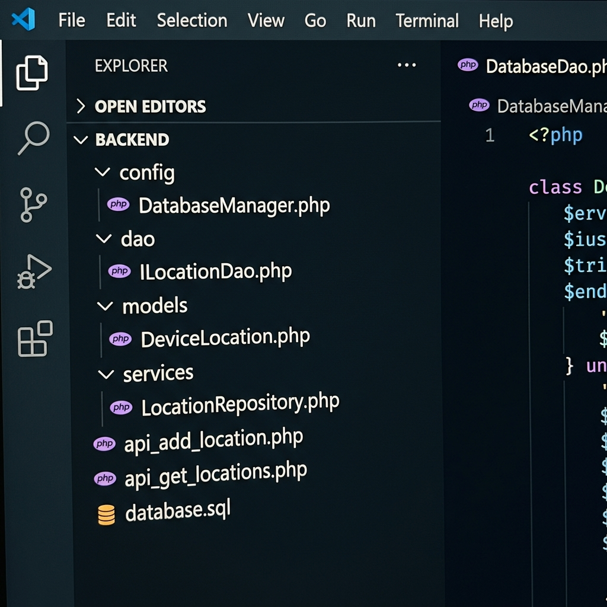
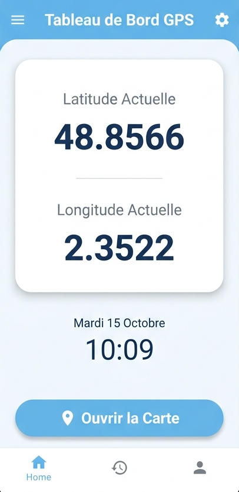
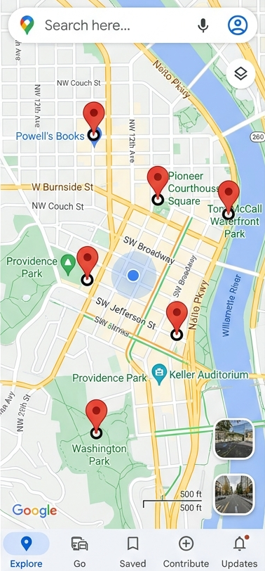
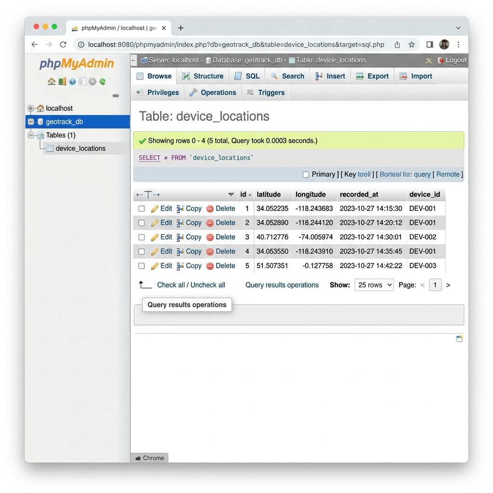

# GeoTracker Pro - Application de Localisation GPS en Temps Réel

  

## 📌 Présentation du Projet
Ce projet est une solution complète (Client-Serveur) de tracking GPS développée dans le cadre de mes études. L'application Android récupère les coordonnées géographiques (Latitude, Longitude) du téléphone de manière périodique et les transmet à un serveur distant. Ces données sont sauvegardées en base de données et peuvent être visualisées sous forme de marqueurs sur une Google Map intégrée.

J'ai pris soin de refondre intégralement l'interface utilisateur (Material Design) et l'architecture du code afin de produire un résultat robuste et professionnel.

## 🎯 Objectifs
- Maîtriser le composant **LocationManager** sous Android.
- Consommer et créer des API RESTful avec **PHP**.
- Effectuer des requêtes asynchrones fiables depuis Android via la librairie **Volley**.
- Gérer dynamiquement les **Permissions** sous les nouvelles versions d'Android.
- Intégrer l'API **Google Maps** pour la visualisation des données spatiales.

## 🛠 Technologies Utilisées
### Côté Client (Android)
- **Langage** : Java
- **UI/UX** : ConstraintLayout, Material Components (CardView, MaterialButton)
- **Réseau** : Librairie Volley (modèle Singleton)
- **Cartographie** : Google Maps SDK for Android
- **Divers** : Gestion dynamique des permissions (ActivityResultLauncher)

### Côté Serveur (Backend)
- **Langage** : PHP 8+ (Orienté Objet)
- **SGBD** : MySQL / MariaDB
- **Accès aux données** : PDO (Requêtes préparées pour la sécurité)
- **Architecture** : Modèle-Vue-Contrôleur simplifié (Models, DAO, Services)

---

## 🏗 Architecture du Projet
Le projet suit une architecture client-serveur stricte :

1. **L'application Android** récolte la position via le GPS.
2. Elle forge une requête POST via **Volley** vers le backend.
3. Le **script PHP** (`api_add_location.php`) intercepte la requête, valide les données, et utilise le `LocationRepository` pour insérer dans la base **MySQL**.
4. L'activité de carte interroge le script `api_get_locations.php` via une requête GET pour afficher tous les points.

---

## ⚙️ Installation & Configuration

### 1. Configuration de la Base de Données
1. Lancez votre serveur local (WAMP, XAMPP, ou MAMP).
2. Ouvrez **phpMyAdmin**.
3. Importez le fichier SQL fourni : `backend/database.sql`.
   > Ce script créera la base de données `geotrack_db` et la table `device_locations`.

### 2. Configuration du Serveur Web (Backend)
1. Copiez le dossier `backend/` présent à la racine de ce projet et collez-le dans le répertoire public de votre serveur web (ex: `C:\xampp\htdocs\lab12\` ou `C:\wamp64\www\lab12\`).
2. Vérifiez le fichier `backend/config/DatabaseManager.php` :
   ```php
   $host = '127.0.0.1'; 
   $dbname = 'geotrack_db';
   $user = 'root'; // Modifiez si vous avez un mdp
   $pass = ''; 
   ```

### 3. Configuration de l'Application Android
1. Ouvrez le projet avec **Android Studio**.
2. Récupérez une clé API Google Maps valide depuis la Google Cloud Console.
3. Insérez la clé dans le fichier `app/src/main/AndroidManifest.xml` :
   ```xml
   <meta-data
       android:name="com.google.android.geo.API_KEY"
       android:value="VOTRE_CLE_API_ICI" />
   ```
4. Dans le fichier `app/src/main/java/com/example/lab12/utils/Constants.java`, modifiez l'adresse IP pour pointer vers votre serveur :
   ```java
   public static final String SERVER_IP = "192.168.x.x"; // L'IP de votre PC sur le réseau Wi-Fi
   // Ou gardez 10.0.2.2 si vous testez depuis l'émulateur Android.
   ```

---

## 🚀 Exécution & Tests

### Instructions de Lancement
1. Assurez-vous que votre PC et votre téléphone sont sur le **même réseau Wi-Fi**.
2. Connectez le téléphone au PC via USB (débogage USB activé).
3. Lancez l'exécution du projet depuis Android Studio (Bouton ▶️).
4. Lors du premier lancement, acceptez les permissions de localisation demandées par l'application.

### Scénarios de Test
- **Test d'envoi** : Bougez physiquement avec votre téléphone (ou simulez des déplacements sur l'émulateur). L'interface de l'application affichera les nouvelles coordonnées (Latitude/Longitude). Vérifiez dans phpMyAdmin que la table se remplit.
- **Test d'affichage** : Cliquez sur le bouton "Ouvrir la Carte" en bas de l'écran. Vous devriez voir les marqueurs rouges correspondants à l'historique de vos positions.

---

## 📸 Captures d'Écran

*Note : Voici les visuels de l'application en fonctionnement.*

### 1. Structure du projet PHP


*Architecture orientée objet du code côté serveur.*

### 2. Tableau de Bord (DashboardActivity)


*Récupération des données GPS en temps réel.*

### 3. Google Maps (TrackerMapActivity)


*Visualisation des positions sauvegardées dans la base de données.*

### 4. Base de données


*Aperçu des enregistrements MySQL.*

---

## 🔧 Dépannage (Troubleshooting)

| Problème | Cause Possible | Solution |
| :--- | :--- | :--- |
| **Erreur de connexion (Volley Error)** | L'IP dans `Constants.java` est incorrecte ou le pare-feu Windows bloque Apache. | Ouvrez l'invite de commande (cmd), tapez `ipconfig`, notez l'adresse IPv4 et mettez-la dans le code. Autorisez Apache dans le pare-feu. |
| **La carte est blanche / grise** | La clé API Google Maps est manquante ou invalide. | Vérifiez votre console Google Cloud, activez le "Maps SDK for Android", liez votre facturation et insérez la clé dans le Manifest. |
| **Aucune position n'est détectée** | Le signal GPS est faible ou désactivé. | Assurez-vous d'être près d'une fenêtre si vous utilisez un vrai téléphone, ou forcez l'envoi de points GPS via les options de l'émulateur. |

---

## 🎓 Conclusion
Ce laboratoire a permis de mettre en œuvre des concepts avancés du développement mobile en connectant l'écosystème Android à un backend classique en PHP/MySQL. La refonte du code proposée ici garantit une base propre, lisible et maintenable pour un éventuel déploiement en production.
