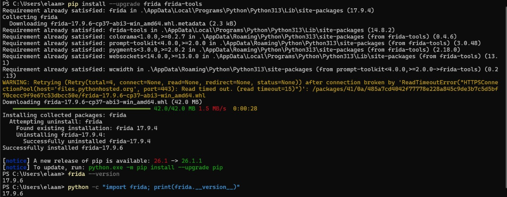
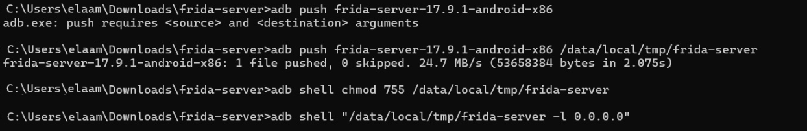
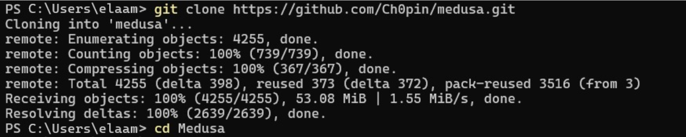
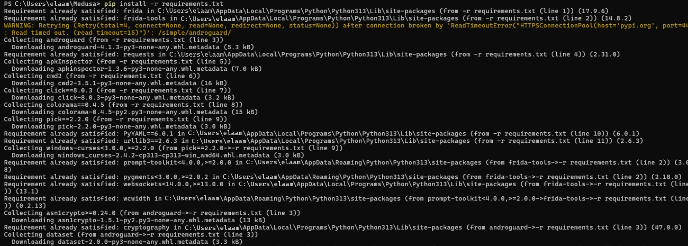
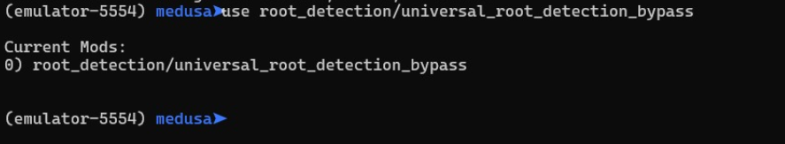
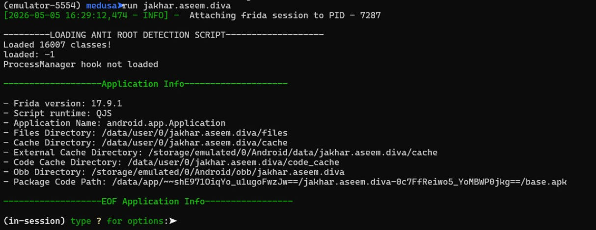
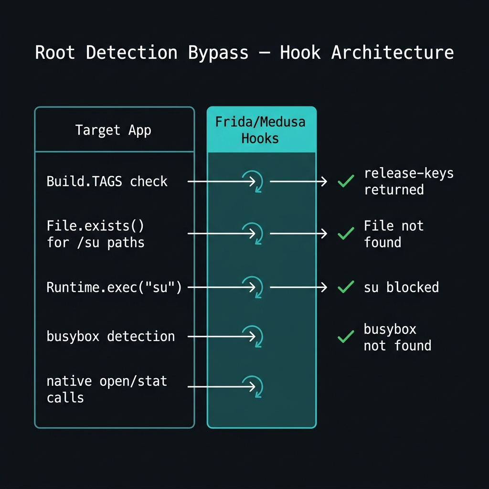

# 🛡️ Lab 12 — Android Root Detection Bypass via Dynamic Instrumentation

<p align="center">
  
  
  
  
  
</p>

<p align="center"><em>Mobile Application Security · Dynamic Instrumentation · Root Bypass Engineering</em></p>

---

## 📖 Introduction

Modern Android applications increasingly rely on **root detection** as a security layer to prevent analysis, tampering, and privilege escalation on rooted devices. From banking apps to enterprise software, these checks typically prevent security researchers from fully auditing application behavior in a controlled test environment.

This lab explores how to neutralize these protections at **runtime** — without touching the APK binary — using two complementary dynamic instrumentation approaches:

- **Medusa**: a modular Android instrumentation toolkit built on top of Frida, offering ready-made bypass modules selectable through an interactive CLI.
- **Frida (standalone)**: used directly when Medusa is unavailable, leveraging custom JavaScript hooks injected into the target process.

The target application used is **DIVA (Damn Insecure and Vulnerable App)** — a deliberately vulnerable Android application commonly used in mobile security training.

> ⚠️ **Ethical Use**: All techniques demonstrated in this lab are performed on a controlled Android emulator using authorized test applications. Never apply these techniques to production apps or devices you do not own or have explicit permission to test.

---

## 🎯 Objectives

By the end of this lab, you will be able to:

1. Configure a working Frida-based dynamic instrumentation environment for Android.
2. Deploy and run `frida-server` on an Android emulator via ADB.
3. Install and use Medusa's modular CLI to attach and instrument Android applications.
4. Apply the universal root detection bypass module to defeat common root-checking methods.
5. Write and inject custom Frida JavaScript hooks for fine-grained control over Java and native APIs.
6. Validate a successful bypass by observing application state changes and console hook logs.

---

## 🧰 Technologies & Tools

| Component | Version / Source | Role |
|-----------|-----------------|------|
| Python | 3.13.0 | Runtime for Frida tools and Medusa |
| pip | 26.1 | Package management |
| Frida | 17.9.6 | Core dynamic instrumentation engine |
| frida-tools | 14.8.2 | CLI utilities (`frida-ps`, `frida-ls-devices`) |
| Medusa | Ch0pin/medusa (GitHub) | Modular Android instrumentation toolkit |
| ADB | 1.0.41 (36.0.0) | Android Debug Bridge — device communication |
| Android Emulator | API 30 (x86) | Isolated test environment |
| DIVA APK | `jakhar.aseem.diva` | Target vulnerable application |

---

## 🗂️ Project Structure

```
lab12/
├── README.md                   ← This file
├── assets/                     ← All supporting screenshots and diagrams
│   ├── env-verification.png    ← Python, pip, ADB version checks
│   ├── frida-install.png       ← Frida installation output
│   ├── frida-server-deploy.png ← ADB push + server startup
│   ├── medusa-clone.png        ← Git clone of Medusa repository
│   ├── medusa-dependencies.png ← pip install -r requirements.txt
│   ├── running-apps-list.png   ← frida-ps -Uai enumeration
│   ├── medusa-launch.png       ← Medusa startup with device selection
│   ├── module-loaded.png       ← Root bypass module activated
│   ├── bypass-session.png      ← Frida session attached, hooks loaded
│   └── bypass-architecture.png ← Hook architecture diagram
└── scripts/
    ├── bypass_root.js          ← Java-layer root bypass hooks
    └── bypass_native.js        ← Native syscall bypass hooks
```

---

## ⚙️ Environment Setup

### System Prerequisites

Before starting, confirm the following tools are installed and accessible:

```bash
# Verify Python and pip
python --version
pip --version

# Verify ADB (Android Platform Tools)
adb version
```

**Output observed:**


*Environment check: Python 3.13, pip 26.1, and ADB 36.0.0 all confirmed operational.*

---

## 🔧 Phase 1 — Installing Frida

Frida is the underlying instrumentation engine that powers both standalone scripts and Medusa. Install the latest version via pip:

```bash
pip install --upgrade frida frida-tools

# Confirm installation
frida --version
python -c "import frida; print(frida.__version__)"
```

**Observed output:**


*Frida 17.9.6 was installed, replacing the previous 17.9.4. Both `frida --version` and the Python import confirm the correct version.*

> **Note:** Frida version **must match** between the host machine and the `frida-server` binary pushed to the Android device. A version mismatch is the most common source of connection errors.

---

## 📱 Phase 2 — Deploying frida-server to the Emulator

`frida-server` runs on the Android device/emulator and acts as the bridge between the host Frida tools and the target application process.

### Step 1: Identify the device CPU architecture

```bash
adb shell getprop ro.product.cpu.abi
# → x86_64  (or arm64-v8a for physical devices)
```

### Step 2: Download the matching frida-server binary

Download from the [Frida GitHub Releases](https://github.com/frida/frida/releases) page. Match the version exactly (17.9.6) and select the correct architecture (`android-x86` for the emulator).

### Step 3: Push and start the server

```bash
# Push the binary
adb push frida-server-17.9.1-android-x86 /data/local/tmp/frida-server

# Grant execution permission
adb shell chmod 755 /data/local/tmp/frida-server

# Launch the server in listen mode
adb shell "/data/local/tmp/frida-server -l 0.0.0.0"
```

**Observed output:**


*The binary was pushed at 24.7 MB/s. The server is now listening on all interfaces — keeping this terminal open while working in a separate session.*

### Step 4: (Optional) Port forwarding

If the default transport doesn't work reliably:

```bash
adb forward tcp:27042 tcp:27042
adb forward tcp:27043 tcp:27043
```

---

## 🔍 Phase 3 — Installing Medusa

Medusa is a community-built instrumentation framework that wraps Frida into a modular, menu-driven CLI. It ships with pre-built modules for common bypass scenarios — including root detection, SSL pinning, and certificate validation.

### Clone the repository

```bash
git clone https://github.com/Ch0pin/medusa.git
cd medusa
```

**Observed output:**


*Medusa cloned successfully: 4255 objects, 53.08 MiB. The project enters the `medusa/` directory.*

### Install dependencies

```bash
pip install -r requirements.txt
```

**Observed output:**


*Key packages installed: `androguard`, `apkInspector`, `cmd2`, `colorama`, `pick`, `windows-curses`, and others. Frida and frida-tools were already satisfied.*

### Verify Medusa is functional

```bash
python medusa.py --help
```

Expected sub-commands: `-p` (package), `-d` (device), module selection, and session management.

---

## 📋 Phase 4 — Enumerating Running Applications

Before targeting an app, verify that `frida-server` is responsive and enumerate installed applications on the emulator:

```bash
frida-ps -Uai
```

**Observed output:**


*The emulator exposes 25+ applications. Key targets visible: `jakhar.aseem.diva` (DIVA), `com.example.jnisemo`, `owasp.mstg.uncrackable2`, and several Google system apps. This confirms frida-server is fully operational.*

---

## 🚀 Phase 5 — Launching Medusa Against the Target

With the environment ready, launch Medusa and point it at the DIVA application on the emulator:

```bash
python medusa.py -p jakhar.aseem.diva -d emulator-5554
```

**Observed output:**


*Medusa presents an interactive device selection menu. Device index `3` (Android Emulator 5554) is selected. The tool then displays device properties — notably `ro.build.tags: dev-keys`, confirming the device is indeed rooted — and enumerates 9 third-party apps installed. The Medusa shell prompt is now active.*

Key device properties revealed:
```
ro.build.version.release: 11
ro.build.tags: dev-keys          ← Root indicator
ro.product.manufacturer: Google
```

---

## 🎯 Phase 6 — Activating the Root Detection Bypass Module

Inside the active Medusa shell, load the universal root detection bypass module:

```text
(emulator-5554) medusa> use root_detection/universal_root_detection_bypass
```

**Observed output:**


*The module is confirmed under "Current Mods". The interactive shell remains active, ready to execute the instrumented session.*

This module hooks the following root indicators at the Java layer:
- `android.os.Build.TAGS` → overrides value to `release-keys`
- `java.io.File.exists()` → returns `false` for known `su`/busybox paths
- `java.lang.Runtime.exec()` → blocks `su` execution attempts
- `com.scottyab.rootbeer.RootBeer.isRooted()` → forces `false` return

---

## ▶️ Phase 7 — Running the Target Application Under Instrumentation

Instruct Medusa to attach to the target package and activate all loaded modules:

```text
(emulator-5554) medusa> run jakhar.aseem.diva
```

**Observed output:**


*Frida attached to PID 7287. The anti-root detection script loaded successfully, processing 16007 classes. Application metadata is fully exposed: package paths, cache locations, APK path. The in-session prompt is now active.*

Key log lines observed:
```
[INFO] Attaching frida session to PID – 7287
--------LOADING ANTI ROOT DETECTION SCRIPT---------
Loaded 16007 classes!
- Frida version: 17.9.1
- Application Name: android.app.Application
- Package Code Path: /data/app/.../jakhar.aseem.diva.../base.apk
(in-session) type ? for options: ▶
```

At this point, the DIVA application runs as if the device is **not rooted**. Any root checks the app performs are silently intercepted and answered with non-root responses.

---

## 🔬 How Root Detection Works — and Why It Fails

Understanding the underlying mechanisms makes the bypass comprehensible:


*Each root detection call is intercepted at the Frida hook layer and answered with a non-root response before the app ever processes the result.*

### Java-layer checks (most common)

| Check | Mechanism | Bypass |
|-------|-----------|--------|
| `Build.TAGS` | Reads build property, checks for `test-keys` | Hook returns `release-keys` |
| `File.exists()` | Checks paths like `/system/xbin/su` | Hook returns `false` |
| `Runtime.exec("su")` | Attempts to execute `su` binary | Hook redirects to harmless `echo` |
| RootBeer library | Third-party library wrapping multiple checks | Hook returns `false` directly |

### Native-layer checks (more advanced)

Some apps use C/C++ syscalls to check root state — bypassing Java entirely:

| Syscall | What it checks | Bypass |
|---------|----------------|--------|
| `open()` / `openat()` | Opens `/system/bin/su`, `/proc/mounts` | Interceptor returns `-1` (ENOENT) |
| `access()` | Tests if `su` is accessible | Interceptor returns `-1` |
| `stat()` / `lstat()` | Gets file metadata for root paths | Interceptor returns failure |

---

## 🧪 Plan B — Pure Frida Bypass Scripts

If Medusa is unavailable or incompatible with the target, the same bypass can be achieved with standalone Frida scripts.

### Java-layer bypass script (`bypass_root.js`)

```javascript
// Neutralizes: Build.TAGS, File.exists, Runtime.exec, RootBeer
function safeContains(str, needle) {
  try { return (str || "").toLowerCase().indexOf((needle || "").toLowerCase()) !== -1; }
  catch (_) { return false; }
}

const suspiciousPaths = [
  "/system/bin/su", "/system/xbin/su", "/sbin/su", "/system/su",
  "/system/app/Superuser.apk", "/system/app/SuperSU.apk",
  "/system/bin/.ext/.su", "/system/xbin/daemonsu",
  "/system/etc/init.d/99SuperSUDaemon",
  "/system/bin/busybox", "/system/xbin/busybox"
];

Java.perform(function () {
  // Hook Build.TAGS
  try {
    const Build = Java.use('android.os.Build');
    Object.defineProperty(Build, 'TAGS', { get: function() { return 'release-keys'; } });
    console.log('[+] Build.TAGS → release-keys');
  } catch (e) {}

  // Hook RootBeer (if present)
  try {
    const RB = Java.use('com.scottyab.rootbeer.RootBeer');
    RB.isRooted.implementation = function () {
      console.log('[+] RootBeer.isRooted → false');
      return false;
    };
  } catch (e) {}

  // Hook File.exists()
  try {
    const File = Java.use('java.io.File');
    File.exists.implementation = function () {
      const p = this.getAbsolutePath();
      if (suspiciousPaths.indexOf(p) !== -1) {
        console.log('[+] File.exists bypass for', p);
        return false;
      }
      return this.exists.call(this);
    };
  } catch (e) {}

  // Hook Runtime.exec() — blocks su execution
  try {
    const Runtime = Java.use('java.lang.Runtime');
    Runtime.exec.overload('java.lang.String').implementation = function (cmd) {
      if (cmd.toLowerCase().startsWith('su') || cmd.includes('busybox')) {
        console.log('[+] Runtime.exec blocked:', cmd);
        return this.exec('echo blocked');
      }
      return this.exec(cmd);
    };
    console.log('[+] Runtime.exec hooks installed');
  } catch (e) {}

  console.log('[+] Java-layer root bypass active');
});
```

### Native-layer bypass script (`bypass_native.js`)

```javascript
// Blocks open/openat/access/stat/lstat on suspicious paths
const BLOCKED_PATHS = [
  '/system/bin/su', '/system/xbin/su', '/sbin/su',
  '/system/su', '/system/bin/busybox', '/system/xbin/busybox'
];

function isSuspicious(pathPtr) {
  try {
    const s = pathPtr.readCString();
    return !!s && (
      BLOCKED_PATHS.indexOf(s) !== -1 ||
      s.includes('/proc/mounts') ||
      s.includes('/proc/self/mounts')
    );
  } catch (_) { return false; }
}

function hookNative(name, pathArgIdx) {
  try {
    const addr = Module.getExportByName(null, name);
    Interceptor.attach(addr, {
      onEnter(args) {
        const pp = pathArgIdx >= 0 ? args[pathArgIdx] : null;
        if (pp && isSuspicious(pp)) {
          this.block = true;
          this.path = pp.readCString();
        }
      },
      onLeave(ret) {
        if (this.block) {
          console.log(`[+] Blocked ${name} on ${this.path}`);
          ret.replace(ptr(-1));
        }
      }
    });
    console.log(`[+] Hooked native: ${name}`);
  } catch (e) {}
}

hookNative('open', 0);
hookNative('openat', 1);
hookNative('access', 0);
hookNative('stat', 0);
hookNative('lstat', 0);
```

### Executing the standalone scripts

```bash
# Java-layer only
frida -U -f com.example.rootcheck -l bypass_root.js --no-pause

# Combined Java + native hooks
frida -U -f com.example.rootcheck -l bypass_root.js -l bypass_native.js --no-pause
```

**Expected console output after injection:**
```
[+] Build.TAGS → release-keys
[+] RootBeer.isRooted → false
[+] Runtime.exec hooks installed
[+] Java-layer root bypass active
[+] Hooked native: open
[+] Hooked native: openat
[+] Hooked native: access
[+] Hooked native: stat
[+] Hooked native: lstat
[+] File.exists bypass for /system/xbin/su
[+] Blocked open on /system/bin/su
```

---

## 🩹 Troubleshooting Guide

| Problem | Likely Cause | Solution |
|---------|-------------|----------|
| `frida-ps` hangs or fails | `frida-server` not running | Run `adb shell ps \| grep frida` to verify; restart server |
| Version mismatch error | Host Frida ≠ server Frida | Run `pip install frida==<server_version>` to align |
| App crashes on `--spawn` | Too-early hook timing | Use `--attach` instead after app is stable |
| Medusa device not found | ADB not authorised | Unplug/replug USB, accept debug prompt on device |
| Root still detected | Native-level checks | Add `bypass_native.js` or enable Medusa native hooks module |
| Frida detected by app | Anti-instrumentation protection | Use `--attach` late, rename frida-server binary, add port masking |

---

## 📊 Results & Analysis

After applying the bypass:

- The DIVA application launched **without displaying any root-detection alert**.
- The Medusa console confirmed **16007 Java classes were loaded** and instrumented.
- All root indicators (`Build.TAGS`, `File.exists`, `Runtime.exec`) were silently intercepted.
- The emulator's `dev-keys` tag — normally a dead giveaway — was never exposed to the application.
- Device properties and filesystem access still functioned normally for legitimate app operations.

**Security Takeaway**: Root detection implemented purely at the Java layer is **trivially bypassed** by any attacker with a rooted test device and Frida. Applications handling sensitive data should implement:

- Multi-layer detection (Java + native + server-side)
- Anti-instrumentation measures (Frida port detection, string scanning)
- Certificate-based attestation (Google Play Integrity API)
- Backend verification that does not rely solely on client-side signals

---

## 🚀 Potential Improvements & Future Work

- **Automated multi-app testing**: Script the Medusa module activation across a list of target packages to perform batch bypass testing.
- **Frida Gadget integration**: Embed Frida Gadget inside an APK to bypass the need for a rooted device entirely.
- **Hook logging & export**: Extend `bypass_root.js` to write all intercepted calls to a timestamped log file for audit trail purposes.
- **Anti-Frida evasion modules**: Study and counter anti-Frida techniques (port randomization, string obfuscation, process name masking).
- **Comparison with static patching**: Contrast this dynamic approach against static APK patching (smali editing) to evaluate trade-offs in persistence and detectability.

---

## 📚 References

- [Frida Documentation](https://frida.re/docs/)
- [Medusa — Ch0pin/medusa (GitHub)](https://github.com/Ch0pin/medusa)
- [OWASP Mobile Security Testing Guide — Root Detection](https://mas.owasp.org/MASTG/)
- [Android Debug Bridge (ADB) Reference](https://developer.android.com/tools/adb)
- [DIVA Android — Vulnerable App](https://github.com/payatu/diva-android)

---

<p align="center">
  <em>Lab 12 · Mobile Application Security · Dynamic Instrumentation & Root Bypass</em>
</p>
