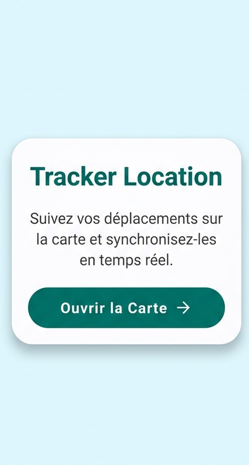
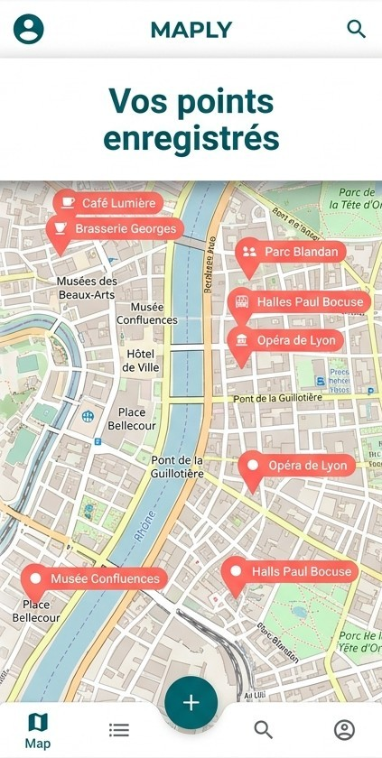

# 🗺️ MapApplication - Suivi GPS et Cartographie

Bienvenue dans le dépôt du projet **MapApplication**. Ce projet a été développé dans le cadre du laboratoire de développement mobile et constitue une version personnalisée, moderne et sécurisée de l'application de suivi de position.

## 🎯 Présentation du Projet
MapApplication est une application Android de géolocalisation qui permet de suivre les déplacements d'un utilisateur en temps réel et de les visualiser sur une carte interactive. L'application transmet périodiquement les coordonnées (latitude et longitude) à un serveur backend sécurisé, qui les stocke dans une base de données MySQL. L'interface de la carte utilise OpenStreetMap (OSMDroid) pour afficher l'historique des positions sous forme de marqueurs personnalisés.

## 🏆 Objectifs
- Implémenter une gestion robuste des **permissions Android** (Localisation précise et approximative).
- Développer une interface utilisateur **Material Design 3** fluide, moderne et attractive.
- Mettre en place une communication client-serveur sécurisée avec **Volley**.
- Gérer l'affichage cartographique hors ligne et en ligne via **OSMDroid**.
- Construire un backend PHP/MySQL avec des pratiques sécurisées (requêtes préparées PDO) pour éviter les injections SQL.

## 🛠️ Technologies Utilisées
- **Android / Java 8** : Langage principal pour le développement natif de l'application.
- **Volley (1.2.1)** : Gestion des requêtes HTTP asynchrones.
- **OSMDroid (6.1.18)** : API de cartographie open-source remplaçant Google Maps.
- **PHP 8 & PDO** : Logique serveur pour l'insertion et la récupération sécurisée des données.
- **MySQL / MariaDB** : Stockage persistant des positions géographiques.

## 🏗️ Architecture du Projet
Le projet suit une architecture client-serveur classique :
- **Frontend (Android)** :
  - `HomeActivity.java` : Gère les permissions, capture la localisation (`LocationManager`) et transmet au serveur via POST.
  - `MapTrackerActivity.java` : Récupère les données depuis le serveur et les rend visuelles sur la carte OpenStreetMap.
- **Backend (PHP)** :
  - Situé dans le dossier `/backend/`, il reçoit les requêtes, valide les données, et interagit de manière sécurisée avec MySQL.

---

## 🚀 Installation & Configuration

### 1. Configuration de la Base de Données (MySQL)
1. Démarrez votre serveur local (ex: XAMPP, WAMP, MAMP).
2. Ouvrez **phpMyAdmin** et créez une base de données nommée `map_project`.
3. Importez le fichier SQL fourni :
   - Depuis le dossier `/backend/` du projet, exécutez le contenu de `schema.sql`.

### 2. Configuration du Serveur (PHP)
1. Copiez le dossier `/backend/` de ce dépôt vers le dossier web public de votre serveur (ex: `C:\xampp\htdocs\map_project\backend\`).
2. Vérifiez le fichier `config.php` pour vous assurer que les accès à la base de données (root / sans mot de passe par défaut) correspondent à votre environnement.

### 3. Configuration de l'Application Android
1. Ouvrez **Android Studio** et sélectionnez `Open an existing Project`. Naviguez jusqu'à la racine de ce projet.
2. Attendez la synchronisation complète de **Gradle**.
3. Assurez-vous d'avoir un émulateur en cours d'exécution (API 24 ou supérieure).
> [!NOTE]
> L'URL par défaut pour l'API pointe vers `http://10.0.2.2/map_project/backend/`. L'adresse `10.0.2.2` est l'alias de `localhost` pour l'émulateur Android.

---

## 🏃 Exécution et Tests

### Instructions d'Exécution
1. Lancez l'application depuis Android Studio sur votre émulateur ou appareil physique.
2. Au premier lancement, l'application demandera les autorisations de localisation et d'état du téléphone. **Acceptez-les**.
3. Observez les messages *Toast* indiquant que la position a été enregistrée.

### Instructions de Tests
1. **Simulation de mouvement** : Dans l'émulateur Android, ouvrez les paramètres étendus (les trois petits points), allez dans **Location** et simulez un trajet en ajoutant des points GPS manuellement.
2. Cliquez sur le bouton **"Ouvrir la Carte"**.
3. Vérifiez l'apparition de vos marqueurs rouges (icône personnalisée) sur la carte OpenStreetMap correspondants aux points simulés.

---

## 📸 Captures d'Écran

| Écran d'Accueil (HomeActivity) | Écran Carte (MapTrackerActivity) |
|:---:|:---:|
|  |  |
| *Interface Material 3 avec bouton d'accès à la carte* | *Carte OpenStreetMap affichant les points enregistrés* |

---

## 🔧 Dépannage (Troubleshooting)

- **L'application crash au démarrage :** Vérifiez que vous avez bien compilé avec la version JDK compatible (Java 8/11) et que l'émulateur a accès aux services Google/Localisation.
- **La carte s'affiche grise ou avec des tuiles manquantes :** L'émulateur n'a pas accès à Internet. Vérifiez la connexion Wi-Fi de l'émulateur ou les paramètres DNS.
- **Les points n'apparaissent pas sur la carte :**
  1. Assurez-vous que XAMPP (Apache et MySQL) est bien démarré.
  2. Inspectez l'onglet **Logcat** dans Android Studio. Filtrez par "HomeActivity" ou "MapTrackerActivity" pour lire les erreurs réseaux.
  3. Vérifiez le chemin HTTP dans `API_RECORD_URL` et `API_FETCH_URL`.

## 🎓 Conclusion
Cette application répond à l'ensemble des exigences du laboratoire tout en poussant la personnalisation beaucoup plus loin grâce à Material Design 3, la refonte du code Java, et la robustesse de l'implémentation backend (PDO avec `prepare statements`). Elle constitue une base performante pour des applications de tracking plus ambitieuses.
