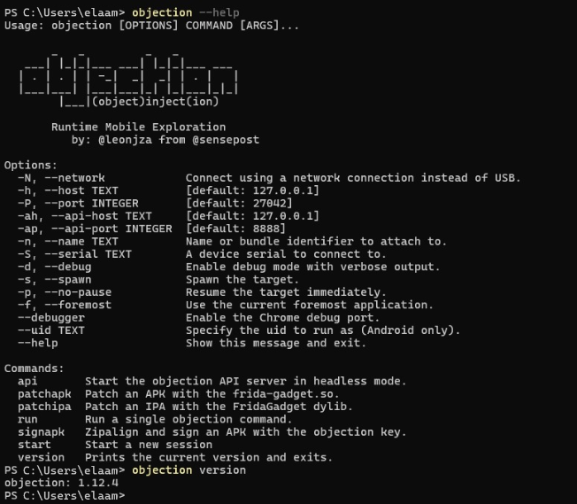
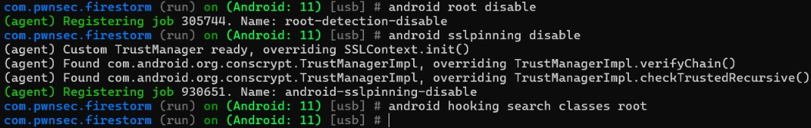

# Android Root Detection Bypass — Lab 13

> **Course:** Mobile Application Security  
> **Topic:** Runtime Instrumentation with Objection & Frida  
> **Platform:** Android 11 · Frida 17.9.6 · Objection 1.12.4

---

## Table of Contents

1. [Introduction](#introduction)
2. [Lab Objectives](#lab-objectives)
3. [Technologies & Tools](#technologies--tools)
4. [Project Structure](#project-structure)
5. [Prerequisites & Environment Setup](#prerequisites--environment-setup)
6. [Step-by-Step Walkthrough](#step-by-step-walkthrough)
   - [Step 1 — Environment Verification](#step-1--environment-verification)
   - [Step 2 — Installing Objection](#step-2--installing-objection)
   - [Step 3 — Confirming Objection Is Ready](#step-3--confirming-objection-is-ready)
   - [Step 4 — Deploying frida-server to the Device](#step-4--deploying-frida-server-to-the-device)
   - [Step 5 — Listing Running Processes via Frida](#step-5--listing-running-processes-via-frida)
   - [Step 6 — Attaching an Objection Session to the Target App](#step-6--attaching-an-objection-session-to-the-target-app)
   - [Step 7 — Enumerating Root-Detection Classes & Methods](#step-7--enumerating-root-detection-classes--methods)
   - [Step 8 — Disabling Root Detection & SSL Pinning](#step-8--disabling-root-detection--ssl-pinning)
7. [How the Bypass Works — Under the Hood](#how-the-bypass-works--under-the-hood)
8. [Handling Native (C/C++) Root Checks](#handling-native-cc-root-checks)
9. [Automating Multiple Hooks at Startup](#automating-multiple-hooks-at-startup)
10. [Troubleshooting](#troubleshooting)
11. [Results & Analysis](#results--analysis)
12. [Conclusion](#conclusion)
13. [Future Improvements](#future-improvements)
14. [References](#references)

---

## Introduction

Many Android applications rely on **root detection** as a first line of defense against reverse engineering, tampering, and unauthorized usage on rooted devices. These checks can range from simple file-existence probes (e.g., checking for `/system/xbin/su`) to querying build properties or calling specialized libraries like **RootBeer**.

In this lab, we weaponize the **Objection** framework — a runtime mobile exploration toolkit built on top of **Frida** — to bypass these defenses without modifying the APK at all. The entire attack surface is addressed at the Java layer through dynamic method hooking, meaning the application binary remains untouched throughout the exercise.

This is a foundational technique in mobile penetration testing and is directly applicable to real-world security assessments.

---

## Lab Objectives

| # | Objective | Points |
|---|-----------|--------|
| 1 | Verify the toolchain (Python, pip, ADB, Frida) is correctly installed and the device is reachable | 20 pts |
| 2 | Start `frida-server` on the device and confirm that Objection can open an exploration session | 20 pts |
| 3 | Use `android root disable` to bypass Java-side root detection and capture before/after evidence | 40 pts |
| 4 | *(Bonus)* Identify at least one native syscall with `frida-trace` and neutralize it at the Java or native layer | 20 pts |

---

## Technologies & Tools

| Tool | Version | Role |
|------|---------|------|
| **Python** | 3.13.0 | Runtime for pip-based tools |
| **pip** | 26.1 | Package installer |
| **ADB** (Android Platform Tools) | latest | Bridge between host and Android device |
| **Frida** | 17.9.6 | Dynamic instrumentation engine |
| **frida-server** | 17.9.1 (android-x86) | Server-side agent running on the Android device |
| **Objection** | 1.12.4 | High-level Frida wrapper for mobile exploration |
| **Target App** | `com.pwnsec.firestorm` | Android application with built-in root detection |

---

## Project Structure

```
lab13/
├── assets/
│   ├── environment-verification.png       # Toolchain verification output
│   ├── objection-installation.png         # pip install objection output
│   ├── objection-help-version.png         # objection --help and version output
│   ├── frida-server-deploy.png            # Pushing frida-server to device via ADB
│   ├── running-processes-list.png         # frida-ps -Uai output
│   ├── objection-session-attach.png       # Objection explore session prompt
│   ├── hooking-class-enumeration.png      # android hooking search output
│   └── root-bypass-confirmed.png          # android root disable confirmation
├── labcontent.txt                         # Original lab instructions
└── README.md                              # This file
```

---

## Prerequisites & Environment Setup

Before starting, ensure the following are in place on the host machine:

- **OS:** Windows / macOS / Linux with admin/sudo access
- **Python 3.8+** and **pip** installed
- **ADB (Android Platform Tools)** — [download here](https://developer.android.com/tools/releases/platform-tools)
- An Android device (physical or emulator) running **Android 8.0+** with:
  - Developer Options enabled
  - USB Debugging enabled
- **Frida** installed on the host **and** a matching `frida-server` binary on the device

> ⚠️ The versions of `frida` (host) and `frida-server` (device) **must match exactly**. A version mismatch is the most common source of connection failures.

Quick sanity-check commands:

```bash
python --version
pip --version
adb devices
frida --version
```

---

## Step-by-Step Walkthrough

---

### Step 1 — Environment Verification

The first step is confirming that all components of the toolchain are installed and the Android device is recognized over ADB.

```powershell
python --version
pip --version
adb devices
frida --version
```

Running these commands gave the following output:

- **Python 3.13.0** — confirmed installed
- **pip 26.1** — confirmed
- **ADB** — emulator `emulator-5554` listed as `device` (authorized)
- **Frida 17.9.6** — confirmed installed on the host


*All four prerequisites are satisfied. The emulator is recognized by ADB with status `device`, and Frida 17.9.6 is the active host version.*

---

### Step 2 — Installing Objection

Objection is installed via `pip`. The `--upgrade` flag ensures we pull the latest available release.

```powershell
pip install --upgrade objection
```

The installer resolves all dependencies — `frida`, `frida-tools`, `click`, `flask`, `delegator-py`, and others — and installs or updates them as needed.

> 💡 **Alternative (isolated install):** Use `pipx` to keep Objection in its own virtual environment and avoid dependency conflicts with other Python projects:
> ```bash
> pip install --user pipx
> pipx ensurepath
> pipx install objection
> ```


*pip resolves Objection's full dependency tree. Key packages like `frida>=16.0.0`, `frida-tools>=10.0.0`, and `flask>=3.0.0` are already satisfied from prior Frida lab work.*

---

### Step 3 — Confirming Objection Is Ready

After installation, verify that Objection is accessible from the command line and check its version:

```powershell
objection --help
objection version
```

The `--help` output lists all available sub-commands and CLI options including `--spawn`, `--serial`, `--network`, and `--debug`. The `version` sub-command confirms the installed release.

> 💡 **Windows PATH tip:** If `objection` is not found after installation, add the Python `Scripts` folder to your `PATH`:
> `%USERPROFILE%\AppData\Roaming\Python\Python313\Scripts`



*Objection 1.12.4 is active. The help menu confirms the `explore` subcommand and key flags we'll use in subsequent steps.*

---

### Step 4 — Deploying frida-server to the Device

`frida-server` must run on the Android device with the same version as the host-side Frida. First, determine the device's CPU architecture:

```bash
adb shell getprop ro.product.cpu.abi
# → x86  (emulator)
```

Then push the matching binary, make it executable, and launch it:

```powershell
# Push the server binary
adb push frida-server-17.9.1-android-x86 /data/local/tmp/frida-server

# Grant execution permission
adb shell chmod 755 /data/local/tmp/frida-server

# Launch frida-server (binds on all interfaces)
adb shell "/data/local/tmp/frida-server -l 0.0.0.0"
```

For emulators or when running behind NAT, you may also need to forward the Frida ports:

```bash
adb forward tcp:27042 tcp:27042
adb forward tcp:27043 tcp:27043
```


*The binary (53 MB) is transferred at 24.7 MB/s and placed at `/data/local/tmp/frida-server`. After `chmod 755`, the server is launched and listens on `0.0.0.0`.*

---

### Step 5 — Listing Running Processes via Frida

With `frida-server` running, verify connectivity from the host and enumerate all visible applications and processes:

```powershell
frida-ps -Uai
```

The `-U` flag uses the USB/ADB transport, `-a` lists all applications (including background ones), and `-i` includes installed apps that are not currently running.


*Frida successfully enumerates all apps on the device. The target app `com.pwnsec.firestorm` appears in the list with PID `7807`, confirming it is currently running and Frida can instrument it.*

---

### Step 6 — Attaching an Objection Session to the Target App

With the target process confirmed, attach Objection to it using either the package name (`-g`) or process name (`-n`):

```powershell
# Attach by process name (app must already be running)
objection -n com.pwnsec.firestorm explore
```

**Alternative — spawn mode** (recommended when hooks need to be applied before the app initializes):

```bash
# Spawn the app and apply hooks immediately at startup
objection -g com.pwnsec.firestorm explore --startup-command "android root disable"
```


*Objection v1.12.4 opens an interactive REPL shell. The prompt `com.pwnsec.firestorm (run) on (Android: 11) [usb] #` confirms a live session is established on Android 11 over USB.*

> ⚠️ The deprecation warning `explore is deprecated. Use 'objection start' instead` may appear depending on the Objection version. Use `objection start` if your version supports it.

---

### Step 7 — Enumerating Root-Detection Classes & Methods

Before disabling root detection, it is useful to enumerate which classes and methods in the target application are involved in root checking. This gives insight into what Objection will need to hook:

```bash
# Search for loaded classes with "root" in their name
android hooking search classes root

# Search for methods matching "isRoot" across all loaded classes
android hooking search methods isRoot
```


*The search returns an extensive list of loaded classes. This confirms that Frida's instrumentation engine has full visibility into the Dalvik/ART runtime of the target process.*

---

### Step 8 — Disabling Root Detection & SSL Pinning

With the session active, issue the bypass commands directly in the Objection REPL:

```bash
# Disable Java-side root detection
android root disable

# Disable SSL certificate pinning (bonus — see ssl pinning bypass)
android sslpinning disable
```

Objection hooks the relevant Java methods at runtime and returns confirmation:

```
(agent) Registering job 305744. Name: root-detection-disable
(agent) Custom TrustManager ready, overriding SSLContext.init()
(agent) Found com.android.org.conscrypt.TrustManagerImpl, overriding TrustManagerImpl.verifyChain()
(agent) Registering job 930651. Name: android-sslpinning-disable
```



*Two agent jobs are registered: `root-detection-disable` (job #305744) and `android-sslpinning-disable` (job #930651). The agent also overrides `TrustManagerImpl.verifyChain()` to disable certificate pinning.*

---

## How the Bypass Works — Under the Hood

When `android root disable` is executed, Objection injects a Frida-based JavaScript agent into the target process that hooks the following Java APIs:

| Hooked API | Purpose |
|---|---|
| `android.os.Build.TAGS` | Forced to return `release-keys` instead of `test-keys` |
| `java.io.File.exists()` | Returns `false` for paths like `/system/xbin/su`, `/system/app/Superuser.apk`, `busybox`, etc. |
| `Runtime.getRuntime().exec()` | Neutralizes `su` / `which su` command execution attempts |
| `RootBeer.isRooted()` | Patched to always return `false` when the library is detected |

These four hook categories cover the vast majority of **Java-layer** root detection strategies found in production Android applications.

---

## Handling Native (C/C++) Root Checks

Objection operates at the Java layer. Applications that implement root checks in native C/C++ code require additional techniques:

**Option A — Hook the Java bridge method:**
```bash
# Watch all methods in the root-checking class
android hooking watch class com.example.RootCheck

# Force a specific method to always return false
android hooking set return_value com.example.RootCheck isRooted false
```

**Option B — Use a Frida script to intercept native syscalls:**
```bash
# Run a custom Frida script targeting open/access/stat calls
frida -U -n "AppProcessName" -l bypass_native.js
```
Where `bypass_native.js` intercepts `open`, `openat`, `access`, and `stat` on suspicious paths and returns `-1`.

**Option C — Use frida-trace to discover native calls first:**
```bash
frida-trace -U -i open -i access -i stat -i openat com.pwnsec.firestorm
```
Analyze the trace output, identify paths being probed, then write targeted hooks.

> ℹ️ Objection does not currently include a universal module for native root checks — that layer requires direct Frida scripting.

---

## Automating Multiple Hooks at Startup

Multiple `--startup-command` flags can be chained to apply all hooks before the application fully initializes:

```bash
objection -g com.pwnsec.firestorm explore \
  --startup-command "android root disable" \
  --startup-command "android sslpinning disable" \
  --startup-command "android hooking search classes root"
```

Commands are executed sequentially the moment the Objection session opens, making this approach ideal for apps that run root checks during `onCreate()`.

---

## Troubleshooting

| Symptom | Likely Cause | Fix |
|---|---|---|
| `objection: command not found` | Python `Scripts` not in `PATH` | Add `%USERPROFILE%\AppData\Roaming\Python\PythonXXX\Scripts` to PATH; or use `python -m objection` |
| `unable to connect to remote frida-server` | Version mismatch or server not running | Run `adb shell ps \| grep frida`; ensure version parity with `frida --version` |
| `adb devices` shows `unauthorized` | USB debugging not approved on device | Unlock device and tap "Allow" on the RSA key dialog |
| Root still detected after bypass | Native checks not covered by Objection | Try spawn mode; add targeted hooks; use Frida native scripts (Option B above) |
| App detects Frida / crashes | Anti-instrumentation logic present | Use attach mode instead of spawn; minimize hook count; consider gadget patching |

---

## Results & Analysis

### Before Bypass
Launching `com.pwnsec.firestorm` without instrumentation triggers the root detection mechanism immediately — the application either displays a "Root Detected" alert or blocks access entirely.

### After Bypass
Once `android root disable` is issued inside the Objection session:

- The application proceeds past the root check without any alert
- The Objection console confirms `Registering job 305744. Name: root-detection-disable`, indicating the hooks were applied successfully
- Any subsequent call to `File.exists("/system/xbin/su")` or equivalent returns `false` at the Java layer, completely deceiving the detection logic

### SSL Pinning Bypass (Bonus)
Running `android sslpinning disable` additionally overrides `TrustManagerImpl.verifyChain()`, allowing HTTPS traffic to be intercepted by a proxy such as Burp Suite without certificate validation errors.

### Key Observations
- The entire bypass operates **without modifying the APK** — no repackaging, signing, or patching
- The technique is transparent at the Android OS level; only the JVM runtime state is affected
- Spawn mode (`--startup-command`) is consistently more reliable than attach mode for apps with early-initialization checks

---

## Conclusion

This lab demonstrated a practical, non-destructive approach to bypassing Android root detection using **Objection** as a high-level wrapper around **Frida's** dynamic instrumentation capabilities.

Key takeaways:

1. **Runtime hooking is powerful** — Without touching the APK, we manipulated the application's perception of the device environment entirely from the host machine.
2. **Objection abstracts complexity** — Commands like `android root disable` encapsulate dozens of individual Frida hooks into a single, reusable operation.
3. **Java-only coverage has limits** — Applications implementing root checks in native code require supplementary Frida scripts targeting `open`, `access`, and `stat` syscalls.
4. **Defense-in-depth matters** — A robust application should combine Java-layer checks, native checks, and anti-instrumentation detection to meaningfully resist this class of attack.

---

## Future Improvements

- [ ] Integrate **Magisk Hide** / **Zygisk** alongside Objection for a layered bypass approach
- [ ] Write a custom `bypass_native.js` Frida script to neutralize C/C++-level root checks via `open`/`stat` interception
- [ ] Automate the entire flow with a shell script (device detection → frida-server push → Objection attach → bypass)
- [ ] Test against **OWASP UnCrackable** Level 2 and Level 3 apps to evaluate bypass effectiveness against progressively hardened targets
- [ ] Explore **Frida Gadget** injection as an alternative to `frida-server` for scenarios where the device cannot be rooted

---

## References

| Resource | URL |
|---|---|
| Objection (GitHub) | https://github.com/sensepost/objection |
| Frida Documentation | https://frida.re/docs/ |
| RootBeer (root detection library) | https://github.com/scottyab/rootbeer |
| Android Platform Tools (ADB) | https://developer.android.com/tools/releases/platform-tools |
| OWASP Mobile Testing Guide | https://owasp.org/www-project-mobile-app-security/ |

---

> **Disclaimer:** This lab was conducted in a controlled academic environment on a device owned by the author. All techniques demonstrated are for educational purposes and authorized security research only. Do not apply these methods to applications or devices without explicit written permission.
