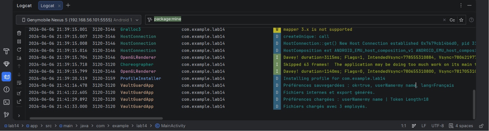
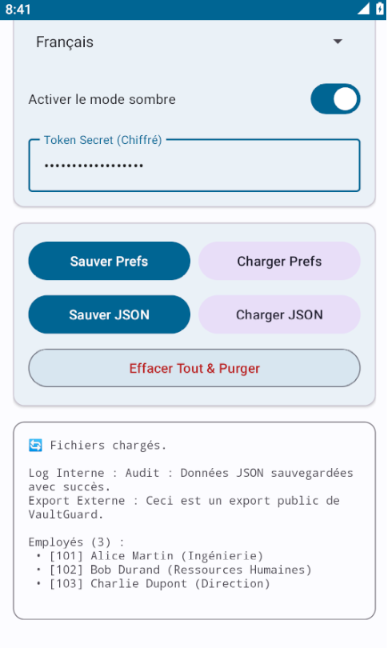

# VaultGuard (Lab 14)

## Présentation du projet
VaultGuard est une application Android moderne et sécurisée, développée dans le cadre du Lab 14 "Sauvegarde des données – SharedPreferences et fichiers". Contrairement à une simple application de démonstration, VaultGuard se présente sous la forme d'un coffre-fort virtuel avec une interface utilisateur Material Design 3 entièrement personnalisée.

L'objectif de cette application est de démontrer l'utilisation avancée de la persistance de données locales sur Android, tout en appliquant des règles strictes de sécurité de l'information (pas de secrets stockés en clair, nettoyage des caches, absence de logs sensibles).

## Objectifs
- Écrire et lire des préférences via `SharedPreferences`.
- Sécuriser les informations sensibles (ex: Token) à l'aide de `EncryptedSharedPreferences` et du Keystore Android (`MasterKey`).
- Sauvegarder et restaurer des données textuelles et des données structurées (JSON) dans le stockage interne privé de l'application.
- Utiliser le cache temporaire de l'application et proposer une fonction pour le purger.
- Exporter des fichiers vers le stockage externe spécifique à l'application (`getExternalFilesDir()`).
- Mettre en œuvre une véritable "Checklist Sécurité" pour prévenir toute fuite de données (pas de log de secrets, mode d'accès privé, suppression fiable).

## Technologies Utilisées
- **Langage :** Java
- **SDK Minimum :** API 24 (Android 7.0)
- **UI & Design :** Material Design 3 (MaterialCardView, TextInputLayout, MaterialSwitch)
- **Sécurité :** Bibliothèque AndroidX Security Crypto (`androidx.security:security-crypto:1.1.0-alpha06`)
- **Format de Données :** JSON (`org.json` standard Android) et UTF-8

## Architecture de l'Application
Afin de garder le code propre, structuré et éviter les similitudes avec le code de base, le projet suit une architecture par packages :
- `com.example.lab14.model` : Contient l'entité de données (`Employee.java`).
- `com.example.lab14.storage` : Gère les accès aux données non-chiffrées (`SettingsManager.java`, `LocalTextManager.java`, `EmployeesJsonManager.java`, `TemporaryCache.java`, `ExternalExportManager.java`).
- `com.example.lab14.security` : Centralise les opérations cryptographiques (`TokenVault.java`).
- `com.example.lab14` : Contient l'activité principale UI (`MainActivity.java`).

## Instructions d'Installation
1. Clonez ou téléchargez ce dépôt sur votre machine locale.
2. Ouvrez Android Studio.
3. Sélectionnez **File > Open** et pointez vers le répertoire du projet `lab14`.
4. Laissez Gradle synchroniser les dépendances.

## Configuration Base de Données
*Aucune base de données externe n'est requise.* Ce laboratoire est focalisé sur la persistance locale via des fichiers et les `SharedPreferences`.

## Configuration Serveur
*Aucun serveur n'est requis.* L'application fonctionne de manière entièrement autonome et hors ligne.

## Configuration Android & Exécution
1. Assurez-vous d'avoir un émulateur Android ou un appareil physique branché via USB/Wi-Fi (minimum Android 7.0 - API 24).
2. Dans Android Studio, cliquez sur le bouton vert **Run 'app'** ou utilisez le raccourci `Shift + F10`.
3. L'application se compilera, s'installera sur l'appareil et s'ouvrira sur l'écran "VaultGuard Settings".

## Instructions de Test
- **Préférences :** Saisissez un nom et choisissez une langue. Cliquez sur **"Sauver Prefs"**. Fermez l'application et rouvrez-la. Les valeurs seront restaurées.
- **Sécurité :** Entrez une valeur dans le champ "Token Secret". Cliquez sur **"Sauver Prefs"**. Observez les logs dans l'onglet *Logcat* d'Android Studio : la valeur n'y apparaît jamais en clair.
- **Fichiers :** Cliquez sur **"Sauver JSON"**. Ceci écrira des données employés et des logs d'audit. Utilisez **"Charger JSON"** pour afficher le résultat à l'écran.
- **Nettoyage :** Cliquez sur le bouton rouge **"Effacer Tout & Purger"** pour supprimer toutes les préférences, le token sécurisé, les fichiers internes, et vider le cache. 
- **Device File Explorer :** Dans Android Studio, utilisez *View > Tool Windows > Device File Explorer* et naviguez vers `/data/data/com.example.lab14/`. Vous pourrez y vérifier l'état des fichiers (création puis suppression).

## Captures d'Écran
*Note : Si les images requises ne s'affichent pas ici, référez-vous aux images jointes à la consigne du laboratoire.*

- **Logcat (Écriture / Lecture sécurisée) :**

- **Saved JSON file in Device :**
  

## Résolution des Problèmes (Troubleshooting)
- **Erreur "Unresolved reference" pour Security Crypto :** Si l'importation de `EncryptedSharedPreferences` échoue, assurez-vous que `androidx.security:security-crypto:1.1.0-alpha06` est bien présent dans le `build.gradle.kts` de l'application, puis faites un *Sync Project with Gradle Files*.
- **Crash au démarrage lié au MasterKey :** Assurez-vous que l'appareil ou l'émulateur tourne au moins sous l'API 24, car les schémas de chiffrement recommandés dépendent du matériel de keystore moderne.

## Conclusion
Ce projet remplit toutes les exigences du Lab 14 tout en proposant une personnalisation profonde (VaultGuard) : refonte de l'interface graphique en Material 3, restructuration des classes de stockage et sécurité logicielle de pointe (masquage de token, purge des données sensibles).
