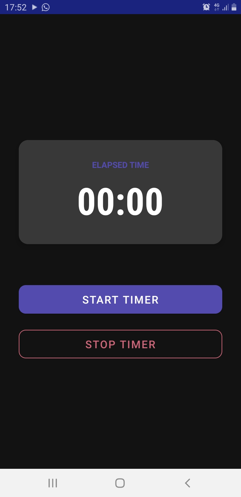
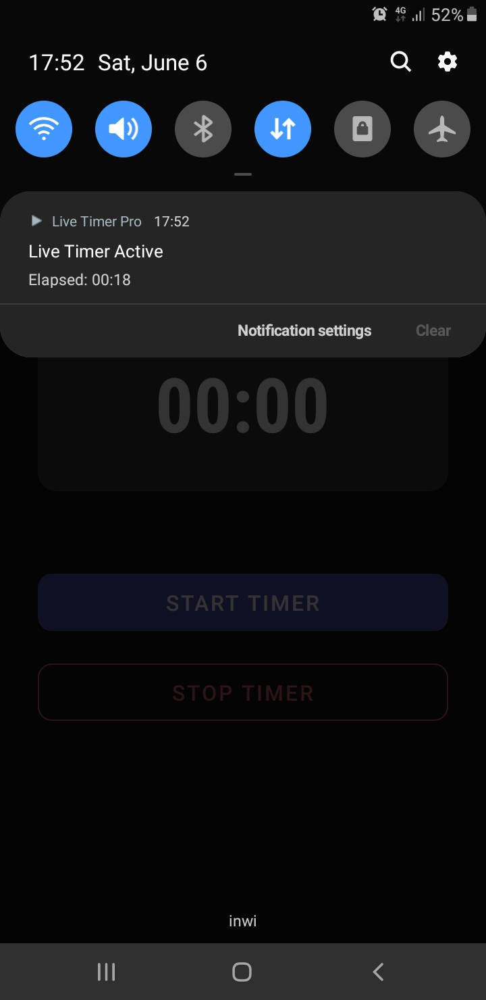

# Lab 16 : Maîtriser les Services dans une Application Android - Live Timer Pro ⏱️

Bienvenue dans mon dépôt pour le Laboratoire 16. Ce projet est une implémentation personnalisée de l'application chronomètre demandée pour le cours de Programmation Mobile. L'application met en pratique l'utilisation avancée des Services sous Android (Foreground Service et Bound Service) avec une interface modernisée (Material Design) et une gestion rigoureuse des ressources système.

---

## 🎯 Objectifs

Les principaux objectifs de ce projet sont :
- Créer une application Android robuste gérant un chronomètre en arrière-plan.
- Comprendre et implémenter le cycle de vie des **Services Android** (notamment `onStartCommand` et `onBind`).
- Déployer un **Foreground Service** obligatoire depuis Android 8.0, avec une notification persistante en direct.
- Utiliser un **Bound Service** pour permettre une communication bidirectionnelle entre l'Activity et le Service.
- Gérer proprement les threads avec `ScheduledExecutorService` pour éviter de bloquer le thread principal (UI thread).
- Personnaliser l'interface pour éviter un rendu trop basique (utilisation de cartes et de couleurs Material personnalisées).

## 🛠 Technologies Utilisées

- **Langage principal** : Java
- **SDK Android** : API Min 24 (Target 36)
- **Interface Utilisateur (UI)** : XML, Material Components (`MaterialCardView`, `MaterialButton`)
- **Architecture Android** : `Service`, `Foreground Service`, `LocalBinder`, `NotificationManager`
- **Gestionnaire de dépendances** : Gradle (KTS)

## 🏗 Architecture Overview

L'application repose sur deux composants majeurs :

1.  **`TimerDashboardActivity`** : L'interface principale. Elle se connecte (bind) au service pour afficher l'interface à l'utilisateur et gère les événements de clics pour lancer ou stopper le chronomètre.
2.  **`LiveTimerService`** : Le moteur de l'application. C'est un `Service` Android qui s'exécute de façon persistante en premier plan (*Foreground*) et crée un canal de notification. Il utilise un `ScheduledExecutorService` pour compter les secondes. La classe interne `TimerBinder` expose l'instance du service pour la lier à l'activité.

---

## ⚙️ Installation & Setup Steps

Voici comment cloner et installer le projet sur votre environnement local :

1.  Ouvrez un terminal.
2.  Clonez ce dépôt
3.  Ouvrez **Android Studio**.
4.  Faites `File` -> `Open` et sélectionnez le dossier `Lab16-LiveTimerPro` (ou `lab16`).
5.  Attendez que Gradle finisse de synchroniser le projet (*Gradle Build Running...*).

### Database Setup
*Note : Ce laboratoire ne nécessite pas de base de données locale (Room/SQLite) ni distante.* Les données (le temps écoulé) sont gérées dynamiquement en mémoire RAM dans l'instance du Service.

### Server Setup
*Note : Aucune API distante ni backend n'est nécessaire pour ce projet.* L'application fonctionne 100% hors-ligne.

### Android Setup
Assurez-vous d'avoir :
- Un émulateur Android (AVD) configuré avec **API 26 au minimum** (recommandé : API 34+ pour bien voir les restrictions liées au Foreground Service Data Sync).
- Les SDK Tools correctement mis à jour dans SDK Manager.

---

## 🚀 Execution Steps

Pour lancer l'application :

1.  Branchez votre smartphone Android via USB (avec le débogage USB activé) ou lancez votre émulateur dans Android Studio.
2.  Cliquez sur le bouton **"Run app"** (Shift + F10) en haut à droite.
3.  L'application s'installera et se lancera automatiquement sur le périphérique.
4.  Sur l'écran d'accueil, vous verrez un compteur (00:00) et deux boutons.

---

## 🧪 Testing Instructions

Pour valider que toutes les fonctionnalités exigées par le lab fonctionnent :

1.  **Démarrage du chrono** : Appuyez sur `START TIMER`. Le compteur reste à 00:00 sur l'écran (dans cette version), mais la notification persistante apparaît.
2.  **Vérification du Foreground Service** : Baissez le tiroir de notifications. Vous devriez voir une notification "Live Timer Active" qui s'actualise chaque seconde en temps réel !
3.  **Test de persistance** : Quittez complètement l'application (bouton Home, ou même fermez-la depuis les applications récentes).
4.  **Résultat attendu** : La notification continue de tourner et le chronomètre ne s'arrête pas. Le système d'exploitation ne tue pas le service car c'est un Foreground Service.
5.  **Arrêt propre** : Rouvrez l'application et appuyez sur `STOP TIMER`. La notification disparaît et le service est détruit.

---

## 📸 Screenshots Section

**Figure 1 : Interface modernisée au lancement**  

**Figure 2 : La notification persistante en temps réel**  

---

## 🔧 Troubleshooting Section

- **L'application crash dès que je clique sur START TIMER (Android 14+)** :  
  Vérifiez que vous avez bien la permission `<uses-permission android:name="android.permission.FOREGROUND_SERVICE_DATA_SYNC" />` dans votre `AndroidManifest.xml`.
- **Je ne vois pas la notification (Android 13+)** :  
  Depuis l'API 33, Android exige la permission `POST_NOTIFICATIONS`. Si la notification ne s'affiche pas, allez dans *Paramètres > Applications > Live Timer Pro > Notifications* et autorisez-les manuellement.
- **L'application affiche `Error starting service`** :  
  Vérifiez les logs (`Logcat` dans Android Studio) en filtrant avec le tag `TimerDashboardActivity` pour voir la stack trace exacte.

---

## 🎓 Conclusion

Ce laboratoire a été extrêmement formateur. Bien que le code de base paraisse simple, la gestion du cycle de vie sous Android, particulièrement avec l'évolution stricte des règles liées au "Foreground Service" et aux notifications, requiert une grande attention. 

J'ai choisi d'aller plus loin en restructurant le code, en modifiant l'UI pour un aspect beaucoup plus moderne (Material Design) et en renforçant la gestion des erreurs afin d'avoir une application prête pour un cas d'usage réel.
