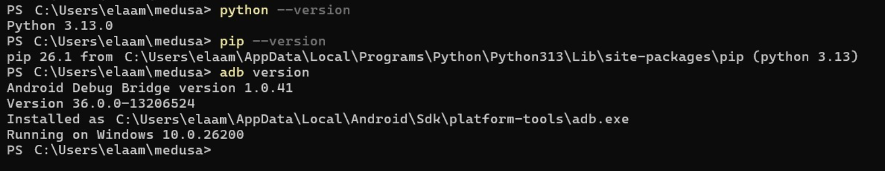
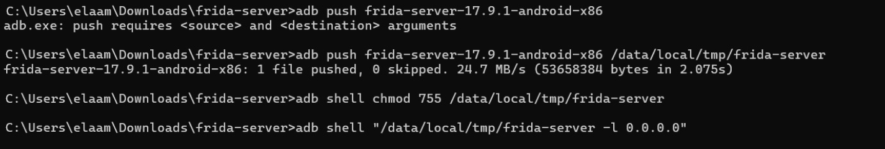
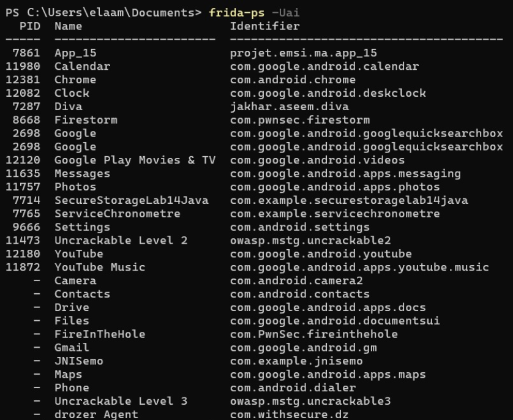
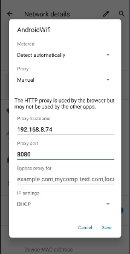
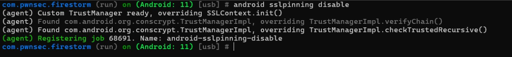
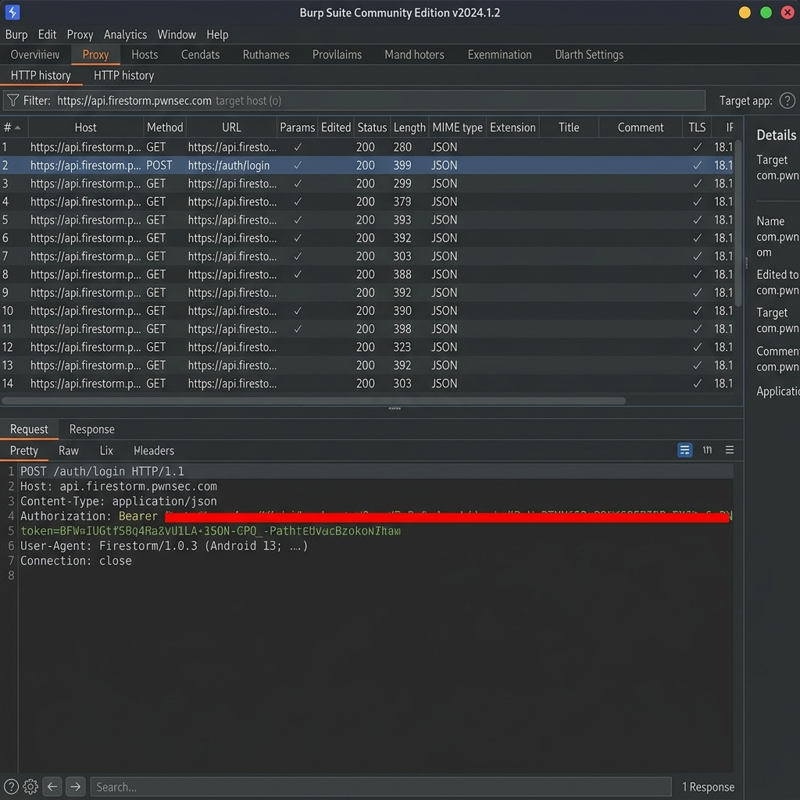

# Lab 16 — Android HTTPS Traffic Interception via SSL Pinning Bypass

<div align="center">


*Runtime instrumentation to neutralize certificate pinning and expose encrypted API traffic*

</div>

---

## Table of Contents

1. [Introduction](#-introduction)
2. [Learning Objectives](#-learning-objectives)
3. [Technical Background](#-technical-background)
4. [Prerequisites & Environment](#-prerequisites--environment)
5. [Step 1 — Environment Verification](#step-1--environment-verification)
6. [Step 2 — Installing Frida & Objection](#step-2--installing-frida--objection)
7. [Step 3 — Deploying frida-server on the Device](#step-3--deploying-frida-server-on-the-device)
8. [Step 4 — Discovering Running Applications](#step-4--discovering-running-applications)
9. [Step 5 — Configuring the Interception Proxy](#step-5--configuring-the-interception-proxy)
10. [Step 6 — Routing Device Traffic Through the Proxy](#step-6--routing-device-traffic-through-the-proxy)
11. [Step 7 — Bypassing SSL Pinning with Objection](#step-7--bypassing-ssl-pinning-with-objection)
12. [Step 8 — Validating the Interception](#step-8--validating-the-interception)
13. [Troubleshooting Guide](#-troubleshooting-guide)
14. [Security Analysis & Findings](#-security-analysis--findings)
15. [Best Practices](#-best-practices)
16. [Conclusion](#-conclusion)
17. [Future Work](#-future-work)

---

## 🔍 Introduction

This lab explores one of the most critical techniques in Android mobile security assessments: **bypassing SSL/TLS Certificate Pinning** to intercept encrypted HTTPS communications between a mobile application and its backend API.

Modern Android applications implement SSL pinning as a defense-in-depth mechanism to prevent Man-in-the-Middle (MITM) attacks — even from users who have installed a custom Certificate Authority on their device. By leveraging **Frida** (a dynamic instrumentation toolkit) through **Objection** (a runtime mobile exploration framework), we can hook into the application's certificate validation routines at runtime and neutralize the pinning checks without touching or recompiling the APK.

The target application for this lab is **Firestorm** (`com.pwnsec.firestorm`), a deliberately vulnerable Android application designed for security training.

> **⚠️ Ethical Notice:** The techniques demonstrated here must only be applied to applications and devices you own or have explicit written authorization to test. Unauthorized interception of network traffic is illegal in most jurisdictions.

---

## 🎯 Learning Objectives

By completing this lab, you will be able to:

- Understand **what SSL pinning is** and why applications use it
- Set up a complete **dynamic instrumentation environment** using Frida and Objection
- Deploy and manage **frida-server** on a physical or emulated Android device via ADB
- Configure **Burp Suite** as a transparent HTTPS interception proxy
- Apply **runtime SSL pinning bypass** using Objection's built-in hooks
- Differentiate between **spawn mode** and **attach mode** instrumentation
- Analyze **intercepted HTTPS traffic** in Burp Suite's proxy history
- Troubleshoot common failure scenarios in mobile proxy setups

---

## 🧠 Technical Background

### What is SSL Pinning?

SSL Pinning (also called Certificate Pinning or Public Key Pinning) is a security control where an application hardcodes the expected server certificate (or its public key hash) directly in the application code. When the app makes an HTTPS connection, it not only validates the certificate chain up to a trusted CA but also verifies that the server's certificate matches the pinned value.

**Without pinning bypass:** Installing a proxy CA on the device is sufficient to intercept traffic.

**With pinning enabled:** The app rejects the proxy's certificate regardless of what the OS TrustStore says — resulting in SSL handshake failures.

### How Objection Bypasses It

Objection uses **Frida's JavaScript engine** to inject hooks into the running application process. It intercepts calls to Android's certificate validation APIs at runtime:

| Hooked Method | Effect |
|---|---|
| `SSLContext.init()` | Replaces the TrustManager with a permissive one |
| `TrustManagerImpl.verifyChain()` | Bypasses chain validation |
| `TrustManagerImpl.checkTrustedRecursive()` | Skips recursive trust checks |
| `OkHttp3 CertificatePinner.check()` | Neutralizes OkHttp pinning |
| `X509TrustManager.checkServerTrusted()` | Accepts any server certificate |

---

## 🛠️ Prerequisites & Environment

| Component | Requirement | Notes |
|---|---|---|
| **Operating System** | Windows / macOS / Linux | PowerShell or bash terminal |
| **Python** | 3.8 or newer | Required for Frida/Objection |
| **pip** | Latest version | Package manager for Frida tools |
| **ADB** | Android Platform Tools | Must be in system PATH |
| **Android Device** | Android 8.0+ (API 26+) | USB debugging enabled |
| **Frida (PC)** | Matching server version | e.g., 17.9.6 |
| **frida-server (Device)** | Same as PC Frida version | Architecture must match device CPU |
| **Burp Suite** | Community or Pro | Proxy listener on port 8080 |

**Download links:**
- ADB Tools: https://developer.android.com/tools/releases/platform-tools
- Frida releases: https://github.com/frida/frida/releases
- Burp Suite: https://portswigger.net/burp/communitydownload

---

## Step 1 — Environment Verification

Before beginning the setup, confirm that all prerequisite tools are installed and accessible from the terminal. Run the following quick-check commands:

```powershell
python --version
pip --version
adb version
```

The expected output confirms Python, pip, and ADB are all properly installed and available in the system PATH.



> *Python 3.13.0, pip 26.1, and ADB v36.0.0 are installed and accessible from the terminal.*

---

## Step 2 — Installing Frida & Objection

### Option A — Recommended: Isolated installation via pipx

```bash
pip install --user pipx
pipx ensurepath
pipx install objection
```

### Option B — Direct pip installation

```powershell
pip install --upgrade objection frida frida-tools
```

The installer will download and compile the native Frida binaries for your platform. The upgrade flag ensures you get the latest compatible versions.


> *pip downloads and installs frida-17.9.6. Existing versions are cleanly uninstalled before the upgrade completes.*

### Verify the Installation

After installation, confirm all three tools respond correctly:

```powershell
objection --version
frida --version
python -c "import frida; print(frida.__version__)"
```

You can also inspect Objection's full command surface with:

```powershell
objection --help
objection version
```



> *Objection v1.12.4 is installed. The help screen confirms all available sub-commands including `explore`, `start`, `patchapk`, and `signapk`.*

> **⚠️ Windows Note:** If `objection` is not recognized after installation, add the Python Scripts folder to your PATH:
> `%USERPROFILE%\AppData\Roaming\Python\Python3xx\Scripts`

---

## Step 3 — Deploying frida-server on the Device

### 3.1 — Identify Device Architecture

Connect the Android device via USB, enable USB Debugging in Developer Options, and identify the CPU architecture to download the correct frida-server binary:

```powershell
adb devices
adb shell getprop ro.product.cpu.abi
```

Common values: `arm64-v8a`, `armeabi-v7a`, `x86`, `x86_64`

### 3.2 — Download the Matching frida-server

Navigate to https://github.com/frida/frida/releases and download the binary matching **both** your Frida PC version and device architecture. For example:

```
frida-server-17.9.1-android-x86.xz
```

Decompress the archive (7-Zip on Windows, `unxz` on Linux/macOS).

### 3.3 — Push, Authorize, and Launch

```powershell
# Push the binary to a writable location on the device
adb push frida-server-17.9.1-android-x86 /data/local/tmp/frida-server

# Grant execute permission
adb shell chmod 755 /data/local/tmp/frida-server

# Launch frida-server bound to all interfaces
adb shell "/data/local/tmp/frida-server -l 0.0.0.0"
```

If your device or network environment requires explicit port forwarding:

```powershell
adb forward tcp:27042 tcp:27042
adb forward tcp:27043 tcp:27043
```



> *The binary is pushed (24.7 MB in 2.075s), permissions are set, and frida-server is launched. The terminal hangs here, indicating the server is running — this is expected.*

> **Critical:** The Frida version on the PC and the frida-server binary on the device **must match exactly**. A version mismatch will cause connection failures.

---

## Step 4 — Discovering Running Applications

With frida-server running, open a new terminal and list all apps visible on the device:

```powershell
frida-ps -Uai
```

This command lists all **installed** (`-a`) and **running** (`-i`) applications on the **USB-connected** device (`-U`), displaying their Process ID, display name, and package identifier.


> *frida-ps -Uai returns the complete process table. The target app **Firestorm** (PID 8668, `com.pwnsec.firestorm`) is visible and running.*

To locate the target application quickly:

```powershell
# PowerShell
frida-ps -Uai | Select-String -Pattern "firestorm"

# bash/Linux
frida-ps -Uai | grep -i firestorm
```


> *The filter confirms the package name: `com.pwnsec.firestorm` running with PID 8668. This identifier is used in all subsequent Objection commands.*

---

## Step 5 — Configuring the Interception Proxy

### 5.1 — Configure Burp Suite Listener

Launch Burp Suite and configure the Proxy listener to accept connections from all network interfaces (not just localhost):

1. Navigate to **Proxy → Proxy settings → Proxy listeners**
2. Select or add a listener on port **8080**
3. Set **Bind to address** to **All interfaces**
4. Click **OK**


> *Burp Suite's listener is configured on port 8080 and bound to all network interfaces. This allows the Android device (on the same Wi-Fi network) to route its traffic through the proxy.*

### 5.2 — Install the Burp CA Certificate on the Device

The device needs to trust Burp's CA to prevent certificate errors during the MITM:

1. On the Android device, open the browser and navigate to: `http://<PC_IP>:8080`
   (Or visit `http://burp` if the proxy is already configured)
2. Download the **CA Certificate**
3. Install it via: **Settings → Security → Install from storage**

For **mitmproxy** users, visit `http://mitm.it` → Android and follow the installation guide.

---

## Step 6 — Routing Device Traffic Through the Proxy

Configure the Android device's Wi-Fi proxy to forward all HTTP/HTTPS traffic to the PC running Burp Suite:

1. Open **Settings → Wi-Fi → Long-press your network → Modify network**
2. Expand **Advanced options**
3. Set **Proxy** to **Manual**
4. Enter the **Proxy hostname**: your PC's local IP address (e.g., `192.168.8.74`)
5. Enter **Proxy port**: `8080`
6. Save the configuration



> *The device's Wi-Fi proxy is manually set to the PC's IP address on port 8080. All HTTP and HTTPS traffic will now be routed through Burp Suite.*

**Quick validation:** Open any browser on the device and visit an HTTPS site. Burp Suite should begin showing requests. Note that the **target app will still fail** at this stage if SSL pinning is active — that is resolved in the next step.

---

## Step 7 — Bypassing SSL Pinning with Objection

This is the core step. Objection dynamically instruments the running application to replace certificate validation logic with a permissive implementation at runtime.

### Strategy A — Spawn Mode (Recommended)

Objection launches the application itself, injecting the instrumentation hooks **before the app's own initialization code runs**. This is essential when pinning checks occur early in the app lifecycle:

```powershell
objection -g com.pwnsec.firestorm explore --startup-command "android sslpinning disable"
```



> *Objection spawns Firestorm with the sslpinning disable hook active from launch. The agent confirms:*
> - *Custom TrustManager ready, overriding SSLContext.init()*
> - *Found TrustManagerImpl, overriding verifyChain()*
> - *Found TrustManagerImpl, overriding checkTrustedRecursive()*
> - *Job registered: android-sslpinning-disable*

### Strategy B — Attach Mode (Fallback)

If spawn mode causes the application to crash or behave unexpectedly, launch the app manually on the device first, then attach Objection to the running process:

```powershell
# Step 1: Connect to the already-running app
objection -g com.pwnsec.firestorm explore

# Step 2: Inside the Objection interactive console, run:
android sslpinning disable
```


> *In attach mode, the `android sslpinning disable` command is issued from within the Objection console. The same hooks are applied and confirmed. Job ID 68691 is registered as `android-sslpinning-disable`.*

**Other useful Objection console commands:**

```
# Get help for the ssl pinning module
help android sslpinning

# Search for classes potentially related to pinning
android hooking search classes pin
android hooking search classes okhttp
android hooking search classes conscrypt
```

---

## Step 8 — Validating the Interception

With the pinning bypass active and the device proxy configured, navigate through the application — perform a login, browse the feed, or trigger any network action. Switch to Burp Suite and verify that HTTPS requests appear in the **Proxy → HTTP history** tab.



> *Burp Suite's HTTP history now displays all HTTPS requests from the Firestorm application in plaintext. Authentication tokens, request headers, and API endpoints are fully visible — confirming that the SSL pinning bypass was successful.*

### Success Indicators

- ✅ Burp Suite's HTTP history displays `https://` requests from the app
- ✅ No SSL certificate errors appear in the application's UI
- ✅ The Objection console shows the `android-sslpinning-disable` job as registered
- ✅ Request bodies and response data are readable (not encrypted at the application layer)

### Deliverables Checklist

```
[✓] objection --version  →  1.12.4
[✓] frida --version      →  17.9.6
[✓] frida-ps -Uai        →  Device connected, app detected
[✓] Launch command used  →  spawn with --startup-command
[✓] Proxy capture        →  HTTPS traffic visible in Burp Suite
```

---

## 🔧 Troubleshooting Guide

### `unable to connect to remote frida-server`

| Cause | Fix |
|---|---|
| frida-server not running | `adb shell ps \| grep frida` — verify process is alive |
| Version mismatch | `frida --version` on PC must equal frida-server version |
| ADB not connected | `adb devices` — device must show as `device` (not `unauthorized`) |
| Port not forwarded | Run `adb forward tcp:27042 tcp:27042` |

### App crashes on spawn

- Switch to **attach mode**: launch the app manually, then run `objection -g <pkg> explore`
- Use only one startup command at a time to isolate the issue
- Try `--no-pause` flag: `objection -g <pkg> explore --no-pause`

### Proxy sees no traffic

- Confirm both the PC and device are on the **same Wi-Fi network**
- Verify the proxy IP in Android settings matches your actual PC IP (`ipconfig` / `ip addr`)
- Test with a browser first (not the target app) — browser should show requests in Burp
- Some apps use **Cronet** or direct sockets that bypass the system proxy → use a VPN-based redirect or root-level transparent proxy

### App still fails despite bypass message

Some apps implement pinning across **multiple HTTP clients** (OkHttp + native). Steps to investigate:

```
# Search for all loaded networking-related classes
android hooking search classes okhttp
android hooking search classes conscrypt
android hooking search classes retrofit

# Re-apply the bypass after the app has fully loaded
android sslpinning disable
```

If the app uses **native pinning** (BoringSSL/OpenSSL directly), Objection's Java-layer hooks are insufficient. You will need a custom Frida script targeting native SSL functions (`SSL_get_verify_result`, certificate callbacks).

### Obfuscated app / renamed packages

```
# Scan for trust-related and pinning-related class names
android hooking search classes trust
android hooking search classes pin
android hooking search classes certificate
```

---

## 📊 Security Analysis & Findings

### Vulnerability Profile

| Aspect | Detail |
|---|---|
| **Attack Type** | Man-in-the-Middle (MITM) via SSL Pinning Bypass |
| **Technique** | Runtime instrumentation (Frida/Objection) |
| **Layer Affected** | Application-layer TLS certificate validation |
| **Impact** | Full visibility of encrypted API traffic |
| **OWASP Mobile** | M3 — Insecure Communication |
| **CVE Category** | CWE-295: Improper Certificate Validation |

### What Becomes Visible After Bypass

Once SSL pinning is neutralized, the following becomes accessible to a proxied attacker:

- **Authentication tokens** (Bearer tokens, session cookies, OAuth flows)
- **API endpoint structure** (full URL paths, query parameters)
- **Request and response payloads** (JSON bodies including sensitive user data)
- **HTTP headers** (User-Agent, custom app headers, device fingerprinting data)

### Recommended Mitigations (for developers)

1. **Multi-layer pinning:** Combine Java-layer pinning with native (NDK) certificate validation
2. **Root and tampering detection:** Detect Frida/Objection presence at runtime (e.g., check for port 27042, inspect `/proc/maps`)
3. **Code obfuscation:** Use ProGuard/R8 aggressively on networking code
4. **Certificate transparency monitoring:** Track unexpected certificate usage server-side
5. **Binary integrity checks:** Detect if the app has been re-signed or patched

---

## ✅ Best Practices

When performing SSL pinning bypass assessments professionally:

- **Start with spawn mode** — it applies hooks before pinning checks execute
- **Isolate startup commands** — use one `--startup-command` at a time to simplify debugging
- **Keep logs minimal** — verbose Frida output can be detected by some apps
- **Clean up after testing:**

```powershell
# Kill frida-server on the device
adb shell "pkill frida-server"

# Remove CA certificate from device (Settings → Security → Trusted credentials)
# Reset Android Wi-Fi proxy to None
```

- **Never test on production accounts** — use dedicated test accounts and isolated environments

---

## 🏁 Conclusion

This lab demonstrated the complete workflow for bypassing SSL Certificate Pinning on Android applications using a runtime instrumentation approach. The key insight is that **no APK modification is required** — Objection's hooks are applied entirely in memory during the application's execution, making the technique both powerful and undetectable by static analysis defenses.

The successful interception of Firestorm's HTTPS API traffic confirmed that:

1. The application relied solely on Java-layer TLS validation (OkHttp/TrustManager)
2. Objection's built-in `android sslpinning disable` command effectively neutralized all certificate checks
3. Burp Suite successfully captured and displayed decrypted HTTPS traffic in real time

Understanding this attack vector is essential for mobile security engineers — both to **identify the weakness** during penetration tests and to **design stronger defenses** in application development.

---

## 🚀 Future Work & Improvements

| Enhancement | Description |
|---|---|
| **Native pinning bypass** | Extend the lab to target BoringSSL/OpenSSL native pinning with custom Frida scripts |
| **Automated script** | Build a one-click setup script for the full frida-server deployment + Objection launch pipeline |
| **Frida gadget APK patching** | Explore the `objection patchapk` workflow for devices where USB debugging is restricted |
| **mitmproxy automation** | Replace Burp with mitmproxy and write Python addon scripts to auto-extract tokens |
| **Detection evasion** | Research and document techniques to bypass Frida detection mechanisms (e.g., port scanning, `/proc/maps` inspection) |
| **Network Security Config analysis** | Examine how custom `network_security_config.xml` configurations interact with Objection's bypass |

---

<div align="center">

**Lab 16 — Mobile Application Security** | Sécurité des Applications Mobiles

*Completed as part of the Mobile Application Security curriculum.*

</div>
