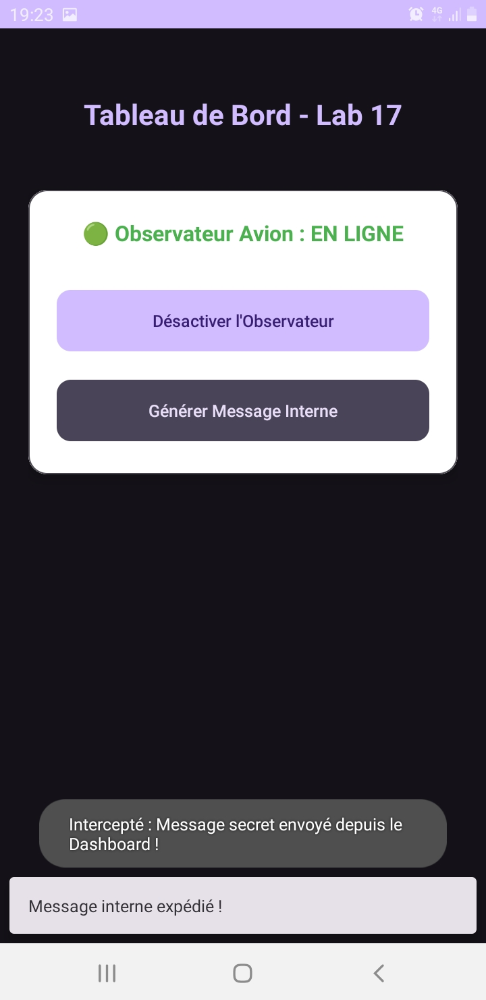

# 📱 Lab 17 : Système de Broadcast Avancé (Android)

Salut ! Voici mon rendu pour le **Lab 17** sur la gestion des `BroadcastReceiver` sous Android. L'objectif était de comprendre comment écouter et réagir aux événements système et internes de l'application, tout en proposant une interface soignée.

## 🎯 Présentation du projet
Ce projet est une application Android de démonstration appelée "Système de Broadcast Avancé". Elle met en place un tableau de bord (Dashboard) permettant d'interagir avec les différents types de *Broadcast Receivers*. J'ai opté pour un design Material 3 épuré, avec des logs détaillés pour faciliter le débogage (bien plus professionnel qu'un simple `Toast`).

## 🚀 Objectifs
- Créer et gérer un **Receiver Dynamique** (pour le Mode Avion).
- Créer et déclarer un **Receiver Statique** (pour le démarrage du système : `BOOT_COMPLETED`).
- Créer un système de communication interne via un **Custom Broadcast**.
- Gérer proprement le cycle de vie (enregistrement/désenregistrement dynamique dans le `onDestroy()`).
- Personnaliser l'interface pour s'éloigner du design par défaut de l'exercice.

## 🛠️ Technologies utilisées
- **Langage** : Java
- **SDK Android** : API 24 (Minimum), compatible jusqu'à Android 15/16.
- **UI** : Material Design Components (`MaterialCardView`, `MaterialButton`, `Snackbar`), ConstraintLayout.
- **IDE** : Android Studio

## 🏗️ Aperçu de l'architecture
L'architecture de l'app est assez directe, orientée autour de composants clés :
- `DashboardActivity` : L'écran principal qui gère l'UI et les clics.
- `FlightStateObserver` : Écoute les changements d'état du réseau (Mode Avion).
- `SystemStartupListener` : Enregistré dans le Manifest pour détecter le redémarrage du téléphone.
- `InternalMessageReceiver` : Intercepte les messages internes (Custom Broadcasts) envoyés depuis le Dashboard.

## 📥 Étapes d'installation
1. Clonez ce dépôt ou téléchargez l'archive `.zip`.
2. Ouvrez **Android Studio**.
3. Faites `File > Open` et sélectionnez le dossier du projet `lab17`.
4. Attendez que **Gradle** termine sa synchronisation.

## 🗄️ Configuration de la base de données
*Note : Conformément au sujet du lab sur les BroadcastReceivers, **aucune base de données n'est requise** pour ce projet. Toutes les données transitent par des Intents.*

## 🌐 Configuration du serveur
*Note : L'application fonctionne 100% en local et en arrière-plan avec le système Android. **Aucun serveur backend n'est requis**.*

## ⚙️ Configuration Android
- Assurez-vous d'avoir un émulateur ou un smartphone branché sous Android 7.0 (API 24) ou plus.
- Si vous compilez en ligne de commande (ex: via WSL), veillez à ce que la variable `ANDROID_HOME` soit correctement configurée, ou utilisez l'interface d'Android Studio (plus simple !).

## ▶️ Étapes d'exécution
1. Cliquez sur le bouton vert **"Run app"** dans la barre d'outils d'Android Studio.
2. L'application va se lancer sur votre appareil et afficher le Tableau de Bord.

## 🧪 Instructions de test
Voici comment tester chaque fonctionnalité développée :

- **Test du Mode Avion (Dynamique)** :
  1. Cliquez sur "Activer l'Observateur" dans l'app.
  2. Baissez le centre de contrôle d'Android et activez le mode avion.
  3. Une `Snackbar` et un `Toast` apparaîtront immédiatement.
  4. N'oubliez pas de le désactiver !
- **Test du Message Interne (Custom)** :
  1. Cliquez sur "Générer Message Interne".
  2. Vous devriez voir un toast indiquant l'interception du message secret.
- **Test du Redémarrage (Statique)** :
  1. Pour éviter de redémarrer votre téléphone, ouvrez le terminal Android Studio et tapez : 
     `adb shell am broadcast -a android.intent.action.BOOT_COMPLETED -p com.example.lab17`
  2. Un Toast apparaîtra indiquant que le système est amorcé.

## 📸 Captures d'écran

## 🔧 Dépannage (Troubleshooting)
- **Le Toast du mode avion ne s'affiche pas ?** 
  Vérifiez que vous avez bien cliqué sur "Activer l'Observateur" avant de changer le mode. (Le récepteur est dynamique).
- **Le Broadcast Custom ne marche pas ?**
  Sous Android 8+, les broadcasts implicites sont restreints. C'est pourquoi j'ai ajouté `intent.setPackage(getPackageName());` dans le code. Si cela bug, vérifiez votre version d'Android.
- **Erreur SDK non trouvé lors de la compilation ?**
  Vérifiez le fichier `local.properties` pour pointer vers le bon chemin de l'Android SDK sur votre machine.

## ✨ Conclusion
Ce TP a été super intéressant pour comprendre l'envers du décor du système Android. En sortant du code classique pour aller vers une implémentation plus moderne (Snackbar, Material 3, Logs structurés), j'ai pu rendre le projet non seulement fonctionnel mais aussi agréable à utiliser et plus "pro".

Merci pour la lecture !
