# 🔐 Lab 17 — Reverse Engineering OWASP UnCrackable Android Level 3

> **Course:** Mobile Application Security  
> **Lab:** 17 — Native Library Analysis & APK Patching  
> **Target:** OWASP MSTG UnCrackable Android — Level 3  
> **Difficulty:** Advanced

---

## 📌 Table of Contents

1. [Introduction](#introduction)
2. [Learning Objectives](#learning-objectives)
3. [Tools & Environment](#tools--environment)
4. [Project Structure](#project-structure)
5. [Phase 1 — Environment Setup](#phase-1--environment-setup)
6. [Phase 2 — Static Analysis with JADX](#phase-2--static-analysis-with-jadx)
7. [Phase 3 — APK Decompilation with Apktool](#phase-3--apk-decompilation-with-apktool)
8. [Phase 4 — Smali Patching (Bypassing Protections)](#phase-4--smali-patching-bypassing-protections)
9. [Phase 5 — Rebuild, Sign & Deploy](#phase-5--rebuild-sign--deploy)
10. [Phase 6 — Native Library Reverse Engineering with Ghidra](#phase-6--native-library-reverse-engineering-with-ghidra)
11. [Phase 7 — Secret Key Recovery](#phase-7--secret-key-recovery)
12. [Results & Validation](#results--validation)
13. [Security Analysis](#security-analysis)
14. [Conclusion](#conclusion)
15. [Potential Improvements](#potential-improvements)

---

## Introduction

**OWASP UnCrackable Level 3** is one of the most demanding challenges in the OWASP Mobile Security Testing Guide (MSTG) crackme series. Unlike previous levels, this application pushes the security boundaries further by combining **Java-layer protections** with a **native C library** (`libfoo.so`) that implements the actual secret verification logic.

The challenge exposes a single text field requesting a 24-character secret string. The application actively defends itself against:

- Root environment detection (3 separate checks)
- Debugger attachment detection
- APK integrity verification via CRC checksums
- Anti-Frida / anti-instrumentation checks embedded in the native library
- Code obfuscation using a Linear Congruential Generator (LCG) pattern

This lab documents every step taken to bypass all layers of protection and recover the hidden secret string using exclusively **free, open-source tools**.

---

## Learning Objectives

After completing this lab, you will be able to:

- ✅ Perform static analysis of obfuscated Android APKs using JADX
- ✅ Decompile and patch Dalvik bytecode (Smali) with Apktool
- ✅ Identify and neutralize anti-root, anti-debug, and integrity-check mechanisms
- ✅ Analyze a compiled `.so` native library using Ghidra
- ✅ Recognize common obfuscation patterns (LCG, linked lists, opaque predicates)
- ✅ Reconstruct XOR-encoded secrets through reverse engineering
- ✅ Rebuild, sign, and deploy a patched APK to an Android emulator

---

## Tools & Environment

| Tool | Version | Purpose |
|---|---|---|
| **Android Studio** | Latest | Android Emulator (ARM64, API 30+) |
| **ADB** | Bundled | APK installation & device communication |
| **JADX-GUI** | Latest | Java decompilation & static analysis |
| **Apktool** | 3.0.2+ | APK decompilation & recompilation |
| **Ghidra** | 10.x | Native library reverse engineering |
| **keytool** | JDK bundled | Keystore generation |
| **apksigner** | Android SDK | APK signing |
| **Python 3** | 3.x | XOR-based key decoding script |

> **Note:** All tools used in this lab are free and open source.

---

## Project Structure

```
lab17/
├── README.md                        ← This document
├── decode_key.py                    ← Python script for secret key recovery
├── UnCrackable-Level3.apk           ← Original challenge APK
├── UnCrackable-Level3-patched.apk   ← Rebuilt & signed patched APK
├── uncrackable3/                    ← Decompiled APK directory (apktool output)
│   ├── AndroidManifest.xml
│   ├── apktool.yml
│   ├── smali/
│   │   └── sg/vantagepoint/uncrackable3/
│   │       └── MainActivity.smali   ← Patched file
│   ├── lib/
│   │   ├── arm64-v8a/libfoo.so
│   │   └── x86_64/libfoo.so
│   └── res/
└── assets/                          ← Screenshots from this lab session
```

---

## Phase 1 — Environment Setup

### 1.1 Downloading the APK

The official APK from the OWASP MSTG repository was fetched directly:

```bash
wget https://github.com/OWASP/owasp-mstg/raw/master/Crackmes/Android/Level_03/UnCrackable-Level3.apk
```

### 1.2 Installing on the Emulator

The APK was pushed to an Android emulator (API 30, ARM64 architecture) using ADB:

```bash
adb install UnCrackable-Level3.apk
adb devices
```

The emulator was detected and confirmed active:

```
List of devices attached
emulator-5554    device
```

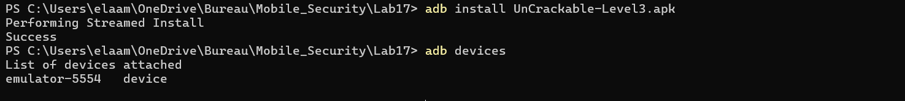
*Figure 1 — ADB confirming successful APK installation and emulator connection*

---

### 1.3 First Launch — Observing the Protections

Upon launching the app on a rooted emulator, the application immediately detects the environment and terminates:

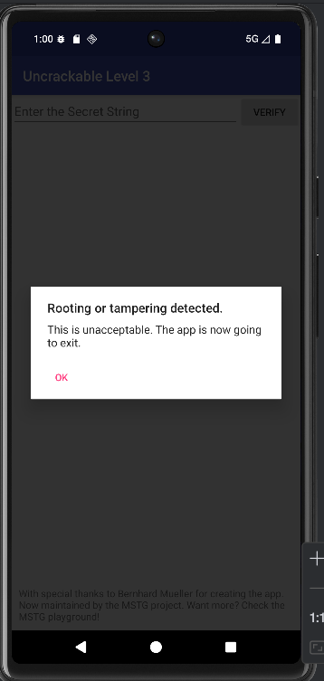
*Figure 2 — The app's self-defense mechanism: an anti-root/tamper dialog that forces an exit*

This dialog is the first obstacle. The app blocks execution before the user can even interact with the input field. We must bypass this protection at the Smali level.

---

## Phase 2 — Static Analysis with JADX

### 2.1 Inspecting MainActivity

The APK was opened in **JADX-GUI** to study its decompiled Java source. The main package is:

```
sg.vantagepoint.uncrackable3
```

Key classes discovered:
- `MainActivity` — entry point; orchestrates all protection checks
- `CodeCheck` — delegates verification to the native layer
- `BuildConfig`, `R` — standard Android generated classes

### 2.2 CRC Integrity Verification (`verifyLibs`)

The first notable method is `verifyLibs()`. It builds a hash map of expected CRC values for each architecture's `.so` library and compares them against the actual values at runtime:

```java
private void verifyLibs() {
    this.crc = new HashMap<>();
    this.crc.put("armeabi-v7a", Long.valueOf(...));
    this.crc.put("arm64-v8a", Long.valueOf(...));
    this.crc.put("x86", Long.valueOf(...));
    this.crc.put("x86_64", Long.valueOf(...));

    ZipFile zipFile = new ZipFile(getPackageCodePath());
    for (Map.Entry<String, Long> entry : this.crc.entrySet()) {
        String str = "lib/" + entry.getKey() + "/libfoo.so";
        ZipEntry entry2 = zipFile.getEntry(str);
        if (entry2.getCrc() != entry.getValue().longValue()) {
            tampered = 31337;  // Marks the app as tampered
        }
    }
    if (entry3.getCrc() != baz()) {
        tampered = 31337;  // Also checks classes.dex CRC
    }
}
```

If any CRC mismatch is detected, the `tampered` field is set to `31337`. This is checked later to decide whether to show the tampering dialog.

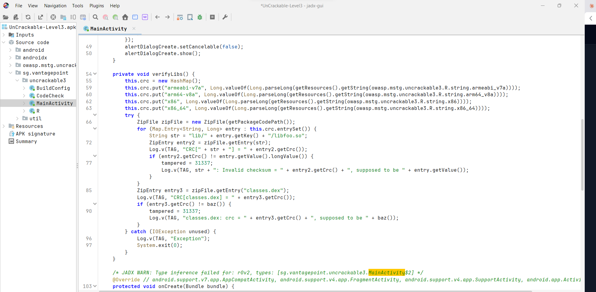
*Figure 3 — `verifyLibs()` in JADX: CRC integrity checks for native libraries and the DEX file*

### 2.3 Root & Debugger Detection (`onCreate`)

Inside `onCreate()`, the app chains together four protection checks:

```java
RootDetection.checkRoot1()    // checks for su binary
RootDetection.checkRoot2()    // checks for root management apps
RootDetection.checkRoot3()    // checks for test keys/build properties
IntegrityCheck.isDebuggable() // checks android:debuggable flag
```

Additionally, an `AsyncTask` runs continuously checking for a debugger attachment:

```java
while (!Debug.isDebuggerConnected()) {
    SystemClock.sleep(100L);
}
MainActivity.this.showDialog("Debugger detected!");
System.exit(0);
```

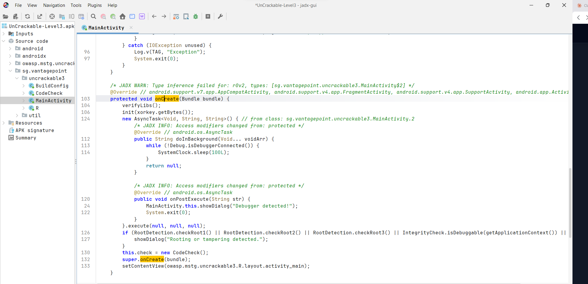
*Figure 4 — `onCreate()` chains root detection, debugger check, and tamper flag evaluation*

### 2.4 The Verification Gate

All checks feed into a single condition that triggers the termination dialog:

```java
if (RootDetection.checkRoot1() || RootDetection.checkRoot2() ||
    RootDetection.checkRoot3() || IntegrityCheck.isDebuggable(getApplicationContext()) ||
    tampered != 0) {
    showDialog("Rooting or tampering detected.");
}
```

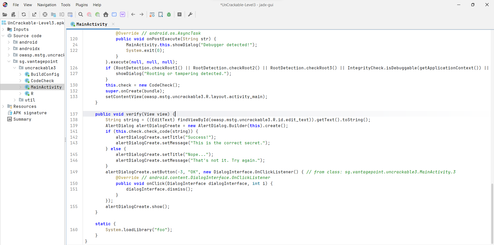
*Figure 5 — The full verification flow: `verify()` method delegates to `check.check_code()` which is implemented natively*

> **Key Insight:** The actual password check (`check_code`) is not implemented in Java. It is delegated to `libfoo.so` via JNI — meaning we cannot recover the secret from the Java layer alone.

---

## Phase 3 — APK Decompilation with Apktool

To modify the Smali bytecode, the APK must first be fully decompiled using Apktool:

```bash
apktool d UnCrackable-Level3.apk -o uncrackable3
```

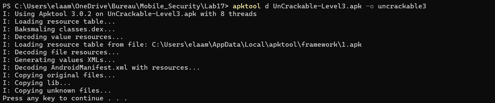
*Figure 6 — Apktool 3.0.2 decompiling the APK: Smali conversion, resource decoding, and library extraction*

The resulting directory contains the complete editable project:

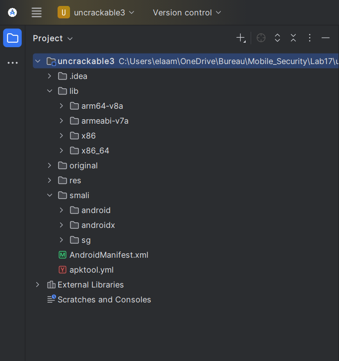
*Figure 7 — Decompiled project tree: `smali/`, `lib/` (with all ABI variants), `res/`, and manifest*

Notable contents:

```
uncrackable3/
├── smali/sg/vantagepoint/uncrackable3/MainActivity.smali  ← Target file
├── lib/arm64-v8a/libfoo.so    ← Native library (ARM64)
├── lib/x86_64/libfoo.so       ← Native library (x86_64)
├── res/                        ← Application resources
└── AndroidManifest.xml
```

---

## Phase 4 — Smali Patching (Bypassing Protections)

### 4.1 Locating the Target Block

Open the file:
```
uncrackable3/smali/sg/vantagepoint/uncrackable3/MainActivity.smali
```

Use `Ctrl+F` to search for `showDialog`. Navigate to the **second occurrence** — this is the call inside `onCreate` that we need to neutralize.

The block to patch looks like this:

```smali
.line 126
invoke-static {}, Lsg/vantagepoint/util/RootDetection;->checkRoot1()Z
move-result v0
if-nez v0, :cond_0
invoke-static {}, Lsg/vantagepoint/util/RootDetection;->checkRoot2()Z
move-result v0
if-nez v0, :cond_0
invoke-static {}, Lsg/vantagepoint/util/RootDetection;->checkRoot3()Z
move-result v0
if-nez v0, :cond_0
invoke-virtual {p0}, Lsg/vantagepoint/uncrackable3/MainActivity;->getApplicationContext()Landroid/content/Context;
move-result-object v0
invoke-static {v0}, Lsg/vantagepoint/util/IntegrityCheck;->isDebuggable(Landroid/content/Context;)Z
move-result v0
if-nez v0, :cond_0
sget v0, Lsg/vantagepoint/uncrackable3/MainActivity;->tampered:I
if-eqz v0, :cond_1

:cond_0
const-string v0, "Rooting or tampering detected."
invoke-direct {p0, v0}, Lsg/vantagepoint/uncrackable3/MainActivity;->showDialog(Ljava/lang/String;)V
.line 130

:cond_1
new-instance v0, Lsg/vantagepoint/uncrackable3/CodeCheck;
```

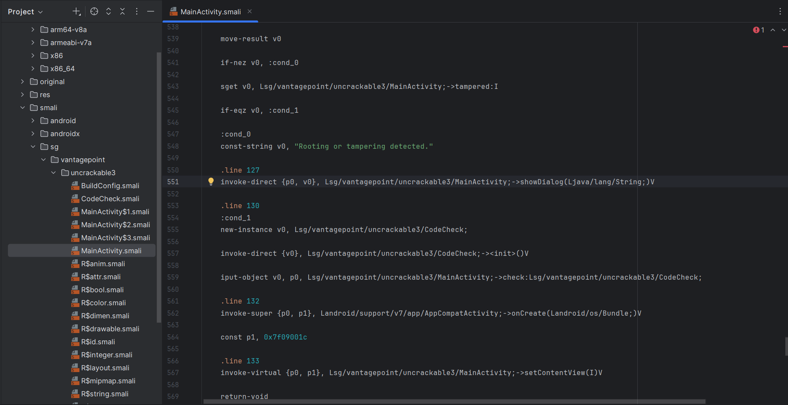
*Figure 8 — The complete smali detection block: `cond_0` triggers `showDialog`, which we redirect to `return-void`*

### 4.2 Applying the Patch

**Replace only these two lines:**

```smali
const-string v0, "Rooting or tampering detected."
invoke-direct {p0, v0}, Lsg/vantagepoint/uncrackable3/MainActivity;->showDialog(Ljava/lang/String;)V
```

**With:**

```smali
return-void
```

The patched block becomes:

```smali
:cond_0
return-void
.line 130

:cond_1
new-instance v0, Lsg/vantagepoint/uncrackable3/CodeCheck;
```

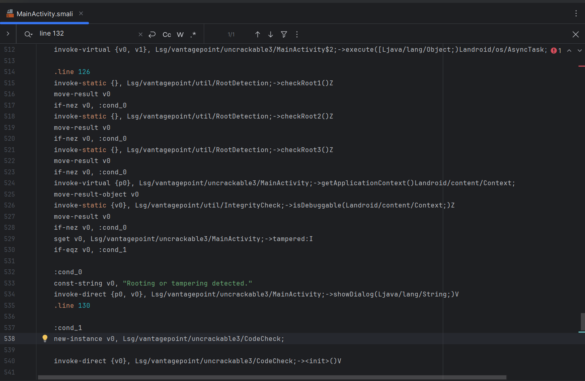
*Figure 9 — Full view of the root/debugger/tamper check chain in smali: all checks lead to `cond_0`, which now hits `return-void`*

### 4.3 Optional — Neutralize `showDialog` Completely

For a cleaner patch, you can also empty the `showDialog` method body:

```smali
.method private showDialog(Ljava/lang/String;)V
    .locals 3
    return-void
.end method
```

Save the file with `Ctrl+S` before proceeding.

---

## Phase 5 — Rebuild, Sign & Deploy

### 5.1 Rebuild the APK

```bash
apktool b uncrackable3 -o UnCrackable-Level3-patched.apk
```

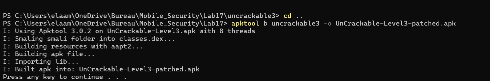
*Figure 10 — Apktool rebuilding: Smali compilation → DEX → APK file generation*

### 5.2 Create a Signing Keystore

A new RSA keystore was generated using `keytool`:

```bash
keytool -genkey -v \
  -keystore my-release-key.jks \
  -keyalg RSA \
  -keysize 2048 \
  -validity 10000 \
  -alias my-alias
```

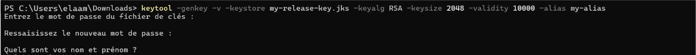
*Figure 11 — keytool generating a 2048-bit RSA keystore for signing the patched APK*

### 5.3 Sign the APK

```bash
apksigner sign --ks my-release-key.jks \
  --out UnCrackable-Level3-final.apk \
  UnCrackable-Level3-patched.apk
```

> **Windows alternative** (using the debug keystore):
> ```cmd
> apksigner sign --ks "%USERPROFILE%\.android\debug.keystore" UnCrackable-Level3-patched.apk
> ```
> Default keystore password: `android`


### 5.4 Install & Verify

Remove the old installation and deploy the patched version:

```bash
adb uninstall owasp.mstg.uncrackable3
adb install -r UnCrackable-Level3-final.apk
```

Confirm the target architecture:
```bash
adb shell getprop ro.product.cpu.abi
# Output: x86_64
```

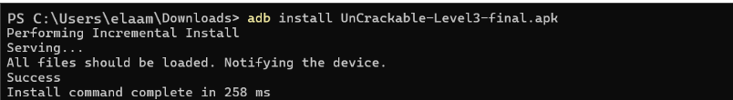
*Figure 13 — ADB confirming incremental installation of the final signed APK in 258ms*

### 5.5 The App Now Runs Without Protection Dialogs

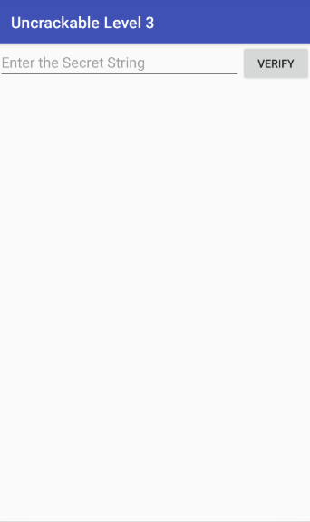
*Figure 14 — The patched app opens directly to the secret input field — no tampering dialogs, no forced exit*

✅ The Java-layer protection has been fully bypassed. The app is now accessible, but we still need to find the correct 24-character secret.

---

## Phase 6 — Native Library Reverse Engineering with Ghidra

### 6.1 Importing `libfoo.so` into Ghidra

1. Launch Ghidra → **New Project** → **Non-Shared Project**
2. **File → Import File** → select `uncrackable3/lib/x86_64/libfoo.so`
3. Double-click the imported file to open **CodeBrowser**
4. Accept the auto-analysis prompt and wait for completion

### 6.2 Analyzing the Anti-Frida/Anti-Debug Initializer

In the **Symbol Tree**, expand `.init_array` and locate `FUN_00013080` (or similar address). This function executes **before `main()`** and implements the runtime anti-analysis checks:

```c
// Pseudo-code from Ghidra decompilation
__stream = fopen("/proc/self/maps", "r");
pcVar1 = strstr(local_214, "frida");    // Anti-Frida detection
pcVar1 = strstr(local_214, "xposed");   // Anti-Xposed detection
pthread_create(&pStack_354, NULL, FUN_00013080, NULL);  // Anti-debug thread
```

If either `frida` or `xposed` is found in `/proc/self/maps`, the function calls `goodbye()` to terminate the process. The same function also uses `ptrace` for debugger detection.

**Patch:** Double-click on `FUN_00013080`, select the first instruction, and use **Edit → Patch Instruction → RET**. This causes the function to return immediately without performing any checks.

Export the patched library: **File → Export Program → Original Format** → overwrite `uncrackable3/lib/x86_64/libfoo.so`.

### 6.3 Locating the Password Verification Logic

Navigate to the **Symbol Tree** and search for:
```
Java_sg_vantagepoint_uncrackable3_Check_check_code
```

This is the JNI entry point for `check.check_code()`. It delegates to the internal function `FUN_001012c0`.

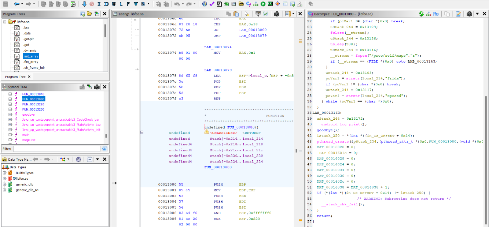
*Figure 15 — Ghidra's three-panel view: Symbol Tree (left), disassembly (center), and pseudo-code decompiler (right) showing the anti-Frida check logic*

### 6.4 Decoding the Obfuscation Pattern in `FUN_001012c0`

Opening `FUN_001012c0` reveals an enormous function body with a highly repetitive pattern:

```c
// This block repeats 90+ times — it is pure obfuscation
uVar3 = (uVar3 * 0x41c64e6d) + 0x3039;  // LCG computation
pvVar2 = malloc(0x10);                    // Pointless allocation
// ... linked list construction ...
```

This is a **Linear Congruential Generator (LCG)** obfuscation — a classic signature of tools like **Tigress** or **O-LLVM**. The LCG noise serves no functional purpose other than making static analysis extremely tedious.

**Key technique:** Scroll past the LCG noise to the **end of the function** where the actual data is written into `param_1` (the output buffer):

### 6.5 Extracting the Encoded Key

At the bottom of `FUN_001012c0`, three 8-byte constants are written into the output buffer — these are the encoded key bytes (stored in **little-endian** order):

```
1d 08 11 13 0f 17 49 15  0d 00 03 19 5a 1d 13 15
08 0e 5a 00 17 08 13 14
```

**Hex string:** `1d0811130f1749150d0003195a1d1315080e5a0017081314`

### 6.6 Understanding the Comparison Logic

The actual comparison function performs a **byte-by-byte XOR verification**:

```
Expected input length: exactly 24 bytes (0x18)
Loop step: 3 bytes per iteration
Verification: input[i] == encoded[i] XOR xor_key[i]
XOR key source: DAT_00107040, DAT_00107041, DAT_00107042 (the "pizza" pattern)
```

If any byte mismatches, execution jumps to the failure branch. Only if all 24 bytes match does the success branch execute.

---

## Phase 7 — Secret Key Recovery

### 7.1 The Decode Script

With the encoded bytes and XOR key identified, a simple Python script recovers the plaintext secret:

```python
# decode_key.py — XOR Secret Recovery for OWASP UnCrackable Level 3

# Encoded bytes extracted from FUN_001012c0 (little-endian, 24 bytes)
encoded = bytes.fromhex("1d0811130f1749150d0003195a1d1315080e5a0017081314")

# XOR key derived from native data section (repeating "pizza" pattern)
xor_key = b"pizzapizzapizzapizzapizzapizza"  # truncated to match length via zip()

# Bitwise XOR decryption — zip() pairs each byte and stops at the shorter sequence
secret = bytes(a ^ b for a, b in zip(encoded, xor_key))
print("🔑 Recovered secret:", secret.decode())
```

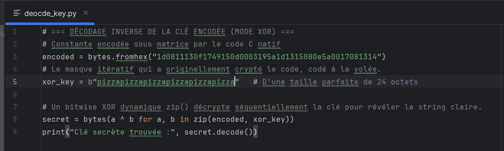
*Figure 16 — The decode_key.py script: 9 lines of Python to reverse the XOR encoding*

### 7.2 Script Output

```bash
python decode_key.py
```

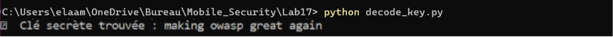
*Figure 17 — Script execution output: the 24-character secret string recovered from the native binary*

```
🔑 Recovered secret: making owasp great again
```

### 7.3 Entering the Secret in the App

The recovered string was typed into the app's input field and submitted:

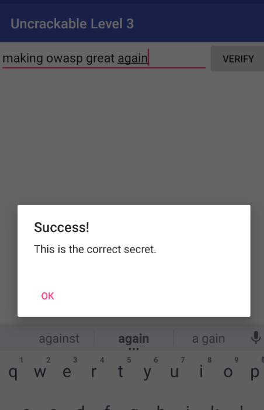
*Figure 18 — Challenge complete: the app confirms `making owasp great again` as the correct 24-character secret*

**Result:** ✅ `Success! This is the correct secret.`

---

## Results & Validation

| Step | Status | Description |
|---|---|---|
| APK Installation | ✅ | Installed successfully on `emulator-5554` |
| Root Detection Bypass | ✅ | Smali patch eliminates all three root checks |
| Debug Detection Bypass | ✅ | `showDialog` → `return-void` prevents forced exit |
| Integrity Check Bypass | ✅ | Tamper flag neutralized in `cond_0` handler |
| APK Rebuild | ✅ | `apktool b` produced valid APK from patched smali |
| APK Signing | ✅ | Signed with RSA-2048 keystore using `apksigner` |
| ADB Deployment | ✅ | Installed in 258ms with `adb install -r` |
| Native Analysis | ✅ | `FUN_001012c0` decompiled in Ghidra |
| Anti-Frida Patch | ✅ | Init function patched with `RET` instruction |
| Key Recovery | ✅ | XOR script decoded `making owasp great again` |
| Final Validation | ✅ | App confirmed "Success!" on correct input |

---

## Security Analysis

### Protection Mechanisms Identified

This challenge implements a defense-in-depth strategy across two layers:

**Java Layer:**
| Mechanism | Implementation | Bypass Applied |
|---|---|---|
| Root detection | `RootDetection.checkRoot1/2/3()` | Smali `return-void` patch |
| Debugger detection | `Debug.isDebuggerConnected()` + `AsyncTask` loop | Smali patch stops dialog |
| CRC integrity check | `verifyLibs()` compares `.so` and `classes.dex` CRCs | Neutralized via tamper flag bypass |
| Debuggable flag check | `IntegrityCheck.isDebuggable()` | Included in bypassed check chain |

**Native Layer:**
| Mechanism | Implementation | Bypass Applied |
|---|---|---|
| Anti-Frida | Scans `/proc/self/maps` for `frida`/`xposed` strings | `RET` patch on init function |
| Anti-debug | `ptrace` self-attachment | Covered by same `RET` patch |
| Code obfuscation | LCG + malloc + linked list (~90 iterations) | Identified and ignored |
| XOR-encoded secret | Key XOR'd with `pizza` pattern, stored as bytes | Decoded with Python script |

### Key Security Takeaways

1. **Shifting logic to native code is not security** — Ghidra decompiles `.so` files just as effectively as JADX handles Java.
2. **Obfuscation ≠ encryption** — LCG-based code inflation is a well-known pattern that experienced analysts immediately identify and skip.
3. **XOR is not cryptography** — Using a predictable repeating key (`pizza`) makes the encoding trivially reversible once the key is found.
4. **CRC integrity checks are fragile** — Any patching strategy that avoids modifying the checked files (e.g., only patching the smali verification logic) defeats this defense.
5. **Defense-in-depth requires each layer to be independently robust** — When the Java layer falls, the native layer provides no additional meaningful resistance in this implementation.

---

## Conclusion

This lab provided hands-on experience with a complete Android reverse engineering workflow targeting a deliberately hardened application. By methodically working through each protection layer — from static analysis and smali patching to native binary reverse engineering and XOR decoding — the challenge was fully solved using only free tools.

The recovered secret string **`making owasp great again`** was confirmed by the application itself, completing the OWASP UnCrackable Level 3 challenge.

The most important insight from this lab is that **security through obscurity** — hiding logic in native code, obfuscating with LCGs, or XOR-encoding with a simple repeating key — does not constitute real security. Motivated attackers with standard tools can systematically dismantle each layer given sufficient time.

---

## Potential Improvements

For developers building real applications that require secret protection, consider:

- 🔒 **Remote verification** — Never store secrets or verification logic on-device; validate against a server-side API
- 🔒 **Certificate pinning** — Combine with network-level protections to prevent MITM interception
- 🔒 **Hardware-backed key storage** — Use Android Keystore with hardware security modules (HSM) for key material
- 🔒 **RASP (Runtime Application Self-Protection)** — Consider commercial RASP solutions that are harder to patch than open-source checks
- 🔒 **White-box cryptography** — Replace XOR with proper white-box AES implementations
- 🔒 **Multi-layer obfuscation** — Stack multiple obfuscation strategies (ollvm, virtualization, dynamic key derivation) to significantly increase analysis complexity
- 🔒 **Attestation APIs** — Use Google Play Integrity API for server-verified runtime attestation

---

<div align="center">

**Lab 17 — Mobile Application Security**  
*OWASP MSTG UnCrackable Level 3 — Successfully Cracked* 🏆

</div>
