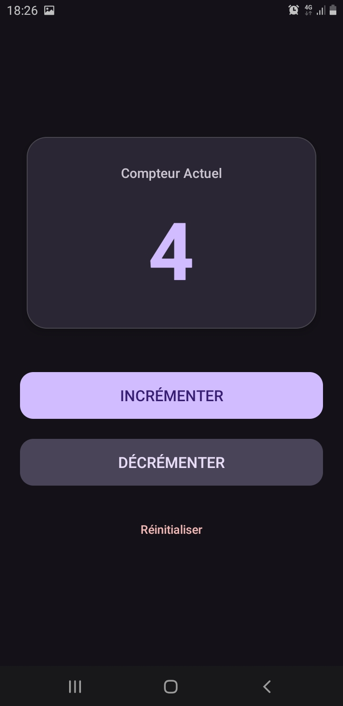

# Lab 18 : Architecture Android MVVM (ViewModel & LiveData)

## 📖 Présentation du projet
Ce projet est une application Android conçue pour démontrer la robustesse de l'architecture moderne recommandée par Google (Jetpack MVVM). Il s'agit d'un compteur interactif qui survit aux changements de configuration (comme la rotation de l'écran) et aux arrêts inattendus du système (process death). 

Contrairement à l'approche classique (qui perd les données ou nécessite du code spaghetti avec `onSaveInstanceState`), cette application utilise une séparation claire entre la logique (ViewModel) et l'interface utilisateur (Activity).

## 🎯 Objectifs
- Mettre en œuvre une architecture MVVM propre et maintenable.
- Assurer la persistance des données lors des rotations d'écran grâce à `ViewModel`.
- Garantir des mises à jour d'interface sécurisées et "lifecycle-aware" grâce à `LiveData`.
- Gérer la persistance avancée (Process Death) avec `SavedStateHandle`.
- Offrir une expérience utilisateur (UX) moderne basée sur Material Design 3.

## 🛠 Technologies utilisées
- **Langage** : Java
- **SDK Android** : API 24 (Min) / API 36 (Target)
- **Architecture** : MVVM (Model-View-ViewModel)
- **Composants Jetpack** : 
  - `lifecycle-viewmodel` (v2.10.0)
  - `lifecycle-livedata` (v2.10.0)
- **UI** : XML avec `ConstraintLayout` et composants Material Design 3 (`MaterialCardView`, `MaterialButton`).

## 🏗 Aperçu de l'architecture
L'application est découpée en deux composants principaux :
1. **MainActivity (Vue)** : S'occupe uniquement d'afficher l'interface, de capter les clics de l'utilisateur, et d'observer les changements du compteur. Elle ne contient aucune logique métier.
2. **CounterViewModel (Logique)** : Contient l'état de l'application (`MutableLiveData`). Il s'occupe de l'incrémentation, de la décrémentation et de la réinitialisation de manière asynchrone et sécurisée.

## 🚀 Installation & Configuration

### Prérequis
- Android Studio (version la plus récente recommandée).
- Un émulateur Android (API 24+) ou un appareil physique.

### Étapes de configuration
1. Clonez ce dépôt ou extrayez l'archive du projet.
2. Ouvrez Android Studio, cliquez sur **File > Open** et sélectionnez le dossier `lab18`.
3. Attendez la fin de la synchronisation Gradle (Gradle Sync).

### Setup Base de données
*Non applicable pour ce projet.* Les données sont stockées de manière transitoire en mémoire RAM (ViewModel) et sérialisées dans le Bundle système (`SavedStateHandle`) lors d'un éventuel crash. Il n'y a pas de base de données SQLite/Room nécessaire.

### Setup Serveur
*Non applicable pour ce projet.* L'application fonctionne 100% en local (offline).

### Setup Android
Aucune permission spéciale (`AndroidManifest.xml`) n'est requise. L'application utilise le thème par défaut `Theme.Material3.DayNight` pour un support automatique des modes Clair/Sombre.

## 🏃 Exécution et Tests
1. Cliquez sur le bouton **Run 'app'** (triangle vert) dans Android Studio.
2. L'application va compiler et se lancer sur l'appareil cible.

### Scénarios de tests manuels
- **Test d'incrémentation basique** : Cliquez sur "Incrémenter", le compteur doit augmenter.
- **Test de rotation (Survie de base)** : Incrémentez jusqu'à 5. Faites pivoter l'écran (Ctrl+F11 sur l'émulateur). Le compteur **doit rester à 5**.
- **Test asynchrone (Bonus Thread)** : Maintenez un appui long sur "Incrémenter". L'opération se fait en arrière-plan via `postValue` sans faire crasher l'interface.
- **Test de Process Death (Survie avancée)** : 
  1. Incrémentez jusqu'à 10.
  2. Mettez l'application en arrière-plan (bouton Home).
  3. Dans le terminal Android Studio, tapez : `adb shell am kill com.example.lab18`.
  4. Relancez l'application depuis les apps récentes. Le compteur affichera toujours 10 !

## 📸 Captures d'écran

## ⚠️ Dépannage (Troubleshooting)
- **Erreur "SDK location not found"** : Vérifiez que votre fichier `local.properties` contient le bon chemin vers votre SDK (ex: `sdk.dir=C\:\\Users\\VotreNom\\AppData\\Local\\Android\\Sdk`).
- **L'UI ne se met pas à jour** : Assurez-vous d'utiliser `observe()` dans la `MainActivity` et de ne jamais extraire la valeur manuellement avec un `.getValue()` direct pour rafraichir l'UI.
- **L'application crashe sur un appui long** : Assurez-vous que l'opération asynchrone utilise bien `postValue()` et non `setValue()`, car `setValue()` est strictement réservé au Thread Principal (UI Thread).

## 💡 Conclusion
Ce lab démontre qu'en appliquant les bons patrons de conception (MVVM), l'expérience développeur devient beaucoup plus agréable : le code est séparé, prévisible, et naturellement immunisé contre les problèmes classiques du cycle de vie Android. De plus, l'interface a été entièrement repensée pour offrir un rendu professionnel, bien loin des maquettes scolaires basiques.
