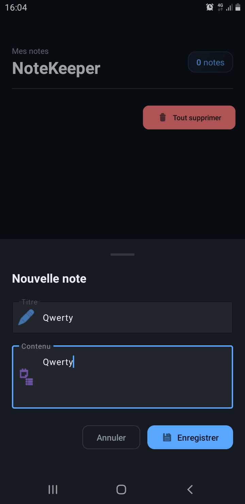
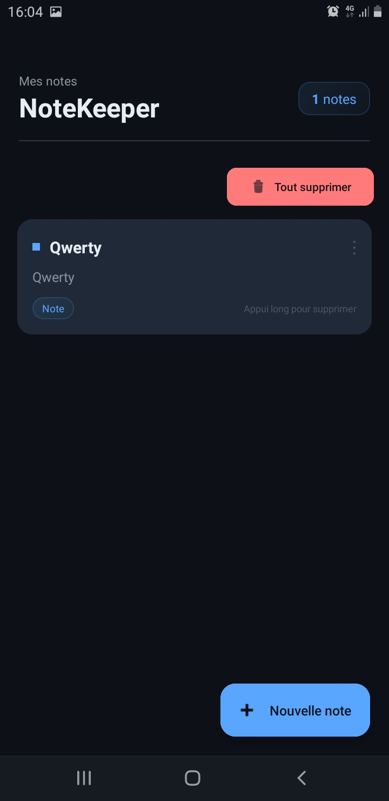
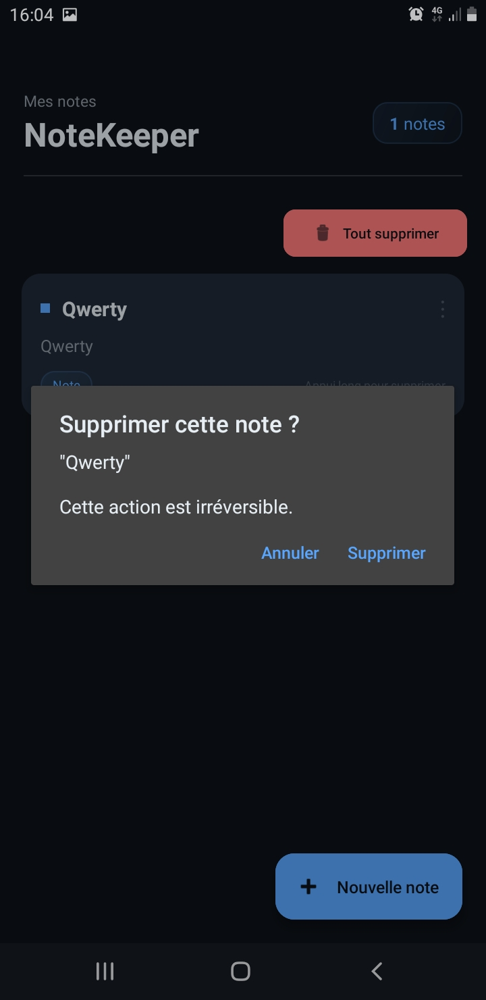

# 📝 NoteKeeper — Lab 19

Application Android de gestion de notes développée dans le cadre du cours de **Programmation Mobile (Android avec Java)**.  
Ce projet implémente l'architecture **MVVM** avec **Room**, **LiveData**, **ViewModel** et **RecyclerView**.

---

## 📖 Présentation du projet

**NoteKeeper** est une application de prise de notes locale. Elle permet de créer, consulter et supprimer des notes persistées dans une base de données SQLite via Room. L'interface suit le modèle MVVM pour bien séparer les couches de l'application.

L'application a été personnalisée avec :
- un thème sombre moderne (palette GitHub-inspired)
- un formulaire en BottomSheet à la place d'un formulaire fixe
- des cartes animées avec indicateurs de couleur alternés
- une confirmation avant suppression via AlertDialog
- un compteur de notes en temps réel

---

## 🎯 Objectifs pédagogiques

- Comprendre et implémenter l'architecture **MVVM** sur Android
- Utiliser **Room** pour la persistance locale sur SQLite
- Utiliser **LiveData** pour l'observation automatique des données
- Implémenter un **RecyclerView** performant avec Adapter et ViewHolder
- Comprendre pourquoi les opérations de base de données ne doivent pas se faire sur le thread principal
- Comprendre comment le **ViewModel** survit aux rotations d'écran

---

## 🛠️ Technologies utilisées

| Technologie | Rôle |
|---|---|
| Java | Langage de développement |
| Room 2.6.1 | Abstraction SQLite, persistance locale |
| ViewModel + AndroidViewModel | Conservation de l'état entre rotations |
| LiveData | Observation réactive des données |
| RecyclerView 1.3.2 | Affichage performant de la liste de notes |
| CardView 1.0.0 | Rendu visuel des cartes |
| Material Design 3 | Composants UI modernes (BottomSheet, FAB, Snackbar) |
| ExecutorService | Exécution des opérations DB en arrière-plan |

---

## 🏗️ Architecture du projet

L'application suit le pattern **MVVM** (Model – View – ViewModel) :

```
com.example.lab19
│
├── data
│   ├── local
│   │   ├── NoteEntity.java       ← Entity Room (table "notes")
│   │   ├── NoteDao.java          ← Interface d'accès aux données
│   │   └── AppDatabase.java      ← Singleton Room Database
│   └── NoteRepository.java       ← Intermédiaire ViewModel ↔ base
│
├── ui
│   ├── MainActivity.java         ← Vue principale (observe le ViewModel)
│   ├── NoteCardAdapter.java      ← Adapter RecyclerView + animations
│   └── AddNoteBottomSheet.java   ← Formulaire d'ajout (BottomSheet)
│
└── viewmodel
    └── NoteViewModel.java        ← Logique de présentation + LiveData
```

### Flux de données

```
SQLite ──Room──► NoteDao ──LiveData──► NoteRepository ──LiveData──► NoteViewModel ──observe──► MainActivity ──setData──► RecyclerView
```

Le sens inverse (actions utilisateur) :

```
RecyclerView/FAB ──► MainActivity ──► NoteViewModel.insert/delete() ──► NoteRepository ──► NoteDao ──► SQLite
```

---

## 📦 Installation et configuration

### Prérequis

- Android Studio Hedgehog (ou plus récent)
- JDK 11+
- Android SDK : min API 24 (Android 7.0), target API 36
- Appareil ou émulateur Android

### Cloner / ouvrir le projet

```bash
# Si le projet est sur Git
git clone https://github.com/votre-compte/lab19-notekeeper.git

# Sinon, ouvrir directement dans Android Studio :
# File > Open > sélectionner le dossier lab19
```

### Synchronisation Gradle

Une fois ouvert dans Android Studio, attendre la synchronisation automatique du projet.  
Si elle ne se lance pas : **File > Sync Project with Gradle Files**

---

## 🗄️ Configuration de la base de données

La base de données est **locale** sur l'appareil — aucune configuration serveur n'est nécessaire.

Room crée automatiquement le fichier `notekeeper.db` dans le répertoire de données privé de l'application lors du premier lancement.

Paramètres Room (dans `AppDatabase.java`) :
- **Nom** : `notekeeper.db`
- **Version** : `1`
- **Table** : `notes` (champs : `noteId`, `noteTitle`, `noteContent`, `createdAt`)
- **Migration** : `fallbackToDestructiveMigration()` (acceptable en développement)

---

## 🖥️ Configuration du serveur

> **Il n'y a pas de serveur dans ce projet.** Toutes les données sont stockées localement via Room/SQLite.  
> Si tu veux ajouter une synchronisation distante plus tard, tu peux ajouter Retrofit dans le `NoteRepository` sans toucher au reste de l'architecture.

---

## 📱 Configuration Android

Les dépendances importantes dans `gradle/libs.versions.toml` :

```toml
[versions]
room = "2.6.1"
lifecycle = "2.8.7"
recyclerview = "1.3.2"
cardview = "1.0.0"
```

Dans `app/build.gradle.kts` :
```kotlin
implementation(libs.room.runtime)
annotationProcessor(libs.room.compiler)   // génère le code Room
implementation(libs.room.livedata)
implementation(libs.lifecycle.viewmodel)
implementation(libs.lifecycle.livedata)
implementation(libs.recyclerview)
implementation(libs.cardview)
```

---

## ▶️ Lancement de l'application

1. Connecter un appareil Android ou démarrer un émulateur
2. Dans Android Studio : cliquer sur **Run ▶** (ou `Shift+F10`)
3. Sélectionner l'appareil cible
4. L'application se compile et se lance automatiquement

---

## 🧪 Instructions de test

### Test 1 — Ajout de notes

1. Appuyer sur le bouton **+ Nouvelle note** (FAB en bas à droite)
2. Remplir le titre et le contenu
3. Appuyer sur **Enregistrer**
4. ✅ La note doit apparaître immédiatement dans la liste

### Test 2 — Suppression par appui long

1. Faire un appui long sur une carte de note
2. Confirmer la suppression dans le dialogue
3. ✅ La note disparaît de la liste

### Test 3 — Persistance après fermeture

1. Ajouter quelques notes
2. Fermer complètement l'application (retirer du gestionnaire de tâches)
3. Rouvrir l'application
4. ✅ Les notes sont toujours présentes

### Test 4 — Résistance à la rotation

1. Ajouter une note
2. Tourner l'écran de 90°
3. ✅ La liste reste intacte sans rechargement visible

### Test 5 — Suppression globale

1. Appuyer sur **Tout supprimer** (bouton rouge en haut)
2. Confirmer dans le dialogue
3. ✅ La liste se vide et l'état vide (emoji + texte) s'affiche

---

## 📸 Captures d'écran

### Formulaire d'ajout — BottomSheet



### Écran principal — liste des notes



### Confirmation de suppression (dialogue)




---

## ❓ Résolution des problèmes

### ❌ Erreur de compilation Room : "Cannot find symbol"

**Cause** : L'annotationProcessor n'est pas configuré.  
**Solution** : Vérifier que `annotationProcessor(libs.room.compiler)` est bien dans `build.gradle.kts` (et **non** `implementation`).

---

### ❌ L'application plante avec "IllegalStateException: Cannot access database on the main thread"

**Cause** : Une opération Room est appelée sur le thread principal.  
**Solution** : Toutes les opérations d'écriture (`insert`, `delete`) doivent passer par `ExecutorService` dans le `NoteRepository`. Vérifier que la méthode du DAO n'est pas appelée directement depuis l'Activity.

---

### ❌ La liste ne se met pas à jour après une insertion

**Cause** : Le LiveData n'est pas observé correctement, ou `getAllNotes()` du DAO ne retourne pas un `LiveData<List<NoteEntity>>`.  
**Solution** : Vérifier que la signature dans `NoteDao` est `LiveData<List<NoteEntity>> fetchAllNotes()` et que `observe(this, ...)` est bien appelé dans `MainActivity`.

---

### ❌ Gradle sync échoue sur les versions des dépendances

**Cause** : Certaines versions spécifiées ne sont pas disponibles dans le dépôt Maven.  
**Solution** : Vérifier la connectivité internet et s'assurer que les versions dans `libs.versions.toml` correspondent bien à celles disponibles sur [mvnrepository.com](https://mvnrepository.com/artifact/androidx.room/room-runtime).

---

### ❌ "Class not found" pour MainActivity au lancement

**Cause** : Le chemin dans `AndroidManifest.xml` ne correspond pas au package réel.  
**Solution** : L'Activity est dans `com.example.lab19.ui.MainActivity`. Le manifest doit avoir `android:name=".ui.MainActivity"`.

---

## 📚 Conclusion

Ce projet m'a permis de comprendre concrètement comment une application Android peut être structurée selon le modèle MVVM. La séparation entre l'interface (Activity), la logique (ViewModel) et les données (Repository + Room) rend le code beaucoup plus lisible et maintenable qu'une approche "tout dans l'Activity".

J'ai aussi compris pourquoi Room interdit les opérations sur le thread principal : une requête SQLite bloquante bloquerait l'interface et la rendrait non réactive. L'utilisation d'`ExecutorService` dans le Repository résout ce problème de façon propre.

Le ViewModel, lui, résout élégamment le problème de la rotation d'écran : en survivant à la recréation de l'Activity, il évite de relancer inutilement toutes les requêtes de données.

---

*Projet réalisé dans le cadre du cours Programmation Mobile — Android avec Java | MLIAEdu Platform*
