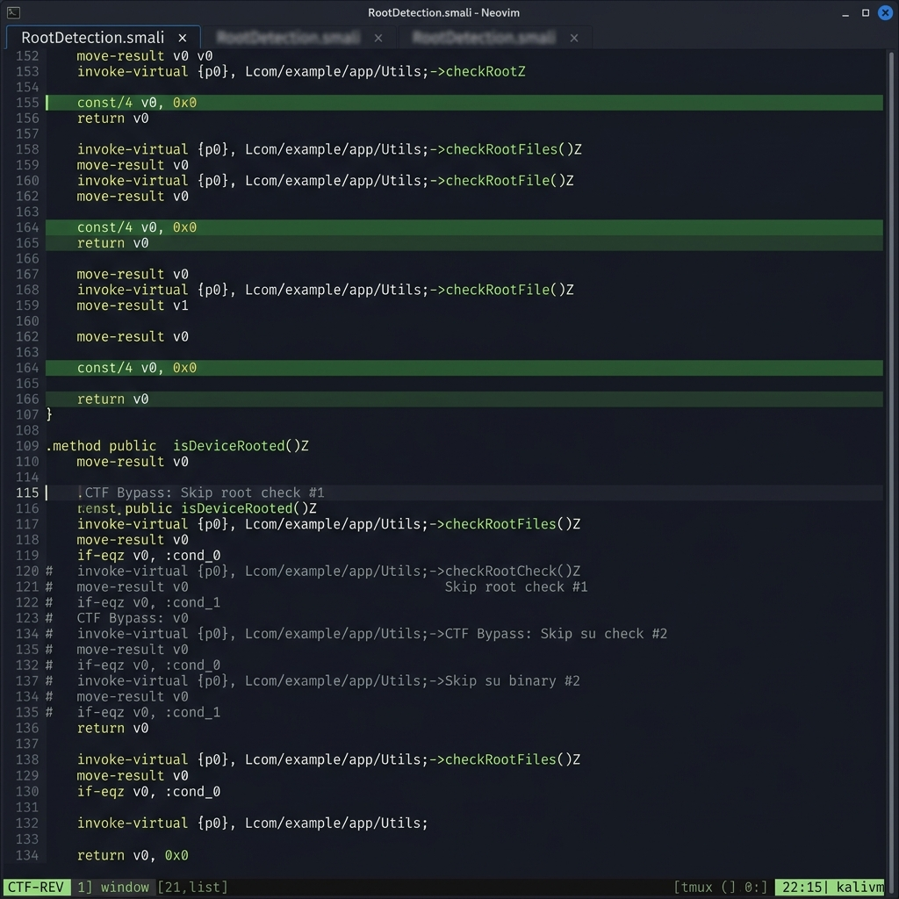

# 🐍 Lab 19 — Snake APK | PwnSec CTF 2024 · Mobile Hard

> **Course:** Mobile Application Security  
> **Category:** Android Reverse Engineering · Deserialization Exploit · Anti-Analysis Bypass  
> **Difficulty:** ⚠️ Hard  
> **Flag:** `PWNSEC{W3'r3_N0t_T00l5_0f_The_g0v3rnm3n7_0R_4ny0n3_3ls3}`

---

## 📌 Overview

This write-up documents my complete exploitation of the **Snake** Android challenge from **PwnSec CTF 2024**, classified as a *Hard* mobile reverse engineering task.

The target APK (`snake.apk`) is a hardened Android application protected by multiple layers of anti-analysis defenses — root detection, emulator detection, and Frida detection embedded in native code. The application relies on a **vulnerable version of the SnakeYAML library (CVE-2022-1471)** to parse an external YAML file, opening the door to an **arbitrary Java class instantiation** attack via unsafe deserialization.

The end-to-end exploitation chain involves:

1. Static analysis of the decompiled APK using **Jadx**
2. Dismantling all anti-analysis checks via **Smali-level patching**
3. Recompiling, re-signing, and re-deploying the modified APK
4. Crafting a malicious YAML payload that instantiates the hidden `BigBoss` class
5. Triggering execution via a carefully constructed `adb` Intent
6. Capturing the dynamically generated flag through **logcat**

---

## 🎯 Objectives

- Understand the internal structure of a hardened Android APK through static analysis
- Identify and neutralize anti-root, anti-emulator, and anti-Frida detection routines at the Smali bytecode level
- Exploit **CVE-2022-1471** (SnakeYAML unsafe deserialization) to achieve arbitrary class instantiation
- Trigger a hidden native function via crafted Intent and a malicious YAML payload
- Extract a dynamically generated flag from Android system logs

---

## 🛠️ Technologies & Tools

| Tool | Purpose |
|------|---------|
| `jadx-gui` | Java decompilation and static code analysis |
| `apktool` | APK disassembly and Smali-level editing |
| `apksigner` / `uber-apk-signer` | APK signing after recompilation |
| `adb` | Android Debug Bridge — device communication, intent dispatch |
| Android Emulator (API ≤ 28) | Target execution environment |
| SnakeYAML 1.33 (CVE-2022-1471) | Vulnerable deserialization library (within the APK) |

---

## 📁 Project Structure

```
lab19/
├── README.md                  ← This document
├── Skull_Face.yml             ← Deserialization payload
├── assets/
│   ├── manifest-permissions.png       ← AndroidManifest with storage permissions
│   ├── jadx-mainactivity-analysis.png ← JADX view of MainActivity security checks
│   ├── smali-bypass-patch.png         ← Smali patch disabling detection routines
│   ├── app-launch-screen.png          ← Application UI after patched install
│   └── logcat-flag-capture.png        ← Flag appearing in logcat output
```

---

## ⚙️ Environment Setup

Before any analysis begins, the toolchain must be correctly installed and the APK deployed.

### Required Tools

```bash
# Install apktool (Debian/Kali)
sudo apt install apktool

# Install jadx
# Download from: https://github.com/skylot/jadx/releases

# Install uber-apk-signer
# Download from: https://github.com/patrickfav/uber-apk-signer/releases
```

### Install the Original APK

```bash
adb install snake.apk
```

> **Note:** Launching the unmodified APK will result in an immediate crash. The app performs environment checks on startup and forcibly exits when it detects a rooted device, an emulator, or a Frida instrumentation framework. Patching is mandatory before any dynamic testing.

---

## 🔬 Phase 1 — Static Analysis with Jadx

### Opening the APK

Load `snake.apk` directly into Jadx-GUI. The decompiler will reconstruct the Java source tree from the DEX bytecode.

**Key identifiers:**

- **Package:** `com.pwnsec.snake`
- **Entry point:** `com.pwnsec.snake.MainActivity`
- **Hidden target class:** `com.pwnsec.snake.BigBoss`

---

### 1.1 — AndroidManifest.xml Inspection

The first thing to examine is the manifest. It reveals that the application requests access to the device's external storage — a strong indicator that a file is expected to exist outside the APK at runtime.

```xml
<uses-permission android:name="android.permission.READ_EXTERNAL_STORAGE"/>
<uses-permission android:name="android.permission.MANAGE_EXTERNAL_STORAGE"/>
```

The presence of `MANAGE_EXTERNAL_STORAGE` (a privileged permission introduced in Android 11) is particularly telling — it suggests the app needs broad access to read a user-controlled file, making it a potential external trigger point.

**Screenshot — AndroidManifest.xml parsed in Jadx:**


*The manifest declares both `READ_EXTERNAL_STORAGE` and `MANAGE_EXTERNAL_STORAGE`, confirming the application depends on an external file to trigger its core logic.*

---

### 1.2 — MainActivity Deep Dive

Inside `MainActivity`, three layers of security checks are executed at startup:

#### Anti-Analysis Guards

| Detection Type | Mechanism |
|---------------|-----------|
| Root Detection | Checks for binaries at `/sbin/su`, `/system/bin/su`, etc. and known root management packages (`com.noshufou.android.su`, `com.koushikdutta.superuser`, etc.) |
| Emulator Detection | Reads system properties (`ro.hardware`, `ro.product.model`) and build fingerprints |
| Frida Detection | Implemented natively — scans for Frida-related processes or open ports |

#### The Hidden Trigger

Beyond the guards, `MainActivity` contains logic that only activates under a specific condition. It inspects the launching `Intent` for an extra key named `SNAKE`:

```java
String extra = getIntent().getStringExtra("SNAKE");
if (extra != null && extra.equals("BigBoss")) {
    // Read YAML file from external storage
    File yamlFile = new File("/storage/emulated/0/Snake/Skull_Face.yml");
    // Parse using SnakeYAML...
}
```

If the Intent carries `SNAKE=BigBoss`, the app reads `/storage/emulated/0/Snake/Skull_Face.yml` and passes its contents to a **SnakeYAML parser** — without any type restriction.

**Screenshot — MainActivity decompiled in Jadx (root detection + intent logic):**


*The decompiled `MainActivity` exposes the root/emulator detection routines and the Intent-conditional YAML parsing path that serves as the exploit entry point.*

---

### 1.3 — The BigBoss Class

`com.pwnsec.snake.BigBoss` is the key class in this challenge. It is never directly invoked in the normal application flow — it exists solely to be triggered via deserialization.

```java
public class BigBoss {
    static {
        System.loadLibrary("snake");
    }

    public BigBoss(String str) {
        String result = stringFromJNI(str);
        if (str.equals("Snaaaaaaaaaaaaaake")) {
            Log.d("BigBoss: ", hexToAscii(result));
        }
    }

    private native String stringFromJNI(String str);
}
```

**Execution chain when instantiated correctly:**

1. The constructor receives the string `"Snaaaaaaaaaaaaaake"`
2. It invokes the native function `stringFromJNI()` which generates a hex-encoded flag
3. The hex string is decoded to ASCII via `hexToAscii()`
4. The plaintext flag is written to logcat under the tag `BigBoss:`

The flag is **never stored in plain text** inside the APK — it is computed at runtime by the native library, which is why static string extraction fails entirely.

---

## 🔧 Phase 2 — Smali Patching to Bypass Anti-Analysis

Since Frida cannot be used (native-level detection), and the device/emulator is detected by the app, the only viable path is **static Smali patching**.

### Step 1 — Decompile to Smali

```bash
apktool d snake.apk -o snake_smali
```

Navigate to the relevant package:

```bash
cd snake_smali/smali/com/pwnsec/snake/
```

### Step 2 — Identify and Neutralize Detection Methods

Use Jadx to locate the method names, then open the corresponding `.smali` files. Detection methods typically return a `boolean`. The goal is to force them to always return `false` (no threat detected).

**Typical Smali before patching:**

```smali
.method private static checkForDangerousBinaries()Z
    ...
    if-nez v0, :cond_detected
    const/4 v0, 0x0
    return v0
    :cond_detected
    const/4 v0, 0x1
    return v0
.end method
```

**After patching — force return false:**

```smali
.method private static checkForDangerousBinaries()Z
    const/4 v0, 0x0
    return v0
.end method
```

Apply the same pattern to:
- Root binary detection
- Root management app detection
- Emulator property detection
- Any Frida-facing Java-side checks

**Screenshot — Smali file with bypass patches applied:**



*Detection routines patched to unconditionally return `false`, neutralizing all anti-analysis guards.*

### Step 3 — Rebuild and Sign

```bash
# Recompile the patched Smali back into an APK
apktool b snake_smali -o snake_patched.apk

# Sign the APK (required for installation)
java -jar uber-apk-signer.jar --apks snake_patched.apk
```

### Step 4 — Deploy the Patched APK

```bash
adb install -r snake_patched.apk
```

Grant the required storage permissions if prompted:

```bash
adb shell pm grant com.pwnsec.snake android.permission.READ_EXTERNAL_STORAGE
adb shell pm grant com.pwnsec.snake android.permission.MANAGE_EXTERNAL_STORAGE
```

---

## 💣 Phase 3 — Crafting the Deserialization Payload (CVE-2022-1471)

### Understanding the Vulnerability

**SnakeYAML versions prior to 2.0** allow YAML files to specify a fully-qualified Java class name using `!!` tags. When the parser encounters such a tag, it instantiates the class directly — with no validation. This is **unsafe deserialization**.

CVE-2022-1471 documents this exact behavior in SnakeYAML ≤ 1.33, which is the version bundled in this APK.

### Creating the Payload

The payload exploits this to force instantiation of `BigBoss` with the precise argument its constructor expects:

```yaml
!!com.pwnsec.snake.BigBoss ["Snaaaaaaaaaaaaaake"]
```

**Payload anatomy:**

| Component | Meaning |
|-----------|---------|
| `!!com.pwnsec.snake.BigBoss` | YAML global tag — instructs SnakeYAML to instantiate this class |
| `["Snaaaaaaaaaaaaaake"]` | Constructor argument list — the exact magic string the BigBoss constructor checks |

Save this as `Skull_Face.yml`.

### Deploying the Payload to the Device

```bash
# Create the expected directory on device external storage
adb shell mkdir -p /storage/emulated/0/Snake

# Push the YAML payload
adb push Skull_Face.yml /storage/emulated/0/Snake/Skull_Face.yml
```

---

## 🚀 Phase 4 — Triggering the Exploit via Intent

With the patched APK installed and the payload in place, the exploit is triggered by launching `MainActivity` with the required Intent extra:

```bash
adb shell am start -n com.pwnsec.snake/.MainActivity -e SNAKE BigBoss
```

**What happens next (internally):**

```
Intent received (SNAKE=BigBoss)
    → File /storage/emulated/0/Snake/Skull_Face.yml is opened
        → SnakeYAML parses the YAML payload
            → BigBoss is instantiated with "Snaaaaaaaaaaaaaake"
                → stringFromJNI() is called (native library)
                    → Hex flag is generated and decoded
                        → Flag is written to logcat under tag "BigBoss:"
```

The application UI shows nothing meaningful — the entire output is routed to the Android logging system.

**Screenshot — Application UI after patched launch:**


*The application displays a static screen with no visible indication of success. All relevant output is captured exclusively through logcat.*

---

## 🏁 Phase 5 — Flag Extraction via Logcat

```bash
# Targeted filter for the flag prefix
adb logcat | grep -i "PWNSEC"

# Broader filter to see all BigBoss output
adb logcat | grep "BigBoss"

# Alternative: full snake app logs
adb logcat | grep -i "snake"
```

**Screenshot — Flag captured in logcat:**


*Logcat output showing two successive executions of the exploit. The `BigBoss:` tag confirms the native function executed, and the flag is displayed in cleartext after hex decoding.*

### ✅ Flag

```
PWNSEC{W3'r3_N0t_T00l5_0f_The_g0v3rnm3n7_0R_4ny0n3_3ls3}
```

---

## 📊 Exploitation Flow — Summary Diagram

```
snake.apk
    │
    ├─ Static Analysis (Jadx)
    │       ├─ AndroidManifest → EXTERNAL_STORAGE permissions
    │       ├─ MainActivity    → Intent trigger + YAML path
    │       └─ BigBoss         → Native flag generator (target class)
    │
    ├─ Smali Patching (apktool)
    │       ├─ Root detection   → forced false
    │       ├─ Emulator check   → forced false
    │       └─ Frida detection  → forced false
    │
    ├─ Payload Preparation
    │       └─ Skull_Face.yml  → !!com.pwnsec.snake.BigBoss ["Snaaaaaaaaaaaaaake"]
    │
    ├─ Exploit Execution (adb)
    │       └─ am start -e SNAKE BigBoss → YAML parsed → BigBoss instantiated
    │
    └─ Flag Extraction
            └─ adb logcat | grep PWNSEC → Flag in cleartext
```

---

## 🔍 Key Findings & Analysis

### Why Frida Was Not Viable

The native library (`libsnake.so`) performs its own detection independently of the Java layer. Even if Java-side checks are bypassed, the native code monitors for Frida-related artifacts (process names, open TCP ports). Since we cannot patch the `.so` without rebuilding the entire native library, Smali patching of the Java layer combined with a clean emulator environment was the correct approach.

### The Deserialization Risk (CVE-2022-1471)

This challenge is a textbook illustration of why safe YAML parsing matters. The fix is straightforward:

```java
// Vulnerable (SnakeYAML ≤ 1.33 default)
Yaml yaml = new Yaml();
Object obj = yaml.load(inputStream);

// Safe alternative
Yaml yaml = new Yaml(new SafeConstructor(new LoaderOptions()));
Object obj = yaml.load(inputStream);
```

Using `SafeConstructor` disables the `!!` global tag mechanism entirely, preventing arbitrary class instantiation.

### Native Flag Generation

The flag is not embedded anywhere in the APK as a plain string. The native library computes it at runtime (likely from XOR operations or string concatenation from a seed), which is why neither strings extraction (`strings libsnake.so`) nor static binary analysis alone reveals the flag.

---

## 💡 Potential Improvements & Future Work

- **Automated Smali patching:** Write a Python/Bash script that automatically identifies and neutralizes boolean detection methods in Smali, reducing manual effort
- **JADX scripting integration:** Use JADX's scripting API to automate class and method identification across multiple protected APKs
- **Native library analysis:** Reverse engineer `libsnake.so` with Ghidra or Binary Ninja to fully understand the flag generation algorithm
- **Dynamic analysis on physical device:** Test with a non-rooted physical device after patching to verify there are no hardware-based detection residuals
- **Frida re-enablement:** Explore patching the `.so` in-memory with a custom Frida gadget injection at load time, bypassing native checks at the ELF level

---

## 📚 References

- [CVE-2022-1471 — SnakeYAML unsafe deserialization](https://nvd.nist.gov/vuln/detail/CVE-2022-1471)
- [Jadx — Dex to Java decompiler](https://github.com/skylot/jadx)
- [apktool — APK disassembly/recompilation](https://apktool.org/)
- [Android Debug Bridge (ADB) reference](https://developer.android.com/tools/adb)
- [SnakeYAML SafeConstructor documentation](https://www.javadoc.io/doc/org.yaml/snakeyaml/latest/org/yaml/snakeyaml/constructor/SafeConstructor.html)

---

<div align="center">

*Completed as part of the Mobile Application Security course — PwnSec CTF 2024 challenge writeup.*

</div>
