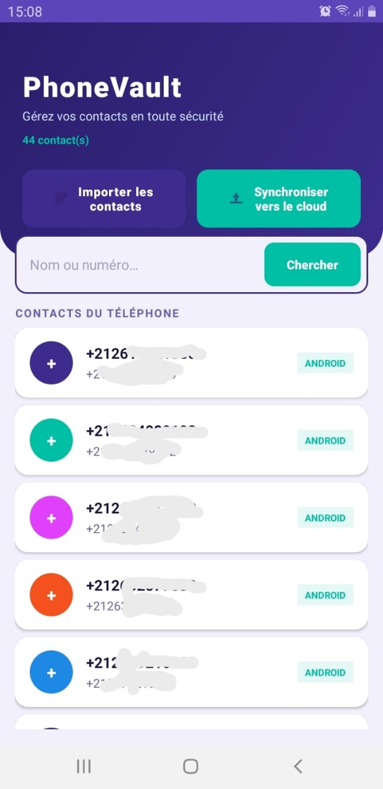
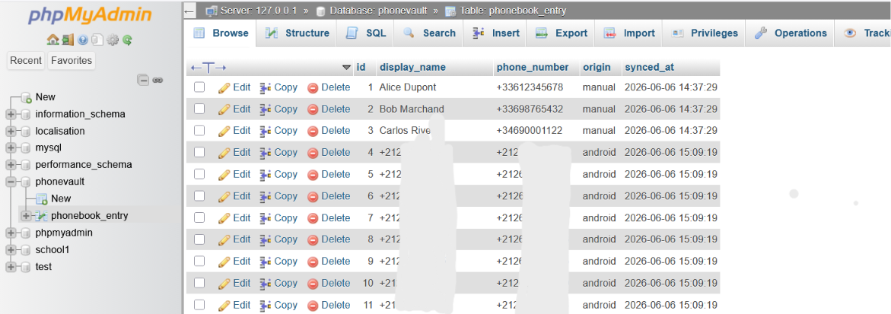

# 📱 PhoneVault — Lab 20 : Application Android connectée à un backend PHP/MySQL

> **Cours :** Programmation Mobile — Android avec Java  
> **Technologie :** Android Studio · PHP · MySQL (XAMPP) · Retrofit2

---

## 📋 Présentation du projet

PhoneVault est une application Android développée dans le cadre du TP 20. Son objectif est de lire les contacts enregistrés dans le téléphone, de les afficher dans une interface moderne, de les synchroniser vers un serveur distant via une API REST, et de permettre une recherche par nom ou numéro dans la base de données.

Le projet est volontairement personnalisé pour se distinguer du template académique : palette de couleurs indigo/teal, design Material 3, avatars circulaires colorés, architecture découplée (Repository pattern côté backend, Adapter dédié côté Android).

---

## 🎯 Objectifs pédagogiques

- Comprendre le rôle de `ContentResolver` pour accéder aux données système Android
- Gérer la permission `READ_CONTACTS` de manière moderne (ActivityResultLauncher)
- Afficher une liste dynamique avec `RecyclerView` et un adapter personnalisé
- Communiquer avec un backend distant via **Retrofit2** et **Gson**
- Insérer, lister et rechercher des données dans une base **MySQL** via **PHP/PDO**

---

## 🖼️ Aperçu de l'application

<div>


<p>load contact from the phone</p>


<p>send contact to server</p>


<p>contact in database</p>

</div>

---

## 🗂️ Architecture du projet

```
lab20/                          ← Projet Android Studio
├── app/src/main/
│   ├── java/com/example/lab20/
│   │   ├── MainActivity.java       ← Activité principale
│   │   ├── PhoneEntry.java         ← Modèle de données (contact)
│   │   ├── ServerResponse.java     ← Modèle de réponse API
│   │   ├── VaultApi.java           ← Interface Retrofit (endpoints)
│   │   ├── ApiClient.java          ← Singleton Retrofit
│   │   └── EntryListAdapter.java   ← Adapter RecyclerView custom
│   └── res/
│       ├── layout/
│       │   ├── activity_main.xml   ← Layout principal
│       │   └── item_contact_card.xml ← Carte contact RecyclerView
│       └── values/
│           ├── colors.xml          ← Palette indigo/teal
│           ├── strings.xml         ← Textes de l'application
│           └── themes.xml          ← Thème Material3 personnalisé

C:/xampp/htdocs/phonevault-api/ ← Backend PHP (dans htdocs XAMPP)
├── config/Database.php             ← Connexion PDO MySQL
├── model/Entry.php                 ← Classe Entry (modèle métier)
├── repository/EntryRepository.php ← CRUD base de données
├── api/
│   ├── push.php                    ← POST : insérer un contact
│   ├── list.php                    ← GET  : lister tous les contacts
│   └── search.php                  ← GET  : rechercher par mot-clé
└── phonevault.sql                  ← Script SQL de configuration
```

---

## 🛠️ Technologies utilisées

| Côté | Technologie |
|------|-------------|
| Android | Java, AndroidX, Material Design 3 |
| Réseau | Retrofit 2.11.0, Gson Converter |
| UI | RecyclerView, CardView, CoordinatorLayout |
| Backend | PHP 8+, PDO |
| Base de données | MySQL (via XAMPP) |
| Serveur local | Apache (XAMPP) |

---

## ⚙️ Installation et configuration

### 1. Prérequis

- [XAMPP](https://www.apachefriends.org/) installé et lancé (Apache + MySQL)
- [Android Studio](https://developer.android.com/studio) installé
- Un émulateur Android configuré **ou** un appareil physique connecté en USB

---

### 2. Configuration de la base de données

1. Ouvrir **phpMyAdmin** → `http://localhost/phpmyadmin`
2. Créer une nouvelle base de données ou importer le script SQL :

```sql
CREATE DATABASE IF NOT EXISTS phonevault
    CHARACTER SET utf8mb4
    COLLATE utf8mb4_unicode_ci;

USE phonevault;

CREATE TABLE IF NOT EXISTS phonebook_entry (
    id           INT          AUTO_INCREMENT PRIMARY KEY,
    display_name VARCHAR(200) NOT NULL,
    phone_number VARCHAR(60)  NOT NULL,
    origin       VARCHAR(60)  DEFAULT 'android',
    synced_at    DATETIME     DEFAULT CURRENT_TIMESTAMP,
    UNIQUE KEY uq_phone (phone_number)
) ENGINE=InnoDB DEFAULT CHARSET=utf8mb4 COLLATE=utf8mb4_unicode_ci;
```

> **Astuce :** Le fichier `phonevault-api/phonevault.sql` contient ce script prêt à l'emploi. Il suffit d'aller dans phpMyAdmin → Importer → sélectionner le fichier.

---

### 3. Configuration du serveur PHP

1. Copier le dossier `phonevault-api/` dans `C:/xampp/htdocs/`
2. Vérifier que le dossier est bien accessible à :  
   `http://localhost/phonevault-api/api/list.php`

La configuration de la base est dans `config/Database.php` :

```php
private string $host     = "localhost";
private string $dbName   = "phonevault";
private string $user     = "root";
private string $password = "";   // laisser vide par défaut avec XAMPP
```

---

### 4. Configuration de l'application Android

Ouvrir le fichier `ApiClient.java` et adapter l'URL selon l'environnement :

```java
// Pour l'émulateur Android Studio :
private static final String BASE_URL = "http:// 192.168.137.1/phonevault-api/api/";

// Pour un appareil physique sur le même réseau Wi-Fi :
private static final String BASE_URL = "http://192.168.X.X/phonevault-api/api/";
//                                                  ↑ IP locale de votre PC
```

> Pour connaître l'IP locale : ouvrir un terminal Windows et taper `ipconfig`, puis chercher **Adresse IPv4** dans la section Wi-Fi.

---

### 5. Dépendances Gradle

Les dépendances suivantes sont déjà déclarées dans `app/build.gradle.kts` :

```kotlin
// Retrofit + Gson
implementation("com.squareup.retrofit2:retrofit:2.11.0")
implementation("com.squareup.retrofit2:converter-gson:2.11.0")

// RecyclerView & CardView
implementation("androidx.recyclerview:recyclerview:1.3.2")
implementation("androidx.cardview:cardview:1.0.0")
```

Faire une synchronisation Gradle : **File → Sync Project with Gradle Files**

---

## ▶️ Lancement de l'application

1. S'assurer que **XAMPP** est lancé (Apache vert + MySQL vert)
2. Lancer l'émulateur ou connecter l'appareil Android
3. Cliquer sur **Run** dans Android Studio (▶)

---

## 🧪 Tests de l'application

### Test 1 — Vérification de la base de données

Ouvrir phpMyAdmin et vérifier que la table `phonebook_entry` existe dans `phonevault`.

### Test 2 — Test des API dans le navigateur

| URL | Résultat attendu |
|-----|-----------------|
| `http://localhost/phonevault-api/api/list.php` | `[]` ou liste JSON |
| `http://localhost/phonevault-api/api/search.php?q=alice` | Résultats filtrés |

Pour tester `push.php`, utiliser **Postman** avec :
- Méthode : `POST`
- URL : `http://localhost/phonevault-api/api/push.php`
- Body (JSON raw) :
```json
{
  "display_name": "Test Contact",
  "phone_number": "+33612345678",
  "origin": "test"
}
```

### Test 3 — Import des contacts

1. Lancer l'application
2. Appuyer sur **Importer les contacts**
3. Résultat attendu : boîte de dialogue de permission → accepter → liste des contacts du téléphone affichée avec avatars colorés

### Test 4 — Synchronisation

1. Après l'import, appuyer sur **Synchroniser vers le cloud**
2. Résultat attendu : Snackbar affichant "✓ X synchronisé(s) | ✗ Y échec(s)"
3. Vérifier dans phpMyAdmin que les contacts sont insérés dans `phonebook_entry`

### Test 5 — Recherche

1. Saisir un prénom ou un numéro dans le champ de recherche
2. Appuyer sur **Chercher** ou touche Entrée du clavier
3. Résultat attendu : liste filtrée avec les contacts correspondants

---

## 🔍 Résolution des problèmes courants

| Problème | Cause probable | Solution |
|----------|---------------|----------|
| Erreur réseau | Mauvaise URL dans `ApiClient.java` | Vérifier l'IP et remplacer ` 192.168.137.1` par l'IP locale si sur appareil réel |
| `usesCleartextTraffic` | HTTP bloqué sur Android >= 9 | Déjà activé dans `AndroidManifest.xml` |
| Contacts vides | Pas de contacts sur l'émulateur | Ajouter des contacts manuellement dans l'app Contacts de l'émulateur |
| Erreur 500 PHP | Base non créée ou mal configurée | Vérifier que `phonevault.sql` est bien importé dans phpMyAdmin |
| `Column index -1` | Colonne introuvable dans le Cursor | Déjà géré avec vérification `< 0` dans `loadDeviceContacts()` |
| Doublons en base | Même numéro envoyé plusieurs fois | Géré côté SQL avec `ON DUPLICATE KEY UPDATE` |

---

## 🏗️ Points techniques remarquables

### Côté Android
- **`ActivityResultLauncher`** : gestion moderne des permissions (remplace `onRequestPermissionsResult`)
- **`AtomicInteger`** : comptage thread-safe du résultat de synchronisation
- **`Snackbar`** à la place des Toast pour un feedback plus moderne
- **Avatar coloré** avec cycle de 5 couleurs et initiale du nom
- **`projection` explicite** dans `ContentResolver.query()` pour de meilleures performances

### Côté PHP
- **PDO** avec requêtes préparées → protège contre l'injection SQL
- **`ON DUPLICATE KEY UPDATE`** → évite les doublons sur le numéro de téléphone
- **`preg_replace`** sur le numéro → normalisation des espaces à l'insertion
- **Headers CORS** (`Access-Control-Allow-Origin: *`) → compatibilité avec différents clients
- **Architecture Repository** → séparation propre entre logique métier et accès aux données

---

## 📌 Conclusion

PhoneVault est une application Android complète qui démontre comment faire dialoguer un smartphone avec un backend distant. Le projet couvre la gestion des permissions, l'accès aux données système via `ContentResolver`, l'affichage dans un RecyclerView personnalisé, et la communication HTTP asynchrone avec Retrofit. Côté serveur, le backend PHP/MySQL illustre l'architecture en couches et l'utilisation sécurisée de PDO.

---

*Projet réalisé dans le cadre du module Programmation Mobile — Android avec Java.*
