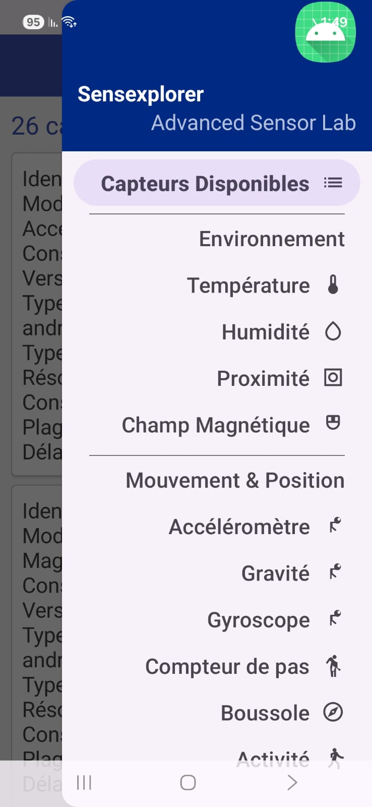
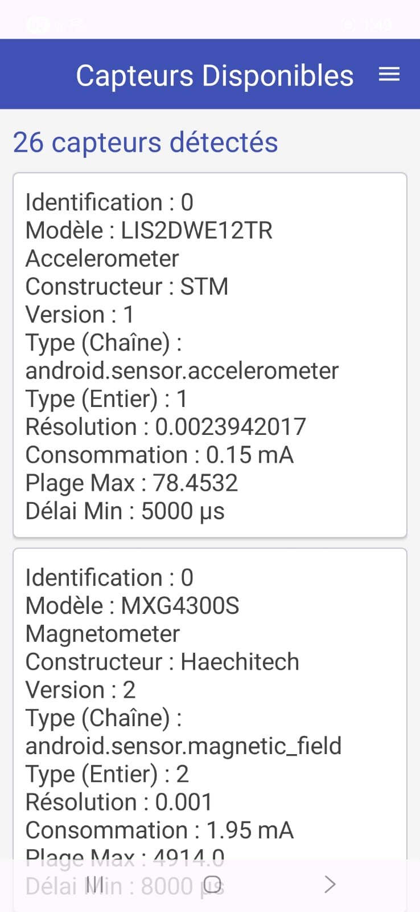
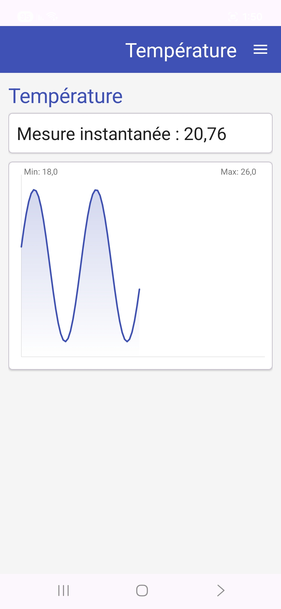
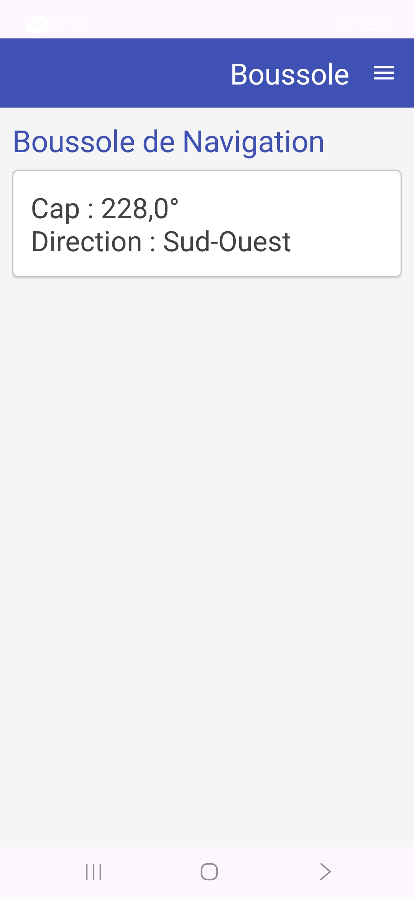
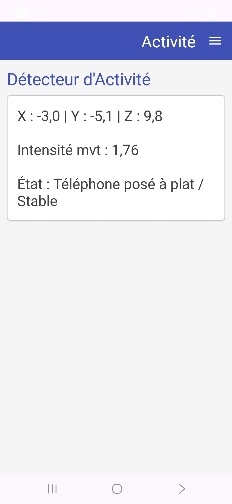

# Sensexplorer - Laboratoire Avancé sur les Capteurs Android

Bienvenue dans **Sensexplorer**, une application moderne conçue pour illustrer l'exploration et l'utilisation experte des capteurs intégrés dans les smartphones Android. 
Ce projet a été réalisé dans le cadre académique, avec une interface graphique améliorée (Material Design 3) et un code modulaire pour une maintenance optimale.

---

## 🎯 Objectifs

L'objectif principal de cette application est de démontrer l'exploitation des capacités sensorielles d'un smartphone. Les sous-objectifs incluent :
- **Découverte** : Lister tous les capteurs matériels disponibles et leurs capacités techniques.
- **Visualisation** : Afficher un graphique temporel en temps réel pour divers capteurs (Température, Humidité, Proximité, Magnétisme).
- **Cinématique** : Analyser les mouvements bruts via l'accéléromètre, le gyroscope, et la gravité.
- **Orientation** : Déterminer la position du téléphone dans l'espace avec une boussole numérique calculée.
- **Suivi d'Activité** : Utiliser un podomètre matériel et un algorithme d'inférence maison pour détecter le type de mouvement de l'utilisateur (saut, marche, repos).

---

## 📖 Concepts des Capteurs

Dans l'écosystème Android, l'accès aux capteurs se fait principalement via le `SensorManager`. Les capteurs se divisent en plusieurs catégories :
1. **Capteurs d'environnement** : Mesurent l'humidité, la luminosité, la pression atmosphérique et la température ambiante (ex: `TYPE_AMBIENT_TEMPERATURE`, `TYPE_RELATIVE_HUMIDITY`).
2. **Capteurs de mouvement** : Mesurent l'accélération et la rotation (ex: `TYPE_ACCELEROMETER`, `TYPE_GYROSCOPE`, `TYPE_GRAVITY`).
3. **Capteurs de position** : Déterminent l'orientation du dispositif dans l'espace (ex: `TYPE_MAGNETIC_FIELD`, `TYPE_PROXIMITY`).

Chaque capteur fournit des données via des événements interceptés par l'interface `SensorEventListener`.

---

## 🏗 Architecture et Organisation

Afin de garantir un code maintenable et d'éviter les `MainActivity` monolithiques, le projet est organisé en trois sous-packages :

* `fragments/` : Contient les différentes vues de l'application (Overview, Kinematics, LiveChart, Pedometer, Compass, ActionDetector).
* `utils/` : Contient les classes d'aide (`MathFilter` pour le lissage des données et `SensorDetailHelper` pour le formatage).
* `views/` : Contient les composants graphiques personnalisés, notamment `DynamicCurveView` qui génère la courbe sans bibliothèques externes.

L'application repose sur un `DrawerLayout` et une `NavigationView` permettant de basculer facilement d'un fragment à l'autre.

---

## 🚀 Installation et Exécution

### Prérequis
- Android Studio Koala (ou supérieur).
- Un appareil Android physique (recommandé) sous Android 10 (API 29) ou supérieur, ou un émulateur.

### Étapes
1. **Cloner ou décompresser** le projet dans le dossier de votre choix.
2. Ouvrez Android Studio et cliquez sur **Open**, puis sélectionnez le dossier du projet.
3. Patientez pendant que **Gradle** synchronise les dépendances.
4. Sélectionnez votre téléphone ou l'émulateur dans la barre supérieure.
5. Cliquez sur le bouton **Run** (Triangle vert) ou utilisez le raccourci `Shift + F10`.

---

## 🛠 Utilisation de chaque Capteur

- **Capteurs Disponibles** : Écran d'accueil listant toutes les puces du téléphone, avec leur fabricant, consommation, et délai de rafraîchissement.
- **Environnement (Température, Humidité, Proximité)** : Affiche la valeur et trace l'historique récent sur le graphe. Si le capteur n'est pas présent (ex: émulateur), une simulation sinusoïdale s'active automatiquement.
- **Champ Magnétique** : Trace la norme euclidienne ($$\sqrt{x^2 + y^2 + z^2}$$) du champ magnétique environnant. Approchez un aimant pour voir le pic.
- **Accéléromètre, Gravité, Gyroscope** : Affiche en temps réel les coordonnées X, Y, Z. L'accéléromètre contient la gravité, tandis que le capteur "Gravité" l'isole.
- **Compteur de pas** : Lit le capteur podomètre matériel. Requiert la permission *Activité physique*.
- **Boussole** : Fusionne l'accéléromètre et le magnétomètre (via `getRotationMatrix`) pour obtenir l'Azimut et l'orientation cardinale (Nord, Sud, etc.).
- **Activité** : Utilise l'accéléromètre couplé à un filtre passe-bas (`MathFilter`) pour supprimer la gravité, puis applique des heuristiques statistiques (moyenne, écart-type, variance) pour deviner l'action en cours.

---

## 📸 Captures d'Écran

Navigation Drawer

Accueil

Graphique Température

Boussole

---

## 🧪 Instructions de Test

Pour vérifier le bon fonctionnement de l'application :
1. **Tester sur émulateur** : Ouvrez les fenêtres de paramètres de l'émulateur (Extended controls > Virtual sensors) pour faire varier artificiellement les données de l'accéléromètre, de la lumière, etc. Vérifiez que l'application réagit.
2. **Capteur manquant** : Allez sur l'onglet "Température" dans l'émulateur. Un message "Mode simulation activé" doit apparaître et une courbe mathématique doit se dessiner.
3. **Mouvement** : Prenez un téléphone physique en main, et essayez de secouer, de sauter, ou de poser l'appareil à plat. Vérifiez la rubrique "Activité".

---

## ⚠️ Problèmes Courants et Solutions

- **Les pas ne s'affichent pas / "Permission refusée"** : 
  - *Solution* : Android 10+ requiert l'autorisation d'accès à l'activité physique. Assurez-vous d'avoir accepté la pop-up de permission lors du premier lancement du podomètre.
- **Le graphique de température est vide sur téléphone physique** :
  - *Solution* : La majorité des téléphones grand public ne possèdent plus de thermomètre ambiant. Ce comportement est attendu.
- **La boussole indique toujours le Nord avec de fausses valeurs** :
  - *Solution* : Vous devez calibrer la boussole de votre téléphone en réalisant un mouvement en "8" avec l'appareil en main.

---

## 🏁 Conclusion

Cette implémentation va au-delà du TP original en proposant une véritable structuration par Fragments, une injection de vues Material Design élégantes, et la création de classes utilitaires (`SensorDetailHelper`, `MathFilter`) favorisant la réutilisabilité du code. L'exploration sensorielle est rendue plus fluide, ludique et professionnelle.
