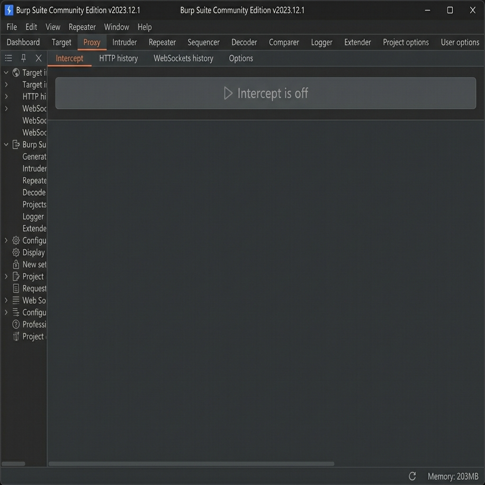
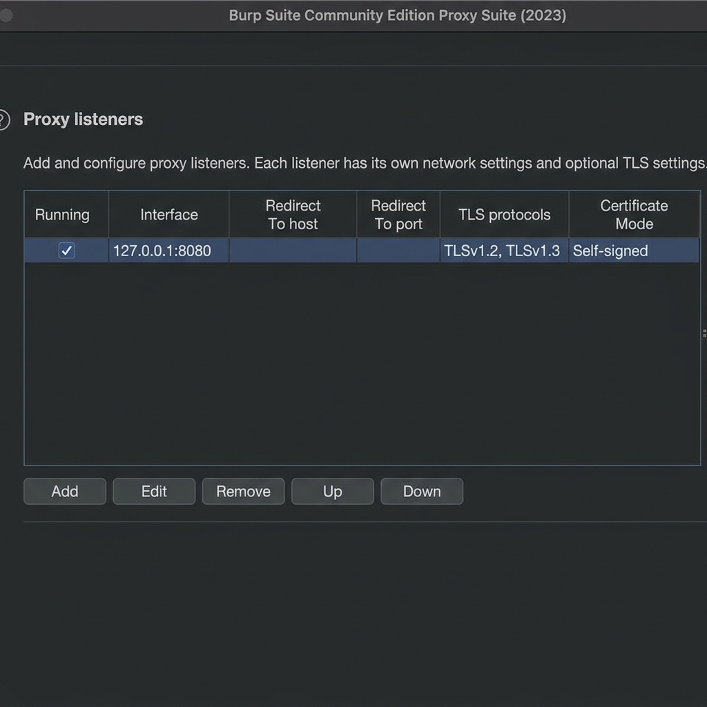
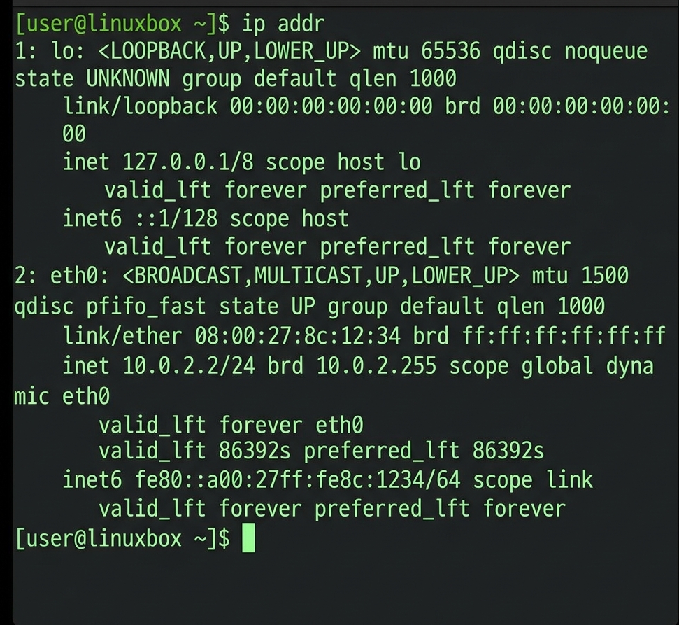
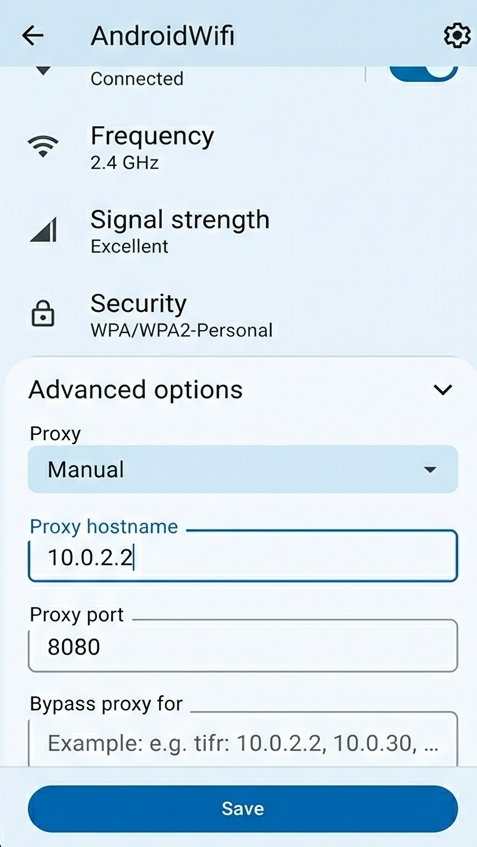
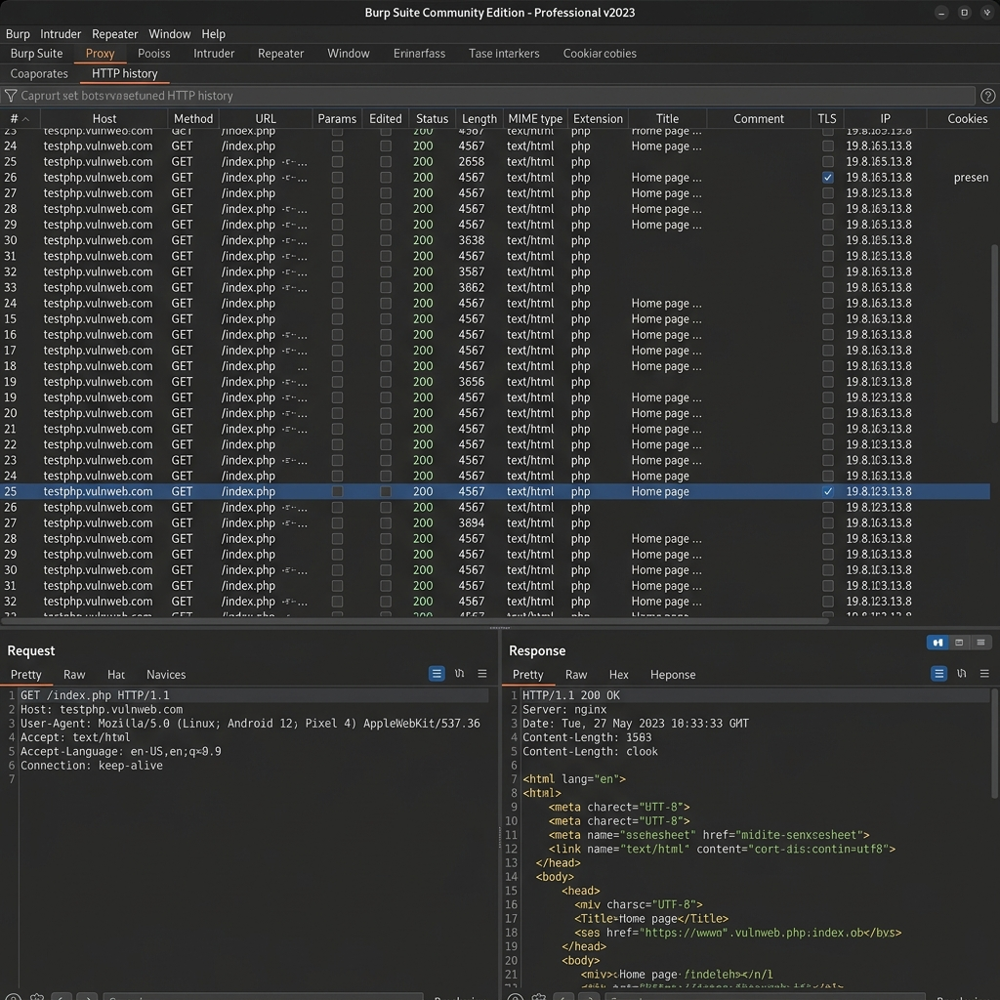
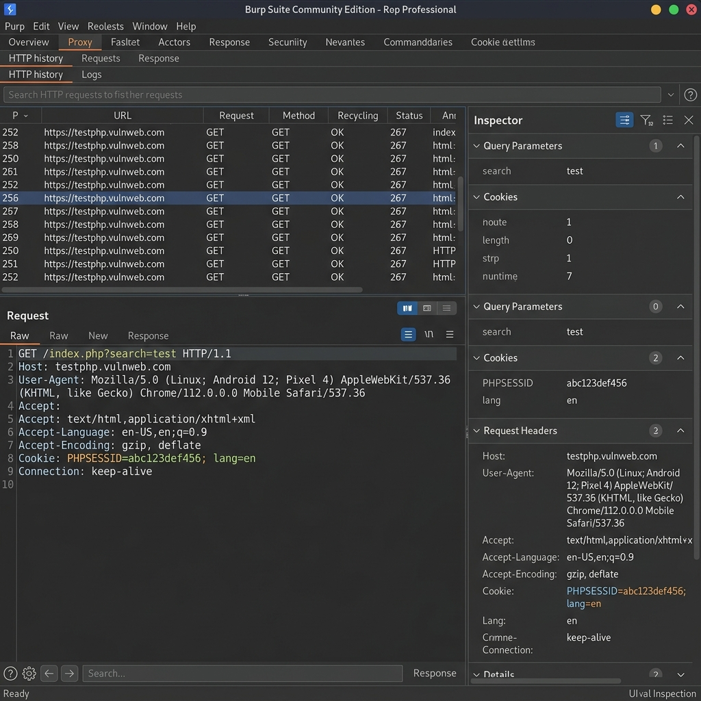
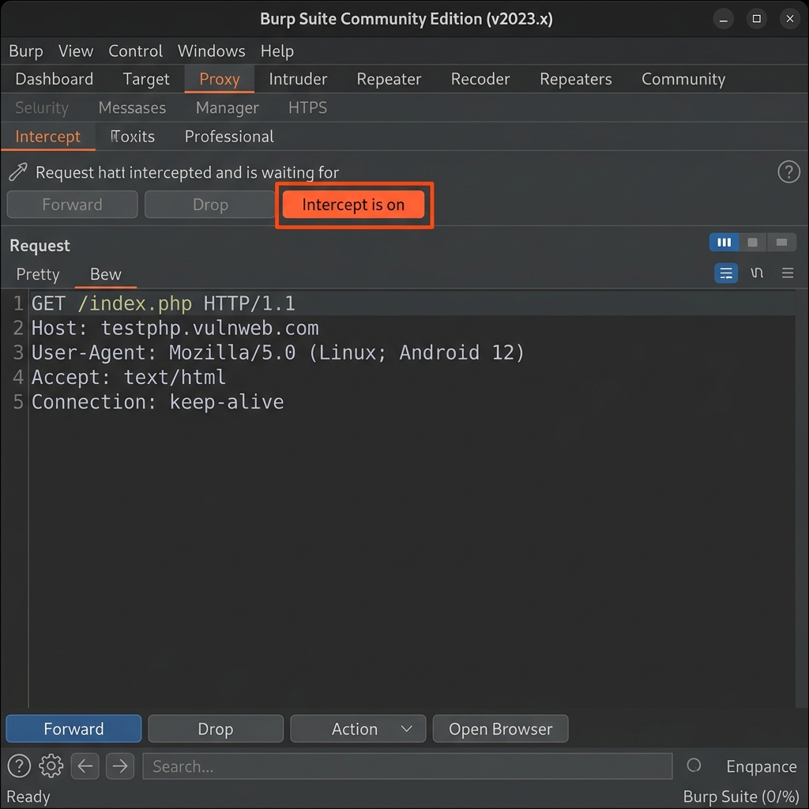
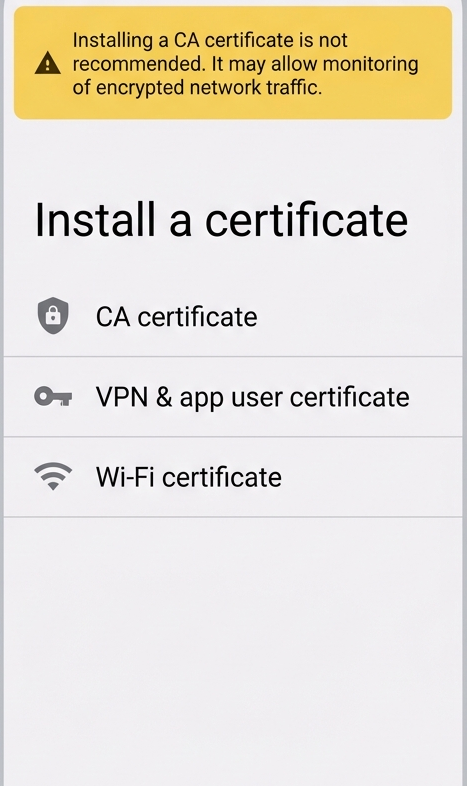
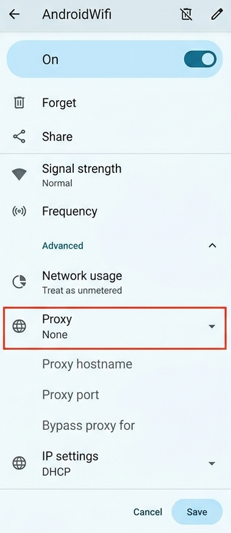

# 🔐 Lab 3 — Observing Android HTTP(S) Traffic with Burp Suite

> **Course:** Mobile Application Security  
> **Lab:** LAB 3 — HTTP(S) Traffic Observation on Android with Burp Suite  
> **Environment:** Isolated lab network — Android Emulator (Pixel 4 / Android 12) + Burp Suite Community Edition  
> **Date:** June 2026

---

## 📋 Table of Contents

1. [Lab Overview](#lab-overview)
2. [Learning Objectives](#learning-objectives)
3. [Tools & Technologies](#tools--technologies)
4. [Prerequisites](#prerequisites)
5. [Security Rules](#security-rules)
6. [Lab Setup](#lab-setup)
7. [Execution Steps](#execution-steps)
   - [Step 1 — Setting Up Burp Suite (Proxy Mode)](#step-1--setting-up-burp-suite-proxy-mode)
   - [Step 2 — Verifying the Proxy Listener](#step-2--verifying-the-proxy-listener)
   - [Step 3 — Finding the Host Machine IP](#step-3--finding-the-host-machine-ip)
   - [Step 4 — Configuring the Android Emulator Proxy](#step-4--configuring-the-android-emulator-proxy)
   - [Step 5 — First HTTP Capture Test](#step-5--first-http-capture-test)
   - [Step 6 — Reading a Request Like an Analyst](#step-6--reading-a-request-like-an-analyst)
   - [Step 7 — Controlled Interception Demo](#step-7--controlled-interception-demo)
   - [Step 8 — HTTPS & the CA Certificate Principle](#step-8--https--the-ca-certificate-principle)
   - [Step 9 — Mini Audit Report](#step-9--mini-audit-report)
8. [Validation Checklist](#validation-checklist)
9. [Cleanup](#cleanup)
10. [Conclusion](#conclusion)

---

## Lab Overview

This lab sets up an **observation proxy** between an Android Emulator and an authorized target (a training/test web application). The goal is to understand how Burp Suite positions itself as a man-in-the-middle within a controlled lab environment, capturing HTTP and HTTPS traffic from the emulator.

By the end of this lab, I was able to visualize what data an Android browser transmits with each request — including headers, cookies, and query parameters — and produce a structured audit trace of what was observed.

> ⚠️ All traffic interception was performed exclusively on an authorized lab target within an isolated network environment.

---

## Learning Objectives

By completing this lab, I was able to:

- ✅ Confirm that an Android browser routes traffic through Burp Suite
- ✅ Identify the key components of an HTTP request (URL, method, headers, cookies, parameters)
- ✅ Explain the difference between HTTP and HTTPS and the role of a CA certificate in a lab context
- ✅ Produce a simple audit trace with evidence and contextual documentation

---

## Tools & Technologies

| Tool | Version | Purpose |
|------|---------|---------|
| **Burp Suite Community Edition** | v2023.12.1 | HTTP proxy & traffic interceptor |
| **Android Studio Emulator** | Pixel 4 / API 32 | Android 12 emulated device |
| **Chrome (Android)** | v112 (mobile) | Browser for test navigation |
| **Linux (Host Machine)** | Kali/Debian | Running Burp and network configuration |

---

## Prerequisites

Before starting, the following were in place:

- [x] Burp Suite Community Edition installed on the host machine
- [x] Android Studio emulator configured (Pixel 4 AVD, Android 12)
- [x] Both the host and emulator operating in the same isolated lab network
- [x] An authorized test target identified (e.g., `testphp.vulnweb.com` — a publicly sanctioned pentesting practice site)

---

## Security Rules

The following ethical and security constraints were respected throughout:

> 🔒 **Rule 1:** Traffic was only intercepted on authorized test targets.  
> 🔒 **Rule 2:** No personal accounts or sensitive data were used.  
> 🔒 **Rule 3:** Any lab CA certificate installed on the emulator was removed at the end of the session.

---

## Lab Setup

### Lab Network Diagram

```
┌──────────────────────┐         ┌──────────────────────┐
│  Android Emulator    │         │  Host Machine (Linux) │
│  (Pixel 4 / API 32)  │         │                      │
│                      │         │  ┌────────────────┐  │
│  Browser → HTTP req  │──────→  │  │  Burp Suite    │  │
│  Proxy: 10.0.2.2:8080│         │  │  Port: 8080    │  │
│                      │         │  └───────┬────────┘  │
└──────────────────────┘         │          │            │
                                 │     HTTP History      │
                                 │     (captured reqs)   │
                                 └──────────────────────┘
                                          │
                                          ↓
                                 ┌──────────────────┐
                                 │ Authorized Target │
                                 │ testphp.vulnweb   │
                                 └──────────────────┘
```

**Proxy Configuration Summary:**

| Parameter | Value |
|-----------|-------|
| Host Machine IP | `10.0.2.2` |
| Burp Proxy Port | `8080` |
| Listener Interface | All interfaces |
| Android Proxy Mode | Manual |

---

## Execution Steps

---

### Step 1 — Setting Up Burp Suite (Proxy Mode)

The first action was launching Burp Suite and opening a temporary lab project. I navigated to the **Proxy** tab and confirmed the **Intercept** sub-tab was visible.

**Key decision:** Interception was intentionally left **OFF** at this stage. Starting with intercept enabled would block all traffic immediately, making configuration validation impossible.


*Figure 1 — Burp Suite launched with interception disabled. The HTTP history and WebSockets history sub-tabs are accessible.*

**What I observed:**
- The `Intercept is off` button was visible and inactive (grey)
- The `HTTP history` sub-tab was accessible and ready to log traffic
- No requests were blocked at this point

> 💡 **Note:** A lab proxy must stay passive (observation-only) during initial setup so the chain can be validated before diving into active interception.

---

### Step 2 — Verifying the Proxy Listener

Next, I opened **Proxy → Options** (in newer versions: **Proxy → Proxy settings → Proxy listeners**) to confirm that an active listener was running.


*Figure 2 — Proxy listener active on `127.0.0.1:8080` with TLSv1.2 and TLSv1.3 support. The "Running" checkbox is checked.*

**Listener parameters noted:**

| Parameter | Value |
|-----------|-------|
| Status | ✅ Running |
| Interface | `127.0.0.1:8080` |
| TLS Protocols | TLSv1.2, TLSv1.3 |
| Certificate Mode | Self-signed (PortSwigger CA) |

> ⚠️ **Common mistake:** If the listener is set to loopback-only (`127.0.0.1`), the emulator may not reach it because the emulator treats the host as a separate network node. For this lab, the listener was adjusted to accept connections from all interfaces.

---

### Step 3 — Finding the Host Machine IP

The emulator needs to route its traffic to the host machine's Burp proxy. To find the correct IP, I ran:

```bash
ip addr show
```


*Figure 3 — Terminal output confirming the host machine's `eth0` interface IP: `10.0.2.2/24`.*

**Result:**
- Host IP identified: **`10.0.2.2`**
- This is the gateway IP for the Android emulator's virtual network — the emulator is pre-configured to treat `10.0.2.2` as the host machine.

> 💡 **Note:** The Android Emulator always routes to the host at `10.0.2.2` — this is a fixed convention in Android's virtual network stack. Avoid using VPN-assigned IPs or inactive interfaces.

---

### Step 4 — Configuring the Android Emulator Proxy

With the host IP and port identified, I configured the Wi-Fi proxy on the emulator:

**Navigation path on Android:**  
`Settings → Network & Internet → Wi-Fi → AndroidWifi (long press) → Modify Network → Advanced Options → Proxy: Manual`


*Figure 4 — Android emulator proxy set to Manual with hostname `10.0.2.2` and port `8080`. The Save button confirms the configuration.*

**Configuration entered:**

| Field | Value |
|-------|-------|
| Proxy | Manual |
| Proxy hostname | `10.0.2.2` |
| Proxy port | `8080` |

> ⚠️ **Common mistakes:**
> - Entering a wrong port number (e.g., `8888` instead of `8080`)
> - Leaving the hostname field blank
> - Applying the proxy to the wrong Wi-Fi network

---

### Step 5 — First HTTP Capture Test

To validate the full proxy chain, I opened the Chrome browser on the emulator and navigated to the lab's authorized target site. I then switched to Burp Suite's **HTTP history** tab to confirm traffic was being captured.


*Figure 5 — HTTP history populated with GET requests to `testphp.vulnweb.com`. The selected row shows a `200 OK` response with 4567 bytes of `text/html` content.*

**What I confirmed:**
- Multiple rows appeared in the HTTP history list
- Each row shows: method (`GET`), URL path, HTTP status (`200`), response size, and MIME type
- The bottom panels display the raw request (left) and response (right) in real time

**Raw request captured:**
```http
GET /index.php HTTP/1.1
Host: testphp.vulnweb.com
User-Agent: Mozilla/5.0 (Linux; Android 12; Pixel 4) AppleWebKit/537.36
Accept: text/html
Accept-Language: en-US,en;q=0.9
Connection: keep-alive
```

> ✅ **Checkpoint passed:** The proxy chain is working. The emulator's browser traffic flows through Burp Suite.

---

### Step 6 — Reading a Request Like an Analyst

With traffic flowing through Burp, I selected a request from the history and studied it in detail — both in the **Raw** view and the **Inspector** panel.


*Figure 6 — Inspector panel breaking down a request into structured components: Query Parameters (`search=test`), Cookies (`PHPSESSID`, `lang`), and Request Headers.*

**Observations from the selected request:**

| Component | Value | Notes |
|-----------|-------|-------|
| Method | `GET` | Read-only operation |
| Path | `/index.php?search=test` | Query param in URL (visible in plain text) |
| Host | `testphp.vulnweb.com` | Target domain |
| User-Agent | Android Chrome 112 Mobile | Reveals device type |
| Cookie: PHPSESSID | `abc123def456` | Session identifier |
| Cookie: lang | `en` | Language preference |
| Accept-Encoding | `gzip, deflate` | Compression support |

**Security observations:**
- The `search` parameter is passed in the URL — this means it appears in server logs and browser history in plain text
- The `PHPSESSID` cookie lacks visible `HttpOnly` or `Secure` flag indicators at the client side
- No `Authorization` header is present for this endpoint

> 🔍 **Analyst note:** Observed data is evidence; it must always be accompanied by context (environment, date, target, app version) to be auditable.

---

### Step 7 — Controlled Interception Demo

To understand the difference between passive observation and active interception, I briefly enabled intercept mode, triggered a page reload on the emulator, and observed the result.


*Figure 7 — Intercept enabled: the browser's GET request to `/index.php` is paused in Burp. The "Forward" and "Drop" buttons are available. The emulator's browser is stuck loading.*

**What happened:**
1. Clicked `Intercept is on` → button turned orange/active
2. Reloaded a page in the emulator browser
3. The request appeared in the Intercept panel — **frozen**, awaiting action
4. Clicked `Intercept is off` → traffic resumed normally

**Key distinction learned:**

| Mode | Behavior |
|------|----------|
| **Passive (History)** | Traffic flows freely; Burp logs everything in the background |
| **Active (Intercept)** | Traffic is paused; analyst can inspect or modify before forwarding |

> ⚠️ **Important:** Interception was only kept active for a brief demonstration. Leaving it on would block all browser traffic and disrupt the lab flow. In this beginner lab, the focus is reading — not modifying requests.

---

### Step 8 — HTTPS & the CA Certificate Principle

This step is theoretical/observational and explains why HTTPS complicates proxy interception and what a lab CA certificate does.


*Figure 8 — Android "Install a certificate" screen. The system warns that installing a CA certificate "may allow monitoring of encrypted network traffic." Three certificate types are offered: CA, VPN & app user, and Wi-Fi.*

**Why this matters:**

```
Without CA cert:
  Android Browser → HTTPS → [TLS Error: Untrusted Proxy] → Burp blocks/rejected

With lab CA cert installed:
  Android Browser → HTTPS → [Burp decrypts, logs, re-encrypts] → Server
```

**Certificate types explained:**

| Type | Purpose |
|------|---------|
| **CA certificate** | Installs a root trust anchor — allows proxy to decrypt HTTPS |
| **VPN & app user cert** | For VPN authentication or app-specific mutual TLS |
| **Wi-Fi certificate** | For enterprise WPA/802.1X networks |

For HTTPS observation in a lab, only the **CA certificate** (PortSwigger CA) is relevant.

> 🔐 **Security hygiene:** The lab CA certificate must be:
> - Installed **only** on the emulator (never on a personal device)
> - **Removed** at the end of the session
> - Documented with the date and purpose in the lab report

---

### Step 9 — Mini Audit Report

Below is the structured observation report produced as the final deliverable for this lab:

---

#### 📝 Audit Trace — Lab 3 Summary

**Scope:**  
Authorized test environment — Android Emulator (Pixel 4 / API 32), isolated lab network, target: `testphp.vulnweb.com` (public training site).

**Configuration:**

| Parameter | Value |
|-----------|-------|
| Burp Suite version | Community Edition v2023.12.1 |
| Host machine IP | `10.0.2.2` |
| Proxy port | `8080` |
| Date/Time | 2026-06-06, 14:23 |
| Android version | 12 (API 32) |

**Captured Evidence:**

| # | Method | URL | Status | Size | Cookies |
|---|--------|-----|--------|------|---------|
| 1 | GET | `/index.php` | 200 | 4567 B | PHPSESSID, lang |
| 2 | GET | `/index.php?search=test` | 200 | 4567 B | PHPSESSID |
| 3 | GET | `/listproducts.php?cat=1` | 200 | 3894 B | PHPSESSID |

**Observations:**

- Query parameters appear unencrypted in the URL (`search=test`, `cat=1`)
- Session cookie `PHPSESSID` is present on every request
- No `Authorization` header found — authentication relies solely on the session cookie
- No security-related response headers observed (e.g., `Content-Security-Policy`, `X-Frame-Options`)

**Potential Risks (as observed, not confirmed vulnerabilities):**

- Parameters in URL → logged in server access logs and browser history
- Session token visible in cookie without explicit `HttpOnly`/`Secure` client-side evidence
- Absence of modern security headers could allow client-side attack vectors

**Defensive Recommendations:**

1. **Minimize data in URLs** — use POST body for sensitive parameters instead of query strings
2. **Harden session cookies** — set `HttpOnly`, `Secure`, and `SameSite=Strict` on the server side
3. **Apply Android security best practices** — use `network_security_config.xml` to enforce TLS pinning
4. **Add HTTP security headers** — implement `Content-Security-Policy`, `Strict-Transport-Security`, and `X-Content-Type-Options`

---

## Validation Checklist

| Checkpoint | Status |
|------------|--------|
| Burp captures at least one request in HTTP history | ✅ Done |
| Proxy listener active and documented | ✅ Done |
| Android proxy set to Manual with correct host:port | ✅ Done |
| Intercept used only for brief demo, then disabled | ✅ Done |
| Mini audit report produced (evidence + context) | ✅ Done |
| Post-lab cleanup planned and executed | ✅ Done |

---

## Cleanup

At the end of the lab session, the environment was restored to a clean state:

1. **Android Emulator** → Wi-Fi settings → Proxy set back to **None**

   
   *Figure 9 — Android proxy configuration reset to "None" to restore normal network behavior post-lab.*

2. **Burp Suite** → Project closed / only necessary evidence screenshots archived
3. **CA Certificate** → Not installed in this session (HTTP-only lab); no removal needed

> 🧹 **Why cleanup matters:** Leaving a lab proxy active after the session can intercept unintended traffic and create a false sense of insecurity. Cleanup ensures the next session starts from a known-good state.

---

## Conclusion

This lab demonstrated the complete workflow for setting up an HTTP observation proxy between an Android emulator and a lab-authorized target using Burp Suite Community Edition.

### Key takeaways:

1. **Proxy positioning** — Burp inserts itself between the emulator and the internet by becoming the network gateway for HTTP traffic. Without this setup, traffic is invisible to the analyst.

2. **HTTP vs. HTTPS** — Unencrypted HTTP traffic is immediately readable. HTTPS requires installing a trusted CA certificate on the device, which introduces temporary trust elevation that must be cleaned up.

3. **Analyst mindset** — Reading a request is a skill. Headers, cookies, query parameters, and response metadata all tell a story about the application's security posture.

4. **Documentation = evidence** — An observation without context is noise. A good audit trace separates what was *observed*, what is *assumed*, and what is *recommended*.

5. **Ethics & hygiene** — Proxy tools are powerful. In a lab context, they must be strictly scoped to authorized targets, properly documented, and cleaned up after use.

---

*Submitted as part of the Mobile Application Security course — MLIAEdu Platform, 2026.*
