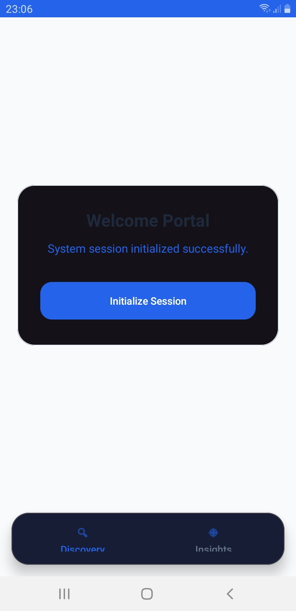
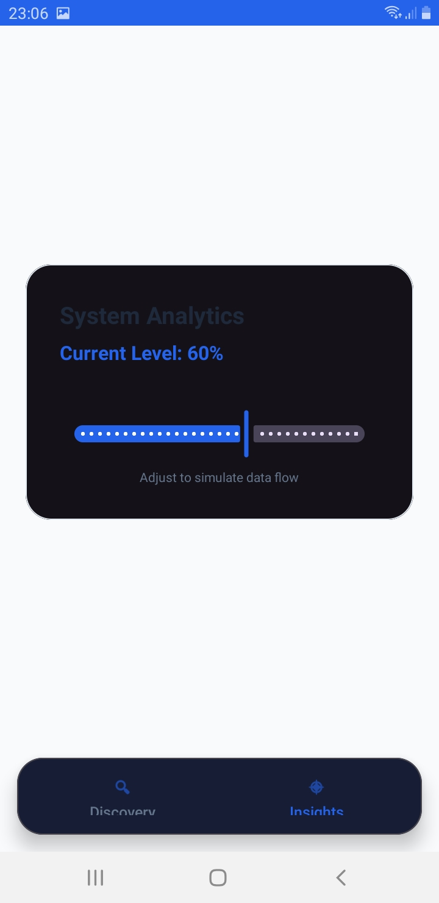

# Lab 4 - Gestion des Fragments Dynamiques

Ce projet Android illustre l'utilisation des fragments dynamiques, la navigation entre eux et la gestion de leur cycle de vie.

## Objectifs du projet
- Créer et utiliser des fragments dynamiques dans une activité.
- Naviguer entre plusieurs fragments avec `FragmentManager`.
- Gérer les événements et les états dans les fragments (clics, SeekBar, etc.).
- Comprendre le cycle de vie d'un fragment et la sauvegarde d'état (`onSaveInstanceState`).

## Fonctionnalités
- **Fragment 1** : Contient un bouton qui met à jour un texte de bienvenue.
- **Fragment 2** : Contient une `SeekBar` dont la valeur est affichée en temps réel et conservée lors de la rotation de l'écran.
- **Navigation** : Deux boutons en bas de l'écran permettent de basculer entre les deux fragments en utilisant des transactions de fragments.

## Captures d'écran

| Fragment 1 | Fragment 2 |
| :---: | :---: |
|  |  |

## Structure du projet
- `MainActivity.java` : Gère le remplacement des fragments et la pile de retour.
- `FragmentOne.java` : Logique du premier fragment.
- `FragmentTwo.java` : Logique du deuxième fragment avec gestion de la `SeekBar`.
- `res/layout/` : Fichiers XML définissant l'interface utilisateur.
