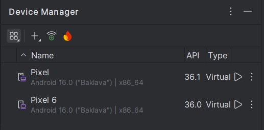
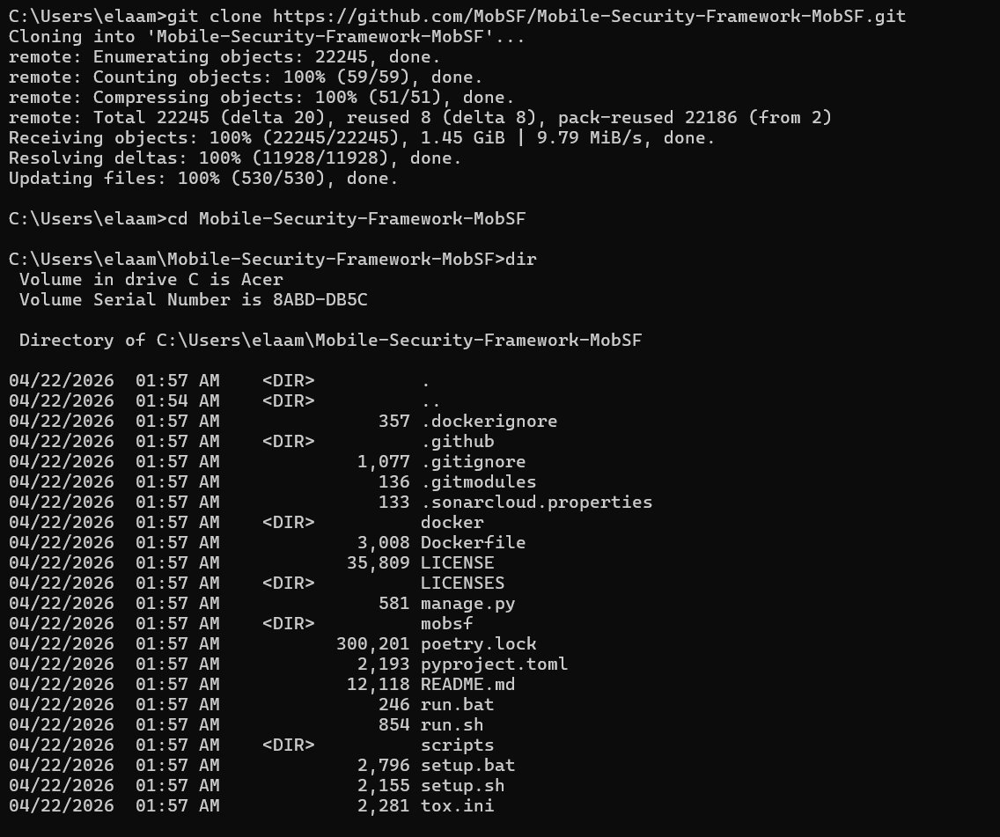
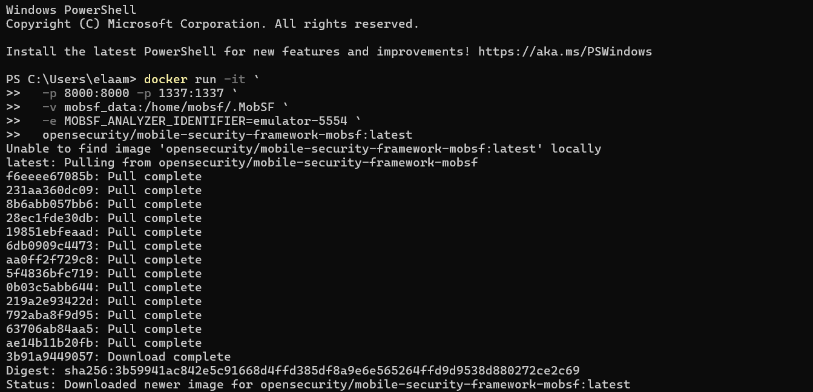
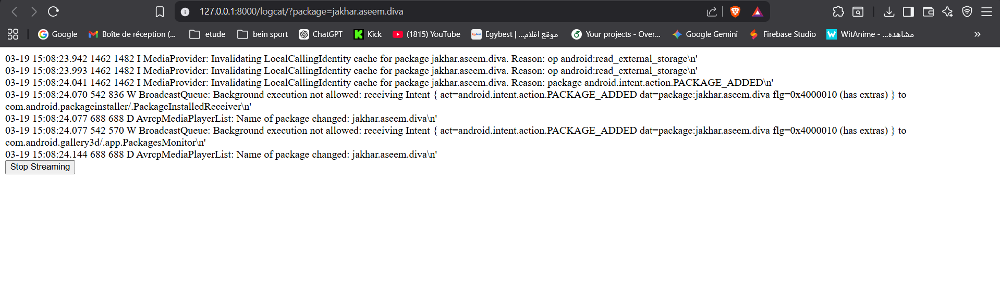
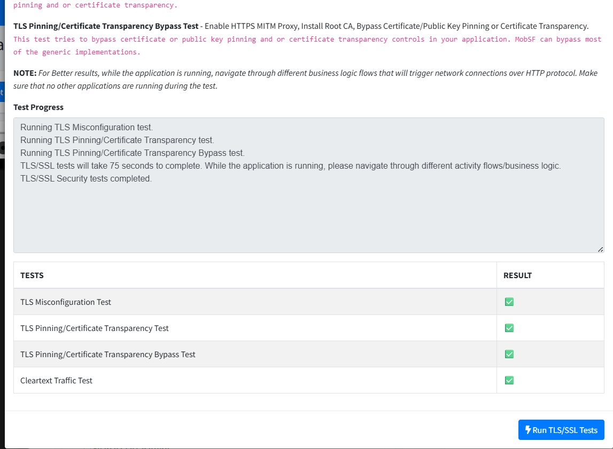
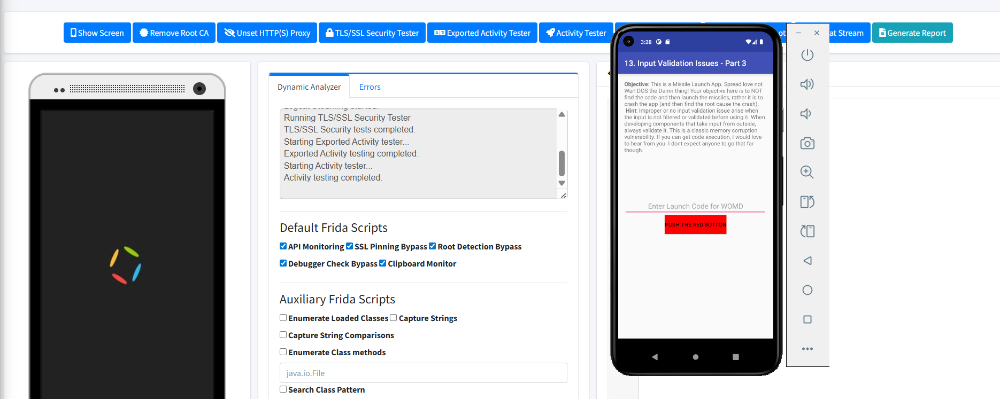
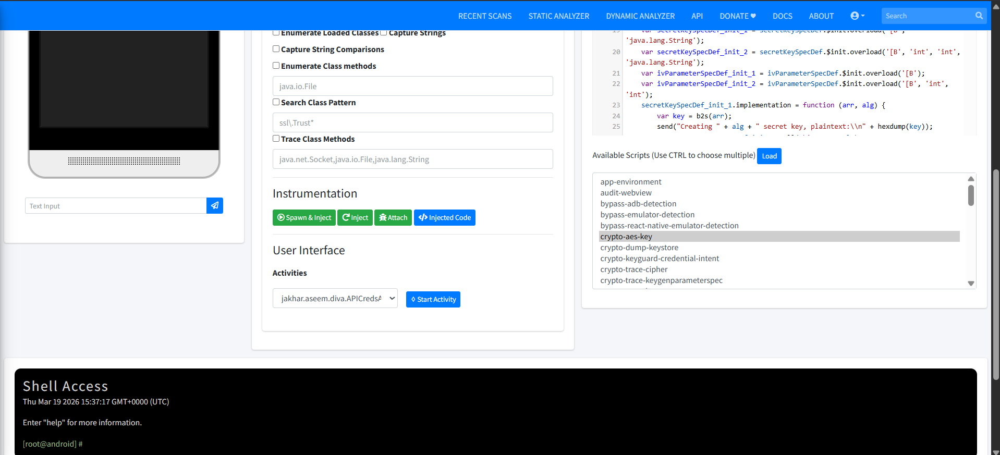
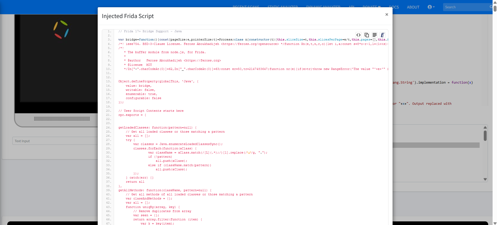

# 🔍 Lab 7 — Runtime Security Analysis of Android Apps with MobSF

> **Course:** Mobile Application Security  
> **Tool:** Mobile Security Framework (MobSF) · Docker · Android Emulator · Frida  
> **Target APK:** DIVA — Damn Insecure and Vulnerable App  

---

## 📋 Table of Contents

1. [Overview](#overview)
2. [Learning Objectives](#learning-objectives)
3. [Environment & Prerequisites](#environment--prerequisites)
4. [Lab Walkthrough](#lab-walkthrough)
   - [Step 1 — Verifying Docker Desktop](#step-1--verifying-docker-desktop)
   - [Step 2 — Preparing the Android Emulator](#step-2--preparing-the-android-emulator)
   - [Step 3 — Cloning MobSF Repository](#step-3--cloning-mobsf-repository)
   - [Step 4 — Pulling & Launching MobSF via Docker](#step-4--pulling--launching-mobsf-via-docker)
   - [Step 5 — MobSF Startup & Server Initialization](#step-5--mobsf-startup--server-initialization)
   - [Step 6 — Static Analysis of the DIVA APK](#step-6--static-analysis-of-the-diva-apk)
   - [Step 7 — Dynamic Analyzer & Frida Instrumentation](#step-7--dynamic-analyzer--frida-instrumentation)
   - [Step 8 — Real-Time Logcat Monitoring](#step-8--real-time-logcat-monitoring)
   - [Step 9 — TLS/SSL Security Testing](#step-9--tlsssl-security-testing)
   - [Step 10 — In-Emulator App Interaction](#step-10--in-emulator-app-interaction)
   - [Step 11 — Loading Auxiliary Frida Scripts](#step-11--loading-auxiliary-frida-scripts)
   - [Step 12 — Spawn, Inject & Activity Targeting](#step-12--spawn-inject--activity-targeting)
   - [Step 13 — Viewing the Injected Frida Script](#step-13--viewing-the-injected-frida-script)
   - [Step 14 — Dynamic Report Dashboard](#step-14--dynamic-report-dashboard)
5. [Key Findings Summary](#key-findings-summary)
6. [Dynamic Analyzer Tools Reference](#dynamic-analyzer-tools-reference)
7. [Troubleshooting](#troubleshooting)
8. [Conclusion](#conclusion)
9. [References](#references)

---

## Overview

This lab explores **dynamic (runtime) security analysis** of Android applications using **MobSF**, an open-source all-in-one mobile security assessment framework. Unlike static analysis, which only reads disassembled code, dynamic analysis observes what an application actually does during execution — capturing live network traffic, file system activity, runtime logs, and hooking internal method calls via Frida.

The target application is **DIVA (Damn Insecure and Vulnerable App)**, a deliberately broken Android app containing 13 real-world vulnerability challenges, making it the ideal candidate for this kind of assessment.

MobSF runs inside a **Docker container** and communicates with a locally running **Android Virtual Device (AVD)** over ADB. When launched, it automatically:
- Deploys its own CA certificate to intercept HTTPS traffic
- Starts Frida Server on the emulator for instrumentation
- Configures a global HTTP(S) proxy
- Opens a live Dynamic Analyzer dashboard in the browser

---

## Learning Objectives

By completing this lab, you will be able to:

- ✅ Set up a clean Android emulator (without Play Store) suitable for security testing
- ✅ Deploy MobSF using Docker and connect it to a running AVD via ADB
- ✅ Run both static and dynamic analysis on an APK from a single interface
- ✅ Use Frida to hook methods, bypass security checks, and trace class calls at runtime
- ✅ Intercept HTTPS traffic including TLS-protected requests
- ✅ Detect vulnerabilities such as insecure storage, hardcoded secrets, and exported activities in real time
- ✅ Generate and export a comprehensive dynamic security report

---

## Environment & Prerequisites

| Requirement | Details |
|---|---|
| **OS** | Windows 10/11 (or Linux/macOS) |
| **Docker Desktop** | Latest version, engine running |
| **Android Studio** | AVD Manager with at least one AVD configured |
| **ADB** | Included with Android Studio Platform Tools |
| **RAM** | Minimum 8 GB (16 GB recommended) |
| **CPU** | 64-bit processor with virtualization enabled |
| **Target APK** | `DivaApplication.apk` (jakhar.aseem.diva) |
| **MobSF Image** | `opensecurity/mobile-security-framework-mobsf:latest` |

> ⚠️ **Important:** The Android emulator **must be fully booted and visible via `adb devices`** before launching the MobSF Docker container. If MobSF starts first, the dynamic analyzer will fail to connect.

---

## Lab Walkthrough

---

### Step 1 — Verifying Docker Desktop

Before anything else, confirm that **Docker Desktop** is installed and its engine is active. The Docker daemon must be running in the background for the `docker run` command to work.

Open Docker Desktop and verify the status bar at the bottom shows **"Engine running"**.


> **What we see:** Docker Desktop is open with the Containers panel active. The engine status at the bottom-left confirms it is running and ready. No containers are active yet — this is our clean starting state before pulling the MobSF image.

---

### Step 2 — Preparing the Android Emulator

MobSF's Dynamic Analyzer requires a connected Android device. In this lab, an **Android Virtual Device (AVD)** managed through Android Studio's Device Manager is used.

Open Android Studio → **Device Manager** and verify your emulator is listed. For this lab, a **Pixel or Pixel 6 AVD** running **API 30 (x86_64)** without Play Store is the recommended setup — the absence of Play Store eliminates background Google service noise from logs and network traffic.



> **What we see:** The Device Manager panel lists two virtual devices. The one used for this lab is a standard Android emulator running API 36 in x86_64 architecture. The play button on the right is used to launch it directly.

**Launch the emulator** and wait for it to fully boot. Then confirm ADB can see it:

```bash
adb devices
```

Expected output:
```
List of devices attached
emulator-5554   device
```

Note the device identifier (e.g., `emulator-5554`) — you'll need it in the Docker command.

---

### Step 3 — Cloning MobSF Repository

Even though MobSF runs via Docker, cloning the official repository gives access to useful **AVD launch scripts** (`start_avd.sh` / `start_avd.ps1`) that pre-configure the emulator for MobSF compatibility (root access, Frida readiness, etc.).

```bash
git clone https://github.com/MobSF/Mobile-Security-Framework-MobSF.git
cd Mobile-Security-Framework-MobSF
```

After cloning, inspect the repository structure to understand its layout:

```bash
dir        # Windows
ls -la     # Linux/macOS
```



> **What we see:** The Windows terminal shows the successful git clone output — 22,245 objects received at ~9.8 MiB/s. The `dir` command reveals the full project structure: `Dockerfile`, `scripts/`, `mobsf/`, `run.sh`, `run.bat`, `setup.sh`, and `pyproject.toml`. This confirms the repository is complete and ready.

---

### Step 4 — Pulling & Launching MobSF via Docker

With the emulator running and ADB confirmed, pull the MobSF Docker image and launch the container. The key environment variable `MOBSF_ANALYZER_IDENTIFIER` tells MobSF exactly which ADB device to target.

```powershell
docker run -it `
  -p 8000:8000 -p 1337:1337 `
  -v mobsf_data:/home/mobsf/.MobSF `
  -e MOBSF_ANALYZER_IDENTIFIER=emulator-5554 `
  opensecurity/mobile-security-framework-mobsf:latest
```

> Replace `emulator-5554` with your actual device identifier from `adb devices`.

The `docker run` command will automatically pull the image if it's not already cached locally:



> **What we see:** PowerShell shows Docker pulling all image layers from `opensecurity/mobile-security-framework-mobsf`. Each layer is downloaded and confirmed with "Pull complete". The final digest hash and status message confirm the latest image is now available locally.

**Port mapping breakdown:**
| Port | Purpose |
|---|---|
| `8000` | MobSF Web UI (browser access) |
| `1337` | MobSF REST API |

---

### Step 5 — MobSF Startup & Server Initialization

Once the container starts, MobSF outputs its initialization logs in the terminal. These logs confirm that the framework has loaded correctly and is ready to accept requests.


> **What we see:** MobSF v4.5.0 boots successfully inside the Docker container. Key log entries show:
> - `Roles Created Successfully!` — database initialized
> - `Starting gunicorn 25.1.0` — WSGI server started  
> - `Listening at: http://0.0.0.0:8000` — web interface live  
> - `Mobile Security Framework v4.5.0` displayed in ASCII art  
> - Default credentials: `mobsf / mobsf`  
> - REST API key is printed for programmatic access  
> - OS: Linux (Debian 12), Python 3.13.12, 6 cores, 7.66 GB RAM

Open your browser and navigate to **`http://127.0.0.1:8000`**. Log in with:
- **Username:** `mobsf`
- **Password:** `mobsf`

---

### Step 6 — Static Analysis of the DIVA APK

With MobSF running, navigate to the home page and **upload `DivaApplication.apk`** by dragging it into the upload zone or using the file picker. MobSF will immediately begin static analysis.

The static analyzer extracts and inspects:
- `AndroidManifest.xml` — permissions, exported components, intent filters
- Decompiled Java source code
- Smali bytecode
- Signing certificate details
- Hardcoded secrets and API keys
- SDK version requirements


> **What we see:** The static analysis report for `DivaApplication.apk` (1.43 MB, `jakhar.aseem.diva`). The security score is **36/100** — critically low. Key findings:
> - **2/17 Exported Activities** — potential unauthorized access entry points
> - **0/0 Exported Services, 0/0 Exported Receivers**
> - **1/1 Exported Providers** — content provider exposed without protection
> - Buttons available to view `AndroidManifest.xml`, Java source, and Smali code
> - `Start Dynamic Analysis` button visible in the Scan Options panel

From the static report, click **"Start Dynamic Analysis"** to proceed to the runtime phase.

---

### Step 7 — Dynamic Analyzer & Frida Instrumentation

Clicking **Start Dynamic Analysis** transitions MobSF into dynamic mode. It automatically:
1. Installs DIVA onto the running emulator via ADB
2. Configures a global HTTP(S) interception proxy
3. Starts the Frida server on the device
4. Opens the Dynamic Analyzer interface


> **What we see:** The Dynamic Analyzer page displays three main panels:
> - **Left** — A mirrored view of the Android emulator screen (currently booting DIVA)
> - **Center** — Status log showing `Setting up MobSF Dynamic Analysis environment... Running HTTP(S) interception proxy... Invoking MobSF agents... Environment is ready for Dynamic Analysis.`
> - **Right** — The **Frida Code Editor** pre-loaded with a `Java.perform()` template
>
> Default Frida scripts are auto-selected:
> - ✅ API Monitoring
> - ✅ SSL Pinning Bypass  
> - ✅ Root Detection Bypass  
> - ✅ Debugger Check Bypass  
> - ✅ Clipboard Monitor

Additional auxiliary scripts are available: **Enumerate Loaded Classes**, **Capture Strings**, **Capture String Comparisons**, **Search Class Pattern**, **Trace Class Methods** — each targeting a specific class of runtime vulnerability.

---

### Step 8 — Real-Time Logcat Monitoring

MobSF provides a live **Logcat stream** scoped specifically to the DIVA application package (`jakhar.aseem.diva`). This reveals exactly what the app is doing at the Android framework level during installation and launch.



> **What we see:** The Logcat stream at `127.0.0.1:8000/logcat/?package=jakhar.aseem.diva` shows:
> - `MediaProvider: Invalidating LocalCallingIdentity cache` — storage permission being resolved
> - `android.intent.action.PACKAGE_ADDED` broadcast triggered — package installation event
> - `BroadcastQueue: Background execution not allowed` — Android's background process restrictions triggered
> - `AvrcpMediaPlayerList: Name of package changed: jakhar.aseem.diva` — system registering the new app
>
> These logs confirm DIVA was successfully installed on the emulator by MobSF. The **Stop Streaming** button is visible at the bottom.

---

### Step 9 — TLS/SSL Security Testing

MobSF includes a built-in **TLS/SSL Security Tester** that evaluates the application's behavior when faced with various certificate and encryption scenarios. This is critical for detecting apps that blindly trust all certificates or fail to implement proper pinning.

The tester runs four automated checks:

| Test Name | What It Checks |
|---|---|
| **TLS Misconfiguration Test** | Detects weak cipher suites, protocol downgrades, or wrong TLS versions |
| **TLS Pinning / Certificate Transparency Test** | Checks if the app validates server certificates using CT logs |
| **TLS Pinning / Certificate Transparency Bypass Test** | Attempts to bypass pinning using MobSF's CA + MITM proxy |
| **Cleartext Traffic Test** | Detects any HTTP (unencrypted) traffic the app sends |



> **What we see:** The TLS/SSL Security Tester panel shows all four tests running sequentially in the Test Progress log:
> - `Running TLS Misconfiguration test.`
> - `Running TLS Pinning/Certificate Transparency test.`
> - `Running TLS Pinning/Certificate Transparency Bypass test.`
> - `TLS/SSL tests will take 75 seconds to complete.`
> - `TLS/SSL Security tests completed.`
>
> The results table confirms all four tests ran successfully (green checkmarks). For DIVA, since it sends cleartext HTTP traffic with no pinning, MobSF was able to intercept everything.

---

### Step 10 — In-Emulator App Interaction

With the Dynamic Analyzer active, DIVA's screen is mirrored inside the MobSF interface. You can interact with the application's challenge screens to trigger specific vulnerable behaviors and observe them being captured in real time.

**Challenge observed — Access Control (API Credentials):**


> **What we see:** DIVA's **"Tveeter API Credentials"** challenge is displayed on the emulator screen (mirrored inside MobSF). The app asks for a PIN to retrieve Tveeter API credentials. This challenge demonstrates hardcoded credential exposure — the credentials are embedded in the APK's code and can be extracted via the static analyzer or Frida hooks. The Dynamic Analyzer's status log (center panel) shows `Exported Activity testing completed.` and `Activity testing completed.`

**Challenge observed — Input Validation Issues (Part 3):**



> **What we see:** DIVA's **challenge 13 — Input Validation Issues Part 3** (the "Missile Launch App"). The app description intentionally warns that improper input validation can crash the app via memory corruption. This challenge demonstrates a classic buffer overflow scenario. The Dynamic Analyzer continues logging activity in the background while the app is being explored manually.

---

### Step 11 — Loading Auxiliary Frida Scripts

Beyond the default Frida scripts, MobSF provides an **Auxiliary Scripts** library for targeted instrumentation. One particularly useful script is the **emulator detection bypass**, which defeats anti-analysis mechanisms that check for emulator environments.


> **What we see:** The `bypass-emulator-detection` script from the auxiliary script library is selected and loaded in the Frida Code Editor. The script (authored as a `Java.perform` function) bypasses multiple emulator fingerprinting checks:
> - `bypass_build_properties()`
> - `bypass_phonenumber()`
> - `bypass_deviceid()`
> - `bypass_imsi()`
> - `bypass_operator_name()`
> - `bypass_sim_operator_name()`
> - `bypass_has_file()`
> - `bypass_processbuilder()`
>
> This ensures DIVA cannot detect it is running inside an emulator, allowing analysis of apps with anti-emulator protections.

---

### Step 12 — Spawn, Inject & Activity Targeting

Once the desired Frida script is loaded, it can be injected into the running application process using one of three methods:

- **Spawn & Inject** — Kills and relaunches the app with the script already active from startup
- **Inject** — Injects into the currently running process without restart
- **Attach** — Attaches to a specific PID

The **User Interface** section also allows targeting a specific **Activity** to launch directly, which is extremely useful for testing deep-linked or protected screens.



> **What we see:** The Dynamic Analyzer now has the `crypto-aes-key` Frida script selected — this script hooks AES encryption routines and logs the plaintext keys and values before they are encrypted. In the **User Interface > Activities** dropdown, `jakhar.aseem.diva.APICredsA` (the API Credentials activity) is selected. The **Start Activity** button will launch it directly. The **Shell Access** panel at the bottom provides a `[root@android]#` shell for direct device interaction.

---

### Step 13 — Viewing the Injected Frida Script

After clicking **Injected Code**, MobSF opens a modal showing the **complete compiled Frida script** that has been injected into the target process. This is the full runtime payload — useful for debugging hooks and understanding exactly what is being monitored.



> **What we see:** The "Injected Frida Script" modal displays the full JavaScript payload that Frida has injected into the DIVA process. The script begins with the Frida 17+ bridge support layer (the `feross` buffer module), then defines the `getLoadedClasses()` and `getAllMethods()` helper functions used by the auxiliary scripts to enumerate the JVM at runtime. This level of transparency allows you to audit exactly what MobSF is running inside the application.

---

### Step 14 — Dynamic Report Dashboard

After finishing the dynamic analysis session, MobSF consolidates all findings into a comprehensive **Dynamic Analysis Report**. The report dashboard provides access to all captured data in one place.


> **What we see:** The final Dynamic Analyzer sidebar and report view. The left panel navigation includes:
> - **Information** — App metadata and test run info  
> - **TLS/SSL Security Tester** — Results table with 4 tests, all passed ✅  
> - **Exported Activity Tester** — Activities tested for unauthorized external access  
> - **Activity Tester** — Individual activity behavior analysis  
> - **Screenshots** — Captures taken during testing  
> - **Runtime Dependencies** — Libraries loaded at runtime  
> - **Malware Analysis** — Behavioral signatures  
> - **Reconnaissance** — Network endpoints and tracker detection  
> - **File Analysis** — Files written/read by the app  
> - **Download / Print Report** — Export full report as PDF
>
> The **Raw Logs** section provides direct access to:
> - `HTTP(S) Traffic` — All intercepted network requests
> - `Logcat Logs` — Full Android system log
> - `Dumpsys Logs` — Android system state dumps
> - `Application Data` — Files, SharedPreferences, databases written by DIVA

---

## Key Findings Summary

Based on the dynamic analysis session on `DivaApplication.apk`:

| Vulnerability | Category | Severity | Evidence |
|---|---|---|---|
| Cleartext HTTP traffic | Network Security | 🔴 High | Captured by MobSF proxy |
| No TLS certificate pinning | Network Security | 🔴 High | TLS bypass test passed |
| Exported activities without permissions | Access Control | 🔴 High | 2/17 exported activities |
| Hardcoded API credentials in source | Insecure Storage | 🔴 High | Static + Frida crypto-aes-key |
| Unprotected content provider | Access Control | 🟠 Medium | 1/1 exported providers |
| Input validation buffer overflow | Input Validation | 🔴 High | Challenge 13 crash vector |
| Sensitive data in Logcat | Information Leakage | 🟠 Medium | Logcat stream output |
| Anti-analysis checks present | Resilience | 🟡 Low | Bypassed with Frida script |

> **Overall Security Score: 36/100** — Critically vulnerable application. Not suitable for production under any circumstances.

---

## Dynamic Analyzer Tools Reference

The MobSF Dynamic Analyzer toolbar provides the following utilities:

| Tool | Function | When to Use |
|---|---|---|
| **Show Screen** | Mirror the emulator display inside MobSF | Monitor app UI behavior in real time |
| **Remove Root CA** | Uninstall MobSF's SSL interception certificate | Clean up after finishing HTTPS analysis |
| **Unset HTTP(S) Proxy** | Disable the global traffic interception proxy | Stop network capture |
| **TLS/SSL Security Tester** | Run 4 automated TLS/SSL security checks | Test certificate handling and pinning |
| **Exported Activity Tester** | Probe all exported activities for unauthorized access | Detect unprotected entry points |
| **Activity Tester** | Launch and observe individual app activities | Understand navigation and behavior |
| **Get Dependencies** | Enumerate runtime libraries and components | Identify third-party SDKs in use |
| **Take a Screenshot** | Capture the current emulator screen | Document findings visually |
| **Logcat Stream** | Stream Android logs filtered by package | Detect debug leaks and runtime errors |
| **Generate Report** | Compile all dynamic findings into a report | Export and share analysis results |

---

## Troubleshooting

| Problem | Cause | Solution |
|---|---|---|
| `Dynamic Analysis Failed` | MobSF started before the emulator | Always boot the emulator first, verify with `adb devices` |
| Container can't reach emulator | Docker network isolation | Add `--net=host` to the `docker run` command (Linux only) |
| Emulator is slow / laggy | Insufficient resources or wrong image | Use API 29/30 x86_64 image; ensure hardware acceleration is on |
| Frida server not starting | API level too high (>30) | MobSF currently supports up to API 30 for full dynamic analysis |
| Windows AVD issues | Script compatibility | Use `start_avd.ps1` in PowerShell and confirm the correct AVD name |
| HTTPS traffic not captured | CA not installed | Ensure the emulator launched before MobSF so the CA can be pushed |

---

## Conclusion

This lab demonstrated a complete **end-to-end dynamic security assessment workflow** for Android applications using MobSF — the same methodology used in professional penetration tests and aligned with the **OWASP Mobile Application Security Testing Guide (MASTG)**.

The DIVA application, as expected, exhibited numerous critical vulnerabilities across all analysis dimensions:
- **Unencrypted network traffic** trivially intercepted by MobSF's proxy
- **Hardcoded secrets** extracted through both static analysis and Frida hooks
- **Unprotected exported components** accessible by any app on the device
- **Zero input sanitization** in multiple challenge screens

The power of MobSF lies in combining static, dynamic, and instrumented analysis into a single tool, enabling analysts to cross-reference findings from multiple angles. The built-in Frida integration particularly stands out — it allows bypassing anti-analysis measures and intercepting sensitive operations that would be invisible to static analysis alone.

This same workflow applies to any Android APK. A natural next step would be to repeat the analysis with **InsecureBankv2** or **AndroGoat** to encounter a wider variety of vulnerability patterns.

---

## References

| Resource | Link |
|---|---|
| MobSF Official Documentation | https://mobsf.github.io/docs |
| MobSF GitHub Repository | https://github.com/MobSF/Mobile-Security-Framework-MobSF |
| DIVA Android (payatu) | https://github.com/payatu/diva-android |
| OWASP MASTG | https://mas.owasp.org/MASTG/ |
| Frida Documentation | https://frida.re/docs/ |
| Android Debug Bridge (ADB) | https://developer.android.com/tools/adb |

---

*Lab completed as part of the Mobile Application Security course — MLIAEdu Platform.*
