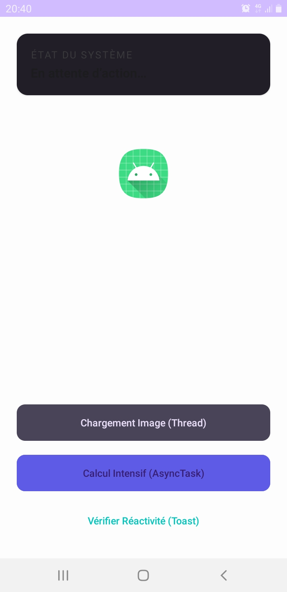
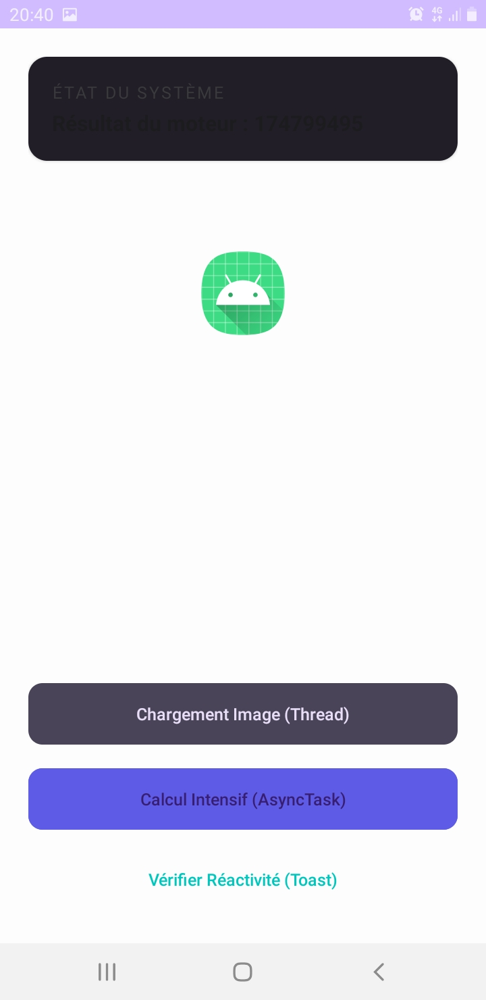

# Lab 8 : Programmation Asynchrone sur Android

## Description
Ce projet est un travail pratique (TP) portant sur la gestion des traitements longs dans une application Android. L'objectif est d'exécuter des tâches en arrière-plan (Worker Threads) tout en maintenant l'interface utilisateur (UI Thread) fluide et réactive.

## Fonctionnalités
- **Chargement d'image (Thread & Handler)** : Simule le chargement d'une ressource via un `Thread` séparé et met à jour l'UI en utilisant un `Handler`.
- **Calcul Intensif (AsyncTask)** : Exécute un calcul lourd en arrière-plan avec une mise à jour en temps réel d'une barre de progression (`LinearProgressIndicator`).
- **Test de Réactivité** : Un bouton permettant d'afficher un `Toast` instantanément, prouvant que l'UI n'est pas bloquée pendant les traitements.

## Aperçu de l'application

### 1. Chargement d'image (Thread)
Cette section montre l'utilisation d'un thread secondaire pour ne pas figer l'écran pendant une opération d'E/S simulée.

### 2. Calcul Intensif (AsyncTask)
Démonstration de la classe `AsyncTask` (approche pédagogique) pour effectuer des calculs CPU tout en publiant l'avancement sur la barre de progression.

## Concepts Techniques Appliqués
- **UI Thread vs Worker Thread** : Séparation des responsabilités pour éviter les erreurs "Application Not Responding" (ANR).
- **Material Design 3** : Utilisation de composants modernes comme `MaterialCardView` et `LinearProgressIndicator`.
- **Gestion de la mémoire** : Utilisation de `Static Inner Class` et `WeakReference` pour l'AsyncTask afin d'éviter les fuites de mémoire.
- **Handler & Looper** : Communication entre les threads de fond et le thread principal.

## Installation
1. Cloner le projet.
2. Ouvrir avec Android Studio.
3. Synchroniser Gradle.
4. Lancer sur un émulateur ou un appareil physique.
