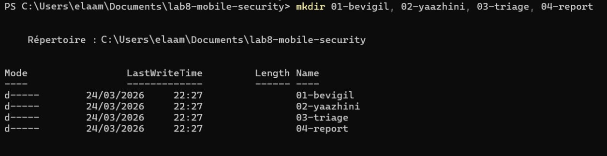
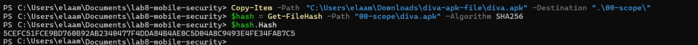
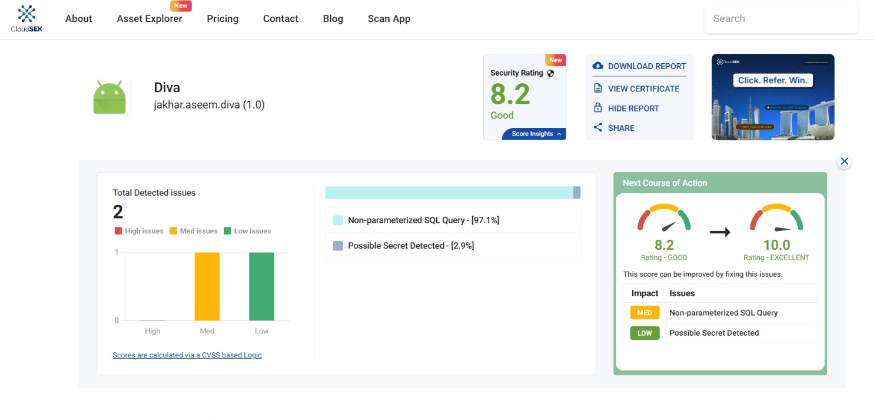
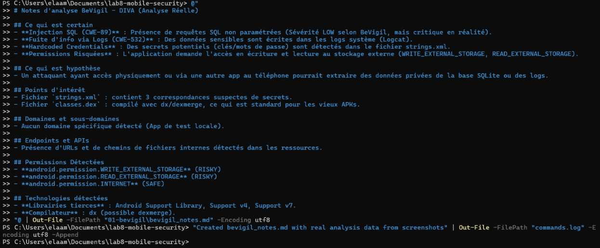
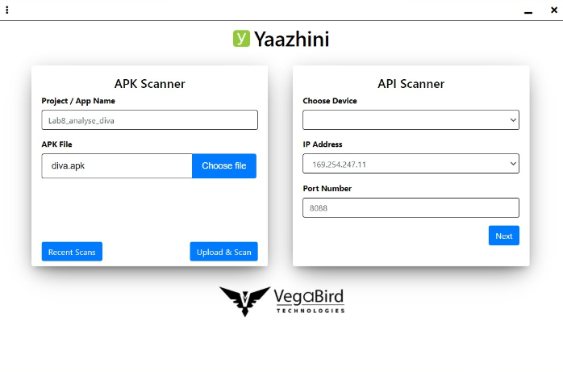

# 📱 Lab 8 — Mobile Application Security Posture & Exposure Analysis

<p align="center">
  
  
  
  
  
</p>

---

## 🗂️ Table of Contents

1. [Introduction](#introduction)
2. [Learning Objectives](#learning-objectives)
3. [Legal & Ethical Boundaries](#legal--ethical-boundaries)
4. [Tools & Technologies](#tools--technologies)
5. [Project Structure](#project-structure)
6. [Analysis Workflow](#analysis-workflow)
7. [Phase 0 — Scope Definition & Ethics](#phase-0--scope-definition--ethics)
8. [Phase 1 — Workspace Setup & Traceability](#phase-1--workspace-setup--traceability)
9. [Phase 2 — Target Artifact Preparation](#phase-2--target-artifact-preparation)
10. [Phase 3 — BeVigil: External Exposure Analysis](#phase-3--bevigil-external-exposure-analysis)
11. [Phase 4 — Yaazhini: Static APK Inspection](#phase-4--yaazhini-static-apk-inspection)
12. [Phase 5 — Triage & Deduplication](#phase-5--triage--deduplication)
13. [Phase 6 — OWASP Correlation](#phase-6--owasp-correlation)
14. [Key Findings Summary](#key-findings-summary)
15. [Security Recommendations](#security-recommendations)
16. [Conclusion](#conclusion)
17. [Future Improvements](#future-improvements)

---

## Introduction

This report documents a **defensive security audit** conducted on the DIVA (Damn Insecure and Vulnerable App) Android APK as part of the Mobile Application Security course. The goal was to map the application's external exposure using **BeVigil** (a CloudSEK OSINT platform) and perform deep static code analysis with **Yaazhini** — a dedicated APK scanner.

The entire analysis was structured, documented, and traceable end-to-end, following professional audit methodology. All activities were strictly scoped to the authorized pedagogical APK and performed in a legal, non-intrusive manner.

> **Analyst:** [Student Name]  
> **Date:** 2026-03-24  
> **Target:** DIVA (Damn Insecure and Vulnerable App) — `jakhar.aseem.diva` v1.0  
> **APK SHA-256:** `5CEFC51FCE9BD760B92AB2340477F4DDA84B4AE0C5D04A8C9493E4FE34FAB7C5`

---

## Learning Objectives

By the end of this lab, the following competencies were developed:

- ✅ **Set up a structured audit workspace** with proper traceability files
- ✅ **Map the external exposure surface** of an Android application using OSINT tools
- ✅ **Perform static analysis** on an APK binary using automated scanning tools
- ✅ **Differentiate confirmed findings from false positives** through methodical triage
- ✅ **Map vulnerabilities to OWASP MASVS/MASTG standards** for professional contextualization
- ✅ **Produce an actionable security report** with prioritized remediation steps

---

## Legal & Ethical Boundaries

> ⚠️ **This lab operates exclusively within a strictly legal and defensive framework.**

| Rule | Description |
|------|-------------|
| **Authorized target only** | Analysis limited to the DIVA pedagogical APK provided by the instructor |
| **No exploitation** | Discovered vulnerabilities were documented but never exploited |
| **No intrusive testing** | No network attacks, brute-force, or active probing performed |
| **Data masking** | All sensitive data found (keys, tokens) was masked in documentation |
| **Non-destructive** | No actions that could damage, disrupt, or overload any target system |

---

## Tools & Technologies

| Tool | Version | Purpose |
|------|---------|---------|
| **BeVigil** (CloudSEK) | Web Dashboard | OSINT-based external exposure scan — endpoints, assets, URLs, leaked secrets |
| **Yaazhini** (VegaBird) | 1.3.2 | Static APK analysis — manifest inspection, code review, vulnerability detection |
| **PowerShell** | 5.1+ | Automation, file management, hash computation, audit logging |
| **OWASP MASVS** | v2 | Reference standard for mobile vulnerability classification |
| **OWASP MASTG** | Latest | Testing methodology guidance |

---

## Project Structure

The lab workspace was organized into five logical directories, each corresponding to a distinct phase of the audit:

```
lab8-mobile-security/
├── 00-scope/
│   ├── scope.md              # Authorization and ethical boundary declaration
│   └── diva.apk              # Authorized pedagogical APK target
│
├── 01-bevigil/
│   ├── bevigil_export.txt    # Raw data exported from BeVigil session
│   └── bevigil_notes.md      # Structured analysis notes with findings
│
├── 02-yaazhini/
│   ├── Lab8_analyse_diva.html  # Full Yaazhini scan report
│   └── yaazhini_notes.md       # Annotated findings from static scan
│
├── 03-triage/
│   ├── triage.csv            # Unified finding registry (10+ entries)
│   └── owasp_mapping.md      # OWASP MASVS correlation for each finding
│
├── 04-report/
│   └── rapport_final.md      # Executive security report
│
├── analyse_info.txt           # Session metadata (analyst, target, hashes, tools)
├── commands.log               # Full chronological command audit trail
└── checklist_fin.md           # Signed completion checklist
```

---

## Analysis Workflow

The audit followed an eight-stage pipeline designed to ensure methodical coverage and reproducibility:

```
┌───────────────┐     ┌───────────────┐     ┌───────────────┐     ┌───────────────┐
│   01. Scope   │────▶│ 02. Workspace │────▶│  03. BeVigil  │────▶│  04. Yaazhini │
│   & Ethics    │     │     Setup     │     │     OSINT     │     │    Static     │
└───────────────┘     └───────────────┘     └───────────────┘     └───────┬───────┘
                                                                          │
                                                                          ▼
┌───────────────┐     ┌───────────────┐     ┌───────────────┐     ┌───────────────┐
│  08. Closure  │◀────│  07. Report   │◀────│ 06. OWASP Map │◀────│  05. Triage   │
│  & Sign-off   │     │   Drafting    │     │               │     │               │
└───────────────┘     └───────────────┘     └───────────────┘     └───────────────┘
```

---

## Phase 0 — Scope Definition & Ethics

Before any technical work began, the **authorization scope** was formally documented. This step is non-negotiable in professional auditing — it serves as legal protection and ensures the analyst stays within sanctioned boundaries.

A `scope.md` file was created under `00-scope/` containing:
- Identity of the authorized target (DIVA APK)
- Source of authorization (instructor-provided, course lab)
- Explicit ethical boundaries
- Analysis period and duration

```powershell
mkdir 00-scope

@"
# Analysis Perimeter

## Authorized Target
Name: DIVA (Damn Insecure and Vulnerable App)
Owner: Instructor / Course Lab

## Authorization
Source: Mobile Security Lab — Course TP
Evidence: Lab instructions issued by instructor

## Artifact Type
- [x] Pedagogical APK provided by instructor
- [ ] Authorized internal application
- [ ] Explicitly authorized domain

## Strict Limits
- No exploitation of discovered vulnerabilities
- No intrusive or active testing
- No bypassing of security mechanisms
- No targeting of unauthorized applications

## Analysis Period
Start Date: 2026-03-24
Duration: 2 hours
"@ | Out-File -FilePath "00-scope\scope.md" -Encoding utf8
```

> 📌 The scope document acts as a signed agreement between the analyst and the course framework, ensuring all subsequent actions remain legally defensible.

---

## Phase 1 — Workspace Setup & Traceability

A structured workspace was initialized with dedicated directories for each audit phase. Two critical traceability files were also created: `analyse_info.txt` (session metadata) and `commands.log` (command audit trail).

### Initializing the Directory Tree

```powershell
mkdir 00-scope
```

**Result:** The `00-scope` directory was successfully created:


*Figure 1 — Initializing the audit workspace: creating the `00-scope` directory*

```powershell
mkdir 01-bevigil, 02-yaazhini, 03-triage, 04-report
```

**Result:** All remaining directories were created in a single command:


*Figure 2 — Complete audit folder structure: `01-bevigil`, `02-yaazhini`, `03-triage`, `04-report`*

### Initializing the Audit Log

```powershell
"# Log des commandes exécutées - $(Get-Date -Format 'yyyy-MM-dd HH:mm:ss')" | Out-File -FilePath "commands.log" -Encoding utf8
"mkdir 01-bevigil, 02-yaazhini, 03-triage, 04-report" | Out-File -FilePath "commands.log" -Encoding utf8 -Append
```


*Figure 3 — Audit log initialized: all subsequent commands are appended to `commands.log` for traceability*

### Session Metadata

The `analyse_info.txt` file was populated with structured metadata about the analysis session:

```powershell
@"
Date: 2026-03-24
Analyste: [Student Name]
Cible: DIVA (Damn Insecure and Vulnerable App)
Artefact: diva.apk
Provenance: Instructor / Course Lab
Hash: [To be filled after APK copy]
Versions outils:
  - BeVigil: Web Dashboard
  - Yaazhini: 1.3.2
Environnement: Windows $(Get-ComputerInfo | Select-Object -ExpandProperty WindowsProductName)
"@ | Out-File -FilePath "analyse_info.txt" -Encoding utf8
```


*Figure 4 — `analyse_info.txt` populated with analyst identity, target information, and tool versions*

---

## Phase 2 — Target Artifact Preparation

The DIVA APK was copied into the `00-scope/` directory and its **SHA-256 cryptographic fingerprint** was computed to guarantee artifact integrity and ensure the analysis is reproducible.

### Artifact Intake & Hash Computation

```powershell
# Copy APK to secure scope directory
Copy-Item -Path "C:\Users\[user]\Downloads\diva-apk-file\diva.apk" -Destination ".\00-scope\"

# Compute SHA-256 integrity hash
$hash = Get-FileHash -Path "00-scope\diva.apk" -Algorithm SHA256
$hash.Hash
```

**Output:**
```
5CEFC51FCE9BD760B92AB2340477F4DDA84B4AE0C5D04A8C9493E4FE34FAB7C5
```


*Figure 5 — SHA-256 hash computed for `diva.apk`; serves as the artifact's cryptographic fingerprint*

```powershell
# Update metadata with verified hash
(Get-Content -Path "analyse_info.txt") -replace "Hash: \[To be filled after APK copy\]", "Hash: $($hash.Hash)" | Set-Content -Path "analyse_info.txt"
```


*Figure 6 — The computed hash is written back into `analyse_info.txt` to finalize artifact documentation*

### Scope Authorization Document

With the APK in place, the `scope.md` was completed to formalize that the artifact was legitimately provided and that all ethical constraints apply:

```powershell
@"
## Cible autorisée
Nom: Application_Mobile_TP_Cyber
Propriétaire: EMSI / Professeur de Sécurité

## Autorisation
Source: TP d'Audit Défensif — 4ème année
Preuve: Instructions du Lab fournies le $(Get-Date -Format "yyyy-MM-dd")

## Type d'artefact
- [x] APK pédagogique fourni par l'enseignant

## Limites strictes (Règles d'or)
1. Je ne vais PAS exploiter les failles (juste les trouver).
2. Je ne vais PAS faire de tests intrusifs.
3. Je vais masquer toute donnée sensible (clés, mots de passe).

## Période d'analyse
Date: $(Get-Date -Format "yyyy-MM-dd")
Durée prévue: 2 heures
"@ | Out-File -FilePath "00-scope\scope.md" -Encoding utf8
```


*Figure 7 — Completed scope document declaring the authorized target, ethical rules, and time boundaries*

---

## Phase 3 — BeVigil: External Exposure Analysis

**BeVigil** is a CloudSEK platform that performs OSINT-based reconnaissance on mobile applications. It aggregates publicly available signals — exposed assets, API endpoints, leaked emails, embedded URLs, and technology fingerprints — that would indicate a real-world exposure footprint.

### BeVigil Scan & Dashboard Overview

The DIVA APK was searched on the BeVigil web portal. The scan identified **2 total security issues** and produced a **Security Rating of 8.2/10 (Good)**.


*Figure 8 — BeVigil dashboard showing DIVA's security score (8.2/10) and the breakdown: 1 Medium (SQL) and 1 Low (Possible Secret)*

Key metrics from the BeVigil scan:

| Category | Finding | Severity |
|----------|---------|---------|
| SQL Query | Non-parameterized SQL Query detected | **Medium** (97.1%) |
| Secrets | Possible Secret Detected | **Low** (2.9%) |

The "Next Course of Action" panel on BeVigil confirmed that fixing these two issues would push the score from **8.2 → 10.0**.

### Export & Documentation

Since full JSON export required a Business subscription, scan results were documented via structured notes and screenshots:

```powershell
"Export JSON non disponible (Formulaire Business requis). Preuves conservées via captures d'écran." | Out-File -FilePath "01-bevigil\bevigil_export.txt" -Encoding utf8
(Get-Content -Path "analyse_info.txt") -replace "- BeVigil: \[version\]", "- BeVigil: CloudSEK BeVigil OSINT Web Portal" | Set-Content -Path "analyse_info.txt"
"Analyse BeVigil complétée via interface Web à 22:14" | Out-File -FilePath "commands.log" -Encoding utf8 -Append
```


*Figure 9 — Export limitation documented in the commands log; screenshots captured as evidence substitute*

### BeVigil Findings — Structured Notes

The full `bevigil_notes.md` was created to categorize everything observed in the BeVigil report:

```markdown
# BeVigil Analysis Notes — DIVA (Real Analysis)

## Confirmed Findings
- **SQL Injection (CWE-89)**: Non-parameterized SQL queries detected (BeVigil: LOW severity, but critical in practice)
- **Log Information Leakage (CWE-532)**: Sensitive data written to system logs (Logcat)
- **Hardcoded Credentials**: Potential secrets (keys/passwords) found in `strings.xml`
- **Risky Storage Permissions**: WRITE_EXTERNAL_STORAGE, READ_EXTERNAL_STORAGE

## Hypothesis
- An attacker with physical access or a malicious co-installed app could extract private DB/log data

## Points of Interest
- `strings.xml`: 3 suspicious secret-pattern matches
- `classes.dex`: compiled with dx/dexmerge (standard for older APKs)

## Detected Technologies
- Android Support Library (v4, v7)
- Compiler: dx (possible dexmerge)
```


*Figure 10 — Structured BeVigil analysis notes showing confirmed findings, hypotheses, and technology stack*

---

## Phase 4 — Yaazhini: Static APK Inspection

**Yaazhini** (by VegaBird Technologies) performs deep static analysis on APK files by decompiling the binary and inspecting the code, manifest, permissions, and network behavior patterns — all without executing the application.

### Launching the Scanner

The DIVA APK was loaded into Yaazhini's APK Scanner module:


*Figure 11 — Yaazhini's main interface showing the APK Scanner configured with project name `Lab8_analyse_diva` and target `diva.apk`*

### Scan Initialization & Decompilation

After clicking **Upload & Scan**, Yaazhini began its analysis pipeline:


*Figure 12 — Yaazhini Progress Bar confirming: APK verification complete, decompilation started (15.65 GB RAM available)*

### Application Summary

Once the scan completed, the App Summary panel provided basic APK metadata:


*Figure 13 — App Summary in Yaazhini: package `jakhar.aseem.diva`, scanned 25-MAR-2026, version 1.0, Min SDK 15, Target SDK 23, Size 1.4 MB*

### Yaazhini Static Findings

Six significant vulnerabilities were identified through static inspection:

```markdown
# Yaazhini Analysis Notes — DIVA (Static Analysis)

## Finding 1: Unencrypted HTTP Communication
- **Location**: `jakhar\aseem\diva\APICreds2Activity.java` — line 23
- **Description**: A URL using the insecure `http://` protocol was found
- **Impact**: Credentials and data transmitted in plaintext; vulnerable to MitM attacks
- **Remediation**: Replace all HTTP calls with HTTPS + TLS enforcement

## Finding 2: Debuggable Mode Enabled
- **Location**: `AndroidManifest.xml` — line 7
- **Description**: `android:debuggable="true"` is set in the <application> tag
- **Impact**: Attackers can attach a debugger at runtime to extract data or modify behavior
- **Remediation**: Set `android:debuggable="false"` in production builds

## Finding 3: Android Backup Enabled (allowBackup)
- **Location**: `AndroidManifest.xml` — line 7
- **Description**: `android:allowBackup="true"` is active
- **Impact**: Any user with ADB access can extract the full app data directory
- **Remediation**: Disable backup with `android:allowBackup="false"`

## Finding 4: Exported Content Provider
- **Location**: `AndroidManifest.xml` — line 36
- **Description**: `NotesProvider` is marked `android:exported="true"` without permission protection
- **Impact**: Malicious apps on the same device can read or modify DIVA's stored notes
- **Remediation**: Set `android:exported="false"` or restrict with explicit permissions

## Finding 5: Insecure External Storage Usage
- **Location**: `InsecureDataStorage4Activity.java` — line 24 (+8 occurrences)
- **Description**: `getExternalStorageDirectory()` used to write files like `.uinfo.txt`
- **Impact**: Files readable/writable by any app or user on the device
- **Remediation**: Use internal private storage for sensitive data

## Finding 6 (Bonus): JavaScript Enabled in WebView
- **Location**: `InputValidation2URISchemeActivity.java` — line 14
- **Description**: `setJavaScriptEnabled(true)` called without input validation
- **Impact**: Potential JavaScript injection / Cross-Site Scripting (XSS) in WebView
- **Remediation**: Disable JavaScript where not required; rigorously validate loaded URLs
```


*Figure 14 — Structured Yaazhini findings notes showing all 6 identified vulnerabilities with location, impact, and remediation guidance*

---

## Phase 5 — Triage & Deduplication

All findings from both BeVigil and Yaazhini were consolidated into a unified `triage.csv` registry. This step eliminates duplicates, assigns severity levels, and builds the authoritative finding list for the final report.

```powershell
"ID,Source,Element,Evidence,Confidence,Severity,Impact,Recommendation,OWASP Ref,Status" | Out-File -FilePath "03-triage\triage.csv" -Encoding utf8
```

### Consolidated Finding Registry

| ID | Source | Finding | Severity | Status |
|----|--------|---------|---------|--------|
| FIND-001 | Yaazhini | HTTP Communication (No TLS) | **Medium** | Confirmed |
| FIND-002 | Yaazhini | Debuggable Mode Active | **High** | Confirmed |
| FIND-003 | BeVigil + Yaazhini | Backup Enabled (allowBackup) | **Medium** | Confirmed |
| FIND-004 | Yaazhini | Exported Content Provider (No Auth) | **High** | Confirmed |
| FIND-005 | Yaazhini | Insecure External Storage | **Medium** | Confirmed |
| FIND-006 | BeVigil | Non-Parameterized SQL Query | **Medium** | Confirmed |
| FIND-007 | BeVigil | Possible Hardcoded Secret | **Low** | To Confirm |
| FIND-008 | BeVigil | Info Leakage via Logcat | **Low** | Confirmed |
| FIND-009 | Yaazhini | JavaScript Enabled in WebView | **Low** | Confirmed |
| FIND-010 | Yaazhini | Risky Storage Permissions | **Low** | Confirmed |

### Final Deliverables Overview


*Figure 15 — Final workspace structure: all required deliverables present across `01-bevigil`, `02-yaazhini`, `03-triage`, and `04-report` directories*

---

## Phase 6 — OWASP Correlation

Each confirmed finding was mapped to its corresponding **OWASP MASVS v2** category, providing industry-recognized context and authoritative remediation guidance.

| Finding ID | Description | OWASP Category | Reference |
|-----------|-------------|----------------|-----------|
| FIND-001 | Unencrypted HTTP | Network Security | **MASVS-NETWORK-1** |
| FIND-002 | Debuggable Build | Code Quality | **MASVS-CODE-2** |
| FIND-003 | Backup Enabled | Data Storage | **MASVS-STORAGE-4** |
| FIND-004 | Exported Component | Platform Security | **MASVS-PLATFORM-1** |
| FIND-005 | External Storage | Data Storage | **MASVS-STORAGE-2** |
| FIND-006 | SQL Injection Risk | Code Quality | **MASVS-CODE-4** |
| FIND-007 | Hardcoded Secret | Cryptography | **MASVS-CRYPTO-1** |
| FIND-008 | Log Data Leakage | Data Storage | **MASVS-STORAGE-3** |
| FIND-009 | WebView XSS Risk | Platform Security | **MASVS-PLATFORM-2** |
| FIND-010 | Excessive Permissions | Storage | **MASVS-STORAGE-1** |

---

## Key Findings Summary

### 🔴 High Severity

**FIND-002 — Debuggable Build Flag Active**  
The `android:debuggable="true"` attribute enables runtime debugger attachment, allowing a local attacker to inspect memory, extract data, or inject malicious code during execution. This should never appear in a production release.

**FIND-004 — Unprotected Exported Content Provider**  
The `NotesProvider` component is exported without any permission requirement. This allows any installed application on the same device to query, insert, or delete data from DIVA's content provider.

### 🟡 Medium Severity

**FIND-001 — Cleartext HTTP Communication**  
API calls transmitted over unencrypted HTTP expose credentials and session tokens to network-level interception (Man-in-the-Middle attacks).

**FIND-003 — Android Backup Enabled**  
With `allowBackup="true"`, the complete application data directory can be extracted by any user with USB/ADB access to the device.

**FIND-005 — Insecure External Storage for Sensitive Files**  
Sensitive files written to external storage are accessible by other applications and users without any permission gate.

**FIND-006 — SQL Injection Exposure (BeVigil)**  
Non-parameterized SQL queries identified by BeVigil suggest direct user input concatenation into query strings, creating potential for data exfiltration or corruption.

### 🟢 Low Severity

**FIND-007** — Possible hardcoded credentials in `strings.xml`  
**FIND-008** — Sensitive information logged to Logcat  
**FIND-009** — JavaScript enabled in WebView without input validation  
**FIND-010** — Dangerous storage permissions (`WRITE_EXTERNAL_STORAGE`, `READ_EXTERNAL_STORAGE`)

---

## Security Recommendations

Based on the analysis, the following **three priority actions** should be addressed immediately:

### Priority 1 — Enforce TLS for All Network Communication
```xml
<!-- AndroidManifest.xml -->
<application
    android:usesCleartextTraffic="false"
    ... >
```
Every API call must use `https://`. Configure a **Network Security Config** file to explicitly block cleartext traffic and enforce certificate pinning where feasible.

---

### Priority 2 — Harden the AndroidManifest.xml
```xml
<application
    android:debuggable="false"
    android:allowBackup="false"
    ... >

<!-- Content Provider — add permission and restrict export -->
<provider
    android:name=".NotesProvider"
    android:exported="false"
    ... />
```
Disabling debuggable mode and backup in the manifest eliminates two High-severity findings instantly. Restrict or remove exported components that don't need to be accessible to external apps.

---

### Priority 3 — Migrate Sensitive Storage to Internal / Keystore APIs
```java
// Replace getExternalStorageDirectory() with:
File internalFile = new File(getFilesDir(), "sensitive_data.txt");

// For secrets and API keys, use Android Keystore:
KeyStore keyStore = KeyStore.getInstance("AndroidKeyStore");
```
Sensitive data must never be written to external storage. API keys and credentials must be stored using the **Android Keystore System** rather than hardcoded in resources or plain files.

---

## Conclusion

This lab provided hands-on experience with two distinct but complementary security analysis methodologies:

- **BeVigil** delivered an external attacker's perspective — exposing what is publicly observable about an application without any binary access
- **Yaazhini** revealed the internal code-level weaknesses by decompiling and statically analyzing the APK

Together, they painted a complete picture of DIVA's security posture. The application exhibited **multiple high-impact vulnerabilities** that are common in real-world Android applications, including debuggable production builds, cleartext communications, and insufficiently protected storage.

The structured, evidence-driven audit methodology — from scope definition through OWASP mapping and final reporting — demonstrated how professional security assessments are conducted ethically and reproducibly.

---

## Future Improvements

| Improvement | Rationale |
|-------------|-----------|
| **Dynamic Analysis (DAST)** | Complement static findings with runtime behavior analysis using Frida or objection |
| **Network Traffic Interception** | Use Burp Suite to capture and verify the actual HTTP calls at runtime |
| **BeVigil Full Export** | Upgrade to a Business account to retrieve structured JSON exports for automated processing |
| **CI/CD Integration** | Embed Yaazhini or equivalent SAST tools into a mobile development pipeline to catch issues pre-release |
| **Threat Modeling** | Apply STRIDE methodology to formally model attack scenarios for each identified vulnerability |
| **Remediation Verification** | After applying fixes, re-run both tools to confirm resolution and verify the security score improvement |

---

<p align="center">
  <em>Course: Mobile Application Security — Practical Lab 8</em><br>
  <em>Analysis date: 2026-03-24 | Tools: BeVigil (CloudSEK) + Yaazhini (VegaBird)</em>
</p>
