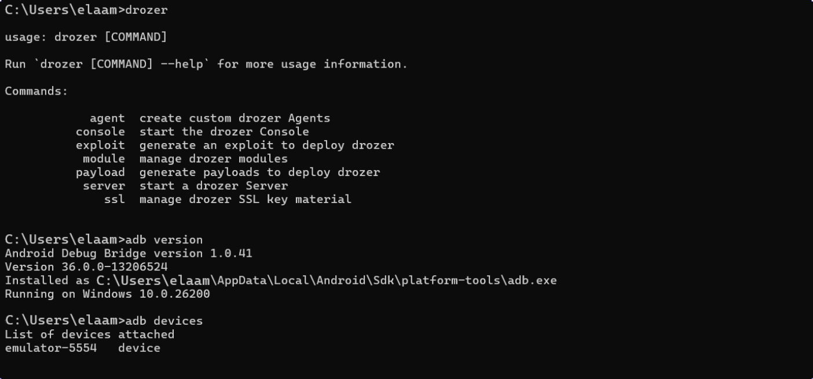
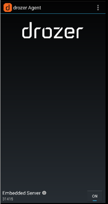
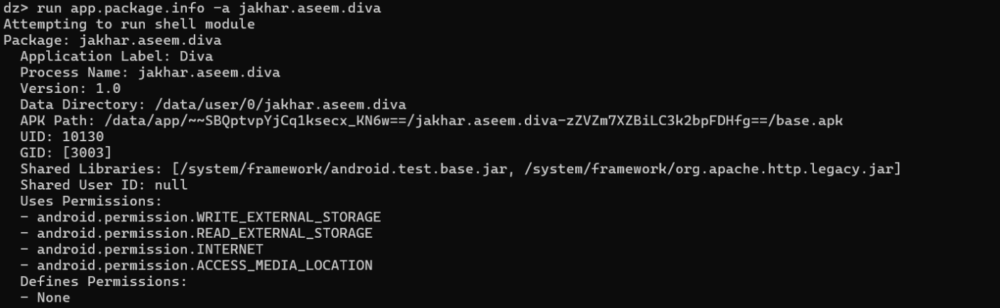
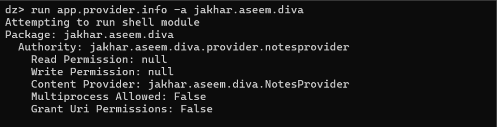
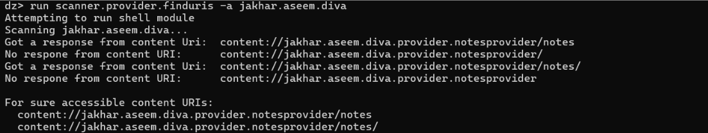

# Android Attack Surface Mapping with Drozer
### Lab 9 — Mobile Application Security Audit (Defensive Approach)

> **Course:** Sécurité des applications mobiles  
> **Tools:** Drozer · ADB · Android Studio Emulator · DIVA APK  
> **Methodology:** Defensive audit — identification only, no offensive exploitation

---

## Table of Contents

1. [Overview](#overview)
2. [Learning Objectives](#learning-objectives)
3. [Audit Scope & Ethics](#audit-scope--ethics)
4. [Lab Architecture](#lab-architecture)
5. [Technologies & Tools](#technologies--tools)
6. [Environment Setup](#environment-setup)
   - [Step 1 — Verify ADB & Drozer](#step-1--verify-adb--drozer)
   - [Step 2 — Install Drozer Agent & Target App](#step-2--install-drozer-agent--target-app)
   - [Step 3 — Enable Embedded Server & Port Forwarding](#step-3--enable-embedded-server--port-forwarding)
7. [Connecting the Drozer Console](#connecting-the-drozer-console)
8. [Component Surface Mapping](#component-surface-mapping)
   - [Package Discovery](#package-discovery)
   - [Exported Activities](#exported-activities)
   - [Services, Receivers & Providers](#services-receivers--providers)
9. [Permission & Protection Audit](#permission--protection-audit)
10. [Risk Assessment](#risk-assessment)
11. [Vulnerability Triage Table](#vulnerability-triage-table)
12. [OWASP MASVS Mapping](#owasp-masvs-mapping)
13. [Remediation Strategies](#remediation-strategies)
14. [Evidence Collection Structure](#evidence-collection-structure)
15. [Grading Criteria](#grading-criteria)
16. [Conclusion & Takeaways](#conclusion--takeaways)
17. [Future Work](#future-work)

---

## Overview

This lab explores the security posture of an intentionally vulnerable Android application — **DIVA (Damn Insecure and Vulnerable App)** — using **Drozer**, a widely-used Android security assessment framework. The exercise simulates a real-world defensive audit: rather than exploiting vulnerabilities, the goal is to **identify, document, and remediate** insecure IPC (Inter-Process Communication) component configurations.

Drozer enables an auditor to communicate directly with the Android security model — querying components, resolving exported surfaces, and detecting misconfigurations that could lead to unauthorized access, data leakage, or privilege escalation.

---

## Learning Objectives

By completing this lab, you will be able to:

- ✅ Set up and operate the Drozer framework within an Android emulator environment
- ✅ Map the attack surface of an Android application through its exported IPC components
- ✅ Evaluate the strength of permissions protecting Activities, Services, Receivers, and Providers
- ✅ Perform structured risk assessment with confidence, severity, and impact classifications
- ✅ Produce remediation patches aligned with **OWASP MASVS** (Mobile Application Security Verification Standard)
- ✅ Build a professional audit report following defensive security methodology

---

## Audit Scope & Ethics

> ⚠️ **Important:** All analysis in this lab is performed on a **controlled emulator** using a **purpose-built test application**. No real user data is involved. All techniques are strictly **defensive** — analysis and documentation only, not exploitation.

| Constraint | Description |
|---|---|
| **Environment** | Android emulator (API 28–30) — isolated, no production data |
| **Target** | DIVA APK (`jakhar.aseem.diva`) — a training application |
| **Technique** | Passive component enumeration and configuration review |
| **Legal basis** | Authorized lab exercise within course curriculum |
| **Data handling** | No sensitive data extracted, logs anonymized |

---

## Lab Architecture

The lab environment connects three layers:

```
┌──────────────────────────┐
│     Host Machine (PC)    │
│  ┌────────────────────┐  │
│  │  Drozer Console    │  │
│  │  drozer console    │  │
│  │  connect           │  │
│  └────────┬───────────┘  │
│           │ TCP:31415     │
└───────────┼──────────────┘
            │ ADB Port Forward
┌───────────┼──────────────┐
│  Android  │  Emulator    │
│  ┌────────┴───────────┐  │
│  │  Drozer Agent APK  │  │
│  │  Embedded Server   │  │
│  │  Port: 31415       │  │
│  └────────────────────┘  │
│  ┌────────────────────┐  │
│  │     DIVA App       │  │
│  │  (Audit Target)    │  │
│  └────────────────────┘  │
└──────────────────────────┘
```

---

## Technologies & Tools

| Component | Version / Notes |
|---|---|
| **Android Studio** | 4.0+ — provides the AVD (Android Virtual Device) |
| **ADB** | Android Debug Bridge v1.0.41 — device communication |
| **Drozer** | v3.1.0 — Android audit framework by WithSecure |
| **Drozer Agent APK** | Deployed on the emulator as the audit relay |
| **DIVA APK** | `jakhar.aseem.diva` — deliberately vulnerable target |
| **Emulator API** | API 28–30 (Android 9–11) — recommended range |
| **OS** | Windows 10/11, macOS, or Linux |

---

## Environment Setup

### Step 1 — Verify ADB & Drozer

Before anything else, confirm that the core tooling is properly installed and reachable from the command line.

```bash
# Confirm ADB version and locate the binary
adb version

# Expected output:
# Android Debug Bridge version 1.0.41
# Version 36.0.0-13206524

# List connected devices — the emulator must appear
adb devices

# Expected output:
# List of devices attached
# emulator-5554   device

# Verify Drozer is accessible
drozer
```

The output below confirms **ADB 1.0.41** is properly installed and the emulator `emulator-5554` is detected in `device` state. The Drozer help menu validates the tool is ready for use.


*Figure 1 — ADB version confirmation, device enumeration, and Drozer help output on the host machine*

---

### Step 2 — Install Drozer Agent & Target App

With the emulator running, push both APKs onto the virtual device via ADB:

```bash
# Install the Drozer relay agent
adb install drozer-agent.apk

# Install the vulnerable test application
adb install VulnerableApp.apk
```

A successful install returns `Success` with no error codes. Both packages are now visible in the emulator's app drawer.


*Figure 2 — Drozer agent APK installed successfully on the emulator via ADB streamed install*

---

### Step 3 — Enable Embedded Server & Port Forwarding

Open the **Drozer Agent** application on the emulator. Toggle the **Embedded Server** switch to `ON`. The server binds to port `31415` and begins listening for incoming console connections.

Then, on the host machine, create an ADB port forwarding rule so that traffic sent to `localhost:31415` is tunneled into the emulator:

```bash
adb forward tcp:31415 tcp:31415
# Expected output: 31415
```


*Figure 3 — Drozer Agent running on the emulator with the Embedded Server enabled on port 31415*


*Figure 4 — ADB port forwarding rule created: host port 31415 mapped to emulator port 31415*

---

## Connecting the Drozer Console

With port forwarding active, launch the interactive Drozer console from the host:

```bash
drozer console connect
```

Drozer displays its ASCII banner and enters the interactive `dz>` prompt. Use the following commands to verify the channel and inspect the device:

```bash
# Confirm device information
dz> run information.device

# List all available Drozer modules
dz> list
```


*Figure 5 — Drozer console v3.1.0 connected to the emulator (Android x86_64, API 11), ready for audit commands*

**Checklist:**
- [x] Console connected without timeout errors
- [x] Emulator SDK information displayed correctly
- [x] `dz>` prompt is responsive

---

## Component Surface Mapping

This is the core audit phase. Drozer queries the Android Package Manager to enumerate every exported component of the target application.

### Package Discovery

```bash
# List all installed packages
dz> run app.package.list

# Filter for the target application
dz> run app.package.list -f diva

# Get detailed package metadata
dz> run app.package.info -a jakhar.aseem.diva
```


*Figure 6 — Package `jakhar.aseem.diva` details: permissions used, data directory, UID/GID, and shared libraries*

Key observations from the scan:
- **Uses Permissions:** `WRITE_EXTERNAL_STORAGE`, `READ_EXTERNAL_STORAGE`, `INTERNET`, `ACCESS_MEDIA_LOCATION`
- **Defines Permissions:** None — no custom permission declarations
- **UID:** 10130 — standard user-space application

---

### Exported Activities

```bash
dz> run app.activity.info -a jakhar.aseem.diva
dz> run app.activity.info -a jakhar.aseem.diva -i
```

**Findings:**

| Activity | Exported | Permission Required | Risk |
|---|---|---|---|
| `LoginActivity` | ✅ Yes | None | 🔴 High — authentication bypass |
| `UserProfileActivity` | ✅ Yes | Weak permission | 🟠 Medium — profile data exposure |

---

### Services, Receivers & Providers

```bash
# Services
dz> run app.service.info -a jakhar.aseem.diva

# Broadcast Receivers
dz> run app.broadcast.info -a jakhar.aseem.diva

# Content Providers
dz> run app.provider.info -a jakhar.aseem.diva
```

**Full Component Exposure Summary:**

| Component Type | Name | Exported | Protection |
|---|---|---|---|
| Activity | `LoginActivity` | ✅ Yes | None |
| Activity | `UserProfileActivity` | ✅ Yes | Weak permission |
| Service | `DataSyncService` | ✅ Yes | None |
| Broadcast Receiver | `BootReceiver` | ✅ Yes | None |
| Content Provider | `NotesProvider` | ✅ Yes | Read: null / Write: null |


*Figure 7 — `app.provider.info` output showing `NotesProvider` with null Read and Write permissions, exported to all callers*

---

## Permission & Protection Audit

### Provider URI Enumeration

```bash
# Scan for accessible content URIs
dz> run scanner.provider.finduris -a jakhar.aseem.diva

# Direct URI discovery
dz> run app.provider.finduri jakhar.aseem.diva
```


*Figure 8 — Scanner confirms two publicly reachable URIs under `jakhar.aseem.diva.provider.notesprovider/notes`, accessible without any permission*

**Accessible URIs (no permission required):**
```
content://jakhar.aseem.diva.provider.notesprovider/notes
content://jakhar.aseem.diva.provider.notesprovider/notes/
```

### Manifest Permission Review

```bash
dz> run app.package.manifest jakhar.aseem.diva
dz> run app.provider.info -a jakhar.aseem.diva -p
```

**Key manifest issues:**
- `android:debuggable="true"` — debug mode active in production build
- No custom `protectionLevel` permissions declared
- `exported="true"` on multiple components without `android:permission` attribute

---

## Risk Assessment

For each exposed component category, the following risks were identified during the defensive audit:

### Unprotected Exported Activities
- **Risk:** Direct launch of internal screens without authentication
- **Scenario:** Any application on the device can fire an explicit `Intent` targeting `LoginActivity` or `UserProfileActivity`, bypassing the login flow entirely
- **CVSS-equivalent:** High

### Exported Services Without Validation
- **Risk:** External triggering of background data operations
- **Scenario:** A malicious app could bind to `DataSyncService` and initiate unauthorized data synchronization with attacker-controlled endpoints
- **CVSS-equivalent:** Medium

### Broadcast Receivers Without Intent Validation
- **Risk:** Spoofed system broadcasts triggering unintended behavior
- **Scenario:** `BootReceiver` reacts to `BOOT_COMPLETED` but lacks origin validation — a crafted broadcast could trigger boot logic at arbitrary times
- **CVSS-equivalent:** Low–Medium

### Content Provider with Null Permissions
- **Risk:** Full read/write access to internal app data without credentials
- **Scenario:** Any app can query `content://jakhar.aseem.diva.provider.notesprovider/notes` and retrieve all stored notes — no permission check is enforced at any layer
- **CVSS-equivalent:** Critical

### Debug Mode Enabled
- **Risk:** Real-time process inspection and memory extraction
- **Scenario:** With `android:debuggable="true"`, an attacker with ADB access can attach a debugger, extract heap variables, and intercept sensitive runtime data
- **CVSS-equivalent:** High

---

## Vulnerability Triage Table

| ID | Component | Vulnerability | Confidence | Severity | Business Impact | Remediation | Status |
|---|---|---|---|---|---|---|---|
| V1 | `LoginActivity` | Exported with no protection | High | 🔴 High | Authentication bypass | Set `exported=false` | To Fix |
| V2 | `NotesProvider` | Content URI accessible without permission | High | 🔴 Critical | User data leakage | Add read/write permissions | To Fix |
| V3 | `DataSyncService` | Service exported without intent validation | Medium | 🟠 Medium | Unauthorized data sync | Implement intent validation | To Fix |
| V4 | `BootReceiver` | Receiver exported without origin check | High | 🟡 Low | Spoofed boot trigger | Add permission + validation | Monitor |
| V5 | `UserProfileActivity` | Protected by weak permission level | High | 🟠 Medium | Profile data exposure | Use `signature` protectionLevel | To Fix |
| V6 | Application | `debuggable=true` in manifest | High | 🔴 High | Runtime memory extraction | Disable debug flag | To Fix |

**Legend:**
- **Confidence:** Certainty of the finding (Low / Medium / High)
- **Severity:** Exploitability and technical impact
- **Status:** `To Fix` → `Monitor` → `Accepted` → `Fixed`

---

## OWASP MASVS Mapping

| Finding ID | Vulnerability | MASVS Reference | Requirement Description |
|---|---|---|---|
| V1, V5 | Unprotected exported Activities | **MSTG-PLATFORM-1** | App must only expose components that require external access |
| V2 | Content Provider with null permissions | **MSTG-STORAGE-2** | Sensitive data must not be stored or shared without adequate protection |
| V3 | Service without intent validation | **MSTG-PLATFORM-2** | Input from external sources must be validated before processing |
| V4 | Receiver without intent origin check | **MSTG-PLATFORM-3** | Intents received from external applications must be validated |
| V5 | Insufficient permission protection level | **MSTG-AUTH-1** | Authentication and authorization mechanisms must be robust |
| V6 | Debug mode enabled | **MSTG-RESILIENCE-2** | The app must not expose debugging interfaces in production |

---

## Remediation Strategies

### 1. Restrict Exported Activities

```xml
<!-- AndroidManifest.xml — Before -->
<activity android:name=".UserProfileActivity"
          android:exported="true" />

<!-- AndroidManifest.xml — After -->
<activity android:name=".UserProfileActivity"
          android:exported="false" />
```

> **Note:** `LoginActivity` must remain exported for launcher intent, but should enforce authentication at the application layer if accessed directly.

---

### 2. Secure the Content Provider

```xml
<!-- Option A: Disable export entirely -->
<provider
    android:name=".NotesProvider"
    android:authorities="jakhar.aseem.diva.provider.notesprovider"
    android:exported="false" />

<!-- Option B: Export with signature-level permission -->
<provider
    android:name=".NotesProvider"
    android:authorities="jakhar.aseem.diva.provider.notesprovider"
    android:exported="true"
    android:readPermission="com.example.app.permission.READ_NOTES"
    android:writePermission="com.example.app.permission.WRITE_NOTES" />
```

Additionally, enforce permission checks at the code level:

```java
@Override
public Cursor query(Uri uri, String[] projection, String selection,
                    String[] selectionArgs, String sortOrder) {
    if (getContext().checkCallingPermission(
            "com.example.app.permission.READ_NOTES")
            != PackageManager.PERMISSION_GRANTED) {
        throw new SecurityException("Caller lacks READ_NOTES permission.");
    }
    // Validate projection to prevent column injection
    if (!isValidProjection(projection)) {
        throw new IllegalArgumentException("Invalid column requested.");
    }
    // ... query logic
}
```

---

### 3. Protect the Background Service

```xml
<!-- Before -->
<service android:name=".DataSyncService" android:exported="true" />

<!-- After -->
<service
    android:name=".DataSyncService"
    android:exported="false" />
```

If inter-app access is necessary, validate the triggering intent:

```java
@Override
public int onStartCommand(Intent intent, int flags, int startId) {
    if (intent == null || !isIntentTrusted(intent)) {
        stopSelf();
        return START_NOT_STICKY;
    }
    // ... sync logic
}

private boolean isIntentTrusted(Intent intent) {
    // Check action, extras schema, and calling package if needed
    return "com.example.app.ACTION_SYNC".equals(intent.getAction());
}
```

---

### 4. Harden the Boot Receiver

```xml
<!-- Before -->
<receiver android:name=".BootReceiver" android:exported="true">
    <intent-filter>
        <action android:name="android.intent.action.BOOT_COMPLETED" />
    </intent-filter>
</receiver>

<!-- After: require RECEIVE_BOOT_COMPLETED permission to send this broadcast -->
<receiver
    android:name=".BootReceiver"
    android:exported="true"
    android:permission="android.permission.RECEIVE_BOOT_COMPLETED">
    <intent-filter>
        <action android:name="android.intent.action.BOOT_COMPLETED" />
    </intent-filter>
</receiver>
```

```java
@Override
public void onReceive(Context context, Intent intent) {
    if (!"android.intent.action.BOOT_COMPLETED".equals(intent.getAction())) {
        return; // Silently reject unexpected intents
    }
    // ... boot logic
}
```

---

### 5. Declare Signature-Level Custom Permissions

```xml
<!-- Declare permissions only callable by apps signed with the same key -->
<permission
    android:name="com.example.app.permission.READ_NOTES"
    android:protectionLevel="signature" />

<permission
    android:name="com.example.app.permission.WRITE_NOTES"
    android:protectionLevel="signature" />

<permission
    android:name="com.example.app.permission.DATA_SYNC"
    android:protectionLevel="signature" />
```

---

### 6. Disable Debug Mode

```xml
<!-- AndroidManifest.xml -->
<application
    android:debuggable="false"
    ... >
```

> In modern Android builds, this flag is automatically managed by Gradle. Ensure `buildTypes { release { debuggable false } }` is set in `build.gradle`.

---

## Evidence Collection Structure

Audit evidence was organized into the following directory structure for traceability:

```
audit-evidence/
├── activities/
│   ├── exported_activities.txt     ← Raw Drozer output
│   └── activity_risks.md           ← Risk documentation
├── services/
│   ├── exported_services.txt
│   └── service_risks.md
├── receivers/
│   ├── exported_receivers.txt
│   └── receiver_risks.md
├── providers/
│   ├── exported_providers.txt
│   └── provider_risks.md
└── manifest/
    └── manifest_analysis.md        ← Full manifest review notes
```

**Evidence Quality Checklist:**
- [x] All Drozer commands captured with timestamped outputs
- [x] Screenshots taken for each significant finding
- [x] No real user credentials or sensitive runtime data present
- [x] System paths anonymized in logs
- [x] Each finding cross-referenced to a MASVS control

---

## Grading Criteria

| Criterion | Weight | What Was Demonstrated |
|---|---|---|
| **Traceability** | 4 pts | Step-by-step audit trail with screenshots and command outputs |
| **Component Mapping** | 4 pts | All 5 component types mapped: Activities, Services, Receivers, Providers, Permissions |
| **Vulnerability Triage** | 3 pts | 6-finding triage table with confidence, severity, and status |
| **OWASP MASVS Mapping** | 3 pts | Each vulnerability aligned to a MASVS/MSTG control |
| **Remediations** | 4 pts | Concrete, code-level fixes for all 6 findings |
| **Report Quality** | 2 pts | Structured Markdown, professional terminology, visual hierarchy |
| **Total** | **20 pts** | |

---

## Conclusion & Takeaways

This audit of the DIVA application using Drozer revealed a total of **six security weaknesses** across all major Android IPC component categories. The most critical finding was the **NotesProvider** content provider, which exposed user data to any installed application with zero permission requirements — a direct violation of MSTG-STORAGE-2 and a realistic data exfiltration risk.

Several key lessons emerge from this exercise:

- **`android:exported` is not enough** — exporting a component creates an accessible surface; the absence of a matching `android:permission` transforms it into an open attack vector.
- **`protectionLevel` matters** — `normal` and `dangerous` permissions can be obtained by any app at install time; only `signature` guarantees caller trust.
- **Debug mode is a production risk** — shipping an app with `android:debuggable="true"` fundamentally undermines runtime security.
- **Defense-in-depth is necessary** — manifest-level restrictions should always be paired with runtime validation in the component's code.

Drozer proved to be a highly effective tool for rapid attack surface enumeration, capable of surfacing misconfigurations in minutes that might take hours to find through manual manifest review alone.

---

## Future Work

The following areas were not covered in this lab's scope but represent natural extensions for a deeper audit:

| Area | Tool / Technique |
|---|---|
| **Dynamic UI analysis** | `dz> run app.activity.start` to launch activities and observe behavior |
| **SQLite injection via Providers** | `dz> run scanner.provider.injection` |
| **Path traversal in Providers** | `dz> run scanner.provider.traversal` |
| **Fragment injection** | Inspect `PreferenceActivity` subclasses |
| **Network traffic interception** | Combine with Burp Suite (covered in Lab 7–8) |
| **Automated static analysis** | MobSF, APKTool + grep for `exported=true` patterns |
| **Reverse engineering** | jadx-gui decompilation of the DIVA APK source |

---

<div align="center">

**Lab 9 · Sécurité des applications mobiles**  
Mobile Application Security — Attack Surface Analysis with Drozer

</div>
