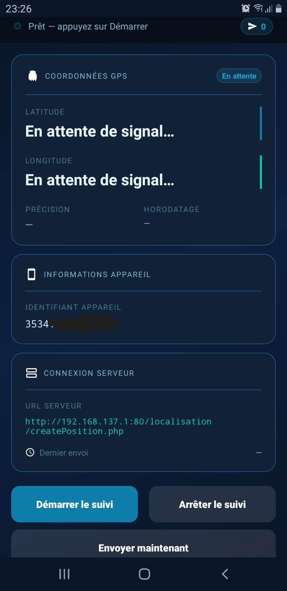
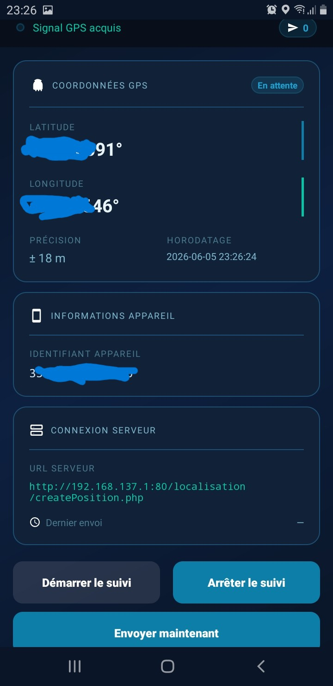
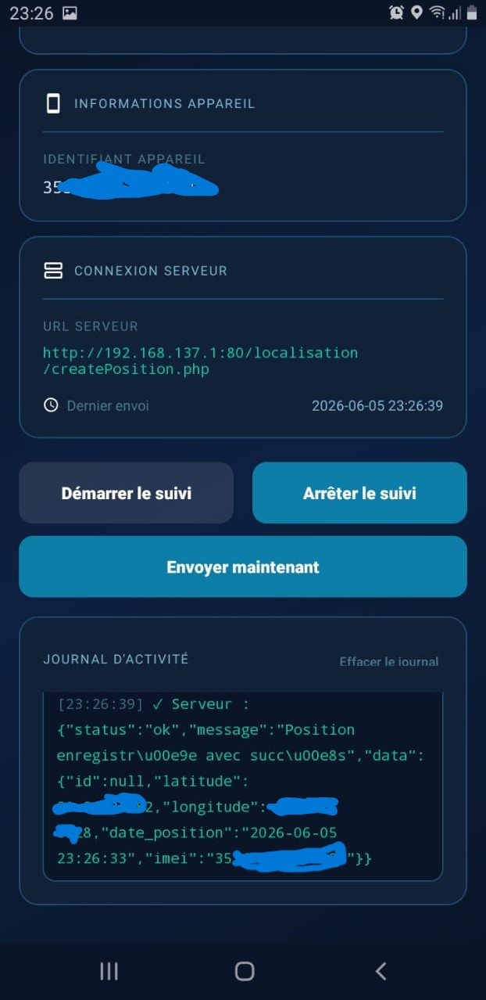
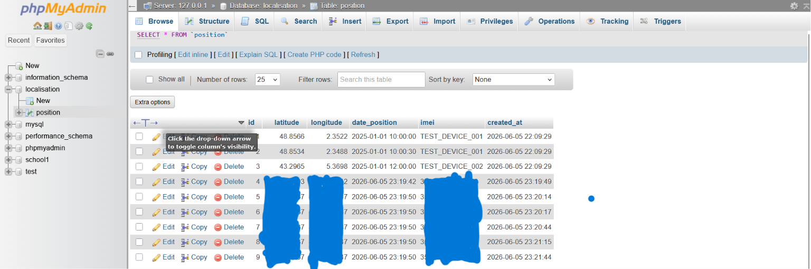

# GeoTracker — Application de localisation GPS Android

> **TP 11 — Programmation Mobile Android avec Java**  
> Module : Localisation smartphone et envoi de coordonnées vers un serveur distant

---

## Présentation du projet

GeoTracker est une application Android native qui récupère la position GPS de l'appareil en temps réel et l'envoie automatiquement vers un serveur PHP/MySQL distant. L'interface reprend un design sombre et moderne (dark UI) avec des animations de pulsation GPS pour rendre l'expérience plus immersive.

L'objectif pédagogique est de comprendre comment combiner :
- la géolocalisation Android (LocationManager + GPS Provider)
- les requêtes HTTP depuis un mobile (bibliothèque Volley)
- un backend PHP structuré en couches (modèle, service, endpoint)
- une base de données MySQL pour la persistance

---

## Objectifs

1. Obtenir les coordonnées GPS (latitude / longitude) de l'appareil
2. Afficher ces coordonnées dans une interface claire et moderne
3. Envoyer les données au serveur distant via une requête HTTP POST :
   - latitude
   - longitude
   - horodatage
   - identifiant de l'appareil (IMEI ou ANDROID_ID)
4. Stocker les données reçues dans une base MySQL côté serveur

---

## Technologies utilisées

| Côté         | Technologie            | Version         |
|--------------|------------------------|-----------------|
| Android      | Java                   | 11              |
| Android      | Android SDK            | API 24 → 35     |
| Android      | Volley (HTTP)          | 1.2.1           |
| Android      | Material Design 3      | 1.12.0          |
| Serveur      | PHP                    | 8.x             |
| Serveur      | MySQL (via XAMPP)      | 8.x             |
| Serveur      | Apache (XAMPP)         | 2.4             |
| Émulateur    | Genymotion             | dernière version|
| Build        | Gradle                 | 8.7.3 KTS       |

---

## Architecture du projet

```
lab11/
│
├── app/                                     ← Application Android
│   └── src/main/
│       ├── AndroidManifest.xml              ← Permissions + déclaration app
│       ├── java/com/example/lab11/
│       │   ├── MainActivity.java            ← Activité principale (GPS + UI)
│       │   ├── model/
│       │   │   └── GpsCoordinate.java       ← Modèle de données GPS
│       │   ├── network/
│       │   │   └── CoordinateUploader.java  ← Envoi HTTP via Volley
│       │   └── utils/
│       │       └── DeviceIdentifier.java    ← Résolution IMEI / ANDROID_ID
│       └── res/
│           ├── layout/activity_main.xml     ← Interface utilisateur
│           ├── drawable/                    ← Icônes + backgrounds
│           ├── anim/                        ← Animations de pulsation
│           └── values/                      ← Couleurs, thèmes, chaînes
│
└── server/                                  ← Backend PHP à déployer dans htdocs
    ├── database_setup.sql                   ← Script SQL d'initialisation
    └── localisation/
        ├── createPosition.php               ← Endpoint POST principal
        ├── classe/GpsPosition.php           ← Modèle de position
        ├── connexion/DbConnexion.php        ← Connexion PDO MySQL
        ├── dao/IRepository.php              ← Interface CRUD générique
        └── service/GpsPositionService.php   ← Logique métier + accès BDD
```

### Flux de données

```
[Émulateur Genymotion]
       │
       │ GPS fix (LocationManager)
       ▼
[MainActivity.java]
       │
       │ HTTP POST (Volley)
       │ latitude, longitude, date_position, imei
       ▼
[Apache / XAMPP — createPosition.php]
       │
       │ Validation + GpsPositionService::create()
       ▼
[MySQL — table position]
```

---

## Mise en place de l'environnement

### Prérequis

- Windows avec XAMPP installé (Apache + MySQL actifs)
- WSL2 installé (pour les commandes Linux)
- Genymotion installé avec un appareil virtuel **Nexus 5** créé
- Android Studio installé avec le projet ouvert

---

## Configuration de la base de données

### 1. Ouvrir phpMyAdmin

Naviguer vers : `http://localhost/phpmyadmin`

### 2. Exécuter le script SQL

Copier-coller le contenu du fichier `server/database_setup.sql` dans l'onglet SQL de phpMyAdmin et exécuter.

Ou via la commande MySQL dans le terminal XAMPP :

```bash
mysql -u root -p < server/database_setup.sql
```

### 3. Vérifier la structure

```sql
USE localisation;
DESCRIBE position;
SELECT * FROM position;
```

La table `position` doit contenir les colonnes : `id`, `latitude`, `longitude`, `date_position`, `imei`, `created_at`.

---

## Configuration du serveur PHP

### 1. Copier les fichiers dans htdocs

Copier le dossier `server/localisation/` vers :

```
C:\xampp\htdocs\localisation\
```

Structure finale attendue :

```
C:\xampp\htdocs\localisation\
├── createPosition.php
├── classe\GpsPosition.php
├── connexion\DbConnexion.php
├── dao\IRepository.php
└── service\GpsPositionService.php
```

### 2. Tester l'endpoint depuis le navigateur

Ouvrir : `http://localhost/localisation/createPosition.php`

La réponse attendue (méthode GET refusée) :

```json
{"status":"error","message":"Méthode non autorisée. Utilisez POST."}
```

### 3. Tester avec curl depuis WSL

```bash
curl -X POST http://localhost/localisation/createPosition.php \
  -d "latitude=48.8566&longitude=2.3522&date_position=2025-01-01+10:00:00&imei=TEST123"
```

Réponse attendue :

```json
{"status":"ok","message":"Position enregistrée avec succès","data":{...}}
```

---

## Configuration Android

### 1. Identifier l'adresse IP de la machine hôte

Depuis Genymotion, la machine hôte Windows est accessible à l'adresse **`192.168.137.1:80`** (adresse standard Genymotion).

Vérifier depuis WSL :

```bash
# Depuis l'émulateur, l'IP hôte = 192.168.137.1:80
# Depuis WSL :
ip route show default
```

### 2. Modifier l'URL du serveur dans le code

Dans [MainActivity.java](app/src/main/java/com/example/lab11/MainActivity.java), ligne `SERVER_ENDPOINT` :

```java
private static final String SERVER_ENDPOINT =
    "http://192.168.137.1:80/localisation/createPosition.php";
```

Remplacer `192.168.137.1:80` par l'IP réelle si nécessaire.

### 3. Vérifier la connectivité depuis l'émulateur

Depuis le terminal ADB (via WSL) :

```bash
# Connecter ADB à Genymotion (port par défaut 5555)
/mnt/c/Users/sadik/AndroidStudioProjects/lab11/platform-tools/adb.exe connect 192.168.137.1:8001:5555

# Lister les appareils connectés
/mnt/c/Users/sadik/AndroidStudioProjects/lab11/platform-tools/adb.exe devices

# Tester la connectivité HTTP depuis l'émulateur
/mnt/c/Users/sadik/AndroidStudioProjects/lab11/platform-tools/adb.exe shell \
  curl -s http://192.168.137.1:80/localisation/createPosition.php
```

### 4. Compiler et installer l'application

```bash
cd /mnt/c/Users/sadik/AndroidStudioProjects/lab11

# Build de l'APK debug
./gradlew assembleDebug

# Installer sur l'émulateur connecté
/mnt/c/Users/sadik/AndroidStudioProjects/lab11/platform-tools/adb.exe \
  install app/build/outputs/apk/debug/app-debug.apk
```

---

## Étapes d'exécution

### 1. Démarrer XAMPP

Ouvrir le panneau de contrôle XAMPP et démarrer :
- ✅ Apache
- ✅ MySQL

### 2. Démarrer Genymotion

- Lancer Genymotion
- Démarrer le **Nexus 5**
- Attendre que l'appareil soit entièrement démarré

### 3. Connecter ADB à Genymotion

```bash
/mnt/c/Users/sadik/AndroidStudioProjects/lab11/platform-tools/adb.exe connect 192.168.137.1:8001:5555
```

### 4. Simuler une position GPS dans Genymotion

Dans Genymotion :
- Ouvrir la **barre d'outils des widgets** (icône en bas à droite)
- Sélectionner **GPS** → entrer des coordonnées manuellement
  - Latitude : `48.8566`
  - Longitude : `2.3522`
- Cliquer sur **Send** pour simuler la position

### 5. Lancer l'application

- Compiler et installer l'APK (voir section précédente), ou
- Lancer directement depuis Android Studio avec l'émulateur connecté

### 6. Utiliser l'application

1. Appuyer sur **Démarrer le suivi**
2. Accorder les permissions GPS et téléphone si demandées
3. Observer les coordonnées s'afficher dans les cartes
4. Appuyer sur **Envoyer maintenant** pour déclencher un envoi manuel
5. L'envoi automatique se fait toutes les 30 secondes pendant le suivi

---

## Instructions de test

### Test 1 — Vérifier la réception des données côté serveur

```bash
# Insérer une position de test directement via curl
curl -X POST http://localhost/localisation/createPosition.php \
  -d "latitude=48.8566&longitude=2.3522&date_position=2025-01-15+14:30:00&imei=ANDROID_test123"
```

Puis vérifier dans phpMyAdmin :

```sql
SELECT * FROM position ORDER BY id DESC LIMIT 5;
```

### Test 2 — Vérifier les logs Android

```bash
# Filtrer les logs de l'application
/mnt/c/Users/sadik/AndroidStudioProjects/lab11/platform-tools/adb.exe logcat -s "GeoTracker" "CoordinateUploader" "DeviceIdentifier"
```

### Test 3 — Tester la validation du serveur

```bash
# Test avec paramètres invalides (latitude hors plage)
curl -X POST http://localhost/localisation/createPosition.php \
  -d "latitude=999&longitude=2.3522&date_position=2025-01-15+14:30:00&imei=TEST"
# Réponse attendue : {"status":"error","message":"Latitude invalide."}

# Test avec paramètres manquants
curl -X POST http://localhost/localisation/createPosition.php \
  -d "latitude=48.8566"
# Réponse attendue : {"status":"error","message":"Paramètres manquants : ..."}
```

---

## Captures d'écran

> *Les captures d'écran suivantes illustrent l'application en fonctionnement sur l'émulateur Genymotion.*

### Interface principale — En attente de signal GPS



### Interface principale — Signal GPS acquis



### Journal d'activité — Après envoi réussi



### phpMyAdmin — Données reçues dans MySQL



> **Note :** Les dossier `screenshots/` doit être créé et les captures ajoutées manuellement après le premier lancement de l'application.

---

## Dépannage

### Le serveur Apache n'est pas accessible depuis l'émulateur

| Problème | Solution |
|----------|----------|
| `Connection refused` | Vérifier que Apache est démarré dans XAMPP |
| `Network unreachable` | Utiliser l'IP `192.168.137.1:80` (hôte Genymotion) |
| `404 Not Found` | Vérifier que le dossier `localisation` est dans `htdocs` |
| `Cleartext not permitted` | Vérifier `android:usesCleartextTraffic="true"` dans le Manifest |

### ADB ne reconnaît pas l'émulateur

```bash
# Redémarrer le serveur ADB
/mnt/c/Users/sadik/AndroidStudioProjects/lab11/platform-tools/adb.exe kill-server
/mnt/c/Users/sadik/AndroidStudioProjects/lab11/platform-tools/adb.exe start-server

# Reconnecter
/mnt/c/Users/sadik/AndroidStudioProjects/lab11/platform-tools/adb.exe connect 192.168.137.1:8001:5555
```

### Permission GPS refusée

1. Aller dans **Paramètres → Applications → GeoTracker → Autorisations**
2. Activer **Localisation** et **Téléphone**
3. Ou désinstaller et réinstaller l'APK pour redemander les permissions

### Pas de fix GPS dans l'émulateur

1. Ouvrir le **widget GPS** de Genymotion (barre latérale droite)
2. Entrer des coordonnées valides et cliquer **Send**
3. Attendre quelques secondes que l'OS transmette le fix à l'application

### Erreur de build `compileSdk`

Si une erreur apparaît autour de `compileSdk`, vérifier que le fichier `build.gradle.kts` utilise bien :

```kotlin
compileSdk = 35
```

et non la syntaxe `compileSdk { version = release(36) { ... } }` (spécifique aux canary builds).

### Volley — `AuthFailureError` ou timeout

- Vérifier que le pare-feu Windows ne bloque pas le port 80
- Ajouter une règle entrante dans le Pare-feu Windows pour TCP port 80
- Vérifier la réponse du serveur via `curl` depuis WSL avant de tester depuis l'app

---

## Conclusion

Ce TP illustre l'architecture complète d'une application mobile connectée : de la capture de données capteur sur Android, à leur transmission HTTP, jusqu'à leur persistance en base de données. L'utilisation de Volley simplifie la gestion des requêtes réseau asynchrones, tandis que la structure PHP en couches (modèle, service, endpoint) favorise la lisibilité et la maintenabilité du backend.

L'interface GeoTracker, avec son design sombre, ses animations de pulsation GPS et son journal d'activité coloré, offre une expérience utilisateur plus engageante qu'une interface académique standard, tout en respectant les contraintes fonctionnelles du sujet.

---

*Réalisé dans le cadre du cours de Programmation Mobile Android — Java.*
